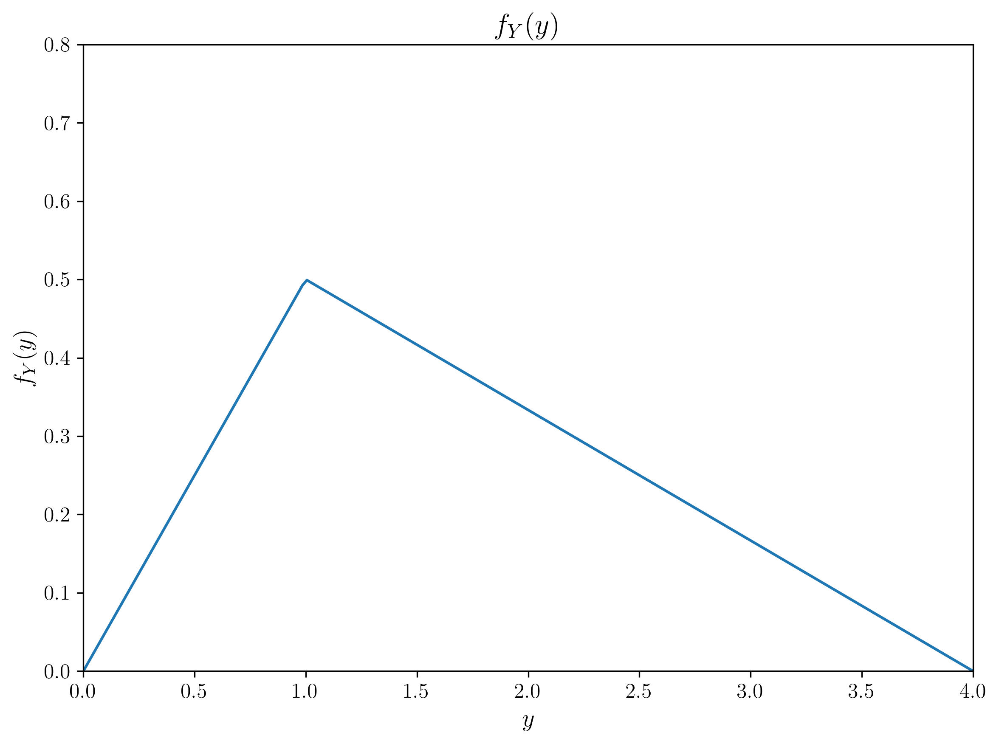

# Lecture 2.7: Maximum A Posteriori and Full Bayesian Inference Quiz

## Overview
This quiz contains 25 questions covering various topics from Lecture 2.7 on Maximum A Posteriori (MAP) Estimation and Full Bayesian Inference.

## Question 1

### Problem Statement
Consider a binomial likelihood with parameter $\theta$ representing the probability of success. We observe data $D = 8$ successes out of $n = 20$ trials.

#### Task
1. Using a $\text{Beta}(2, 2)$ prior for $\theta$, derive the posterior distribution
2. Calculate the Maximum A Posteriori (MAP) estimate for $\theta$
3. Calculate the Maximum Likelihood Estimate (MLE) for $\theta$
4. Compare the MAP and MLE estimates and explain why they differ

For a detailed explanation of this problem, including step-by-step solutions and key insights, see [Question 1: MAP vs MLE for Binomial Data](L2_7_1_explanation.md).

## Question 2

### Problem Statement
Consider a normal distribution with unknown mean $\mu$ and known variance $\sigma^2 = 4$. We observe data $X = \{7.2, 6.8, 8.3, 7.5, 6.9\}$.

#### Task
1. If we use a normal prior $N(7, 1)$ for $\mu$, derive the posterior distribution
2. Calculate the MAP estimate for $\mu$
3. Derive the full Bayesian posterior predictive distribution for a new observation $X_{new}$
4. Calculate the 95% prediction interval for a new observation

For a detailed explanation of this problem, including step-by-step solutions and key insights, see [Question 2: Bayesian Inference for Normal Mean](L2_7_2_explanation.md).

## Question 3

### Problem Statement
Consider two competing models for a dataset:
- Model 1: Normal distribution with unknown mean $\mu_1$ and known variance $\sigma_1^2 = 2$
- Model 2: Normal distribution with unknown mean $\mu_2$ and known variance $\sigma_2^2 = 4$

We use the following priors:
- $\mu_1 \sim \mathcal{N}(0, 1)$
- $\mu_2 \sim \mathcal{N}(0, 2)$

We observe data $X = \{1.5, 2.3, 1.8, 2.5, 1.9\}$.

#### Task
1. Calculate the posterior distribution for $\mu_1$ under Model 1
2. Calculate the posterior distribution for $\mu_2$ under Model 2
3. Calculate the marginal likelihood (evidence) for each model
4. Calculate the Bayes factor and interpret the result for model comparison

For a detailed explanation of this problem, including step-by-step solutions and key insights, see [Question 3: Bayesian Model Comparison](L2_7_3_explanation.md).

## Question 4

### Problem Statement
Consider a linear regression model $y = \beta x + \varepsilon$ where $\varepsilon \sim N(0, \sigma^2)$ with known $\sigma^2 = 1$. We observe the following data points $(x, y)$:
$\{(1, 2.1), (2, 3.8), (3, 5.2), (4, 6.9), (5, 8.3)\}$

#### Task
1. If we use a normal prior $\beta \sim N(1, 0.5)$ for the slope parameter, derive the posterior distribution
2. Calculate the MAP estimate for $\beta$
3. Calculate the MLE for $\beta$
4. Derive the posterior predictive distribution for a new observation $y_{new}$ given $x_{new} = 6$

For a detailed explanation of this problem, including step-by-step solutions and key insights, see [Question 4: Bayesian Linear Regression](L2_7_4_explanation.md).

## Question 5

### Problem Statement
True or False: When using a uniform prior (e.g., $\text{Beta}(1,1)$ for a probability parameter), the MAP estimate is identical to the MLE.

#### Task
1. Determine whether the statement is true or false
2. Explain your reasoning mathematically
3. Provide a simple example that illustrates your answer

For a detailed explanation of this problem, including step-by-step solutions and key insights, see [Question 5: MAP and MLE Relationship](L2_7_5_explanation.md).

## Question 6

### Problem Statement
Consider a logistic regression model with log-posterior:

$$\log p(\mathbf{w}|\mathcal{D}) = \sum_{i=1}^{n} [y_i \log(\sigma(\mathbf{w}^T\mathbf{x}_i)) + (1-y_i)\log(1-\sigma(\mathbf{w}^T\mathbf{x}_i))] - \frac{\lambda}{2}\|\mathbf{w}\|^2 + C$$

where $\sigma(z) = \frac{1}{1+e^{-z}}$ is the sigmoid function, $\mathbf{w}$ are the model parameters, and $C$ is a constant.

#### Task
1. Identify the prior distribution on $\mathbf{w}$ implied by this log-posterior
2. If we have a single data point with $\mathbf{x} = [1, 2]^T$ and $y = 1$, write the gradient $\nabla_{\mathbf{w}} \log p(\mathbf{w}|\mathcal{D})$ for $\mathbf{w} = [0, 0]^T$
3. Describe one optimization technique suitable for finding the MAP estimate in this scenario

For a detailed explanation of this problem, including step-by-step solutions and key insights, see [Question 6: Log Posterior Optimization](L2_7_6_explanation.md).

## Question 7

### Problem Statement
Consider the following regularized loss functions used in machine learning:

1. Ridge Regression: $L(\mathbf{w}) = \|\mathbf{y} - \mathbf{X}\mathbf{w}\|^2 + \lambda\|\mathbf{w}\|^2$
2. Lasso Regression: $L(\mathbf{w}) = \|\mathbf{y} - \mathbf{X}\mathbf{w}\|^2 + \lambda\|\mathbf{w}\|_1$

#### Task
1. Show that Ridge Regression can be interpreted as MAP estimation with a specific prior on $\mathbf{w}$. What is this prior?
2. Show that Lasso Regression can be interpreted as MAP estimation with a different prior on $\mathbf{w}$. What is this prior?
3. For $\lambda = 10$, sketch the shape of both priors in 2D (for a 2-dimensional weight vector)

For a detailed explanation of this problem, including step-by-step solutions and key insights, see [Question 7: Regularization as MAP](L2_7_7_explanation.md).

## Question 8

### Problem Statement
You have a posterior distribution over a parameter $\theta$ that is a mixture of two normal distributions:

$$p(\theta|D) = 0.7 \cdot \mathcal{N}(\theta|2, 1) + 0.3 \cdot \mathcal{N}(\theta|5, 0.5)$$

#### Task
1. Generate 5 samples from this posterior distribution using a rejection sampling approach
2. Briefly explain how Markov Chain Monte Carlo (MCMC) could be used to sample from this distribution
3. Would importance sampling be effective for this distribution? Why or why not?

For a detailed explanation of this problem, including step-by-step solutions and key insights, see [Question 8: Posterior Sampling](L2_7_8_explanation.md).

## Question 9

### Problem Statement
You are trying to predict tomorrow's weather (sunny or rainy) using three different models:
- Model 1: Predicts sunny with probability 0.7
- Model 2: Predicts sunny with probability 0.8
- Model 3: Predicts sunny with probability 0.6

Based on historical data, you assign posterior probabilities to these models:
$P(M_1|D) = 0.5$, $P(M_2|D) = 0.3$, and $P(M_3|D) = 0.2$.

#### Task
1. Calculate the Bayesian Model Averaged prediction for tomorrow being sunny
2. If tomorrow actually turns out to be rainy, how would the posterior probabilities of each model change?
3. What advantage does Bayesian Model Averaging have over simply selecting the highest probability model?

For a detailed explanation of this problem, including step-by-step solutions and key insights, see [Question 9: Bayesian Model Averaging](L2_7_9_explanation.md).

## Question 10

### Problem Statement
Consider comparing two models:
- $M_1$: Linear regression with 3 parameters
- $M_2$: Polynomial regression with 8 parameters

Both models are fit to $n = 50$ data points, with resulting maximum log-likelihoods:
$\log p(D|M_1, \hat{\theta}_1) = -75$
$\log p(D|M_2, \hat{\theta}_2) = -65$

#### Task
1. Calculate the BIC value for each model
2. Which model would be selected according to BIC? Explain why
3. How does BIC penalize model complexity compared to AIC (Akaike Information Criterion)?

For a detailed explanation of this problem, including step-by-step solutions and key insights, see [Question 10: Bayesian Information Criterion](L2_7_10_explanation.md).

## Question 11

### Problem Statement
Consider a simple coin-flipping model with parameter $\theta$ representing the probability of heads. We observe data $D = \{H, H, T, H, T\}$ (3 heads, 2 tails).

#### Task
1. Using a uniform prior ($\text{Beta}(1,1)$) for $\theta$, compute the marginal likelihood $p(D)$
2. Using a more informative prior ($\text{Beta}(10,10)$) for $\theta$, compute the marginal likelihood $p(D)$
3. Explain how these marginal likelihood values could be used for model comparison

For a detailed explanation of this problem, including step-by-step solutions and key insights, see [Question 11: Marginal Likelihood Computation](L2_7_11_explanation.md).

## Question 12

### Problem Statement
Consider a bivariate normal posterior distribution for parameters $\theta_1$ and $\theta_2$:

$$p(\theta_1, \theta_2|D) \propto \exp\left(-\frac{1}{2}\begin{pmatrix}\theta_1 - 3 \\ \theta_2 - 2\end{pmatrix}^T \begin{pmatrix}4 & 1 \\ 1 & 2\end{pmatrix}^{-1} \begin{pmatrix}\theta_1 - 3 \\ \theta_2 - 2\end{pmatrix}\right)$$

#### Task
1. Write a factorized variational approximation $q(\theta_1, \theta_2) = q_1(\theta_1)q_2(\theta_2)$ where both $q_1$ and $q_2$ are normal distributions
2. Explain the key limitation of this factorized approximation for this particular posterior
3. Briefly describe how the ELBO (Evidence Lower BOund) is used in variational inference

For a detailed explanation of this problem, including step-by-step solutions and key insights, see [Question 12: Variational Inference](L2_7_12_explanation.md).

## Question 13

### Problem Statement
You wish to apply full Bayesian inference to a deep neural network with 1 million parameters.

#### Task
1. Identify and briefly explain two major computational challenges in applying full Bayesian inference to this model
2. Compare the computational requirements of MAP estimation versus full Bayesian inference for this model
3. Suggest one practical approximation method that could make Bayesian inference more tractable for this model

For a detailed explanation of this problem, including step-by-step solutions and key insights, see [Question 13: Computational Considerations](L2_7_13_explanation.md).

## Question 14

### Problem Statement
Evaluate whether each of the following statements is TRUE or FALSE. Justify your answer with a brief explanation.

#### Task
1. When the posterior distribution is symmetric and unimodal, the MAP estimate and the posterior mean are identical.
2. Bayesian model averaging can never perform worse than selecting the single best model according to posterior probability.
3. As the number of data points approaches infinity, the influence of the prior on the posterior distribution approaches zero.
4. The Bayesian Information Criterion (BIC) provides a closer approximation to the log marginal likelihood than the Akaike Information Criterion (AIC).
5. Variational inference methods always converge to the exact posterior distribution given enough computational resources.

For a detailed explanation of this problem, including step-by-step solutions and key insights, see [Question 14: MAP and Bayesian Inference Concepts](L2_7_14_explanation.md).

## Question 15

### Problem Statement
Suppose you're modeling the time between arrivals at a hospital emergency room. You've collected data on 10 inter-arrival times (in minutes): $\{12.1, 8.3, 15.7, 9.2, 10.5, 7.8, 14.2, 11.9, 13.4, 9.8\}$.

#### Task
1. Assuming an exponential distribution with parameter $\lambda$ (rate), calculate the MLE for $\lambda$
2. Using a $\text{Gamma}(2, 4)$ prior for $\lambda$, derive the posterior distribution
3. Calculate the MAP estimate for $\lambda$
4. Using the full posterior distribution, find the probability that the next inter-arrival time will be greater than 15 minutes

For a detailed explanation of this problem, including step-by-step solutions and key insights, see [Question 15: Posterior Predictive Distribution](L2_7_15_explanation.md).

## Question 16

### Problem Statement
You're comparing three different classifiers $C_1$, $C_2$, and $C_3$ for a medical diagnosis problem. After testing, you assign posterior probabilities $P(C_1|D) = 0.4$, $P(C_2|D) = 0.35$, and $P(C_3|D) = 0.25$. For a new patient with symptoms $\mathbf{x}$, the models predict the probability of disease as:
- $C_1$: $P(\text{disease}|\mathbf{x}, C_1) = 0.75$
- $C_2$: $P(\text{disease}|\mathbf{x}, C_2) = 0.65$
- $C_3$: $P(\text{disease}|\mathbf{x}, C_3) = 0.85$

#### Task
1. Calculate the model-averaged probability of disease for this patient using Bayesian Model Averaging
2. If the treatment threshold is 0.7 (treat if probability > 0.7), what would be your decision using Bayesian Model Averaging?
3. If you had to select a single model using the MAP approach, which model would you choose and what would be your treatment decision?
4. Briefly explain one advantage and one disadvantage of using Bayesian Model Averaging in this medical context

For a detailed explanation of this problem, including step-by-step solutions and key insights, see [Question 16: Bayesian Model Averaging in Practice](L2_7_16_explanation.md).

## Question 17

### Problem Statement
You have a neural network with weights $\mathbf{w}$ and a dataset $\mathcal{D}$. The log-likelihood is $\log p(\mathcal{D}|\mathbf{w})$ and you want to approximate the posterior $p(\mathbf{w}|\mathcal{D})$ using Laplace approximation.

#### Task
1. Explain the key idea behind Laplace approximation of the posterior
2. If $\hat{\mathbf{w}}_{MAP}$ is the MAP estimate and $\mathbf{H}$ is the Hessian of the negative log-posterior at $\hat{\mathbf{w}}_{MAP}$, write the Laplace approximation formula for $p(\mathbf{w}|\mathcal{D})$
3. How would you use this approximation to estimate the predictive distribution $p(y_{new}|\mathbf{x}_{new}, \mathcal{D})$ for a new input $\mathbf{x}_{new}$?
4. Compare the computational efficiency of this approach with MCMC sampling for the same problem

For a detailed explanation of this problem, including step-by-step solutions and key insights, see [Question 17: Laplace Approximation](L2_7_17_explanation.md).

## Question 18

### Problem Statement
You are given N, I.I.D samples for the books "standard problem":

$$x_i = A + n_i$$

We wish to estimate the parameter "A" using Maximum A Posteriori Estimation.

We know that the distribution of the samples is given by:

$$f(x|A) = \frac{1}{\sqrt{2\pi\sigma^2}}e^{-\frac{(x_i-A)^2}{2\sigma^2}}$$

We also have the following Bayesian Prior Distribution for A:

$$f(A) = \frac{1}{\sqrt{2\pi\sigma_A^2}}e^{-\frac{(A-\mu_A)^2}{2\sigma_A^2}}$$

Assume that the parameters: $\sigma^2$, $\sigma_A^2$, and $\mu_A$ are constant and are known.

#### Task
1. Determine the MAP estimator for the parameter A.
2. If $\sigma_A^2$ was extremely large, what would the estimator look like?

For a detailed explanation of this problem, including step-by-step solutions and key insights, see [Question 18: Normal MAP Estimation](L2_7_18_explanation.md).

## Question 19

### Problem Statement
Consider a scenario where we observe count data $D = \{x_1, x_2, ..., x_N\}$, such as the number of events occurring in fixed time intervals. Assume these counts come from $N$ independent and identically distributed Poisson random variables with rate parameter $\lambda$. In Bayesian statistics, we model our prior belief about $\lambda$ using a Gamma distribution with shape parameter $\alpha$ and rate parameter $\beta$.

#### Task
1. Write out the log-posterior $\log P(\lambda|D) \propto \log P(D|\lambda) + \log P(\lambda)$.
2. Take the derivative of $\log P(D|\lambda) + \log P(\lambda)$ with respect to the parameter $\lambda$.
3. Set the derivative equal to zero and solve for $\lambda$ - call this maximizing value $\lambda_{MAP}$.

For a detailed explanation of this problem, including step-by-step solutions and key insights, see [Question 19: MAP Estimation with Poisson-Gamma Model](L2_7_19_explanation.md).

## Question 20

### Problem Statement
The graphs below illustrate various functions derived from the (not given) joint PDF of two random variables X and Y, each of which is defined in the range [0, 4].

#### Task
Using only the information provided in these graphs (i.e., without any extra computation), determine:

1. The maximum likelihood (ML) estimate of $Y$ given that $X=1$
2. The maximum a posteriori (MAP) estimate of $Y$ given that $X=1$
3. The minimum mean-squared error (MMSE) estimate of $Y$ given that $X=1$
4. Explain the relationship between these three estimates and why they might differ in this case.

For a detailed explanation of this problem, including analysis of joint PDFs, marginal distributions, and the relationship between different estimators, see [Question 20: Joint PDF and Bayesian Estimation](L2_7_20_explanation.md).

## Question 21

### Problem Statement
The graphs below illustrate various functions derived from the (not given) joint PDF of two random variables X and Y, each of which is defined in the range [0, 4].

#### Task
Using only the information provided in these graphs (i.e., without any extra computation), determine:

1. The maximum likelihood (ML) estimate of $Y$ given that $X=2$
2. The maximum a posteriori (MAP) estimate of $Y$ given that $X=2$
3. The minimum mean-squared error (MMSE) estimate of $Y$ given that $X=2$
4. Explain the relationship between these three estimates and why they might differ in this case.

For a detailed explanation of this problem, including step-by-step solutions and key insights on how bimodal distributions affect Bayesian estimation, see [Question 21: Joint PDF and Bayesian Estimation with Bimodal Distribution](L2_7_21_explanation.md).

## Question 22

### Problem Statement
The graphs below illustrate various functions derived from the (not given) joint PDF of two random variables X and Y, each of which is defined in the range [0, 4].

#### Task
Using only the information provided in these graphs (i.e., without any extra computation), determine:

1. The maximum likelihood (ML) estimate of $Y$ given that $X=2$
2. For the maximum a posteriori (MAP) estimate of $Y$ given that $X=2$:
   - Is it higher or lower than the ML estimate? Explain why.
   - Approximately where would it fall relative to the ML estimate?
3. The minimum mean-squared error (MMSE) estimate of $Y$ given that $X=2$
4. Explain the relationship between these three estimates and why they might differ in this case.

For a detailed explanation of this problem, including the relationships between different estimators, see [Question 22: Simple Distributions and Bayesian Estimation](L2_7_22_explanation.md).

## Question 23

### Problem Statement
The graphs below illustrate various functions derived from the (not given) joint PDF of two random variables X and Y, each of which is defined in the range [0, 4].

#### Task
Using only the information provided in these graphs (i.e., without any extra computation), determine:

1. The maximum likelihood (ML) estimate of $Y$ given that $X=3$
2. Describe whether the maximum a posteriori (MAP) estimate of $Y$ given that $X=3$ would be higher or lower than the ML estimate, and explain why
3. The minimum mean-squared error (MMSE) estimate of $Y$ given that $X=3$
4. Explain the relationship between these three estimates and why they might differ in this case.

For a detailed explanation of this problem, including analysis of multimodal distributions and their effects on Bayesian estimators, see [Question 23: Joint PDF and Bayesian Inference with Multimodal Distributions](L2_7_23_explanation.md).

## Question 24

### Problem Statement
Consider a scenario where we're estimating an unknown parameter $\theta$ with the following information:

1. We have collected 5 data points from a normal distribution $\mathcal{N}(\theta, 4)$ (where the variance is known to be 4)
2. The sample mean of our data is $\bar{x} = 7$
3. We're exploring the effect of different prior beliefs about $\theta$ on our MAP estimates

The graphs below illustrate different functions involved in Bayesian estimation:

#### Task
1. Identify the maximum likelihood estimate (MLE) for $\theta$ based on the observed data.
2. For each of the three priors (weak, medium, and strong), calculate approximately how far the MAP estimate deviates from the MLE.
3. Explain the pattern you observe in how the MAP estimates relate to both the prior mean and the MLE as the prior becomes stronger.
4. If you were to collect 20 more data points (for a total of 25) with the same sample mean, how would you expect the three MAP estimates to change relative to the MLE? Explain your reasoning.

For a detailed explanation of this problem, including analysis of prior strength and its effect on MAP estimation, see [Question 24: Prior Strength and MAP Estimation](L2_7_24_explanation.md).

## Question 25

### Problem Statement
You are analyzing data from a coin-flipping experiment where you observed 60 heads out of 100 flips. You want to estimate θ, the probability of getting heads, using different approaches including Maximum Likelihood Estimation (MLE) and Maximum A Posteriori (MAP) estimation with various priors.

Below are several visualizations to help you understand how different prior distributions affect Bayesian estimation:

*Figure 1: Likelihood function for the observed data (60 heads in 100 flips). The vertical red dashed line marks the position of maximum likelihood.*

*Figure 2: Uniform Prior - Beta(1,1) distribution.*

*Figure 3: Prior Biased toward Tails - Beta(3,7) distribution.*

*Figure 4: Prior Biased toward Heads - Beta(7,3) distribution.*

*Figure 5: Prior with Strong Belief in Fair Coin - Beta(50,50) distribution with peak at θ=0.5.*

*Figure 6: Posterior with Uniform Prior. Blue vertical line shows MAP estimate (θ=0.600); red vertical line shows MLE (θ=0.600).*

*Figure 7: Posterior with Tails-Biased Prior. Green vertical line shows MAP estimate (θ=0.574); red vertical line shows MLE (θ=0.600).*

*Figure 8: Posterior with Heads-Biased Prior. Red dashed line shows MAP estimate (θ=0.611); red dotted line shows MLE (θ=0.600).*

*Figure 9: Posterior with Fair Coin Prior. Magenta vertical line shows MAP estimate (θ=0.551); red vertical line shows MLE (θ=0.600).*

*Figure 10: Comparison of all posterior distributions with their respective MAP estimates (vertical dashed lines in corresponding colors) and the MLE (solid black vertical line at θ=0.600).*

*Figure 11: Evolution of the posterior starting from Beta(3,7) prior as more data is collected, maintaining a 60% heads ratio. Different colors represent increasing sample sizes from 5 flips to 500 flips, and the dashed lines indicate the corresponding MAP estimates. Note how the MAP estimates converge toward the MLE (θ=0.600) as data increases.*

*Figure 12: Different Bayesian estimators for the posterior with uniform prior. Red vertical line shows MAP estimate (θ=0.600, optimizing 0-1 loss); green vertical line shows posterior mean (θ=0.598, optimizing squared loss); purple vertical line shows posterior median (θ=0.599, optimizing absolute loss).*

#### Task
Using only the information provided in these figures:

1. Identify the Maximum Likelihood Estimate (MLE) for θ based on the observed data.
2. For each of the four priors (Uniform, Tails-Biased, Heads-Biased, and Fair Coin), determine the MAP estimate for θ.
3. Explain how the choice of prior affects the MAP estimate relative to the MLE.
4. Based on Figure 11 (Evolution of Posterior), explain what happens to the MAP estimate as more data is collected (while maintaining the same ratio of heads to total flips). The figure shows MAP estimates for the following data points:
   - 3 heads, 2 tails (MAP = 0.364)
   - 6 heads, 4 tails (MAP = 0.416)
   - 15 heads, 10 tails (MAP = 0.486)
   - 30 heads, 20 tails (MAP = 0.525)
   - 60 heads, 40 tails (MAP = 0.554)
   - 150 heads, 100 tails (MAP = 0.577)
   - 300 heads, 200 tails (MAP = 0.588)
5. From Figure 12 (Different Bayesian Estimators), identify the posterior mean and median, and explain why they might differ from the MAP estimate. The figure shows:
   - MAP (0-1 Loss): θ = 0.600
   - Mean (Squared Loss): θ = 0.598
   - Median (Absolute Loss): θ = 0.599

For a detailed explanation of this problem, including analysis of how different priors affect MAP estimation and the relationships between various Bayesian estimators, see [Question 25: Effect of Priors on MAP Estimation for Coin Flips](L2_7_25_explanation.md).

## Question 26

### Problem Statement
Suppose we have samples $x_1=0$, $x_2=0$, $x_3=1$, $x_4=1$, $x_5=0$ from a Bernoulli distribution with unknown parameter $\theta$, where $\theta \in (0, 1)$.

#### Task
1. Find the maximum likelihood estimator $\hat{\theta}_{MLE}$ for the parameter $\theta$.
2. Suppose you are asked to select $\theta$ from the set $\{0.2, 0.5, 0.7\}$. Which value would be chosen according to the MLE principle?
3. Now assume a discrete prior $\pi_{\theta}(0.2) = 0.1$, $\pi_{\theta}(0.5) = 0.01$, $\pi_{\theta}(0.7) = 0.89$. What is $\hat{\theta}_{MAP}$?
4. Compare the MAP and MLE estimates from parts (b) and (c). Explain why they differ and discuss how the prior affects the parameter estimation when working with small sample sizes.
5. Suppose you collect additional samples and now have a total of 100 samples with 40 ones and 60 zeros. Calculate the new $\hat{\theta}_{MAP}$ using the same prior as in part (c). Compare this result with your answer from part (c) and explain how the influence of the prior changes as the sample size increases.

For a detailed explanation, see [Question 26: MLE and MAP for Bernoulli Distribution with Small Sample](L2_7_26_explanation.md).