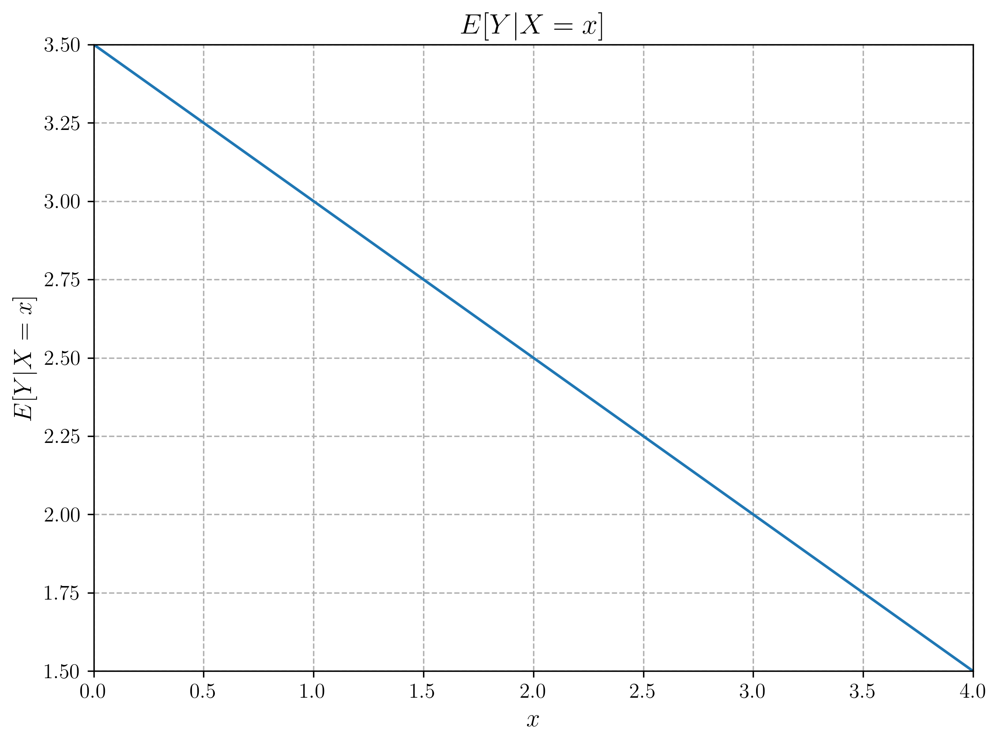
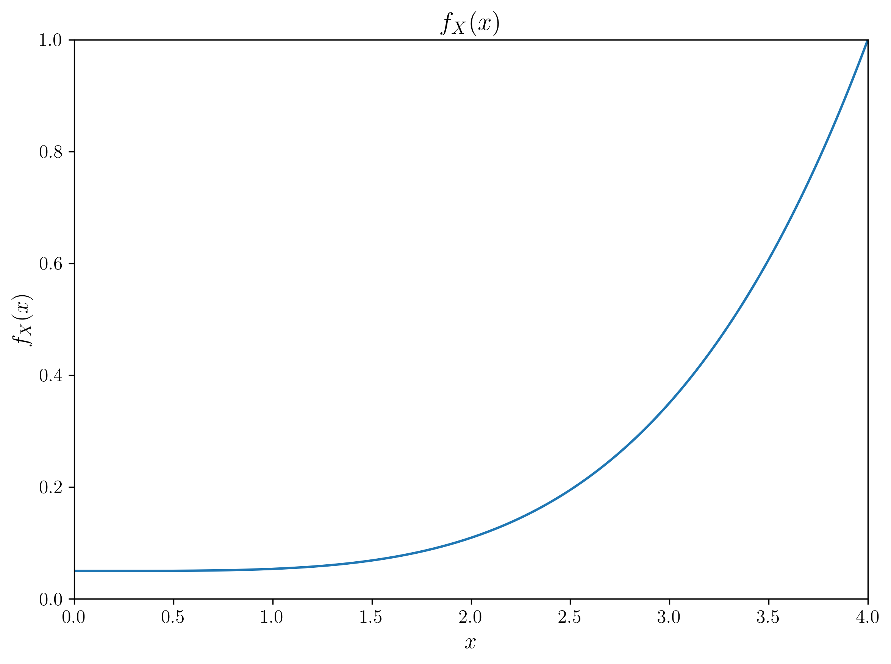

# Lecture 2.7: Maximum A Posteriori and Full Bayesian Inference Quiz

## Overview
This quiz contains 13 questions covering various topics from Lecture 2.7 on Maximum A Posteriori (MAP) Estimation and Full Bayesian Inference.

## Question 1

### Problem Statement
Consider a binomial likelihood with parameter $\theta$ representing the probability of success. We observe data $D = 8$ successes out of $n = 20$ trials.

#### Task
1. Using a $\text{Beta}(2, 2)$ prior for $\theta$, derive the posterior distribution
2. Calculate the Maximum A Posteriori (MAP) estimate for $\theta$
3. Calculate the Maximum Likelihood Estimate (MLE) for $\theta$
4. Compare the MAP and MLE estimates and explain why they differ

For a detailed explanation of this problem, including step-by-step solutions and key insights, see [Question 1: MAP vs MLE for Binomial Data](L2_7_1_explanation.md).

## Question 2

### Problem Statement
Consider a normal distribution with unknown mean $\mu$ and known variance $\sigma^2 = 4$. We observe data $X = \{7.2, 6.8, 8.3, 7.5, 6.9\}$.

#### Task
1. If we use a normal prior $N(7, 1)$ for $\mu$, derive the posterior distribution
2. Calculate the MAP estimate for $\mu$
3. Derive the full Bayesian posterior predictive distribution for a new observation $X_{new}$
4. Calculate the 95% prediction interval for a new observation

For a detailed explanation of this problem, including step-by-step solutions and key insights, see [Question 2: Bayesian Inference for Normal Mean](L2_7_2_explanation.md).

## Question 3

### Problem Statement
Consider two competing models for a dataset:
- Model 1: Normal distribution with unknown mean $\mu_1$ and known variance $\sigma_1^2 = 2$
- Model 2: Normal distribution with unknown mean $\mu_2$ and known variance $\sigma_2^2 = 4$

We use the following priors:
- $\mu_1 \sim \mathcal{N}(0, 1)$
- $\mu_2 \sim \mathcal{N}(0, 2)$

We observe data $X = \{1.5, 2.3, 1.8, 2.5, 1.9\}$.

#### Task
1. Calculate the posterior distribution for $\mu_1$ under Model 1
2. Calculate the posterior distribution for $\mu_2$ under Model 2
3. Calculate the marginal likelihood (evidence) for each model
4. Calculate the Bayes factor and interpret the result for model comparison

For a detailed explanation of this problem, including step-by-step solutions and key insights, see [Question 3: Bayesian Model Comparison](L2_7_3_explanation.md).

## Question 4

### Problem Statement
True or False: When using a uniform prior (e.g., $\text{Beta}(1,1)$ for a probability parameter), the MAP estimate is identical to the MLE.

#### Task
1. Determine whether the statement is true or false
2. Explain your reasoning mathematically
3. Provide a simple example that illustrates your answer

For a detailed explanation of this problem, including step-by-step solutions and key insights, see [Question 4: MAP and MLE Relationship](L2_7_5_explanation.md).

## Question 5

### Problem Statement
You are trying to predict tomorrow's weather (sunny or rainy) using three different models:
- Model 1: Predicts sunny with probability 0.7
- Model 2: Predicts sunny with probability 0.8
- Model 3: Predicts sunny with probability 0.6

Based on historical data, you assign posterior probabilities to these models:
$P(M_1|D) = 0.5$, $P(M_2|D) = 0.3$, and $P(M_3|D) = 0.2$.

#### Task
1. Calculate the Bayesian Model Averaged prediction for tomorrow being sunny
2. If tomorrow actually turns out to be rainy, how would the posterior probabilities of each model change?
3. What advantage does Bayesian Model Averaging have over simply selecting the highest probability model?

For a detailed explanation of this problem, including step-by-step solutions and key insights, see [Question 5: Bayesian Model Averaging](L2_7_9_explanation.md).

## Question 6

### Problem Statement
Consider a simple coin-flipping model with parameter $\theta$ representing the probability of heads. We observe data $D = \{H, H, T, H, T\}$ (3 heads, 2 tails).

#### Task
1. Using a uniform prior ($\text{Beta}(1,1)$) for $\theta$, compute the marginal likelihood $p(D)$
2. Using a more informative prior ($\text{Beta}(10,10)$) for $\theta$, compute the marginal likelihood $p(D)$
3. Explain how these marginal likelihood values could be used for model comparison

For a detailed explanation of this problem, including step-by-step solutions and key insights, see [Question 6: Marginal Likelihood Computation](L2_7_11_explanation.md).

## Question 7

### Problem Statement
You wish to apply full Bayesian inference to a deep neural network with 1 million parameters.

#### Task
1. Identify and briefly explain two major computational challenges in applying full Bayesian inference to this model
2. Compare the computational requirements of MAP estimation versus full Bayesian inference for this model
3. Suggest one practical approximation method that could make Bayesian inference more tractable for this model

For a detailed explanation of this problem, including step-by-step solutions and key insights, see [Question 7: Computational Considerations](L2_7_13_explanation.md).

## Question 8

### Problem Statement
Evaluate whether each of the following statements is TRUE or FALSE. Justify your answer with a brief explanation.

#### Task
1. When the posterior distribution is symmetric and unimodal, the MAP estimate and the posterior mean are identical.
2. Bayesian model averaging can never perform worse than selecting the single best model according to posterior probability.
3. As the number of data points approaches infinity, the influence of the prior on the posterior distribution approaches zero.

For a detailed explanation of this problem, including step-by-step solutions and key insights, see [Question 8: MAP and Bayesian Inference Concepts](L2_7_14_explanation.md).

## Question 9

### Problem Statement
Suppose you're modeling the time between arrivals at a hospital emergency room. You've collected data on 10 inter-arrival times (in minutes): $\{12.1, 8.3, 15.7, 9.2, 10.5, 7.8, 14.2, 11.9, 13.4, 9.8\}$.

#### Task
1. Assuming an exponential distribution with parameter $\lambda$ (rate), calculate the MLE for $\lambda$
2. Using a $\text{Gamma}(2, 4)$ prior for $\lambda$, derive the posterior distribution
3. Calculate the MAP estimate for $\lambda$
4. Using the full posterior distribution, find the probability that the next inter-arrival time will be greater than 15 minutes

For a detailed explanation of this problem, including step-by-step solutions and key insights, see [Question 9: Posterior Predictive Distribution](L2_7_15_explanation.md).

## Question 10

### Problem Statement
You're comparing three different classifiers $C_1$, $C_2$, and $C_3$ for a medical diagnosis problem. After testing, you assign posterior probabilities $P(C_1|D) = 0.4$, $P(C_2|D) = 0.35$, and $P(C_3|D) = 0.25$. For a new patient with symptoms $\mathbf{x}$, the models predict the probability of disease as:
- $C_1$: $P(\text{disease}|\mathbf{x}, C_1) = 0.75$
- $C_2$: $P(\text{disease}|\mathbf{x}, C_2) = 0.65$
- $C_3$: $P(\text{disease}|\mathbf{x}, C_3) = 0.85$

#### Task
1. Calculate the model-averaged probability of disease for this patient using Bayesian Model Averaging
2. If the treatment threshold is 0.7 (treat if probability > 0.7), what would be your decision using Bayesian Model Averaging?
3. If you had to select a single model using the MAP approach, which model would you choose and what would be your treatment decision?
4. Briefly explain one advantage and one disadvantage of using Bayesian Model Averaging in this medical context

For a detailed explanation of this problem, including step-by-step solutions and key insights, see [Question 10: Bayesian Model Averaging in Practice](L2_7_16_explanation.md).

## Question 11

### Problem Statement
You are given N, I.I.D samples for the books "standard problem":

$$x_i = A + n_i$$

We wish to estimate the parameter "A" using Maximum A Posteriori Estimation.

We know that the distribution of the samples is given by:

$$f(x|A) = \frac{1}{\sqrt{2\pi\sigma^2}}e^{-\frac{(x_i-A)^2}{2\sigma^2}}$$

We also have the following Bayesian Prior Distribution for A:

$$f(A) = \frac{1}{\sqrt{2\pi\sigma_A^2}}e^{-\frac{(A-\mu_A)^2}{2\sigma_A^2}}$$

Assume that the parameters: $\sigma^2$, $\sigma_A^2$, and $\mu_A$ are constant and are known.

#### Task
1. Determine the MAP estimator for the parameter A.
2. If $\sigma_A^2$ was extremely large, what would the estimator look like?

For a detailed explanation of this problem, including step-by-step solutions and key insights, see [Question 11: Normal MAP Estimation](L2_7_18_explanation.md). 

## Question 12

### Problem Statement
Consider a scenario where we observe count data $D = \{x_1, x_2, ..., x_N\}$, such as the number of events occurring in fixed time intervals. Assume these counts come from $N$ independent and identically distributed Poisson random variables with rate parameter $\lambda$. In Bayesian statistics, we model our prior belief about $\lambda$ using a Gamma distribution with shape parameter $\alpha$ and rate parameter $\beta$.

#### Task
1. Write out the log-posterior $\log P(\lambda|D) \propto \log P(D|\lambda) + \log P(\lambda)$.
2. Take the derivative of $\log P(D|\lambda) + \log P(\lambda)$ with respect to the parameter $\lambda$.
3. Set the derivative equal to zero and solve for $\lambda$ - call this maximizing value $\lambda_{MAP}$.

For a detailed explanation of this problem, including step-by-step solutions and key insights, see [Question 12: MAP Estimation with Poisson-Gamma Model](L2_7_19_explanation.md). 

## Question 13

### Problem Statement
The graphs below illustrate various functions derived from the (not given) joint PDF of two random variables X and Y, each of which is defined in the range [0, 4].

#### Task
Using only the information provided in these graphs (i.e., without any extra computation), determine:

1. The maximum likelihood (ML) estimate of $Y$ given that $X=1$
2. The maximum a posteriori (MAP) estimate of $Y$ given that $X=1$
3. The minimum mean-squared error (MMSE) estimate of $Y$ given that $X=1$
4. Explain the relationship between these three estimates and why they might differ in this case.

For a detailed explanation of this problem, including analysis of joint PDFs, marginal distributions, and the relationship between different estimators, see [Question 13: Joint PDF and Bayesian Estimation](L2_7_20_explanation.md). 