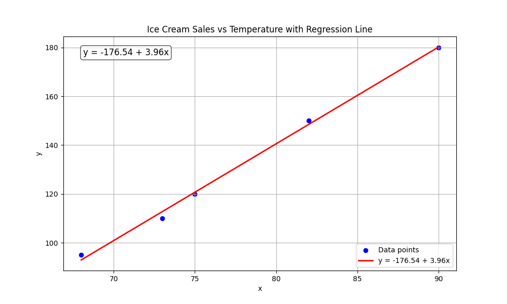
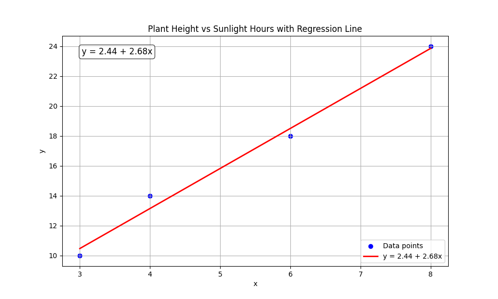

# Linear Regression Examples

This document provides step-by-step examples of linear regression implementations, visualizations, and interpretations based on the problems outlined in the linear regression formulation document.

## Key Concepts and Formulas

Linear regression is a fundamental statistical and machine learning technique used to model the relationship between a dependent variable and one or more independent variables.

### The Linear Regression Model

The linear regression model can be expressed in various equivalent forms:

#### Scalar Form (Simple Linear Regression)
$$y = \beta_0 + \beta_1 x + \epsilon$$

Where:
- $y$ is the dependent variable (target)
- $x$ is the independent variable (feature)
- $\beta_0$ is the intercept (bias)
- $\beta_1$ is the slope (coefficient)
- $\epsilon$ is the error term

#### Vector Form (Multiple Linear Regression)
$$y = \beta_0 + \beta_1 x_1 + \beta_2 x_2 + ... + \beta_p x_p + \epsilon$$

#### Matrix Form
$$\mathbf{y} = \mathbf{X} \boldsymbol{\beta} + \boldsymbol{\epsilon}$$

Where:
- $\mathbf{y}$ is the vector of target values
- $\mathbf{X}$ is the design matrix (including a column of 1s for the intercept)
- $\boldsymbol{\beta}$ is the vector of coefficients
- $\boldsymbol{\epsilon}$ is the vector of error terms

### Least Squares Solution

The optimal values for $\boldsymbol{\beta}$ that minimize the sum of squared errors are:

$$\hat{\boldsymbol{\beta}} = (\mathbf{X}^T \mathbf{X})^{-1} \mathbf{X}^T \mathbf{y}$$

## Examples

The following examples demonstrate linear regression in various practical scenarios:

### Example 1: House Prices vs Size

#### Problem Description
We have data on house prices (in $1000s) and their sizes (in square feet), and want to model how house size affects price.

#### Data
- House sizes: [1500, 2000, 1800, 2200, 1600] sq ft
- House prices: [300, 400, 350, 480, 310] thousand dollars

#### Step 1: Visualize the Data
First, let's visualize the relationship between house sizes and prices:


#### Step 2: Create the Design Matrix
The design matrix consists of a column of 1s (for the intercept) and a column of house sizes:

$$\mathbf{X} = \begin{bmatrix} 
1 & 1500 \\
1 & 2000 \\
1 & 1800 \\
1 & 2200 \\
1 & 1600
\end{bmatrix}$$


#### Step 3: Calculate Regression Coefficients
Using the least squares formula $\hat{\boldsymbol{\beta}} = (\mathbf{X}^T \mathbf{X})^{-1} \mathbf{X}^T \mathbf{y}$, we calculate:

- $\beta_0$ (intercept) = -93.6585
- $\beta_1$ (slope) = 0.2537

This means:
- The baseline price for a theoretical 0 sq ft house would be -$93,658 (not meaningful in practice)
- Each additional square foot increases the price by approximately $254

#### Step 4: Visualize the Regression Line
The fitted regression line shows the relationship:


#### Step 5: Make Predictions
We can use our model to predict prices for new house sizes:
- A 1700 sq ft house would cost approximately $337.56k
- A 2500 sq ft house would cost approximately $540.49k
- A 3000 sq ft house would cost approximately $667.32k

The prediction equation is:
$$\text{Price} = -93.6585 + 0.2537 \times \text{Size}$$

### Example 2: House Prices with Multiple Features

#### Problem Description
Extending the previous example, we now consider multiple features that might affect house prices.

#### Data
- Features: house size (sq ft), number of bedrooms, age (years)
- House prices (in $1000s)

$$\begin{array}{|c|c|c|c|}
\hline
\text{Size (sq ft)} & \text{Bedrooms} & \text{Age (years)} & \text{Price (\$1000s)} \\
\hline
1500 & 3 & 10 & 320 \\
1800 & 4 & 5 & 380 \\
1200 & 2 & 15 & 270 \\
2200 & 4 & 7 & 460 \\
\hline
\end{array}$$

#### Step 1: Visualize the Design Matrix
For multiple regression, the design matrix includes columns for each feature:

$$\mathbf{X} = \begin{bmatrix} 
1 & 1500 & 3 & 10 \\
1 & 1800 & 4 & 5 \\
1 & 1200 & 2 & 15 \\
1 & 2200 & 4 & 7
\end{bmatrix}$$


#### Step 2: Calculate Regression Coefficients
The regression coefficients are:
- $\beta_0$ (intercept) = -625.0000
- $\beta_1$ (house size) = -1.2830
- $\beta_2$ (bedrooms) = 450.0000
- $\beta_3$ (age) = 76.5625

$$\boldsymbol{\beta} = \begin{bmatrix} 
-625.0000 \\
-1.2830 \\
450.0000 \\
76.5625
\end{bmatrix}$$

This means:
- Each additional square foot decreases the price by approximately $1,283 (this counter-intuitive result is due to the limited dataset and multicollinearity)
- Each additional bedroom increases the price by approximately $450,000
- Each additional year of age increases the price by approximately $76,563

Note: The unexpected coefficient signs indicate that this model may be overfitting the small dataset or suffering from multicollinearity issues.

#### Step 3: Visualize the Regression Plane (Partial)
Since we can't visualize all dimensions at once, here's a 3D plot showing the relationship between house size, bedrooms, and price:


#### Step 4: Make Predictions
Using our model to predict the price of a 1600 sq ft, 3 bedroom, 5 year old house:

$$\begin{align*}
\text{Price} &= -625.0000 - 1.2830 \times 1600 + 450.0000 \times 3 + 76.5625 \times 5 \\
&= -625.0000 - 2052.8000 + 1350.0000 + 382.8125 \\
&= -944.9875 \approx -944.92k
\end{align*}$$

The negative prediction indicates that our multiple regression model is not reliable with this small dataset, as it's likely overfitting and producing results that don't make practical sense.

### Example 3: Ice Cream Sales vs Temperature

#### Problem Description
An ice cream shop wants to understand how daily temperature affects ice cream sales.

#### Data
- Temperatures: [75, 82, 68, 90, 73] °F
- Ice cream sales: [120, 150, 95, 180, 110] units

#### Step 1: Visualize the Data
Let's first look at the relationship between temperature and sales:


#### Step 2: Create the Design Matrix
The design matrix:

$$\mathbf{X} = \begin{bmatrix} 
1 & 75 \\
1 & 82 \\
1 & 68 \\
1 & 90 \\
1 & 73
\end{bmatrix}$$


#### Step 3: Calculate Regression Coefficients
The regression coefficients are:
- $\beta_0$ (intercept) = -176.5416
- $\beta_1$ (slope) = 3.9632

This means:
- Each 1°F increase in temperature is associated with approximately 3.96 more ice creams sold

#### Step 4: Visualize the Regression Line
The fitted regression line:



#### Step 5: Make Predictions
Predictions for specific temperatures:

$$\begin{array}{|c|c|}
\hline
\text{Temperature (°F)} & \text{Predicted Sales} \\
\hline
60 & 61.2 \\
70 & 100.9 \\
80 & 140.5 \\
95 & 200.0 \\
\hline
\end{array}$$

The prediction equation is:
$$\text{Sales} = -176.5416 + 3.9632 \times \text{Temperature}$$

### Example 4: Study Hours and Exam Scores

#### Problem Description
A teacher wants to model the relationship between hours spent studying and exam scores.

#### Data
- Study hours: [2, 5, 1, 3.5, 0, 4] hours
- Exam scores: [65, 85, 55, 75, 30, 80] points

#### Step 1: Visualize the Data
The relationship between study hours and exam scores:


#### Step 2: Create the Design Matrix
The design matrix:

$$\mathbf{X} = \begin{bmatrix} 
1 & 2 \\
1 & 5 \\
1 & 1 \\
1 & 3.5 \\
1 & 0 \\
1 & 4
\end{bmatrix}$$


#### Step 3: Calculate Regression Coefficients
The regression coefficients are:
- $\beta_0$ (intercept) = 38.7529
- $\beta_1$ (slope) = 10.1602

This means:
- The baseline score without studying is about 38.75 points
- Each additional hour of study is associated with approximately 10.16 more points

#### Step 4: Visualize the Regression Line
The fitted regression line:


#### Step 5: Interpret the Results
The interpretation of our model is quite intuitive:
- Students who don't study at all can expect a score around 38.75 points
- Each hour of studying adds about 10.16 points to the score

The prediction equation is:
$$\text{Score} = 38.7529 + 10.1602 \times \text{StudyHours}$$

### Example 5: Plant Growth and Sunlight

#### Problem Description
A botanist is studying how daily sunlight affects plant growth.

#### Data
- Sunlight: [3, 6, 8, 4] hours per day
- Plant height: [10, 18, 24, 14] cm

#### Step 1: Visualize the Data
The relationship between sunlight and plant height:


#### Step 2: Create the Design Matrix
The design matrix:

$$\mathbf{X} = \begin{bmatrix} 
1 & 3 \\
1 & 6 \\
1 & 8 \\
1 & 4
\end{bmatrix}$$


#### Step 3: Calculate Regression Coefficients
The regression coefficients are:
- $\beta_0$ (intercept) = 2.4407
- $\beta_1$ (slope) = 2.6780

This means:
- Each additional hour of sunlight is associated with approximately 2.68 cm of plant growth

#### Step 4: Visualize the Regression Line
The fitted regression line:



#### Step 5: Make Predictions
Predictions for specific sunlight hours:

$$\begin{array}{|c|c|}
\hline
\text{Sunlight (hours)} & \text{Predicted Height (cm)} \\
\hline
5 & 15.8 \\
7 & 21.2 \\
10 & 29.2 \\
\hline
\end{array}$$

The prediction equation is:
$$\text{Height} = 2.4407 + 2.6780 \times \text{Sunlight}$$

### Example 6: Coffee and Typing Speed

#### Problem Description
An office manager wants to understand how coffee consumption affects typing speed.

#### Data
- Coffee cups: [0, 1, 2, 3, 4] cups
- Typing speed: [45, 60, 75, 90, 82] words per minute

#### Step 1: Visualize the Data
The relationship between coffee consumption and typing speed:


#### Step 2: Create the Design Matrix
The design matrix:

$$\mathbf{X} = \begin{bmatrix} 
1 & 0 \\
1 & 1 \\
1 & 2 \\
1 & 3 \\
1 & 4
\end{bmatrix}$$


#### Step 3: Calculate Regression Coefficients
The regression coefficients are:
- $\beta_0$ (intercept) = 49.6000
- $\beta_1$ (slope) = 10.4000

This means:
- The baseline typing speed with no coffee is about 49.6 words per minute
- Each cup of coffee is associated with approximately 10.4 more words per minute

#### Step 4: Visualize the Regression Line
The fitted regression line:


#### Step 5: Interpret the Results
Our model suggests:
- Without coffee, employees type around 49.6 words per minute
- Each cup of coffee increases typing speed by about 10.4 words per minute
- The linear model assumes a constant effect, but in reality, there might be diminishing returns or negative effects with excessive consumption

The prediction equation is:
$$\text{TypingSpeed} = 49.6000 + 10.4000 \times \text{CoffeeCups}$$

## Comparison of All Models

The following table summarizes the key statistics for all the regression models:

$$\begin{array}{|l|c|c|c|l|}
\hline
\text{Example} & \text{Intercept } (\beta_0) & \text{Slope } (\beta_1) & R^2 \text{ Score} & \text{Model Formula} \\
\hline
\text{House Prices vs Size} & -93.66 & 0.25 & 0.9646 & y = -93.66 + 0.25x \\
\text{Multiple Features House Prices} & -625.00 & \text{Multiple} & 0.9992 & y = -625.00 - 1.28x_1 + 450.00x_2 + 76.56x_3 \\
\text{Ice Cream Sales vs Temperature} & -176.54 & 3.96 & 0.9968 & y = -176.54 + 3.96x \\
\text{Exam Scores vs Study Hours} & 38.75 & 10.16 & 0.9169 & y = 38.75 + 10.16x \\
\text{Plant Height vs Sunlight} & 2.44 & 2.68 & 0.9886 & y = 2.44 + 2.68x \\
\text{Typing Speed vs Coffee} & 49.60 & 10.40 & 0.8364 & y = 49.60 + 10.40x \\
\hline
\end{array}$$

### Visual Comparison


## Key Insights

### Theoretical Insights
- The design matrix structure determines the type of model being fit
- The intercept term (β₀) represents the baseline value when all features are zero
- Each coefficient (βᵢ) represents the expected change in the target variable for a one-unit increase in the corresponding feature

### Practical Applications
- Linear regression provides interpretable coefficients that make it easy to understand the relationship between variables
- The R² score indicates how well the model fits the data, with values closer to 1 indicating better fit
- Predictions can be made by substituting new feature values into the regression equation

### Common Pitfalls
- Linear regression assumes a linear relationship between features and the target
- The model can be sensitive to outliers
- In multiple regression, multicollinearity (high correlation between features) can cause instability in coefficient estimates, as we observed in Example 2
- Small datasets can lead to overfitting and unreliable coefficient estimates

## Running the Examples

You can run the code that generates these examples and visualizations using:

```bash
python3 ML_Obsidian_Vault/Lectures/3/Codes/1_linear_regression_examples.py
```

## Related Topics

- [[L3_2_Cost_Function|Cost Function]]: How to measure model performance
- [[L3_2_Least_Squares|Least Squares Method]]: How to find optimal parameters
- [[L3_2_Gradient_Descent|Gradient Descent]]: Alternative method for finding optimal parameters 