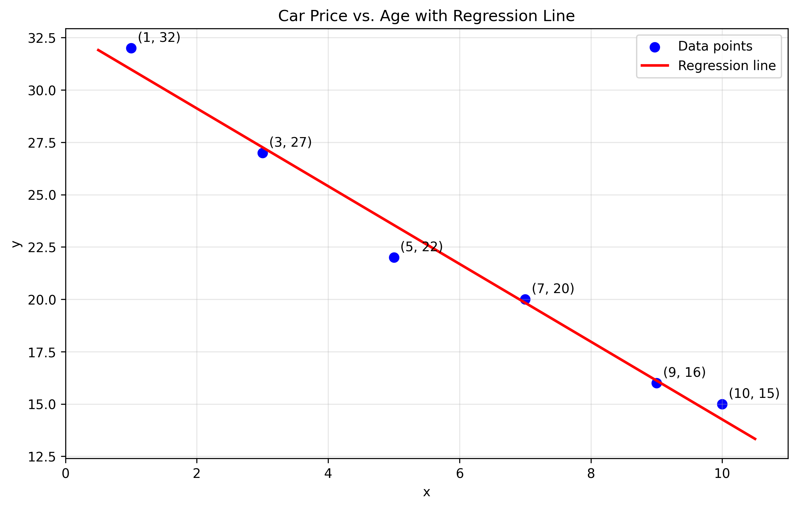
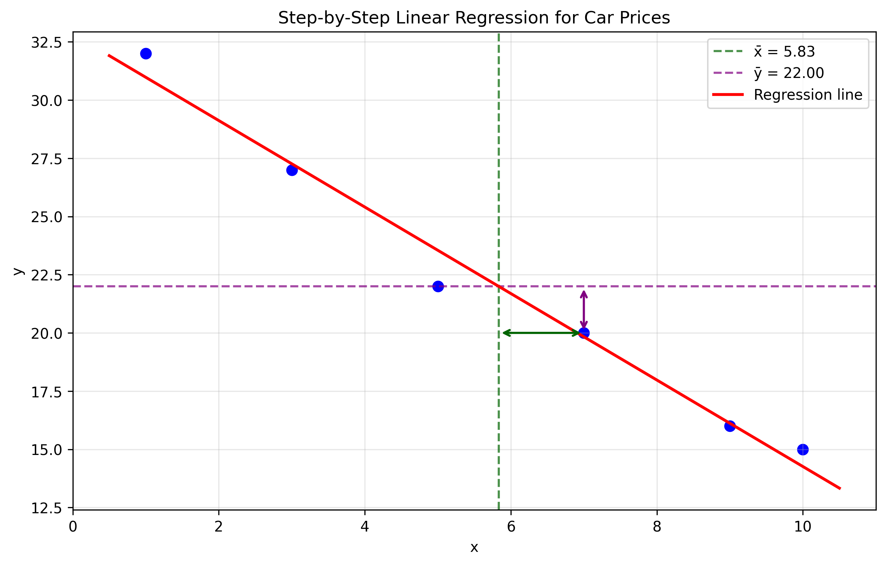
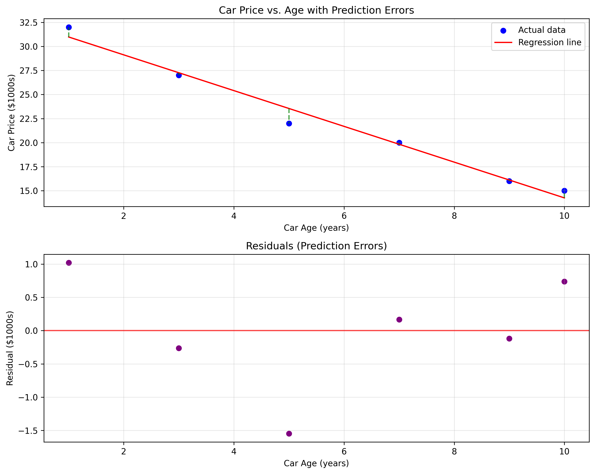
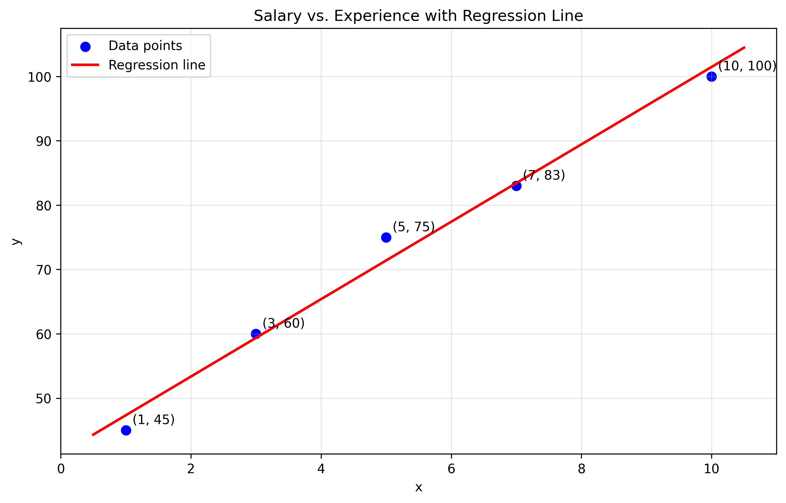
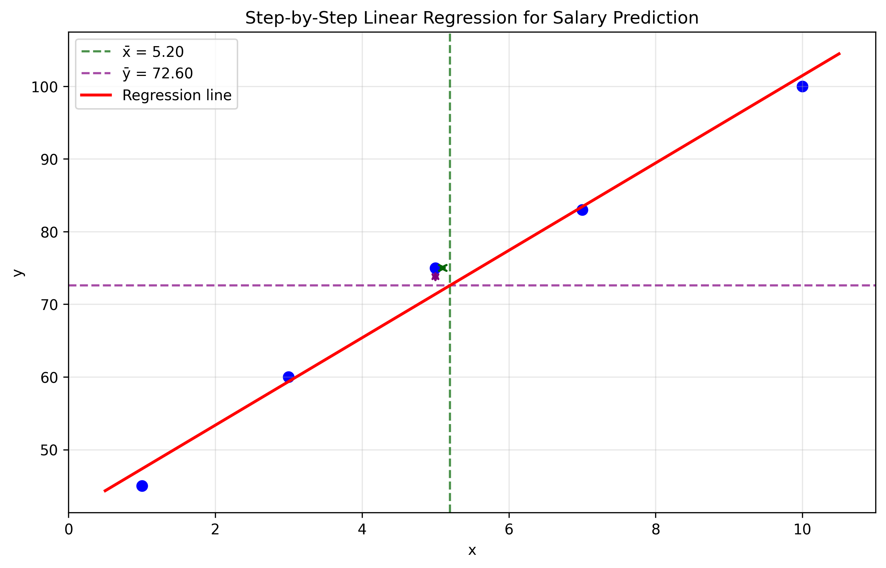
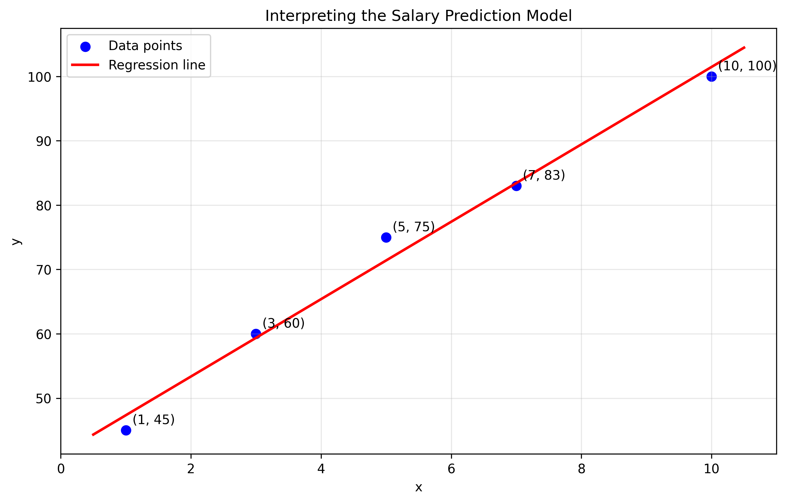
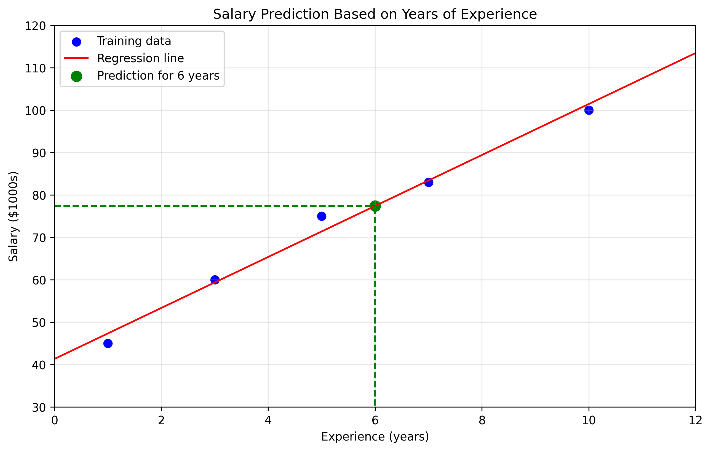

# Linear Regression: Detailed Step-by-Step Examples

This document provides detailed step-by-step solutions for linear regression problems, including visualizations and interpretations of the results.

## Key Concepts and Formulas

Linear regression models the relationship between a dependent variable (y) and one or more independent variables (x) by fitting a linear equation to the observed data.

### The Simple Linear Regression Model

$$y = \beta_0 + \beta_1x + \epsilon$$

$$\hat{y} = \hat{\beta_0} + \hat{\beta_1}x$$

Where:
- $y$ = Dependent variable (target)
- $x$ = Independent variable (feature)
- $\beta_0$ = Population intercept (bias term)
- $\beta_1$ = Population slope (weight)
- $\epsilon$ = Error term (assumes normal distribution with mean 0)
- $\hat{y}$ = Predicted value of $y$
- $\hat{\beta_0}, \hat{\beta_1}$ = Estimated intercept and slope

### Calculation Steps

1. Calculate the means of x and y:
   $$\bar{x} = \frac{1}{n}\sum_{i=1}^{n} x_i$$
   $$\bar{y} = \frac{1}{n}\sum_{i=1}^{n} y_i$$

2. Calculate the slope coefficient ($\hat{\beta_1}$):
   $$\hat{\beta_1} = \frac{\sum_{i=1}^{n} (x_i - \bar{x})(y_i - \bar{y})}{\sum_{i=1}^{n} (x_i - \bar{x})^2}$$

3. Calculate the intercept ($\hat{\beta_0}$):
   $$\hat{\beta_0} = \bar{y} - \hat{\beta_1}\bar{x}$$

4. Write the regression equation:
   $$\hat{y} = \hat{\beta_0} + \hat{\beta_1}x$$

5. Calculate the coefficient of determination (R²):
   $$R^2 = r^2$$
   Where $r$ is the correlation coefficient between x and y.

## Example 1: Estimating Car Prices Based on Age

### Problem Statement
A car dealership wants to model the relationship between a car's age (in years) and its price (in $1000s). They have collected data from recent sales:

| Car Age (years) | Price ($1000s) |
|-----------------|----------------|
| 1               | 32             |
| 3               | 27             |
| 5               | 22             |
| 7               | 20             |
| 9               | 16             |
| 10              | 15             |

The dealership wants to:
1. Find the linear relationship between car age and price
2. Predict the price of a 4-year-old car
3. Interpret what the coefficients mean in this context

### Step-by-Step Solution

#### Step 1: Calculate the means of x (age) and y (price)
$$\bar{x} = \frac{1+3+5+7+9+10}{6} = \frac{35}{6} \approx 5.83$$ years

$$\bar{y} = \frac{32+27+22+20+16+15}{6} = \frac{132}{6} = 22.00$$ thousand dollars

#### Step 2: Calculate the slope coefficient ($\hat{\beta_1}$)
The formula for the slope is:
$$\hat{\beta_1} = \frac{\sum_{i=1}^{n} (x_i - \bar{x})(y_i - \bar{y})}{\sum_{i=1}^{n} (x_i - \bar{x})^2}$$

Let's compute this:

| $x_i$ | $y_i$ | $x_i - \bar{x}$ | $y_i - \bar{y}$ | $(x_i - \bar{x})(y_i - \bar{y})$ | $(x_i - \bar{x})^2$ |
|-------|-------|-----------------|-----------------|----------------------------------|----------------------|
| 1     | 32    | -4.83           | 10.00           | -48.33                           | 23.36                |
| 3     | 27    | -2.83           | 5.00            | -14.17                           | 8.03                 |
| 5     | 22    | -0.83           | 0.00            | -0.00                            | 0.69                 |
| 7     | 20    | 1.17            | -2.00           | -2.33                            | 1.36                 |
| 9     | 16    | 3.17            | -6.00           | -19.00                           | 10.03                |
| 10    | 15    | 4.17            | -7.00           | -29.17                           | 17.36                |
| Sum   |       |                 |                 | -113.00                          | 60.83                |

$$\hat{\beta_1} = \frac{-113.00}{60.83} \approx -1.858$$

#### Step 3: Calculate the intercept ($\hat{\beta_0}$)
Using the formula: $\hat{\beta_0} = \bar{y} - \hat{\beta_1}\bar{x}$
$$\hat{\beta_0} = 22.00 - (-1.858)(5.83) \approx 22.00 + 10.84 \approx 32.836$$

#### Step 4: Write the regression equation
$$\hat{Price} = 32.836 - 1.858 \cdot Age$$

#### Step 5: Predict the price of a 4-year-old car
$$\hat{Price} = 32.836 - 1.858 \cdot 4 = 32.836 - 7.43 = 25.41$$

Therefore, the predicted price of a 4-year-old car is $25,410.

#### Step 6: Calculate the coefficient of determination (R²)
The correlation coefficient is $r = -0.990$, so:
$$R^2 = r^2 = (-0.990)^2 = 0.981$$

This means that 98.1% of the variation in car prices can be explained by the car's age.

#### Model Assessment
- Mean of residuals: 0.000
- Standard deviation of residuals: 0.827
- Sum of squared residuals (SSE): 4.099

### Visualizations







### Interpretation of Results
- **Intercept ($\hat{\beta_0} = 32.836$)**: This represents the estimated price (in $1000s) of a brand new car (age = 0)
- **Slope ($\hat{\beta_1} = -1.858$)**: This means that for each additional year of age, a car's price decreases by approximately $1,858
- **R² = 0.981**: This indicates that 98.1% of the variation in car prices can be explained by the car's age, suggesting a very strong linear relationship

## Example 2: Salary Prediction Based on Experience

### Problem Statement
A company wants to establish a salary guideline based on years of experience. They collect data on current employees:

| Experience (years) | Salary ($1000s) |
|--------------------|-----------------|
| 1                  | 45              |
| 3                  | 60              |
| 5                  | 75              |
| 7                  | 83              |
| 10                 | 100             |

The goal is to:
1. Build a linear regression model
2. Predict the salary for someone with 6 years of experience
3. Interpret the model's coefficients

### Step-by-Step Solution

#### Step 1: Calculate the means
$$\bar{x} = \frac{1+3+5+7+10}{5} = \frac{26}{5} = 5.20$$ years

$$\bar{y} = \frac{45+60+75+83+100}{5} = \frac{363}{5} = 72.60$$ thousand dollars

#### Step 2: Calculate the slope coefficient
Using the same approach as Example 1:

| $x_i$ | $y_i$ | $x_i - \bar{x}$ | $y_i - \bar{y}$ | $(x_i - \bar{x})(y_i - \bar{y})$ | $(x_i - \bar{x})^2$ |
|-------|-------|-----------------|-----------------|----------------------------------|----------------------|
| 1     | 45    | -4.20           | -27.60          | 115.92                           | 17.64                |
| 3     | 60    | -2.20           | -12.60          | 27.72                            | 4.84                 |
| 5     | 75    | -0.20           | 2.40            | -0.48                            | 0.04                 |
| 7     | 83    | 1.80            | 10.40           | 18.72                            | 3.24                 |
| 10    | 100   | 4.80            | 27.40           | 131.52                           | 23.04                |
| Sum   |       |                 |                 | 293.40                           | 48.80                |

$$\hat{\beta_1} = \frac{293.40}{48.80} \approx 6.012$$

#### Step 3: Calculate the intercept
$$\hat{\beta_0} = 72.60 - 6.012(5.20) \approx 72.60 - 31.26 \approx 41.336$$

#### Step 4: Write the regression equation
$$\hat{Salary} = 41.336 + 6.012 \cdot Experience$$

#### Step 5: Predict the salary for 6 years of experience
$$\hat{Salary} = 41.336 + 6.012 \cdot 6 = 41.336 + 36.07 = 77.41$$

Therefore, the predicted salary for someone with 6 years of experience is $77,410.

#### Step 6: Calculate the coefficient of determination (R²)
The correlation coefficient is $r = 0.994$, so:
$$R^2 = r^2 = (0.994)^2 = 0.988$$

This means that 98.8% of the variation in salaries can be explained by years of experience.

### Visualizations









### Interpretation of Results
- **Intercept ($\hat{\beta_0} = 41.336$)**: The base salary for someone with no experience is approximately $41,336
- **Slope ($\hat{\beta_1} = 6.012$)**: For each additional year of experience, the salary increases by approximately $6,012
- **R² = 0.988**: This indicates that 98.8% of the variation in salaries can be explained by years of experience, suggesting a very strong linear relationship

## Key Insights

### Theoretical Insights
- Simple linear regression assumes a linear relationship between variables
- The model estimates two parameters: intercept and slope
- The intercept represents the predicted value when the independent variable is zero
- The slope represents the change in the dependent variable for a one-unit change in the independent variable
- The coefficient of determination (R²) measures the proportion of variance in the dependent variable that is predictable from the independent variable

### Practical Applications
- Simple linear regression is useful for quick predictions based on a single feature
- The model can be used to identify trends and relationships between variables
- The step-by-step calculation process helps understand how the model parameters are derived
- Visualizations help interpret the model and its predictions

### Common Pitfalls
- Assuming linearity when the relationship is non-linear
- Not checking the assumptions of the regression model (normality, constant variance)
- Using the model to predict far outside the range of observed data
- Confusing correlation with causation

## Running the Examples

You can run the code that generates these examples and visualizations using:

```bash
python3 ML_Obsidian_Vault/Lectures/3/Codes/2_linear_regression_detailed_examples.py
```

## Related Topics

- [[L3_2_Simple_Linear_Regression_Examples|Simple Linear Regression Examples]]: More examples of linear regression
- [[L3_2_Cost_Function|Cost Function]]: How to measure the model's accuracy
- [[L3_2_Least_Squares|Least Squares Method]]: The mathematical foundation for finding the optimal parameters
- [[L3_2_Analytical_Solution|Analytical Solution]]: The closed-form solution for linear regression 