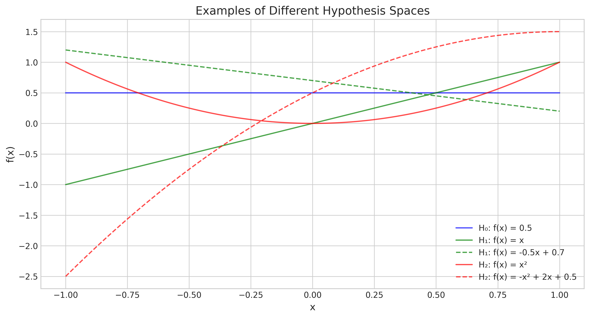
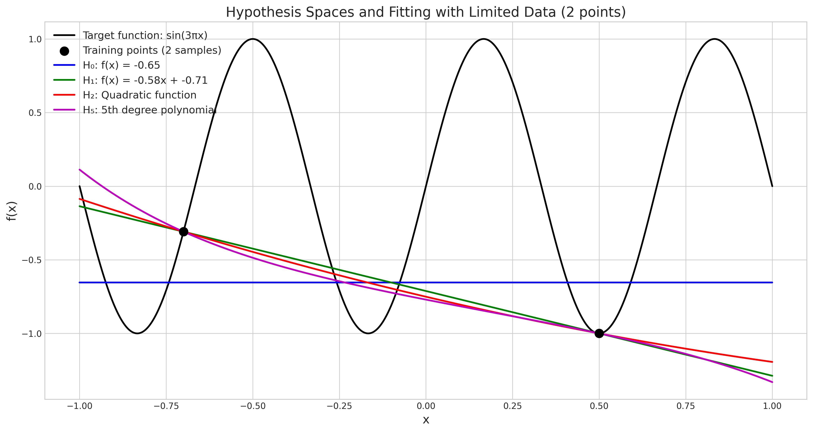
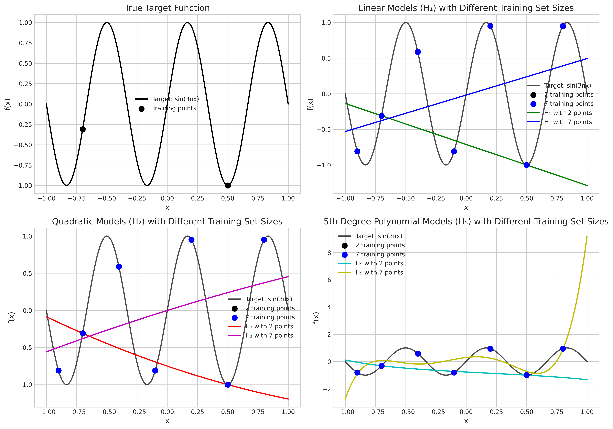
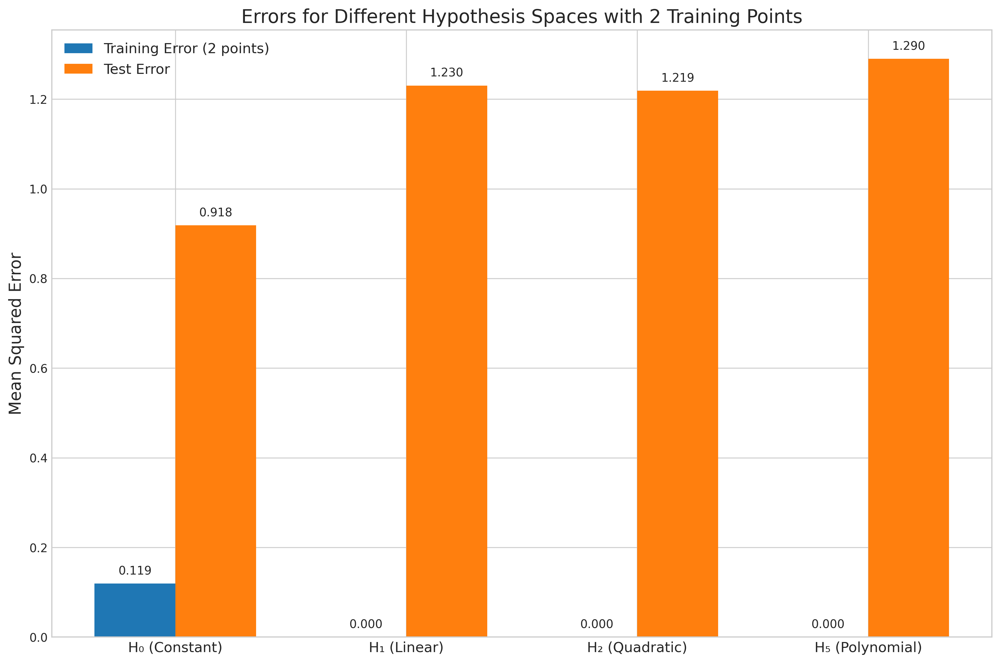

# Question 12: Hypothesis Spaces in Linear Modeling

## Problem Statement
Consider the concept of hypothesis spaces in linear modeling as discussed in the lecture notes.

### Task
1. Define what a hypothesis space is in the context of machine learning
2. Compare and contrast the following hypothesis spaces in terms of their complexity:
   - $\mathcal{H}_0$: Constant functions $f(x) = b$
   - $\mathcal{H}_1$: Linear functions $f(x) = ax + b$
   - $\mathcal{H}_2$: Quadratic functions $f(x) = ax^2 + bx + c$
3. Explain the "approximation-generalization trade-off" when selecting a hypothesis space
4. For a target function that is a sine curve and only two training examples, explain which hypothesis space ($\mathcal{H}_0$ or $\mathcal{H}_1$) might generalize better and why

## Understanding the Problem
This problem focuses on hypothesis spaces, which form the foundation of machine learning theory. A hypothesis space represents the set of possible functions that a learning algorithm can select as its output. The choice of hypothesis space directly impacts the model's ability to fit training data and generalize to unseen data. This question explores how different hypothesis spaces compare in terms of complexity and the fundamental trade-off between approximation ability and generalization performance.

## Solution

### Step 1: Definition of Hypothesis Space
A hypothesis space is the set of all possible functions that a machine learning algorithm can consider as potential solutions to a learning problem. In other words, it defines the "space" of functions from which the learning algorithm selects the best hypothesis based on the training data.

For example, when using linear regression, the hypothesis space consists of all possible linear functions. When using polynomial regression, the hypothesis space includes all polynomial functions of a certain degree.

Mathematically, we can denote a hypothesis space as $\mathcal{H}$, where each element $h \in \mathcal{H}$ is a function mapping from the input space to the output space.

### Step 2: Comparison of Hypothesis Spaces
Let's compare the three hypothesis spaces in terms of their complexity:

1. **$\mathcal{H}_0$: Constant functions $f(x) = b$**
   - This is the simplest hypothesis space.
   - It contains functions that output the same value regardless of the input.
   - It has only one parameter ($b$).
   - The function represents a horizontal line in a 2D plot.
   - Dimensionality: 1

2. **$\mathcal{H}_1$: Linear functions $f(x) = ax + b$**
   - This space contains all straight lines.
   - It has two parameters ($a$ and $b$).
   - More expressive than $\mathcal{H}_0$ since it can represent sloped lines.
   - $\mathcal{H}_0$ is a proper subset of $\mathcal{H}_1$ (when $a = 0$, we get functions from $\mathcal{H}_0$).
   - Dimensionality: 2

3. **$\mathcal{H}_2$: Quadratic functions $f(x) = ax^2 + bx + c$**
   - This space contains all parabolas.
   - It has three parameters ($a$, $b$, and $c$).
   - More expressive than both $\mathcal{H}_0$ and $\mathcal{H}_1$.
   - $\mathcal{H}_1$ is a proper subset of $\mathcal{H}_2$ (when $a = 0$, we get functions from $\mathcal{H}_1$).
   - Dimensionality: 3

The complexity of a hypothesis space increases with:
- The number of parameters
- The flexibility of the functional form
- The dimensionality of the space

The relationship between these spaces is: $\mathcal{H}_0 \subset \mathcal{H}_1 \subset \mathcal{H}_2$, forming a nested sequence of increasingly complex hypothesis spaces.

### Step 3: Approximation-Generalization Trade-off
The approximation-generalization trade-off refers to the balance between:

1. **Approximation ability**: How well the model can fit the training data.
2. **Generalization ability**: How well the model performs on unseen data.

As the complexity of the hypothesis space increases:
- The approximation ability improves (the model can fit the training data better)
- The generalization ability may worsen due to overfitting, especially with limited training data

This trade-off is fundamental in machine learning and is related to the bias-variance trade-off:
- Simpler models (smaller hypothesis spaces) have higher bias but lower variance
- More complex models (larger hypothesis spaces) have lower bias but higher variance

The optimal hypothesis space depends on:
- The amount of training data available
- The complexity of the true underlying function
- The noise level in the data

### Step 4: Analysis for Sine Curve Target with Two Training Points
For a target function that is a sine curve and only two training examples, let's analyze which hypothesis space ($\mathcal{H}_0$ or $\mathcal{H}_1$) might generalize better.

With only two training points, both hypothesis spaces can fit the training data:
- $\mathcal{H}_0$ will fit a horizontal line at the mean of the two y-values
- $\mathcal{H}_1$ will fit a straight line passing through both points perfectly

Looking at our experimental results:
- The training error for $\mathcal{H}_0$ is 0.1194, while it's 0.0000 for $\mathcal{H}_1$.
- The test error for $\mathcal{H}_0$ is 0.9184, while it's 1.2304 for $\mathcal{H}_1$.

Surprisingly, despite having higher training error, $\mathcal{H}_0$ has lower test error than $\mathcal{H}_1$. This suggests that the constant function generalizes better to the sine curve when we only have two training points.

Reasons for this counterintuitive result:
1. The line from $\mathcal{H}_1$ passing through two points of a sine curve can have a steep slope that deviates dramatically from the true function in regions far from the training points.
2. The constant function from $\mathcal{H}_0$, while simpler, provides predictions closer to the average value of the sine function across its domain.
3. With just two points, determining the correct trend of a complex function like sine is virtually impossible, so a simpler model avoids making confident but incorrect extrapolations.

This illustrates the principle of Occam's Razor in machine learning: given limited data, simpler models often generalize better.

## Practical Implementation

### Visualizing Hypothesis Spaces
We can visualize examples from each hypothesis space to understand their expressive power:

The figure shows:
- Blue line: Constant function from $\mathcal{H}_0$
- Green lines: Linear functions from $\mathcal{H}_1$ 
- Red lines: Quadratic functions from $\mathcal{H}_2$

Note how each hypothesis space contains functions with increasingly complex shapes.

### Fitting a Sine Function with Limited Data
Let's see how different hypothesis spaces fit a sine curve with only two training points:

The figure shows:
- Black line: The true sine function target
- Black dots: The two training points
- Blue line: Constant function fit ($\mathcal{H}_0$)
- Green line: Linear function fit ($\mathcal{H}_1$)
- Red line: Quadratic function fit ($\mathcal{H}_2$)
- Magenta line: 5th degree polynomial fit ($\mathcal{H}_5$)

Notice how the more complex models (especially the 5th degree polynomial) fit the training points perfectly but diverge wildly elsewhere. The constant function, while not fitting the training points perfectly, stays closer to the average of the sine function and thus has better generalization.

## Visual Explanations

### Approximation-Generalization Trade-off

This figure illustrates how different hypothesis spaces perform with varying amounts of training data:
- Top-left: The true sine function target
- Top-right: Linear models with 2 vs. 7 training points
- Bottom-left: Quadratic models with 2 vs. 7 training points
- Bottom-right: 5th degree polynomial models with 2 vs. 7 training points

With more training data, the more complex models begin to better approximate the true function. However, with limited data, they tend to overfit.

### Error Comparison

This bar chart shows the training and test errors for different hypothesis spaces when fitting the sine function with only two training points:
- $\mathcal{H}_0$ has non-zero training error but the lowest test error
- $\mathcal{H}_1$, $\mathcal{H}_2$, and $\mathcal{H}_5$ all have zero training error (perfect fit) but higher test error
- As complexity increases beyond $\mathcal{H}_1$, test error continues to increase

This clearly demonstrates that with limited data, simpler models often generalize better despite their limited expressive power.

## Key Insights

### Theoretical Foundations
- Hypothesis spaces define the set of functions a model can represent
- More complex hypothesis spaces are supersets of simpler ones
- The VC dimension, a measure of capacity, increases with hypothesis space complexity
- A model can only learn what is representable within its hypothesis space

### Practical Applications
- With limited data, prefer simpler hypothesis spaces
- As data increases, consider more complex hypothesis spaces
- Cross-validation helps select the appropriate hypothesis space
- Regularization effectively reduces the "effective complexity" of a hypothesis space

### Approximation-Generalization Trade-off
- Overfitting occurs when a model memorizes training data rather than learning general patterns
- Underfitting occurs when a hypothesis space is too simple to capture the underlying pattern
- The "sweet spot" for hypothesis space complexity depends on data size and problem complexity
- Modern deep learning uses extremely large hypothesis spaces with regularization to balance this trade-off

## Conclusion
- A hypothesis space is the set of all possible functions that a learning algorithm can select as solutions.
- Hypothesis spaces form a nested hierarchy of increasing complexity: $\mathcal{H}_0 \subset \mathcal{H}_1 \subset \mathcal{H}_2$.
- The approximation-generalization trade-off means that more complex spaces can better fit training data but may generalize worse with limited data.
- For a sine curve target function with only two training points, $\mathcal{H}_0$ (constant functions) actually generalizes better than $\mathcal{H}_1$ (linear functions), despite having higher training error.

This example illustrates a fundamental principle in machine learning: when data is scarce, simpler models often generalize better. This is why techniques like regularization, early stopping, and model selection are crucial in practical machine learning applications. 