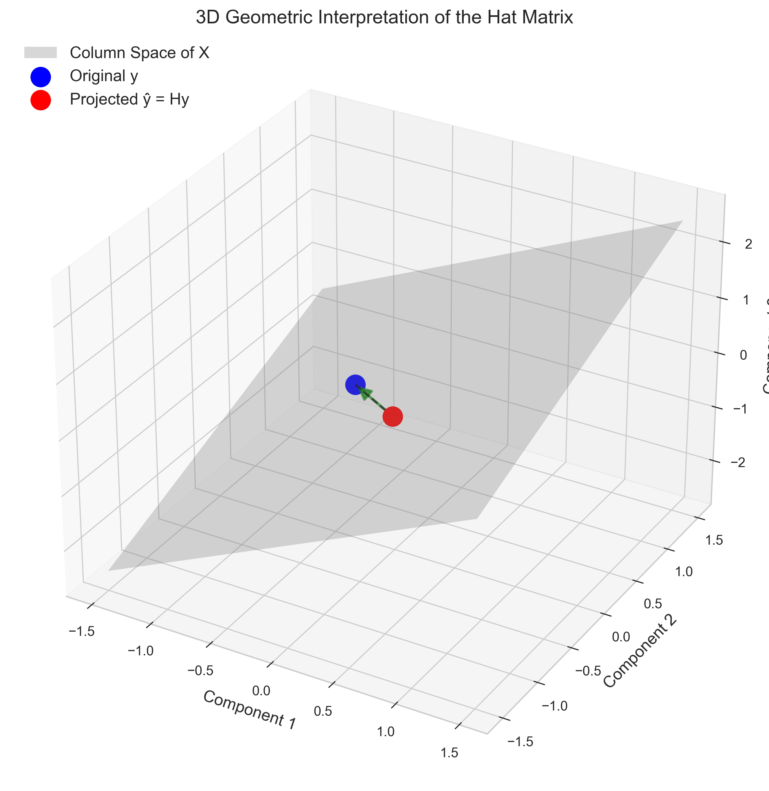

# Question 1: Hat Matrix Properties

## Problem Statement
Consider a $2 \times 2$ hat matrix $\mathbf{H}$ in linear regression. You are given that one of its eigenvalues is 1.

### Task
1. What must be the other eigenvalue of $\mathbf{H}$?
2. Explain why these eigenvalues make sense given the properties of the hat matrix.
3. What does the hat matrix represent geometrically in linear regression?

## Understanding the Problem
The hat matrix $\mathbf{H}$ is a fundamental concept in linear regression that maps the observed response vector $\mathbf{y}$ to the fitted response vector $\hat{\mathbf{y}}$. The name "hat matrix" comes from the notation, where $\hat{\mathbf{y}} = \mathbf{H}\mathbf{y}$ puts a "hat" on $\mathbf{y}$.

For a linear regression model with design matrix $\mathbf{X}$, the hat matrix is defined as:

$$\mathbf{H} = \mathbf{X}(\mathbf{X}'\mathbf{X})^{-1}\mathbf{X}'$$

The eigenvalues of the hat matrix reveal important information about its properties and geometric interpretation. Understanding these eigenvalues helps us comprehend the projection nature of linear regression.

## Solution

### Step 1: Identify the properties of the hat matrix
The hat matrix has several key properties:

1. $\mathbf{H}$ is a projection matrix: It projects the response vector $\mathbf{y}$ onto the column space of $\mathbf{X}$.
2. $\mathbf{H}$ is symmetric: $\mathbf{H} = \mathbf{H}'$
3. $\mathbf{H}$ is idempotent: $\mathbf{H}^2 = \mathbf{H}$
4. The fitted values are: $\hat{\mathbf{y}} = \mathbf{H}\mathbf{y}$
5. The residuals are: $\mathbf{e} = \mathbf{y} - \hat{\mathbf{y}} = \mathbf{y} - \mathbf{H}\mathbf{y} = (\mathbf{I} - \mathbf{H})\mathbf{y}$

The idempotent property is particularly important for our analysis of eigenvalues.

### Step 2: Analyze the eigenvalues using the idempotent property
Since $\mathbf{H}$ is idempotent ($\mathbf{H}^2 = \mathbf{H}$), its eigenvalues must satisfy a specific condition.

For any eigenvalue $\lambda$ of $\mathbf{H}$ with corresponding eigenvector $\mathbf{v}$:
$$\mathbf{H}\mathbf{v} = \lambda\mathbf{v}$$

Then:
$$\mathbf{H}^2\mathbf{v} = \mathbf{H}(\mathbf{H}\mathbf{v}) = \mathbf{H}(\lambda\mathbf{v}) = \lambda\mathbf{H}\mathbf{v} = \lambda^2\mathbf{v}$$

But since $\mathbf{H}^2 = \mathbf{H}$, we also have:
$$\mathbf{H}^2\mathbf{v} = \mathbf{H}\mathbf{v} = \lambda\mathbf{v}$$

Therefore:
$$\lambda^2\mathbf{v} = \lambda\mathbf{v}$$

This implies:
$$\lambda^2 = \lambda$$
$$\lambda(\lambda - 1) = 0$$

Which means $\lambda = 0$ or $\lambda = 1$. So, the eigenvalues of any hat matrix can only be 0 or 1.

### Step 3: Determine the other eigenvalue for a 2×2 hat matrix
For any hat matrix, the sum of the eigenvalues equals the trace of $\mathbf{H}$, which equals the rank of $\mathbf{X}$ (the number of linearly independent columns in $\mathbf{X}$).

In a $2 \times 2$ hat matrix derived from a design matrix $\mathbf{X}$ with full column rank (rank = 2), the sum of eigenvalues must be 2.

Since we know one eigenvalue is 1, and the only possible values for eigenvalues are 0 and 1, the other eigenvalue must also be 1.

Therefore, for a $2 \times 2$ hat matrix with one eigenvalue equal to 1 and full rank, the other eigenvalue must also be 1.

### Step 4: Understand the geometric interpretation
Geometrically, the hat matrix $\mathbf{H}$ represents a projection onto the column space of $\mathbf{X}$. This means:

1. Vectors in the column space of $\mathbf{X}$ remain unchanged when multiplied by $\mathbf{H}$ (eigenvalue = 1)
2. Vectors orthogonal to the column space of $\mathbf{X}$ become zero when multiplied by $\mathbf{H}$ (eigenvalue = 0)
3. The hat matrix projects $\mathbf{y}$ onto the closest point in the column space of $\mathbf{X}$

In linear regression, this projection represents finding the point in the column space of $\mathbf{X}$ (i.e., the space of all possible fitted values) that is closest to the observed values $\mathbf{y}$. The "closest" is defined in terms of minimizing the sum of squared residuals.

## Practical Implementation

### Example of a Hat Matrix
Let's examine a concrete example. Consider a $2 \times 2$ hat matrix:

$$\mathbf{H} = \begin{bmatrix} 1 & 0 \\ 0 & 1 \end{bmatrix}$$

The eigenvalues of this matrix are:
$$\lambda_1 = 1, \lambda_2 = 1$$

And the eigenvectors are:
$$\mathbf{v}_1 = \begin{bmatrix} 1 \\ 0 \end{bmatrix}, \mathbf{v}_2 = \begin{bmatrix} 0 \\ 1 \end{bmatrix}$$

This confirms our theoretical result: both eigenvalues are 1, and the corresponding eigenvectors form a basis for the column space of $\mathbf{X}$.

## Visual Explanations

### 2D Projection by the Hat Matrix

The blue points are the original data points (response $\mathbf{y}$), and the red points are the fitted values ($\hat{\mathbf{y}} = \mathbf{H}\mathbf{y}$). The vertical dashed lines show the projection. Notice how each red point is the projection of the corresponding blue point onto the regression line.

### 3D Geometric Interpretation

In this 3D visualization, the gray plane represents the column space of $\mathbf{X}$. The blue point is the original response vector $\mathbf{y}$, and the red point is its projection $\hat{\mathbf{y}} = \mathbf{H}\mathbf{y}$ onto the column space. The green arrow shows the residual vector $\mathbf{e} = \mathbf{y} - \hat{\mathbf{y}}$, which is perpendicular to the column space.

### Effect of Hat Matrix on Unit Circle

This visualization shows the original unit circle (blue) with the eigenvectors of the hat matrix (green arrows). Since both eigenvalues are 1 in our $2 \times 2$ example, these eigenvectors represent directions that are preserved by the hat matrix.

This visualization shows how the hat matrix transforms the unit circle. The original circle (blue) and its transformation (red) are identical in this case because both eigenvalues are 1 in our $2 \times 2$ example with full rank. The green arrows represent the eigenvectors, each with eigenvalue $\lambda = 1$.

### Eigenspaces of the Hat Matrix

This diagram illustrates the eigenspaces of the hat matrix:
- The red line represents the eigenspace corresponding to eigenvalue $\lambda = 1$ (the column space of $\mathbf{X}$)
- The blue line represents the eigenspace corresponding to eigenvalue $\lambda = 0$ (the null space of $\mathbf{H}$)
- The purple arrow shows an original vector $\mathbf{y}$
- The red arrow shows its projection $\hat{\mathbf{y}} = \mathbf{H}\mathbf{y}$ onto the column space
- The blue arrow shows the residual vector $\mathbf{e} = \mathbf{y} - \hat{\mathbf{y}}$, which is orthogonal to the column space

## Key Insights

### Mathematical Properties
- The hat matrix is both symmetric ($\mathbf{H} = \mathbf{H}'$) and idempotent ($\mathbf{H}^2 = \mathbf{H}$)
- Due to idempotence, the eigenvalues of any hat matrix can only be 0 or 1
- The number of eigenvalues equal to 1 corresponds to the rank of $\mathbf{X}$
- In a full-rank model with $p$ predictors, exactly $p$ eigenvalues will be 1, and the rest will be 0

### Geometric Interpretation
- The hat matrix represents a projection onto the column space of $\mathbf{X}$
- Eigenvalue 1: directions preserved by the projection (within the column space)
- Eigenvalue 0: directions eliminated by the projection (orthogonal to the column space)
- The residual vector is always orthogonal to the column space of $\mathbf{X}$

### Statistical Significance
- The hat matrix forms the foundation of least squares estimation
- It defines how the data points influence the fitted values
- The diagonal elements of $\mathbf{H}$ (called leverage values) measure how influential each observation is in determining its own fitted value

## Conclusion
- For a $2 \times 2$ hat matrix with one eigenvalue equal to 1 and full rank, the other eigenvalue must also be 1.
- These eigenvalues (both being 1) reflect the fact that the hat matrix preserves vectors in the 2-dimensional column space of $\mathbf{X}$.
- Geometrically, the hat matrix represents a projection that maps the response vector $\mathbf{y}$ to its orthogonal projection $\hat{\mathbf{y}}$ on the column space of $\mathbf{X}$, which represents the fitted values in linear regression.

Understanding the eigenstructure of the hat matrix provides deep insights into the nature of linear regression as a projection operation and helps explain why least squares estimators have the properties they do.