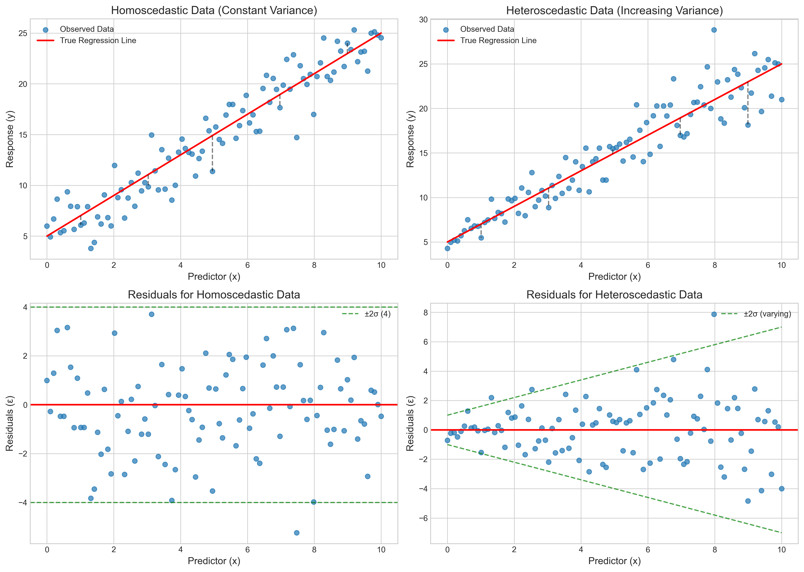
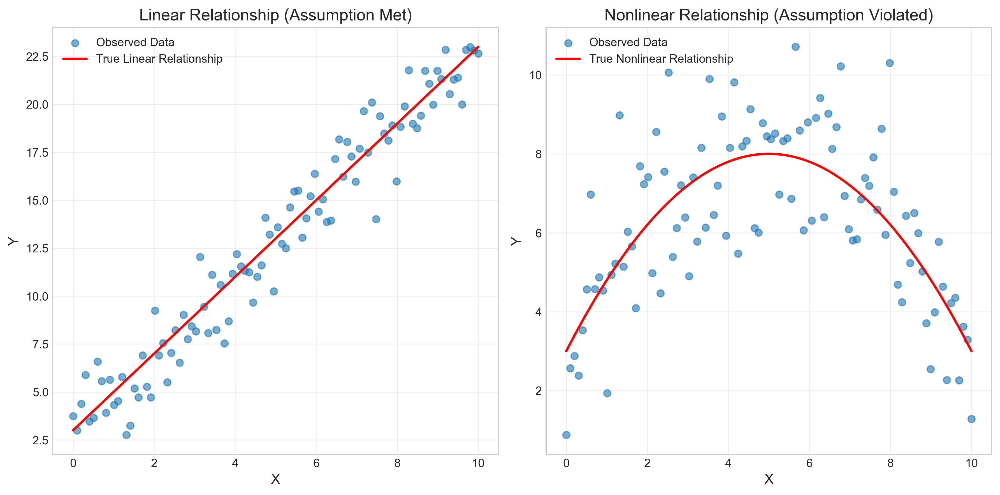
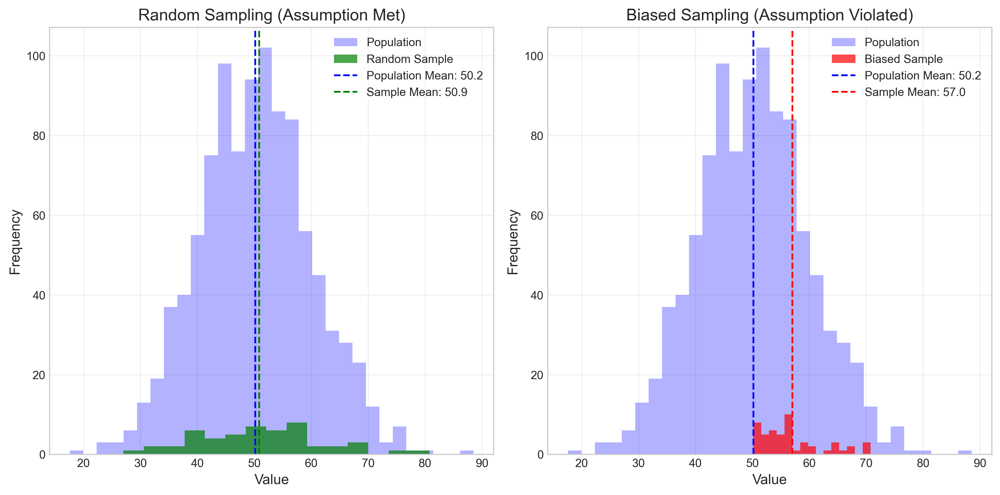
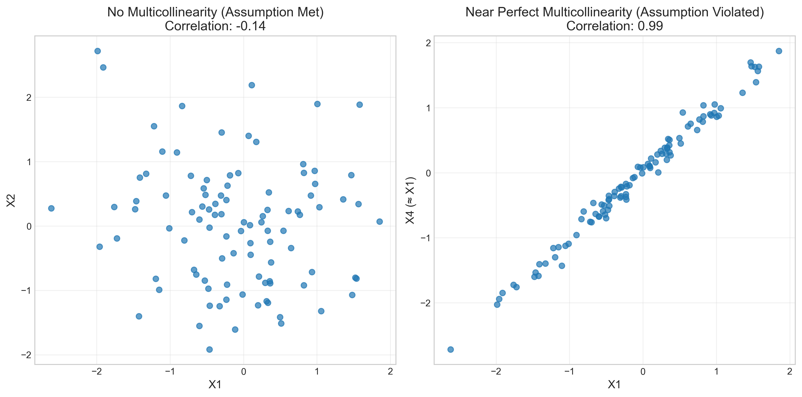
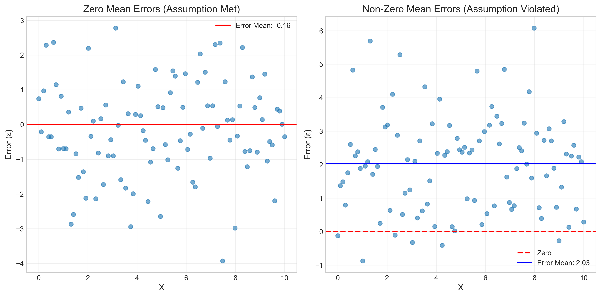
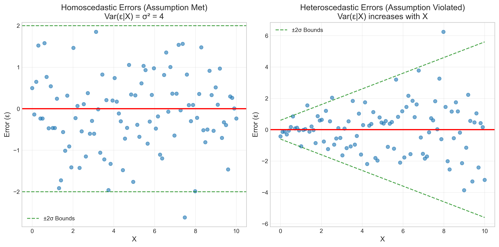
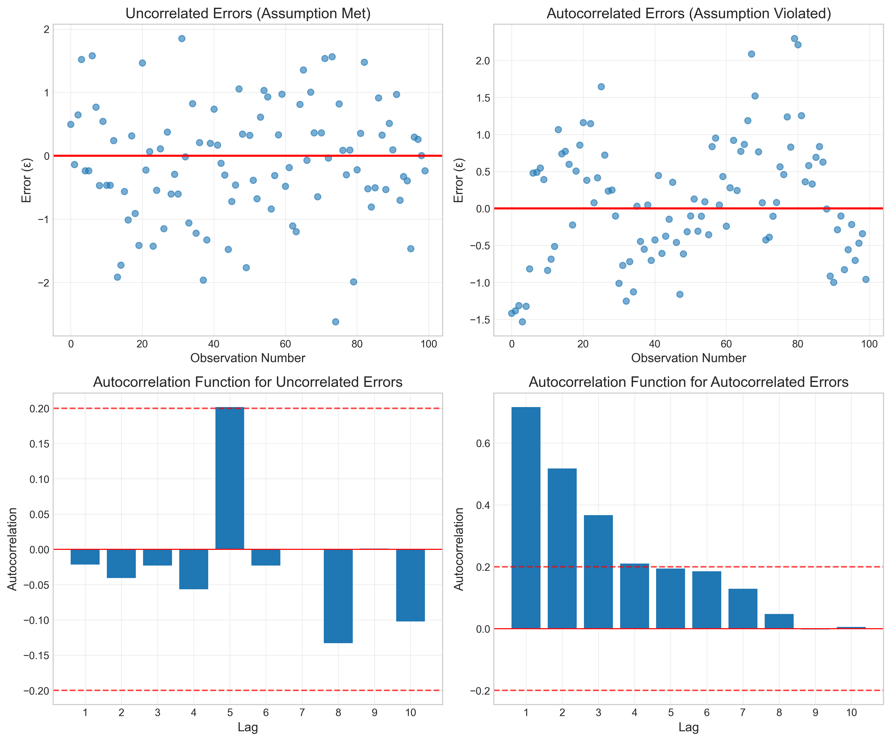
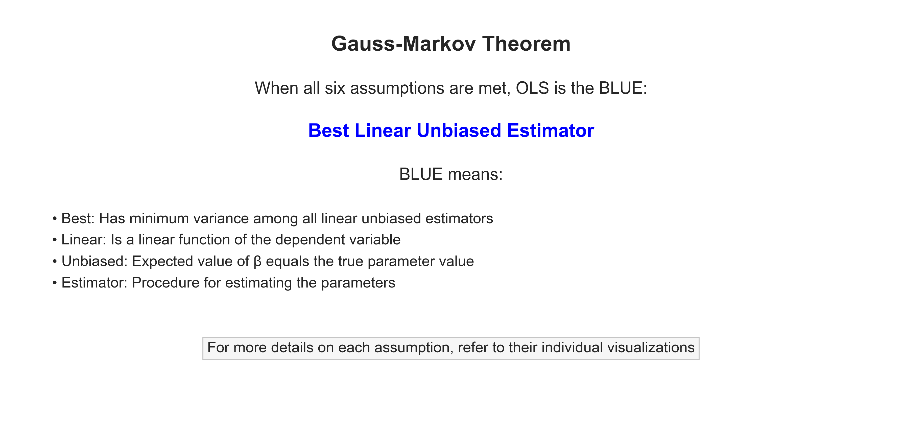
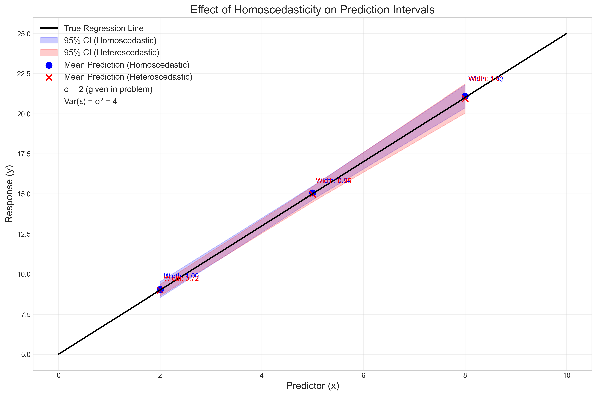
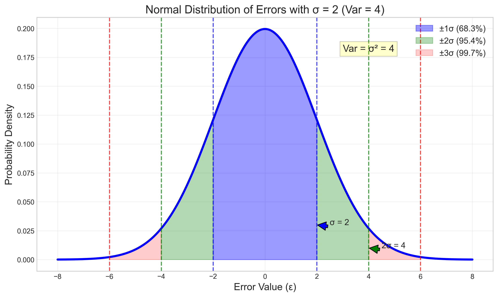

# Question 2: Gauss-Markov Assumptions

## Problem Statement
Consider the Gauss-Markov assumptions in linear regression. You are given a dataset where the errors have constant variance $\sigma^2 = 4$.

### Task
1. State what homoscedasticity means in simple terms
2. Explain why constant variance is important for linear regression
3. What would be the variance of the errors if $\sigma = 2$?

## Understanding the Problem
The Gauss-Markov assumptions form the foundation of linear regression analysis. These assumptions ensure that the Ordinary Least Squares (OLS) estimator has desirable statistical properties, particularly that it is the Best Linear Unbiased Estimator (BLUE). 

One of the key Gauss-Markov assumptions is homoscedasticity, which concerns the variance of the error terms in the model. Understanding this assumption is crucial for valid statistical inference and reliable predictions in linear regression.

The problem asks us to explain this assumption in simple terms, discuss its importance, and perform a basic calculation relating the standard deviation ($\sigma$) to the variance ($\sigma^2$).

## Solution

### Step 1: Explaining homoscedasticity in simple terms
Homoscedasticity (from Greek: homos = same, skedastikos = dispersion) is a key assumption in linear regression that means the variance of the errors is constant across all levels of the predictor variables.

In simple terms, homoscedasticity means that the spread or dispersion of the errors around the regression line is the same throughout the entire range of the data. If you were to visualize this, the vertical distances from the data points to the regression line would have roughly the same variability regardless of where you look along the x-axis.

Mathematically, for a linear model $y = X\beta + \varepsilon$, homoscedasticity means:
$$\text{Var}(\varepsilon_i) = \sigma^2 \text{ for all } i = 1, 2, \ldots, n$$

where $\sigma^2$ is a constant value (in this case, $\sigma^2 = 4$).

The opposite of homoscedasticity is heteroscedasticity, where the variance of errors varies across different levels of the predictors.

### Step 2: Importance of constant variance in linear regression
Constant variance (homoscedasticity) is important for linear regression for several reasons:

1. **Statistical Efficiency:** When the errors have constant variance, the Ordinary Least Squares (OLS) estimator is the Best Linear Unbiased Estimator (BLUE) according to the Gauss-Markov theorem. This means that among all unbiased linear estimators, OLS has the smallest variance, making it the most efficient.

2. **Valid Statistical Inference:** Constant variance ensures that the standard errors of the coefficient estimates are correct, leading to valid hypothesis tests, p-values, and confidence intervals. When heteroscedasticity is present, standard errors may be underestimated or overestimated, leading to incorrect conclusions about the significance of predictors.

3. **Consistent Prediction Accuracy:** Homoscedasticity means that the precision of predictions is the same across all values of the predictors, making the model equally reliable throughout the entire range of the data. This is especially important when making predictions for new observations.

4. **Simplified Statistical Theory:** It simplifies statistical inference because we can use a single parameter ($\sigma^2$) to describe the error distribution rather than having different variances for different observations. This makes the model more interpretable and easier to work with.

5. **Model Diagnostics:** When this assumption is violated, it often indicates that the model is misspecified in some way. Perhaps important predictors are missing, or the relationship is nonlinear, or transformations of variables are needed.

### Step 3: Calculating the variance when σ = 2
The variance of the errors is related to the standard deviation by:
$$\text{Variance} = \sigma^2 = (\text{Standard Deviation})^2$$

Given that $\sigma = 2$:
$$\text{Variance} = \sigma^2 = 2^2 = 4$$

So, the variance of the errors is 4 when $\sigma = 2$. This matches the value given in the problem statement.

## Visual Explanations

### Homoscedastic vs Heteroscedastic Data

This visualization illustrates the key difference between homoscedastic and heteroscedastic data:

- **Top Left:** Homoscedastic data with constant variance. Notice how the spread of points around the regression line (red) remains consistent throughout the range of x.
- **Top Right:** Heteroscedastic data with increasing variance. As x increases, the dispersion of points around the regression line increases as well.
- **Bottom Left:** Residual plot for homoscedastic data. The green dashed lines show the constant ±2σ bounds (±4), and the residuals are uniformly distributed within these bounds.
- **Bottom Right:** Residual plot for heteroscedastic data. The green dashed lines show how the ±2σ bounds increase with x, indicating that the variance is not constant.

### Gauss-Markov Assumptions
The Gauss-Markov theorem states that when all six key assumptions are met, the Ordinary Least Squares (OLS) estimator is the Best Linear Unbiased Estimator (BLUE). Let's explore each assumption:

#### 1. Linearity

The relationship between the predictors and the response variable must be linear. When this assumption is violated (right plot), OLS may produce biased estimates.

#### 2. Random Sampling

The data should be a random sample from the population. With biased sampling (right plot), our estimates won't represent the population properly.

#### 3. No Perfect Multicollinearity

No predictor should be a perfect linear combination of others. Near-perfect multicollinearity (right plot) causes unstable coefficient estimates.

#### 4. Exogeneity (Zero Mean Error)

The expected value of errors should be zero: E(ε|X) = 0. Non-zero mean errors (right plot) lead to biased estimates.

#### 5. Homoscedasticity

The errors should have constant variance: Var(ε|X) = σ². With heteroscedasticity (right plot), OLS estimates become inefficient.

#### 6. No Autocorrelation

The errors should be uncorrelated: Cov(ε_i, ε_j) = 0 for i ≠ j. Autocorrelated errors (right plots) lead to incorrect standard errors.

#### BLUE Property

When all six assumptions are met, OLS is the Best Linear Unbiased Estimator (BLUE).

### Effect of Homoscedasticity on Prediction Intervals

This visualization shows how homoscedasticity affects prediction intervals:

- The black line represents the true regression line
- The blue shaded areas show the 95% confidence intervals for predictions under homoscedasticity
- The red shaded areas show the 95% confidence intervals for predictions under heteroscedasticity

Notice that with homoscedastic errors, the confidence intervals have consistent width across all values of x. In contrast, with heteroscedastic errors, the confidence intervals widen as x increases, reflecting the increasing uncertainty in predictions.

### Normal Distribution of Errors with σ = 2

This visualization shows the probability distribution of errors when σ = 2:

- The blue shaded area represents ±1σ, containing about 68.3% of the probability mass
- The green shaded area represents the region between ±1σ and ±2σ
- The red shaded area represents the region between ±2σ and ±3σ

The annotation highlights that Var = σ² = 4, which is the variance of this distribution.

## Key Insights

### Statistical Foundations
- Homoscedasticity is one of several assumptions required for the Gauss-Markov theorem to hold
- When all assumptions are met, OLS provides the Best Linear Unbiased Estimator (BLUE)
- For normal errors, the variance σ² completely characterizes the dispersion of the error distribution
- Standard deviation (σ) and variance (σ²) are related by a simple squaring relationship

### Practical Implications
- Violation of homoscedasticity (heteroscedasticity) doesn't bias the coefficient estimates, but it affects their standard errors
- With heteroscedasticity, predictions become less reliable in regions with higher variance
- Diagnostic plots, especially residual plots, can help detect violations of homoscedasticity
- When heteroscedasticity is detected, remedies include weighted least squares, robust standard errors, or transforming the response variable

### Common Misconceptions
- Homoscedasticity doesn't require that the data points themselves have constant spread around their mean
- Instead, it requires that the residuals (unexplained variation) have constant spread
- Homoscedasticity is distinct from normality of errors, though both are commonly assumed in linear regression
- Even when heteroscedasticity is present, OLS estimates are still unbiased; they just aren't the most efficient estimates anymore

## Conclusion
- Homoscedasticity means that the errors in a regression model have constant variance across all levels of the predictor variables. It implies that the spread or dispersion of the errors is the same throughout the entire range of data.
- Constant variance is important for linear regression because it ensures the OLS estimator is BLUE, leads to correct standard errors and valid statistical inference, provides consistent prediction accuracy across all predictor values, and simplifies statistical theory.
- Given σ = 2, the variance of the errors is σ² = 2² = 4.

Understanding homoscedasticity and the other Gauss-Markov assumptions is essential for proper application and interpretation of linear regression models. These assumptions provide the theoretical justification for why OLS works and help identify situations where alternative methods might be more appropriate.