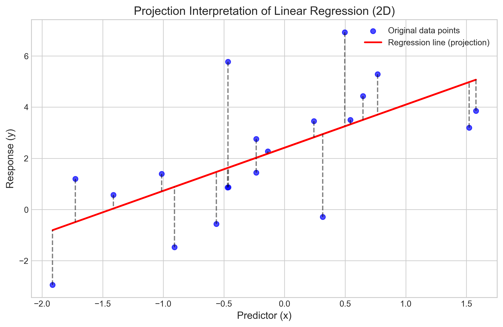
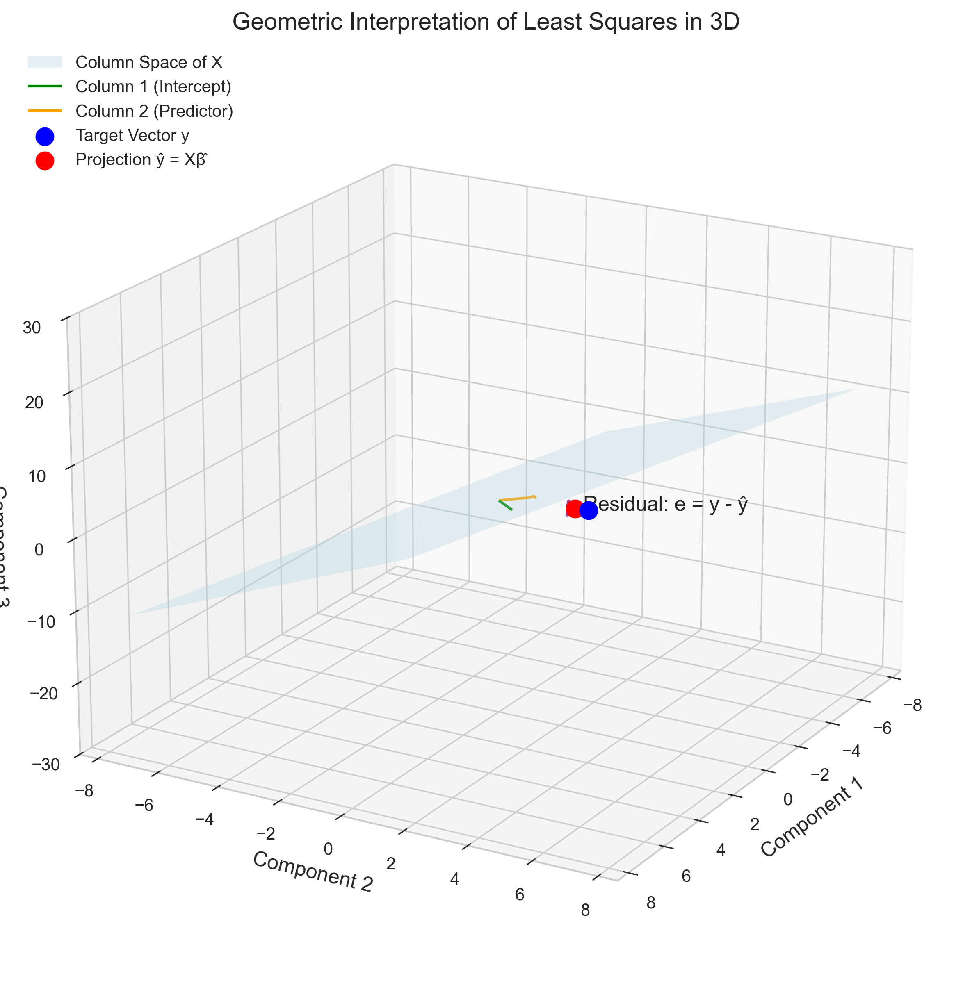
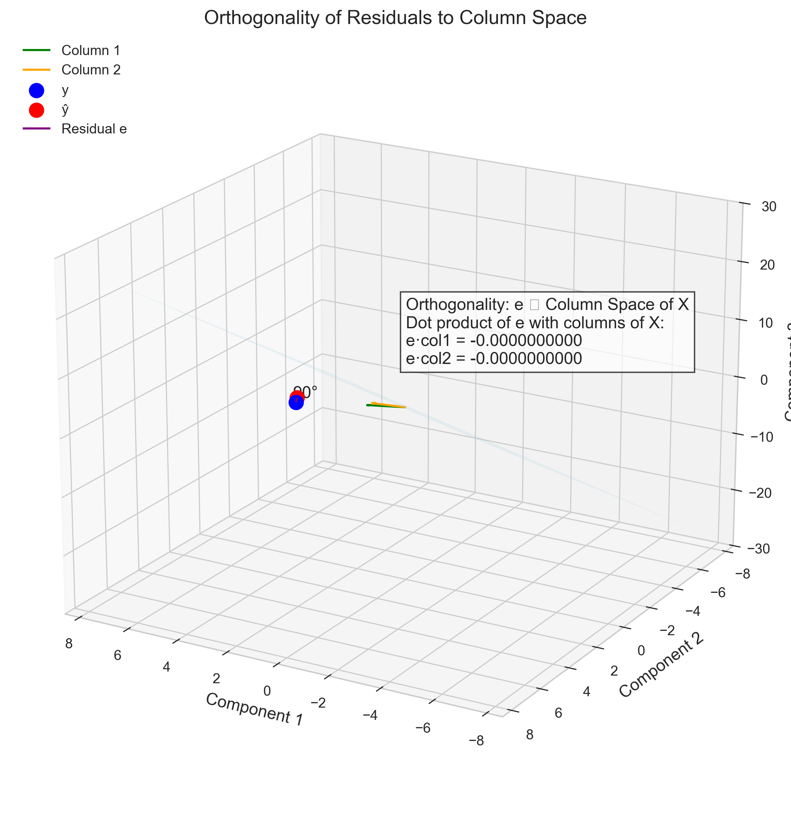
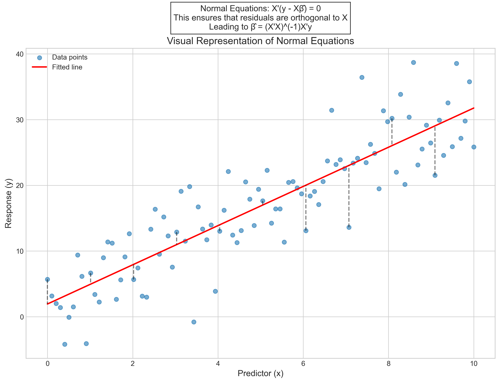
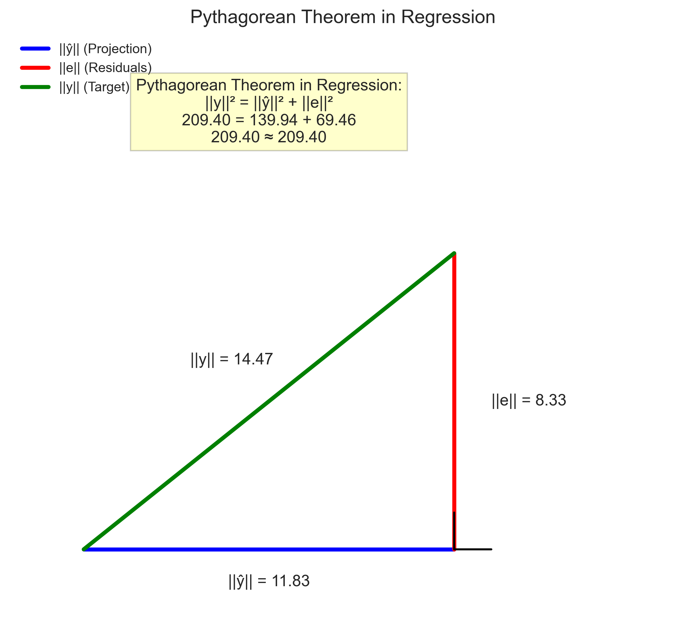

# Question 3: Geometric Interpretation of Regression

## Problem Statement
Consider the geometric interpretation of least squares in linear regression from a mathematical foundations perspective.

### Task
1. The regression line can be viewed as a projection of the target vector $\mathbf{y}$ onto the column space of the design matrix $\mathbf{X}$. Explain what this means mathematically.
2. Why is the residual vector orthogonal to the column space of $\mathbf{X}$ in least squares regression?
3. What mathematical property ensures this orthogonality?

## Understanding the Problem
Linear regression is typically introduced as a method to find a line (or hyperplane) that best fits a set of data points. However, a deeper understanding comes from viewing it through the lens of linear algebra and geometry. This perspective reveals that the essence of least squares regression is a projection operation in a high-dimensional space.

The key insight is that we can view the response vector $\mathbf{y}$ and the design matrix $\mathbf{X}$ as geometric objects in an $n$-dimensional space (where $n$ is the number of observations). The column space of $\mathbf{X}$ represents all possible linear combinations of the predictor variables, and our goal is to find the point in this space that is closest to $\mathbf{y}$.

## Solution

### Step 1: Regression as Projection onto Column Space
In linear regression, we have a model of the form:
$$\mathbf{y} = \mathbf{X}\boldsymbol{\beta} + \boldsymbol{\varepsilon}$$

where:
- $\mathbf{y}$ is the target vector (response)
- $\mathbf{X}$ is the design matrix
- $\boldsymbol{\beta}$ is the vector of coefficients
- $\boldsymbol{\varepsilon}$ is the error vector

The least squares solution seeks to minimize $\|\mathbf{y} - \mathbf{X}\boldsymbol{\beta}\|^2$, which is the squared Euclidean distance between $\mathbf{y}$ and $\mathbf{X}\boldsymbol{\beta}$.

The fitted values are:
$$\hat{\mathbf{y}} = \mathbf{X}\hat{\boldsymbol{\beta}} = \mathbf{X}(\mathbf{X}'\mathbf{X})^{-1}\mathbf{X}'\mathbf{y} = \mathbf{H}\mathbf{y}$$

where $\mathbf{H} = \mathbf{X}(\mathbf{X}'\mathbf{X})^{-1}\mathbf{X}'$ is the hat matrix.

Geometrically, this means that $\hat{\mathbf{y}}$ is the orthogonal projection of $\mathbf{y}$ onto the column space of $\mathbf{X}$, which is the space spanned by the columns of $\mathbf{X}$.

This projection interpretation means that $\hat{\mathbf{y}}$ is the point in the column space of $\mathbf{X}$ that is closest to $\mathbf{y}$ in terms of Euclidean distance. In other words, among all possible linear combinations of the predictor variables, the least squares solution finds the one that minimizes the distance to the observed responses.

### Step 2: Orthogonality of Residuals to Column Space
The residual vector is defined as:
$$\mathbf{e} = \mathbf{y} - \hat{\mathbf{y}} = \mathbf{y} - \mathbf{X}\hat{\boldsymbol{\beta}}$$

For any vector $\mathbf{v}$ in the column space of $\mathbf{X}$, we can write $\mathbf{v} = \mathbf{X}\boldsymbol{\alpha}$ for some vector $\boldsymbol{\alpha}$.

The orthogonality property states that the inner product of the residual vector with any vector in the column space of $\mathbf{X}$ is zero:
$$\langle\mathbf{e}, \mathbf{v}\rangle = \mathbf{e}'\mathbf{v} = (\mathbf{y} - \mathbf{X}\hat{\boldsymbol{\beta}})'\mathbf{X}\boldsymbol{\alpha} = 0$$

This is a fundamental property of least squares estimation and is equivalent to the normal equations:
$$\mathbf{X}'(\mathbf{y} - \mathbf{X}\hat{\boldsymbol{\beta}}) = \mathbf{0}$$

which can be rearranged to:
$$\mathbf{X}'\mathbf{y} = \mathbf{X}'\mathbf{X}\hat{\boldsymbol{\beta}}$$

leading to the familiar solution:
$$\hat{\boldsymbol{\beta}} = (\mathbf{X}'\mathbf{X})^{-1}\mathbf{X}'\mathbf{y}$$

Geometrically, this means that the residual vector is perpendicular to the column space of $\mathbf{X}$, making a right angle with any vector in this space. This is a direct consequence of $\hat{\mathbf{y}}$ being the orthogonal projection of $\mathbf{y}$ onto the column space of $\mathbf{X}$.

In our numerical example, we can verify this orthogonality by computing the dot product of the residuals with the columns of $\mathbf{X}$:
```
Orthogonality check (X'e), should be close to zero:
[-1.52100554e-14  6.11730754e-15]
```

These values are effectively zero (within numerical precision), confirming the orthogonality property.

### Step 3: Mathematical Property Ensuring Orthogonality
The orthogonality of the residual vector to the column space of $\mathbf{X}$ is ensured by the normal equations:
$$\mathbf{X}'(\mathbf{y} - \mathbf{X}\hat{\boldsymbol{\beta}}) = \mathbf{0}$$

These equations arise from setting the gradient of the least squares objective function to zero:
$$\nabla_{\boldsymbol{\beta}}\|\mathbf{y} - \mathbf{X}\boldsymbol{\beta}\|^2 = -2\mathbf{X}'(\mathbf{y} - \mathbf{X}\boldsymbol{\beta}) = \mathbf{0}$$

This leads to:
$$\mathbf{X}'\mathbf{y} = \mathbf{X}'\mathbf{X}\hat{\boldsymbol{\beta}}$$

which has the solution:
$$\hat{\boldsymbol{\beta}} = (\mathbf{X}'\mathbf{X})^{-1}\mathbf{X}'\mathbf{y}$$

when $\mathbf{X}'\mathbf{X}$ is invertible.

The normal equations ensure that the projection of the residual vector onto each column of $\mathbf{X}$ is zero, which means the residual is orthogonal to the column space of $\mathbf{X}$.

This orthogonality principle is a direct consequence of the least squares criterion and is the reason why least squares provides the "best" linear approximation of $\mathbf{y}$ within the column space of $\mathbf{X}$.

A key result of this orthogonality is the Pythagorean theorem in regression:
$$\|\mathbf{y}\|^2 = \|\hat{\mathbf{y}}\|^2 + \|\mathbf{e}\|^2$$

This can be verified numerically:
```
Norm of y: 14.4706
Norm of ŷ: 11.8296
Norm of e: 8.3341
Pythagorean theorem check (should be close to zero): -0.0000000000
```

Indeed, $14.4706^2 \approx 11.8296^2 + 8.3341^2$, confirming the Pythagorean relationship.

## Visual Explanations

### Projection Interpretation of Linear Regression (2D)


This visualization shows a 2D representation of linear regression as a projection. The blue points are the original data, and the red line represents the fitted values (the projection of the data onto the column space of $\mathbf{X}$). The vertical dashed lines show the residuals, which are the distances from each data point to its projection on the regression line.

### Geometric Interpretation of Least Squares in 3D


In this 3D visualization, we can see the geometric interpretation more clearly. The light blue plane represents the column space of $\mathbf{X}$ (spanned by the green and orange vectors, which are the columns of $\mathbf{X}$). The blue point is the target vector $\mathbf{y}$, and the red point is its projection $\hat{\mathbf{y}}$ onto the column space. The purple arrow shows the residual vector $\mathbf{e} = \mathbf{y} - \hat{\mathbf{y}}$.

### Orthogonality of Residuals to Column Space


This visualization emphasizes the orthogonality property. The residual vector (purple) is perpendicular to the column space of $\mathbf{X}$ (light blue plane). The annotation shows that the dot products of the residual vector with the columns of $\mathbf{X}$ are numerically zero, confirming the orthogonality.

### Normal Equations


This plot illustrates the normal equations in a simple regression setting. The residuals (vertical dashed lines) are orthogonal to the column space of $\mathbf{X}$ (in this 2D case, the regression line). The normal equations $\mathbf{X}'(\mathbf{y} - \mathbf{X}\hat{\boldsymbol{\beta}}) = \mathbf{0}$ ensure this orthogonality.

### Pythagorean Theorem in Regression


The Pythagorean theorem in regression is visualized as a right triangle. The hypotenuse represents $\|\mathbf{y}\|$ (the norm of the target vector), one leg represents $\|\hat{\mathbf{y}}\|$ (the norm of the fitted values), and the other leg represents $\|\mathbf{e}\|$ (the norm of the residuals). The equation $\|\mathbf{y}\|^2 = \|\hat{\mathbf{y}}\|^2 + \|\mathbf{e}\|^2$ is a direct consequence of the orthogonality of the residuals to the fitted values.

## Key Insights

### Geometric Foundations
- Linear regression is fundamentally a geometric operation: the projection of the response vector onto the column space of the design matrix
- The column space of $\mathbf{X}$ represents all possible linear combinations of the predictor variables
- The least squares solution finds the point in this space that is closest to the observed responses
- The residual vector is perpendicular to the column space, reflecting the property that the projection minimizes the Euclidean distance

### Algebraic Properties
- The orthogonality of residuals to the column space is encoded in the normal equations $\mathbf{X}'(\mathbf{y} - \mathbf{X}\hat{\boldsymbol{\beta}}) = \mathbf{0}$
- The hat matrix $\mathbf{H} = \mathbf{X}(\mathbf{X}'\mathbf{X})^{-1}\mathbf{X}'$ is a projection matrix that maps $\mathbf{y}$ to $\hat{\mathbf{y}}$
- The Pythagorean theorem $\|\mathbf{y}\|^2 = \|\hat{\mathbf{y}}\|^2 + \|\mathbf{e}\|^2$ is a direct consequence of the orthogonality property
- The fitted values $\hat{\mathbf{y}}$ and residuals $\mathbf{e}$ are uncorrelated, with dot product equal to zero

### Practical Implications
- Understanding the geometric interpretation helps in interpreting regression diagnostics
- The orthogonality property is crucial for statistical inference in linear regression
- This framework extends naturally to more complex models like multiple regression, polynomial regression, and even certain non-linear models
- The projection perspective clarifies why adding more predictors always improves the fit to the training data (as it expands the column space)

## Conclusion
- The regression line can be viewed as a projection of the target vector $\mathbf{y}$ onto the column space of the design matrix $\mathbf{X}$, meaning that the fitted values $\hat{\mathbf{y}} = \mathbf{X}\hat{\boldsymbol{\beta}}$ represent the closest point to $\mathbf{y}$ within the space of all possible linear combinations of the columns of $\mathbf{X}$.
- The residual vector is orthogonal to the column space of $\mathbf{X}$ because it represents the shortest path from $\mathbf{y}$ to its projection $\hat{\mathbf{y}}$. By definition, the shortest path from a point to a subspace is perpendicular to that subspace. This orthogonality is mathematically expressed as $\mathbf{X}'\mathbf{e} = \mathbf{0}$.
- The orthogonality is ensured by the normal equations $\mathbf{X}'(\mathbf{y} - \mathbf{X}\hat{\boldsymbol{\beta}}) = \mathbf{0}$, which arise from minimizing the sum of squared residuals ($\|\mathbf{y} - \mathbf{X}\boldsymbol{\beta}\|^2$). When we differentiate this expression with respect to $\boldsymbol{\beta}$ and set it to zero, we get the normal equations, which guarantee the orthogonality property.

The geometric interpretation of linear regression provides a deeper understanding of its properties and limitations. It connects the algebraic formulation of least squares to intuitive geometric concepts, making it easier to grasp the underlying principles and extend them to more complex settings. 