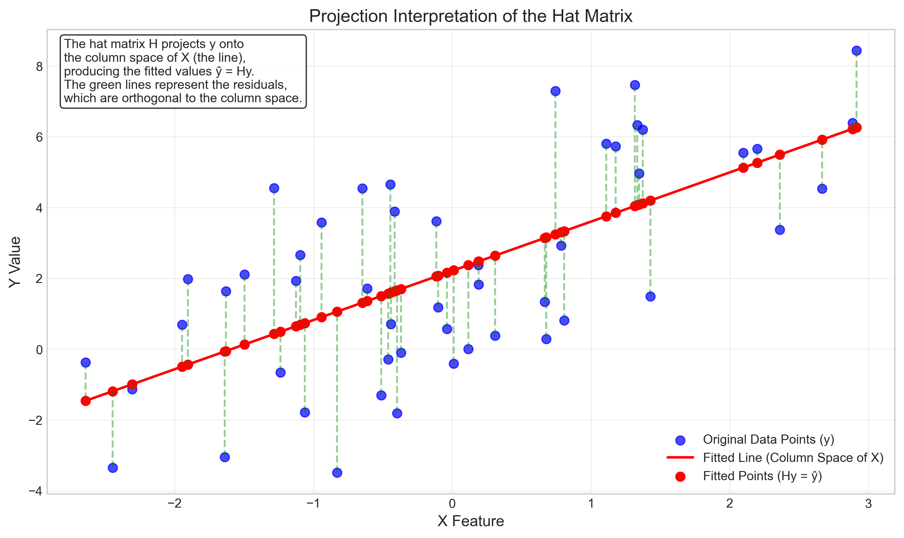
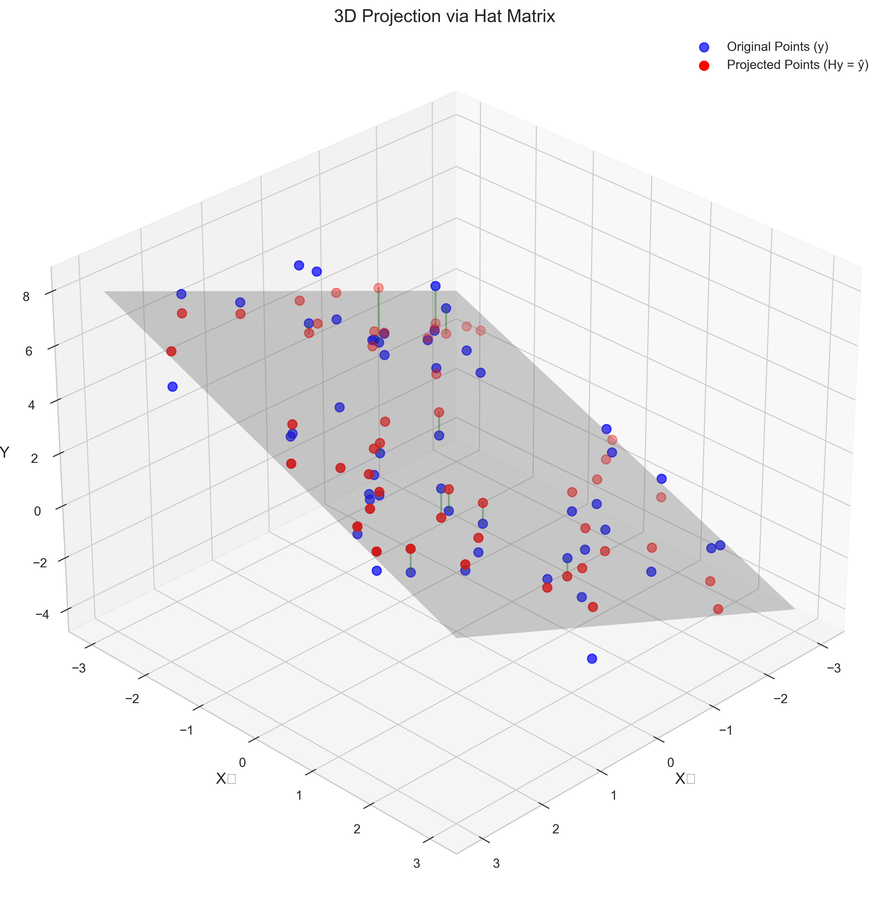
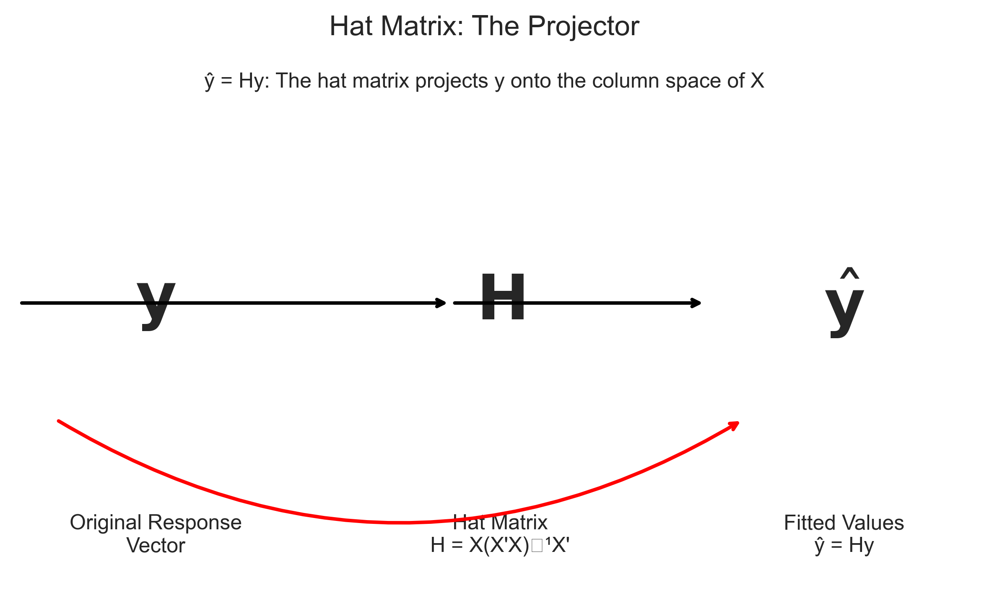
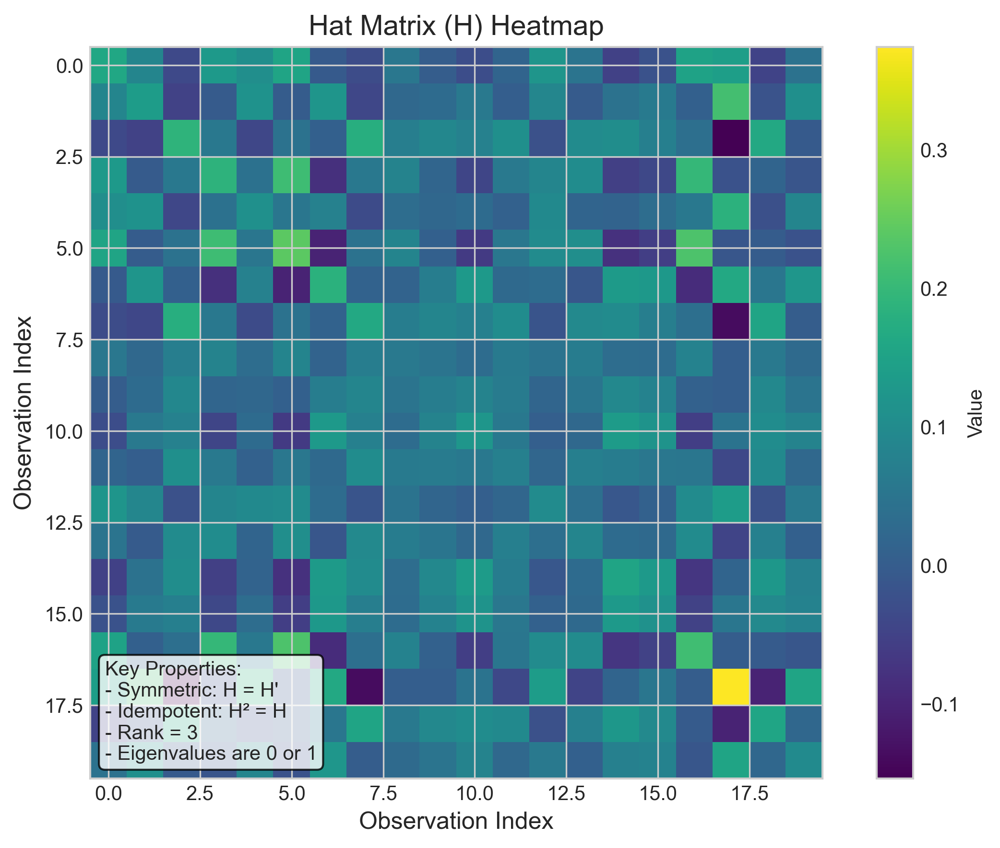
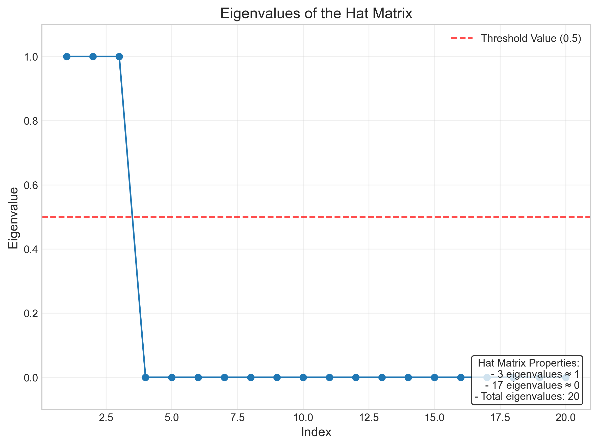
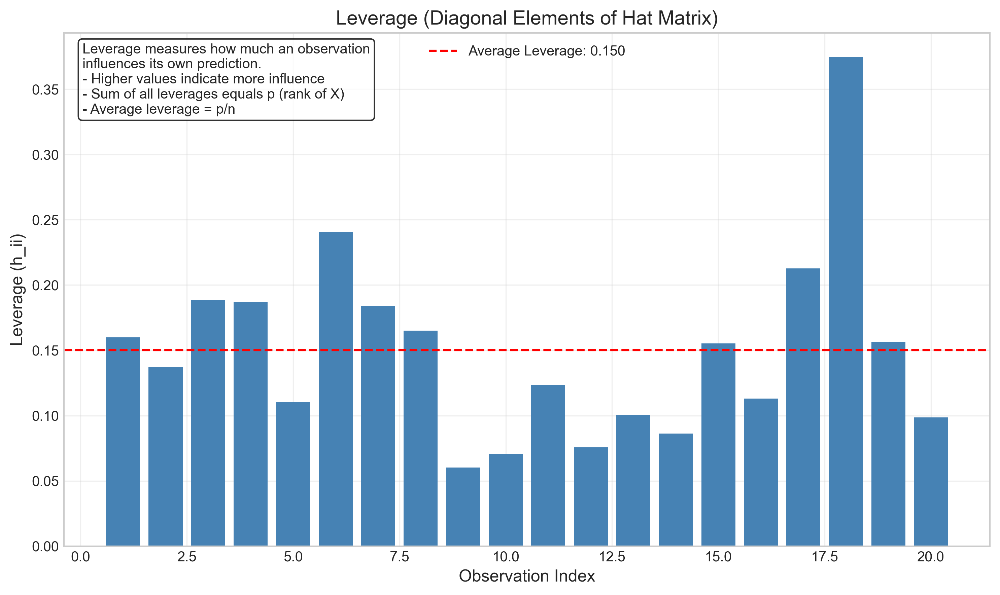

# Question 4: Hat Matrix in Regression

## Problem Statement
Consider a linear regression model with design matrix $\mathbf{X}$ and response vector $\mathbf{y}$. The hat matrix $\mathbf{H}$ is defined as $\mathbf{H} = \mathbf{X}(\mathbf{X}'\mathbf{X})^{-1}\mathbf{X}'$.

### Task
1. State two key properties of the hat matrix $\mathbf{H}$
2. Explain why $\mathbf{H}$ is called a projection matrix
3. What is the relationship between $\mathbf{H}$ and the fitted values $\hat{\mathbf{y}}$?

## Understanding the Problem
In linear regression, we model the relationship between predictors (independent variables) and a response (dependent variable). The hat matrix is a fundamental concept that helps us understand the geometric interpretation of the regression process. It gets its name from "putting a hat on y" - transforming the observed values into fitted values.

The hat matrix encapsulates important mathematical properties of the linear regression model and provides insights into how the model makes predictions. Understanding the hat matrix helps us better comprehend the underlying mechanics of regression, especially from a linear algebra perspective.

## Solution

### Step 1: Defining the Hat Matrix
In linear regression, we model the relationship as $\mathbf{y} = \mathbf{X\beta} + \mathbf{\epsilon}$, where:
- $\mathbf{y}$ is the response vector (size $n \times 1$) 
- $\mathbf{X}$ is the design matrix (size $n \times p$)
- $\mathbf{\beta}$ is the vector of coefficients (size $p \times 1$)
- $\mathbf{\epsilon}$ is the error vector (size $n \times 1$)

The ordinary least squares (OLS) estimator of $\mathbf{\beta}$ is:
$$\hat{\mathbf{\beta}} = (\mathbf{X}'\mathbf{X})^{-1}\mathbf{X}'\mathbf{y}$$

And the fitted values are:
$$\hat{\mathbf{y}} = \mathbf{X}\hat{\mathbf{\beta}} = \mathbf{X}(\mathbf{X}'\mathbf{X})^{-1}\mathbf{X}'\mathbf{y}$$

The hat matrix $\mathbf{H}$ is defined as:
$$\mathbf{H} = \mathbf{X}(\mathbf{X}'\mathbf{X})^{-1}\mathbf{X}'$$

So the relationship between $\mathbf{H}$ and $\hat{\mathbf{y}}$ can be written as:
$$\hat{\mathbf{y}} = \mathbf{H}\mathbf{y}$$

### Step 2: Key Properties of the Hat Matrix

The hat matrix $\mathbf{H}$ has several important properties:

1. **Symmetry**: $\mathbf{H} = \mathbf{H}'$
   
   The hat matrix is symmetric, meaning it equals its own transpose. We can prove this algebraically:
   $$\mathbf{H}' = [\mathbf{X}(\mathbf{X}'\mathbf{X})^{-1}\mathbf{X}']' = \mathbf{X}[(\mathbf{X}'\mathbf{X})^{-1}]'\mathbf{X}'$$
   
   Since $(\mathbf{X}'\mathbf{X})$ is symmetric, its inverse is also symmetric, so:
   $$\mathbf{H}' = \mathbf{X}(\mathbf{X}'\mathbf{X})^{-1}\mathbf{X}' = \mathbf{H}$$

2. **Idempotence**: $\mathbf{H}^2 = \mathbf{H}$
   
   Applying the hat matrix twice gives the same result as applying it once. This is a characteristic property of projection matrices:
   $$\mathbf{H}^2 = \mathbf{H}\mathbf{H} = \mathbf{X}(\mathbf{X}'\mathbf{X})^{-1}\mathbf{X}'\mathbf{X}(\mathbf{X}'\mathbf{X})^{-1}\mathbf{X}'$$
   
   Simplifying:
   $$\mathbf{H}^2 = \mathbf{X}(\mathbf{X}'\mathbf{X})^{-1}\mathbf{I}(\mathbf{X}'\mathbf{X})^{-1}\mathbf{X}' = \mathbf{X}(\mathbf{X}'\mathbf{X})^{-1}\mathbf{X}' = \mathbf{H}$$

3. **Rank**: The rank of $\mathbf{H}$ equals $p$ (the number of columns in $\mathbf{X}$)
   
   This tells us that the dimensionality of the projection space is $p$, which is the number of parameters in our model.

4. **Eigenvalues**: The eigenvalues of $\mathbf{H}$ are either 0 or 1
   
   This is a characteristic property of projection matrices. Eigenvectors with eigenvalue 1 correspond to directions in the column space of $\mathbf{X}$, while eigenvectors with eigenvalue 0 correspond to directions orthogonal to this space.

5. **Trace**: The trace of $\mathbf{H}$ (sum of diagonal elements) equals $p$
   
   This property is related to the degrees of freedom in the model.

### Step 3: Why H is Called a Projection Matrix

The hat matrix $\mathbf{H}$ is called a projection matrix because it projects the response vector $\mathbf{y}$ onto the column space of the design matrix $\mathbf{X}$. In geometric terms:

1. The column space of $\mathbf{X}$ represents all possible linear combinations of the predictor variables. It's a $p$-dimensional subspace within the $n$-dimensional space of possible response vectors.

2. When we multiply $\mathbf{y}$ by $\mathbf{H}$ to get $\hat{\mathbf{y}} = \mathbf{H}\mathbf{y}$, we're finding the point in the column space of $\mathbf{X}$ that is closest to $\mathbf{y}$ in terms of Euclidean distance.

3. The vector $\hat{\mathbf{y}}$ is the orthogonal projection of $\mathbf{y}$ onto the column space of $\mathbf{X}$, meaning the residual vector $\mathbf{r} = \mathbf{y} - \hat{\mathbf{y}}$ is perpendicular (orthogonal) to the column space of $\mathbf{X}$. Mathematically, this means:
   $$\mathbf{X}'\mathbf{r} = \mathbf{X}'(\mathbf{y} - \hat{\mathbf{y}}) = \mathbf{0}$$

4. The idempotence property ($\mathbf{H}^2 = \mathbf{H}$) is a defining characteristic of projection matrices. It means that once you've projected a vector onto a subspace, projecting it again doesn't change anything—you're already in the subspace.

### Step 4: Relationship Between H and the Fitted Values

The relationship between the hat matrix $\mathbf{H}$ and the fitted values $\hat{\mathbf{y}}$ is direct and fundamental:

$$\hat{\mathbf{y}} = \mathbf{H}\mathbf{y}$$

This equation encapsulates the entire fitting process of linear regression in a single matrix operation. It's why $\mathbf{H}$ is called the "hat matrix" - it literally "puts a hat on" $\mathbf{y}$ to produce $\hat{\mathbf{y}}$. This relationship has several important implications:

1. The hat matrix transforms the observed responses $\mathbf{y}$ into the predicted responses $\hat{\mathbf{y}}$.

2. This transformation is equivalent to first calculating the coefficient estimates $\hat{\mathbf{\beta}} = (\mathbf{X}'\mathbf{X})^{-1}\mathbf{X}'\mathbf{y}$ and then computing $\hat{\mathbf{y}} = \mathbf{X}\hat{\mathbf{\beta}}$. 

3. The hat matrix allows us to bypass the explicit calculation of $\hat{\mathbf{\beta}}$ if we're only interested in the fitted values.

4. The diagonal elements of $\mathbf{H}$ (denoted $h_{ii}$) are known as leverage values, which measure how much an observation influences its own prediction.

## Practical Implementation

### Example: 2D Visualization of Projection
In a simple linear regression setting with one predictor (plus intercept), the column space of $\mathbf{X}$ is a line in the $n$-dimensional space. The hat matrix projects the response vector onto this line:

In this visualization:
- Blue points represent the original data points ($\mathbf{y}$)
- Red points represent the fitted values ($\hat{\mathbf{y}} = \mathbf{H}\mathbf{y}$)
- The red line represents the column space of $\mathbf{X}$ (all possible fitted values)
- Green dashed lines represent the residuals, which are perpendicular to the column space

### Example: 3D Visualization
With two predictors (plus intercept), the column space becomes a plane in the $n$-dimensional space:

Here:
- Blue points are the original responses ($\mathbf{y}$)
- Red points are the projected values ($\hat{\mathbf{y}}$) that lie on the plane
- The gray plane is the column space of $\mathbf{X}$
- Green lines are residuals, perpendicular to the plane

### Relationship Diagram
The following diagram illustrates the key relationship between $\mathbf{y}$, $\mathbf{H}$, and $\hat{\mathbf{y}}$:

This visualization emphasizes that the hat matrix is the operator that transforms the original response vector into the fitted values.

## Visual Explanations

### Hat Matrix Heatmap

This heatmap shows the structure of the hat matrix. Each cell $(i,j)$ represents how much observation $j$ influences the prediction for observation $i$. The hat matrix is symmetric, as can be seen from the symmetry across the diagonal.

### Eigenvalues of the Hat Matrix

This plot shows the eigenvalues of the hat matrix. As proven mathematically, they are either very close to 1 or very close to 0. The number of eigenvalues equal to 1 corresponds to the rank of the hat matrix, which is the number of columns in $\mathbf{X}$.

### Leverage Values

The diagonal elements of the hat matrix ($h_{ii}$) represent leverage values, which measure how much influence each observation has on its own predicted value. Higher leverage points have more influence on the regression fit.

## Key Insights

### Mathematical Properties
- The hat matrix is symmetric ($\mathbf{H} = \mathbf{H}'$), which is a key property of projection matrices
- The hat matrix is idempotent ($\mathbf{H}^2 = \mathbf{H}$), meaning applying it twice is the same as applying it once
- The eigenvalues of $\mathbf{H}$ are either 0 or 1, which is characteristic of projection matrices
- The rank of $\mathbf{H}$ equals $p$ (the number of predictor variables including the intercept), determining the dimensionality of the projection space

### Geometric Interpretation
- The hat matrix projects the response vector onto the column space of the design matrix
- This projection is orthogonal, making the residuals perpendicular to the column space
- The column space represents all possible linear combinations of the predictor variables
- The fitted values are the closest points (in terms of Euclidean distance) in the column space to the original responses

### Practical Applications
- The diagonal elements of $\mathbf{H}$ (leverage values) help identify influential observations
- Extreme leverage points can have disproportionate influence on the regression fit
- The trace of $\mathbf{H}$ equals $p$, representing the degrees of freedom used by the model
- The hat matrix allows direct calculation of fitted values without explicitly computing regression coefficients

## Conclusion
- The hat matrix $\mathbf{H} = \mathbf{X}(\mathbf{X}'\mathbf{X})^{-1}\mathbf{X}'$ is a projection matrix that transforms observed responses into fitted values: $\hat{\mathbf{y}} = \mathbf{H}\mathbf{y}$
- Key properties of $\mathbf{H}$ include symmetry, idempotence, and having eigenvalues of either 0 or 1
- $\mathbf{H}$ is called a projection matrix because it orthogonally projects $\mathbf{y}$ onto the column space of $\mathbf{X}$
- The hat matrix provides a geometric interpretation of linear regression as finding the closest point in the column space of $\mathbf{X}$ to the response vector $\mathbf{y}$
- Understanding the hat matrix deepens our comprehension of the linear regression process from both algebraic and geometric perspectives

The hat matrix encapsulates the entire fitting process of linear regression in a single matrix, making it a fundamental concept for understanding both the mathematics and geometry of regression models. 