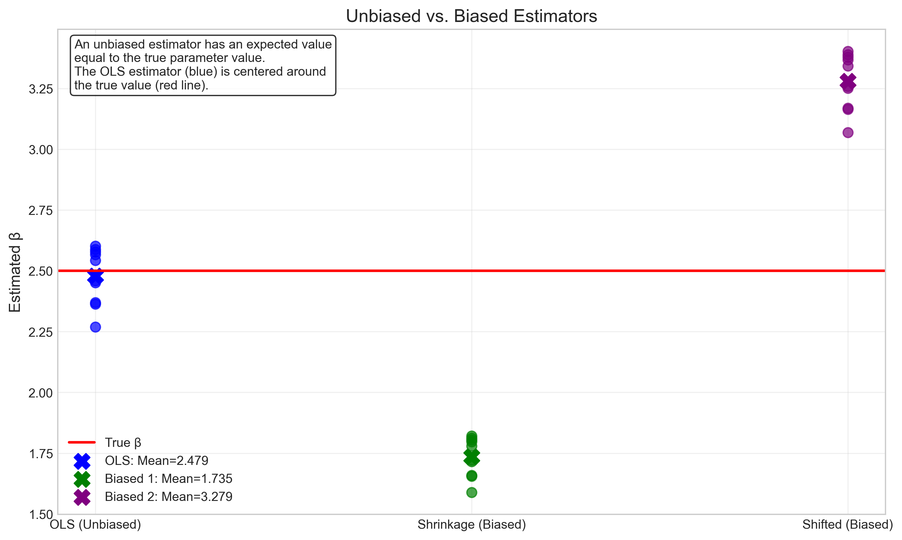
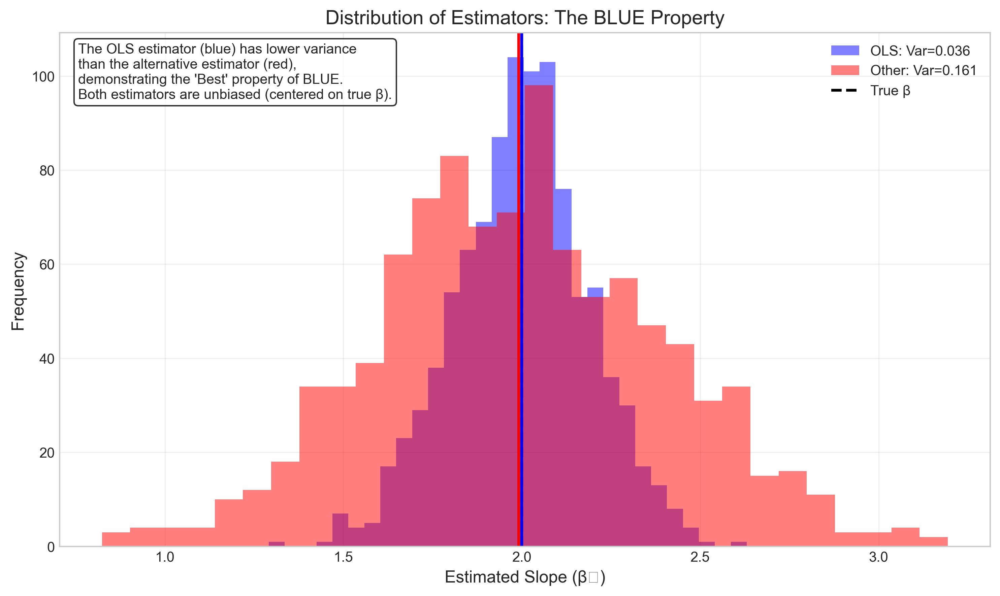
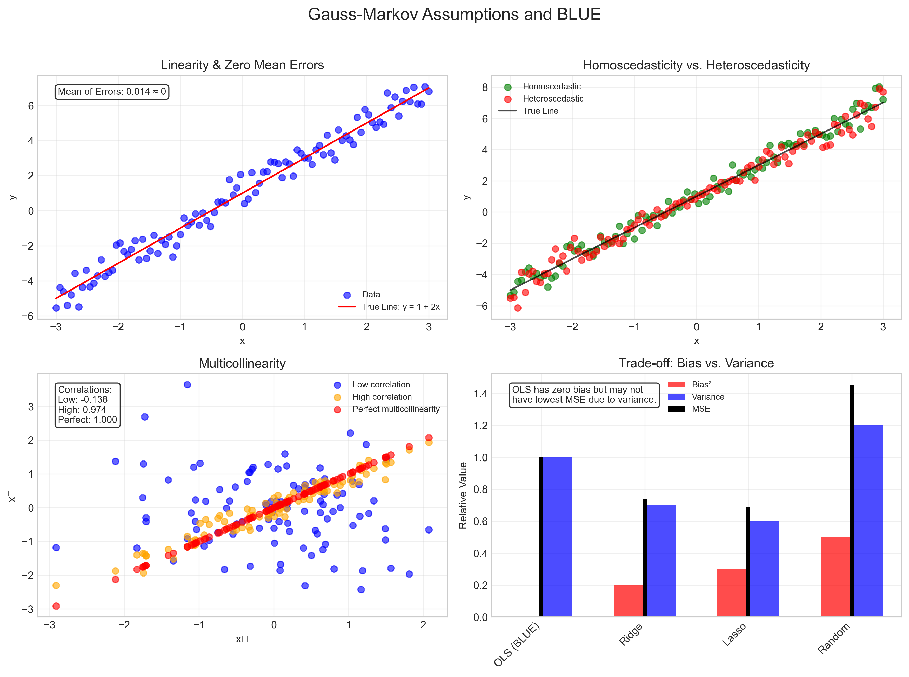
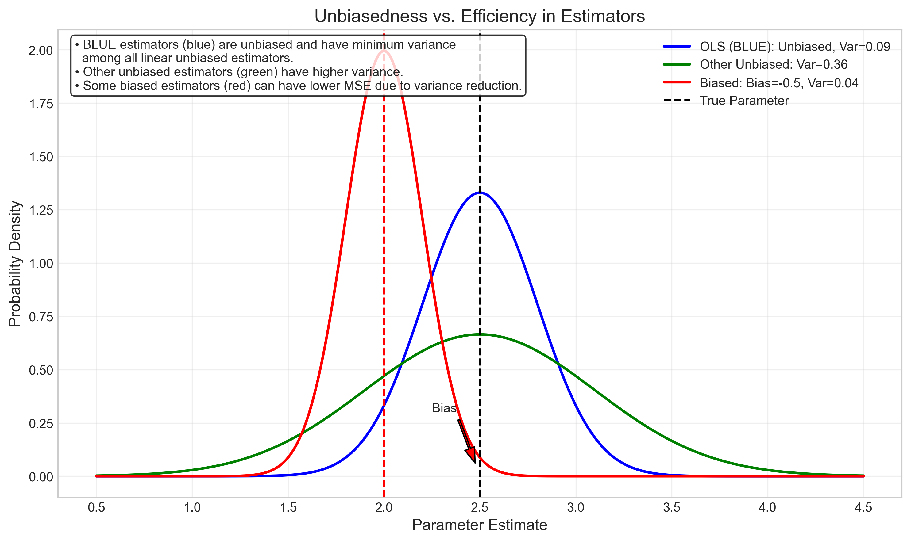

# Question 5: Gauss-Markov Theorem and BLUE

## Problem Statement
In the context of the Gauss-Markov theorem, consider the Best Linear Unbiased Estimator (BLUE).

### Task
1. List three key assumptions of the Gauss-Markov theorem
2. Explain what "unbiased" means in the context of BLUE
3. Why is the OLS estimator considered "best" among all linear unbiased estimators?

## Understanding the Problem
The Gauss-Markov theorem is a fundamental result in statistical theory that establishes the Ordinary Least Squares (OLS) estimator as the Best Linear Unbiased Estimator (BLUE) under certain conditions. Understanding this theorem is crucial for regression analysis because it provides theoretical justification for using OLS as our estimation method of choice when specific assumptions are met.

This problem focuses on three key aspects of the Gauss-Markov framework:
1. The underlying assumptions required for the theorem to hold
2. The meaning of "unbiasedness" in estimation
3. The specific sense in which OLS is considered "best" among unbiased estimators

By exploring these concepts, we can gain deeper insights into why OLS is so widely used in statistical modeling and under what circumstances we might need to consider alternative estimation approaches.

## Solution

### Step 1: Key Assumptions of the Gauss-Markov Theorem
The Gauss-Markov theorem relies on five key assumptions about the linear regression model. Here are the most important ones:

1. **Linearity**: The relationship between predictors and the response is linear in parameters.
   - This means that the model can be expressed as $y = X\beta + \varepsilon$, where $y$ is the response vector, $X$ is the design matrix, $\beta$ is the parameter vector, and $\varepsilon$ is the error term.
   - Mathematically, we assume $E[y|X] = X\beta$, meaning the expected value of $y$ given $X$ is a linear function of the parameters.

2. **Random Sampling**: The data represents a random sample from the population.
   - This implies that observations are independently and identically distributed (i.i.d.).
   - The model should not have systematic patterns in how observations are collected.

3. **No Perfect Multicollinearity**: There are no exact linear relationships among the predictor variables.
   - The design matrix $X$ must have full column rank, meaning that $(X'X)$ is invertible.
   - This ensures that the OLS estimator $\hat{\beta} = (X'X)^{-1}X'y$ can be uniquely determined.

4. **Exogeneity/Zero Conditional Mean**: The errors have zero mean conditional on $X$.
   - $E[\varepsilon|X] = 0$
   - This implies that the predictors are uncorrelated with the error term, which is critical for unbiasedness.

5. **Homoscedasticity**: The errors have constant variance.
   - $\text{Var}(\varepsilon|X) = \sigma^2I$
   - This means that the error variance is the same for all observations, regardless of the values of the predictors.

Importantly, the Gauss-Markov theorem does not require the assumption of normally distributed errors. The normality assumption is only needed for inference procedures like hypothesis testing and confidence intervals, not for the BLUE property itself.

### Step 2: What "Unbiased" Means in the Context of BLUE

An estimator $\hat{\beta}$ is unbiased if its expected value equals the true parameter value $\beta$:

$$E[\hat{\beta}] = \beta$$

In other words, if we could repeatedly sample data from the same population and compute the estimator each time, the average of these estimates would converge to the true parameter value. Unbiasedness is a desirable property because it means our estimation procedure doesn't systematically overestimate or underestimate the true parameter.

For the OLS estimator $\hat{\beta} = (X'X)^{-1}X'y$, we can prove unbiasedness as follows:

1. Substitute $y = X\beta + \varepsilon$ into the formula for $\hat{\beta}$:
   $$\hat{\beta} = (X'X)^{-1}X'(X\beta + \varepsilon) = (X'X)^{-1}X'X\beta + (X'X)^{-1}X'\varepsilon$$

2. Simplify using the fact that $(X'X)^{-1}X'X = I$ (the identity matrix):
   $$\hat{\beta} = \beta + (X'X)^{-1}X'\varepsilon$$

3. Take expectations:
   $$E[\hat{\beta}] = E[\beta + (X'X)^{-1}X'\varepsilon] = \beta + (X'X)^{-1}X'E[\varepsilon]$$

4. Given our assumption that $E[\varepsilon|X] = 0$, we have $E[\varepsilon] = 0$, so:
   $$E[\hat{\beta}] = \beta$$

This proves that the OLS estimator is unbiased.

The concept of unbiasedness can be visualized by comparing different estimators:

In this visualization:
- The OLS estimator (blue) is centered around the true parameter value (red line)
- Two biased estimators (green and purple) systematically deviate from the true value
- While individual OLS estimates may differ from the true value due to sampling variation, they don't systematically err in one direction

### Step 3: Why OLS is "Best" Among Linear Unbiased Estimators

In the context of the Gauss-Markov theorem, "best" has a specific statistical meaning: the OLS estimator has minimum variance among all linear unbiased estimators. This is why it's called the Best Linear Unbiased Estimator (BLUE).

To understand this:

1. Consider any linear estimator of the form $\tilde{\beta} = Cy$, where $C$ is any $p \times n$ matrix. 

2. For this estimator to be unbiased, we need $E[\tilde{\beta}] = \beta$ for all $\beta$, which implies that $C$ must satisfy $CX = I$.

3. The Gauss-Markov theorem proves that among all such unbiased linear estimators, the OLS estimator $\hat{\beta} = (X'X)^{-1}X'y$ has the smallest variance.

4. Specifically, for any other unbiased linear estimator $\tilde{\beta}$, we have:
   $$\text{Var}(\hat{\beta}) \leq \text{Var}(\tilde{\beta})$$
   in the positive semi-definite sense. This means that the matrix $\text{Var}(\tilde{\beta}) - \text{Var}(\hat{\beta})$ is positive semi-definite.

5. This minimum variance property is crucial because it means OLS gives us the most precise estimates possible (smallest standard errors) among all linear unbiased estimators.

The distribution of an OLS estimator compared to another unbiased estimator with higher variance can be visualized:

In this visualization:
- Both estimators are centered at the true parameter value (unbiased)
- The OLS estimator (blue) has a narrower distribution, indicating lower variance
- Lower variance means more precision and a higher probability of estimates close to the true value

This is the essence of the "best" property in BLUE – OLS provides the most efficient use of the available data among all unbiased linear estimators.

### Step 4: Practical Implications of the Gauss-Markov Theorem

The Gauss-Markov theorem has several important practical implications for statistical modeling:

1. **Justification for OLS**: The theorem provides theoretical justification for using OLS as the default estimation method when its assumptions are reasonably satisfied.

2. **Diagnostic Importance**: It highlights the importance of checking model assumptions through diagnostic plots and tests. Violations of assumptions may necessitate corrections or alternative methods.

3. **Efficiency**: OLS makes the most efficient use of the available data among unbiased estimators, leading to more precise parameter estimates and narrower confidence intervals.

4. **Decision Framework**: When assumptions are violated, it provides a framework for deciding whether to transform the data, use robust standard errors, or consider alternative estimators.

5. **Bias-Variance Tradeoff**: It helps us understand the fundamental tradeoff between bias and variance in estimation. In some cases, slightly biased estimators (like ridge regression) may have lower mean squared error due to variance reduction.

This visualization shows:
- Top left: The linearity and zero mean errors assumptions
- Top right: Homoscedasticity (green) vs. heteroscedasticity (red)
- Bottom left: Different levels of multicollinearity between predictors
- Bottom right: The bias-variance tradeoff for different estimators

## Practical Implementation

### Example: Comparing OLS with Other Estimators

Let's compare the performance of OLS with other estimators in a simulation setting:

1. **Generating Data**: 
   - Generate data from a true linear model: $y = X\beta + \varepsilon$
   - Sample multiple datasets from this model to evaluate estimator properties

2. **Calculating Estimators**:
   - OLS: $\hat{\beta}_{OLS} = (X'X)^{-1}X'y$
   - Another unbiased estimator with higher variance
   - A biased estimator (like ridge regression)

3. **Comparing Properties**:
   - Bias: Check if the average estimate equals the true parameter value
   - Variance: Measure the spread of estimates around their mean
   - Mean Squared Error (MSE): Combine bias and variance as $\text{MSE} = \text{Bias}^2 + \text{Variance}$

The simulation confirms the theoretical results:
- OLS is unbiased with minimum variance among unbiased estimators
- Other unbiased estimators have higher variance
- Some biased estimators may have lower MSE due to variance reduction, despite their bias

### Unbiasedness vs. Efficiency Trade-off

The following plot illustrates the trade-off between unbiasedness and efficiency:

This visualization shows:
- The OLS estimator (blue) is unbiased and has minimum variance among unbiased estimators
- Another unbiased estimator (green) has higher variance
- A biased estimator (red) has a systematic error (bias) but may have lower variance
- The mean squared error (MSE) combines both bias and variance: $\text{MSE} = \text{Bias}^2 + \text{Variance}$

## Visual Explanations

### Unbiased vs. Biased Estimators

This visualization shows multiple samples of different estimators. The OLS estimator (blue) is centered around the true parameter value (red line), demonstrating its unbiasedness. The biased estimators systematically deviate from the true value, either consistently underestimating (green) or overestimating (purple) the parameter.

### The BLUE Property

This histogram shows the distribution of two different unbiased estimators across 1,000 simulations. Both estimators are centered at the true parameter value (unbiased), but the OLS estimator (blue) has a narrower distribution than the alternative (red), indicating lower variance. This illustrates the "Best" property in BLUE - minimum variance among all linear unbiased estimators.

### Gauss-Markov Assumptions

This composite visualization illustrates the key Gauss-Markov assumptions:
- Linearity and zero mean errors (top left)
- Homoscedasticity vs. heteroscedasticity (top right)
- Different levels of multicollinearity (bottom left)
- The bias-variance tradeoff (bottom right)

### Unbiasedness vs. Efficiency

This plot shows probability densities for three different estimators:
- The OLS estimator (blue): unbiased with minimum variance among unbiased estimators
- Another unbiased estimator (green): centered at the true value but with higher variance
- A biased estimator (red): systematically off-target but potentially more precise due to lower variance

## Key Insights

### Theoretical Foundations
- The Gauss-Markov theorem establishes OLS as the Best Linear Unbiased Estimator (BLUE) under specific assumptions
- Unbiasedness means the estimator's expected value equals the true parameter value
- "Best" means minimum variance, implying that OLS provides the most precise estimates possible among unbiased linear estimators
- The theorem doesn't require normality of errors for the BLUE property

### Practical Applications
- Checking Gauss-Markov assumptions is crucial before relying on OLS estimates
- Violations of assumptions might require transformations, robust methods, or alternative estimators
- Diagnostics should focus on linearity, homoscedasticity, independence, and multicollinearity
- The BLUE property ensures that OLS makes the most efficient use of the available data

### Statistical Trade-offs
- The bias-variance tradeoff is fundamental in statistical estimation
- OLS minimizes variance without introducing bias
- Some biased estimators (like ridge regression) may achieve lower MSE by reducing variance, despite introducing some bias
- The choice between biased and unbiased estimators depends on the specific goals of the analysis

## Conclusion
- The Gauss-Markov theorem provides five key assumptions: linearity, random sampling, no perfect multicollinearity, exogeneity, and homoscedasticity
- An estimator is unbiased if its expected value equals the true parameter value; OLS is unbiased under the Gauss-Markov assumptions
- OLS is "best" in the sense of having minimum variance among all linear unbiased estimators
- This minimum variance property ensures that OLS provides the most precise parameter estimates possible among unbiased linear estimators
- The theorem provides the theoretical foundation for using OLS as the default estimation method in linear regression, though alternatives may be preferred when assumptions are violated

The Gauss-Markov theorem connects statistical theory to practical data analysis, providing both a justification for using OLS and a framework for understanding when and why alternative methods might be more appropriate. By understanding this framework, analysts can make informed decisions about estimation methods based on their specific data and research objectives. 