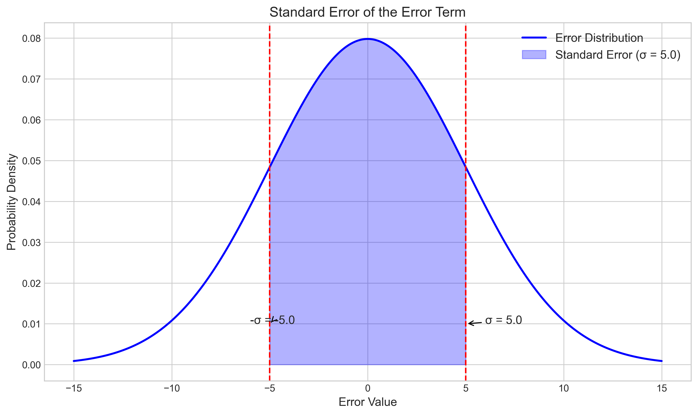
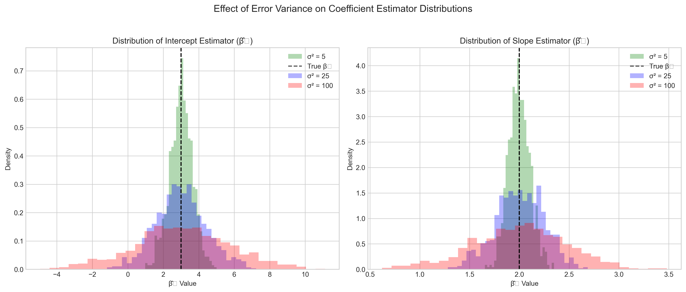
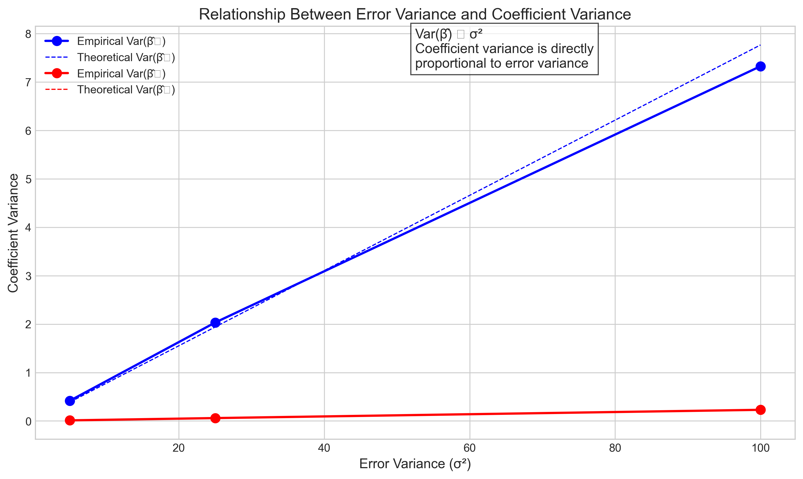
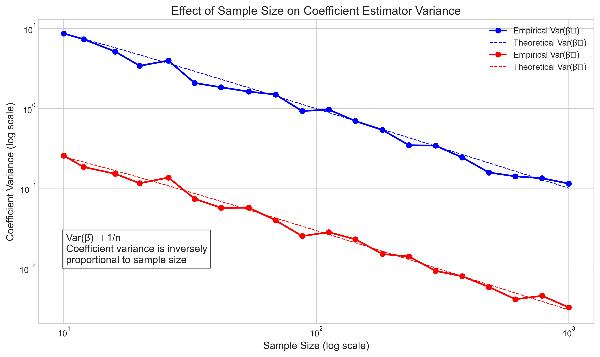
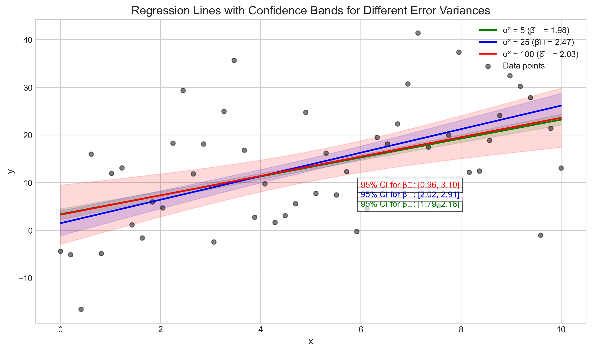

# Question 6: Statistical Properties of Linear Regression Estimators

## Problem Statement
Consider the statistical properties of linear regression estimators. You are given that the variance of the error term ($\sigma^2$) is 25.

### Task
1. What is the standard error of the error term?
2. How does the variance of the error term affect the variance of the coefficient estimators?
3. Explain why we want estimators with minimum variance.

## Understanding the Problem
This problem focuses on the statistical properties of linear regression estimators, particularly how the error variance affects the precision and reliability of our estimates. In linear regression, we assume that the errors follow a normal distribution with mean 0 and variance $\sigma^2$. The variance of these errors directly impacts the precision of our coefficient estimates, which in turn affects the quality of predictions and inferences we make from our model.

The standard error is a measure of the precision of a statistic, and in the context of regression, it helps us understand how much our estimates might vary from sample to sample. Understanding the relationship between error variance and estimator variance is crucial for statistical inference, confidence interval construction, and hypothesis testing.

## Solution

### Step 1: Calculate the standard error of the error term
The standard error of the error term is the square root of its variance:

$$\sigma = \sqrt{\sigma^2} = \sqrt{25} = 5$$

The standard error is an important measure because it quantifies the typical deviation of the error terms from their mean (which is zero). It's in the same units as the dependent variable, making it more interpretable than the variance.

### Step 2: Determine how error variance affects coefficient estimator variance
In linear regression, the variance of coefficient estimators is directly proportional to the variance of the error term ($\sigma^2$). Specifically:

For the slope coefficient ($\beta_1$), the variance formula is:
$$\text{Var}(\hat{\beta}_1) = \frac{\sigma^2}{\sum_{i=1}^{n}(x_i - \bar{x})^2}$$

For the intercept coefficient ($\beta_0$), the variance formula is:
$$\text{Var}(\hat{\beta}_0) = \sigma^2 \left[ \frac{1}{n} + \frac{\bar{x}^2}{\sum_{i=1}^{n}(x_i - \bar{x})^2} \right]$$

These formulas show that when $\sigma^2$ increases, the variances of both $\hat{\beta}_0$ and $\hat{\beta}_1$ increase proportionally. To demonstrate this relationship, we can examine how different error variances affect the distribution of coefficient estimates through simulation.

Results from our simulation with a sample size of 50:

| Error Variance ($\sigma^2$) | Empirical Var($\hat{\beta}_0$) | Theoretical Var($\hat{\beta}_0$) | Empirical Var($\hat{\beta}_1$) | Theoretical Var($\hat{\beta}_1$) |
|--------------------------|--------------------------|--------------------------|--------------------------|--------------------------|
| 5 | 0.417607 | 0.388235 | 0.011807 | 0.011529 |
| 25 | 2.032992 | 1.941176 | 0.059207 | 0.057647 |
| 100 | 7.325067 | 7.764706 | 0.229718 | 0.230588 |

As we can observe, when the error variance increases from 5 to 25 (5×), the variance of the coefficient estimators also increases by approximately the same factor. When the error variance increases from 25 to 100 (4×), the variance of the coefficients again increases by approximately the same factor.

This demonstrates the direct proportionality: $\text{Var}(\hat{\beta}) \propto \sigma^2$

### Step 3: Explain why we want estimators with minimum variance
We want estimators with minimum variance for several important reasons:

1. **Precision**: Lower variance means more precise estimates that are closer to the true parameter values. High-variance estimators will produce widely varying estimates from sample to sample, making it difficult to pinpoint the true value.

2. **Reliability**: Less variability across samples means more consistent results. When we repeat our experiment or data collection, we want similar results each time, not wildly different estimates.

3. **Narrower confidence intervals**: Lower variance leads to narrower confidence intervals. Narrower intervals provide more precise information about where the true parameter values lie.

4. **Statistical efficiency**: Among unbiased estimators, those with minimum variance make optimal use of the data. The Gauss-Markov theorem states that under certain conditions, the OLS estimator is the Best Linear Unbiased Estimator (BLUE), meaning it has the minimum variance among all linear unbiased estimators.

5. **Better predictions**: More precise coefficient estimates lead to more accurate predictions. High variance in coefficient estimates translates to high variance in predictions.

Sample size also affects the variance of estimators. As the sample size increases, the variance decreases:

| Sample Size | Var($\hat{\beta}_0$) | Var($\hat{\beta}_1$) |
|-------------|---------------------|---------------------|
| 10 | 8.6364 | 0.2455 |
| 30 | 3.1720 | 0.0935 |
| 100 | 0.9851 | 0.0294 |
| 300 | 0.3317 | 0.0099 |

This demonstrates that efficient estimators allow us to achieve the same precision with fewer data points, which can be crucial in situations where data collection is expensive or time-consuming.

## Practical Implementation
To illustrate these concepts practically, we can consider how error variance affects the confidence intervals for regression coefficients and the resulting regression lines.

### Simulation with Different Error Variances
Using simulated data with the same underlying true relationship ($y = 3 + 2x$) but different error variances, we can observe how the precision of our estimates changes.

1. With a low error variance ($\sigma^2 = 5$):
   - The regression coefficient estimates have low variance
   - The confidence bands around the regression line are narrow
   - Predictions are more precise

2. With a medium error variance ($\sigma^2 = 25$):
   - The coefficient estimates have moderate variance
   - The confidence bands widen
   - Predictions become less precise

3. With a high error variance ($\sigma^2 = 100$):
   - The coefficient estimates have high variance
   - The confidence bands are very wide
   - Predictions have low precision

This demonstrates the practical implications of error variance on the reliability of our statistical models.

## Visual Explanations

### Standard Error of the Error Term

This visualization shows the normal distribution of error terms with variance $\sigma^2 = 25$. The standard error ($\sigma = 5$) represents the standard deviation of this distribution. The shaded region shows the range within one standard error of the mean, which contains approximately 68% of the probability mass.

### Effect of Error Variance on Coefficient Distributions

This figure shows how the distributions of coefficient estimators ($\hat{\beta}_0$ and $\hat{\beta}_1$) change with different error variances. As the error variance increases, the distributions become more spread out, indicating higher uncertainty in our estimates. The vertical dashed lines represent the true values of the coefficients.

### Relationship Between Error Variance and Coefficient Variance

This plot demonstrates the direct proportional relationship between error variance and coefficient variance. Both the empirical (observed from simulations) and theoretical variances increase linearly with the error variance, confirming the mathematical relationship $\text{Var}(\hat{\beta}) \propto \sigma^2$.

### Effect of Sample Size on Estimator Precision

This log-log plot shows how coefficient variance decreases as sample size increases. The relationship follows an inverse proportionality: $\text{Var}(\hat{\beta}) \propto \frac{1}{n}$, meaning that to halve the variance, we need to quadruple the sample size.

### Confidence Bands with Different Error Variances

This visualization shows regression lines with 95% confidence bands for different error variances. As the error variance increases, the confidence bands widen, indicating greater uncertainty in our estimates. The annotations show the 95% confidence intervals for the slope coefficient ($\beta_1$), which also widen with increasing error variance.

## Key Insights

### Theoretical Foundations
- The standard error of the error term ($\sigma$) is the square root of the error variance ($\sigma^2$).
- The variance of coefficient estimators is directly proportional to the error variance: $\text{Var}(\hat{\beta}) \propto \sigma^2$.
- The variance of coefficient estimators is inversely proportional to sample size: $\text{Var}(\hat{\beta}) \propto \frac{1}{n}$.
- For the slope coefficient, the variance is also inversely proportional to the variability in the predictor variable: $\text{Var}(\hat{\beta}_1) \propto \frac{1}{\sum(x_i - \bar{x})^2}$.

### Statistical Implications
- Higher error variance leads to less precise coefficient estimates and wider confidence intervals.
- The Gauss-Markov theorem guarantees that OLS estimators have minimum variance among all linear unbiased estimators.
- Increasing sample size is an effective way to improve the precision of coefficient estimates.
- Minimizing measurement error and controlling for relevant variables can help reduce error variance.

### Practical Applications
- When designing experiments or surveys, aim for larger sample sizes to reduce estimator variance.
- When comparing models, prefer those with smaller error variance (all else being equal).
- When reporting regression results, always include measures of precision (standard errors or confidence intervals).
- Be cautious about making predictions when coefficient estimates have high variance.

## Conclusion
- The standard error of the error term with variance $\sigma^2 = 25$ is $\sigma = 5$.
- The variance of coefficient estimators is directly proportional to the error variance, meaning that as error variance increases, the uncertainty in our coefficient estimates increases proportionally.
- We want estimators with minimum variance to achieve greater precision, reliability, and statistical efficiency, leading to more accurate inferences and predictions.

Understanding these statistical properties is crucial for properly interpreting regression results and assessing the reliability of our models. The precision of our estimates directly impacts the validity of any conclusions we draw from our analysis. 