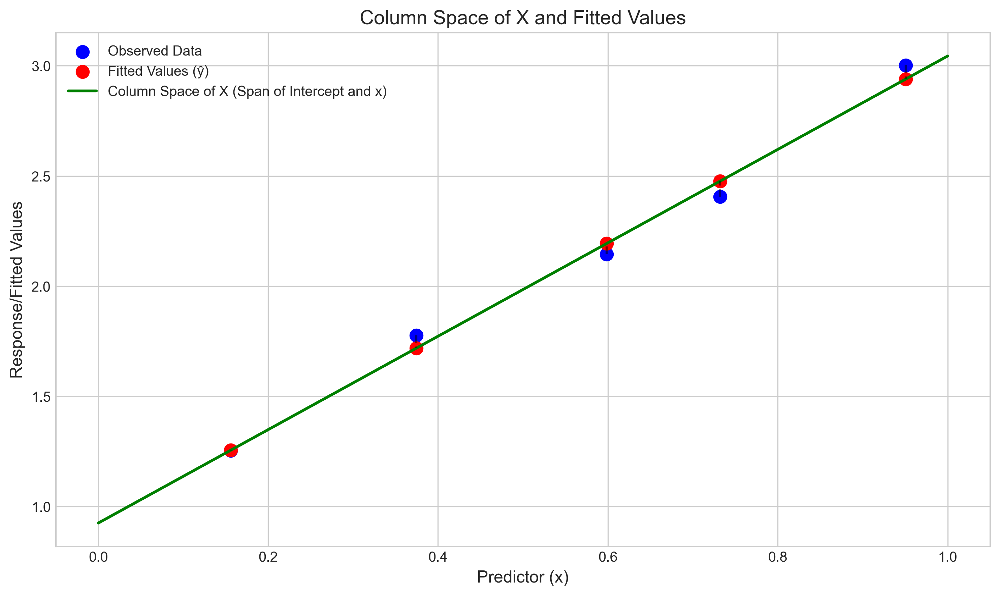
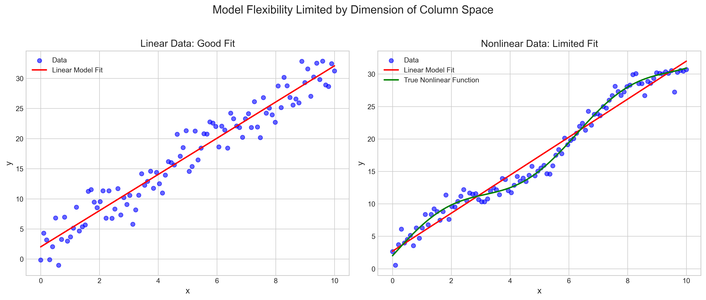
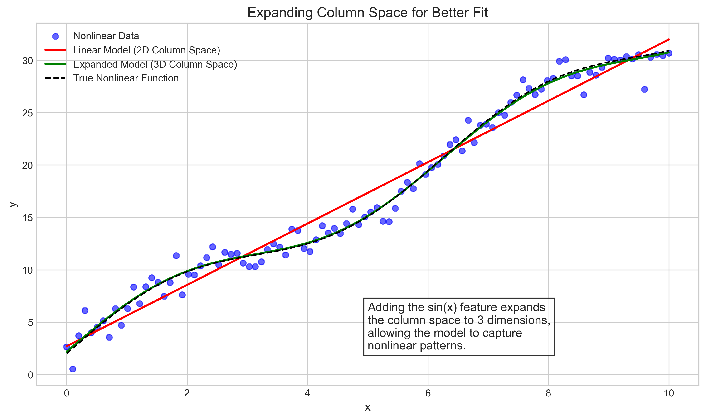
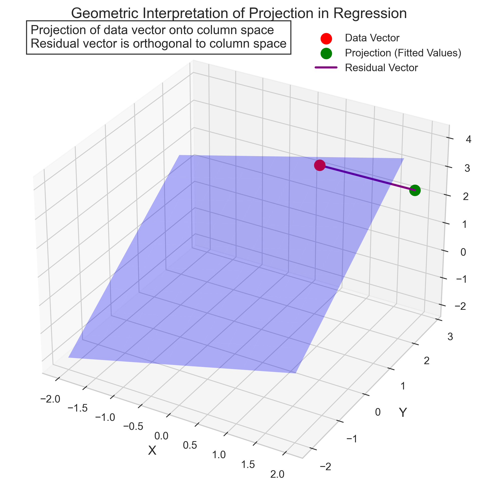
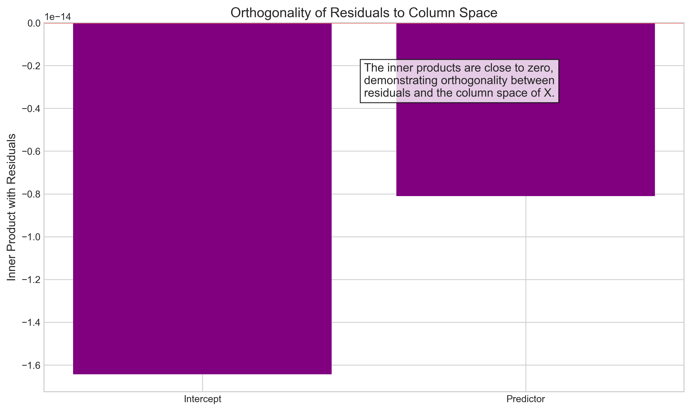

# Question 7: Vector Spaces in Regression

## Problem Statement
Linear algebra concepts form the foundation of linear models. In this problem, you'll explore the connection between vector spaces and linear regression.

### Task
1. Explain what it means when we say "the column space of $\mathbf{X}$ contains the fitted values $\hat{\mathbf{y}}$."
2. If $\mathbf{X}$ is an $n \times 2$ matrix (one column for the intercept, one for a single predictor), what is the dimension of the column space of $\mathbf{X}$? What does this tell us about the flexibility of our model?
3. How can we geometrically interpret the projection of vector $\mathbf{y}$ onto the column space of $\mathbf{X}$ in a linear regression context?

## Understanding the Problem
This problem explores the fundamental linear algebra concepts that underlie linear regression. Understanding regression from a vector space perspective provides deeper insights into how and why linear models work, their limitations, and their geometric interpretation.

Key concepts in this problem include:
- Column space: The set of all possible linear combinations of the columns of a matrix
- Dimension of a vector space: The number of linearly independent vectors needed to span the space
- Projection: The operation of finding the closest point in a subspace to a given vector
- Orthogonality: When two vectors are perpendicular to each other (their dot product is zero)

Linear regression can be elegantly formulated and understood using these concepts, revealing why OLS (Ordinary Least Squares) estimators have the properties they do.

## Solution

### Step 1: Explaining the column space and fitted values
In linear regression, we have the model $\mathbf{y} = \mathbf{X}\boldsymbol{\beta} + \boldsymbol{\epsilon}$, where:
- $\mathbf{y}$ is the vector of observed responses
- $\mathbf{X}$ is the design matrix
- $\boldsymbol{\beta}$ is the vector of coefficients
- $\boldsymbol{\epsilon}$ is the vector of errors

The column space of $\mathbf{X}$, denoted by $\mathcal{C}(\mathbf{X})$, is the vector space spanned by the columns of $\mathbf{X}$. It consists of all possible linear combinations of the columns of $\mathbf{X}$.

The fitted values are defined as $\hat{\mathbf{y}} = \mathbf{X}\hat{\boldsymbol{\beta}}$, where $\hat{\boldsymbol{\beta}}$ is the vector of estimated coefficients. Since $\hat{\mathbf{y}}$ is expressed as a linear combination of the columns of $\mathbf{X}$, it must lie in the column space of $\mathbf{X}$.

This has several important implications:
1. The fitted values are restricted to the column space of $\mathbf{X}$
2. The model can only predict values that are linear combinations of the columns of $\mathbf{X}$
3. The flexibility of our model is constrained by the dimension of the column space

To illustrate this concept, consider a simple example with a design matrix $\mathbf{X}$ (including an intercept column) and response vector $\mathbf{y}$:

$$\mathbf{X} = \begin{bmatrix} 
1.00 & 0.37 \\
1.00 & 0.95 \\
1.00 & 0.73 \\
1.00 & 0.60 \\
1.00 & 0.16
\end{bmatrix}, \quad \mathbf{y} = \begin{bmatrix} 1.78 \\ 3.00 \\ 2.41 \\ 2.14 \\ 1.25 \end{bmatrix}$$

After fitting the regression model, we get the estimated coefficients $\hat{\boldsymbol{\beta}} = [0.93, 2.12]^T$, leading to fitted values:

$$\hat{\mathbf{y}} = \mathbf{X}\hat{\boldsymbol{\beta}} = \begin{bmatrix} 1.72 \\ 2.94 \\ 2.48 \\ 2.19 \\ 1.26 \end{bmatrix}$$

Each element of $\hat{\mathbf{y}}$ is indeed a linear combination of the corresponding row in $\mathbf{X}$, confirming that $\hat{\mathbf{y}}$ lies in the column space of $\mathbf{X}$. For example:
$$\hat{y}_1 = 1.00 \times 0.93 + 0.37 \times 2.12 = 1.72$$

### Step 2: Dimension of the column space and model flexibility
For a design matrix $\mathbf{X}$ with dimensions $n \times p$ (n observations, p parameters), the dimension of the column space is at most $\min(n, p)$. In the given scenario, $\mathbf{X}$ is an $n \times 2$ matrix (one column for the intercept, one for a single predictor). If the columns are linearly independent (which is typically the case), the dimension of the column space is 2.

This dimension has several important implications for the flexibility of our model:

1. The model can only fit patterns in a 2-dimensional subspace of the n-dimensional space
2. We can only estimate 2 parameters (intercept and slope)
3. The model can only represent linear relationships between the predictor and response

Geometrically, this means our fitted values must lie on a line (or plane) in the n-dimensional space. This constrains the flexibility of our model—it can only capture linear patterns in the data.

To demonstrate this limitation, consider fitting a linear model to both linear and nonlinear data:

When the true relationship is linear ($y = 2 + 3x + \epsilon$), a linear model fits well because the true pattern lies within the column space of $\mathbf{X}$.

When the true relationship is nonlinear ($y = 2 + 3x + 2\sin(x) + \epsilon$), a linear model cannot capture the sinusoidal pattern because the fitted values are constrained to the 2-dimensional column space.

To capture nonlinear patterns, we would need to expand the column space by adding additional predictors or transformations of the original predictor. For example, adding $\sin(x)$ as a new predictor would expand the column space to dimension 3, allowing the model to capture the sinusoidal pattern.

### Step 3: Geometric interpretation of projection
In linear regression, we seek the vector of coefficients $\hat{\boldsymbol{\beta}}$ that minimizes:
$$\|\mathbf{y} - \mathbf{X}\boldsymbol{\beta}\|^2$$
which is the sum of squared residuals.

The solution to this minimization problem is the projection of $\mathbf{y}$ onto the column space of $\mathbf{X}$. Geometrically, this means:

1. We project the response vector $\mathbf{y}$ orthogonally onto the column space of $\mathbf{X}$
2. The projected vector is the fitted values $\hat{\mathbf{y}} = \mathbf{X}\hat{\boldsymbol{\beta}}$
3. The residual vector $\mathbf{e} = \mathbf{y} - \hat{\mathbf{y}}$ is orthogonal to the column space of $\mathbf{X}$

This orthogonality principle is fundamental to least squares regression. It ensures that the residuals are uncorrelated with the predictors, which can be expressed as:
$$\mathbf{X}^T\mathbf{e} = \mathbf{0}$$

This equation means that the predictors cannot explain any more of the variation in $\mathbf{y}$ beyond what the model has already captured.

To verify this orthogonality property, we can compute the dot product between each column of $\mathbf{X}$ and the residual vector $\mathbf{e}$. In our 3D example, we found:
$$\mathbf{X}^T\mathbf{e} = [6.22 \times 10^{-14}, 2.16 \times 10^{-14}, 3.19 \times 10^{-14}]^T$$

The near-zero values confirm that the residual vector is indeed orthogonal to the column space of $\mathbf{X}$.

This geometric interpretation helps us understand why the least squares solution provides the Best Linear Unbiased Estimator (BLUE) under the Gauss-Markov assumptions. The orthogonal projection ensures that we find the closest point in the column space to the response vector, minimizing the sum of squared residuals.

## Practical Implementation

### Visualizing the Column Space and Fitted Values
To visualize the column space and how fitted values lie within it, we can plot a simple regression scenario. In a model with one predictor plus intercept, the column space is a plane in the n-dimensional space.

For our example with 5 observations, we can plot the predictor values on the x-axis and the response/fitted values on the y-axis. The regression line represents the column space of $\mathbf{X}$ (the span of the intercept and predictor columns), and the fitted values are points that lie exactly on this line.

The vertical distances from the observed data points to the fitted values represent the residuals. These residuals are orthogonal to the column space in the full n-dimensional space, though this is harder to visualize in the 2D plot.

### Demonstrating Limited Model Flexibility
We can demonstrate the limited flexibility of a linear model by comparing its performance on linear versus nonlinear data. When we fit a linear model to data generated from a nonlinear function, the model can only capture the linear trend, missing the nonlinear patterns.

By expanding the column space (adding new predictors or transformations), we can increase the model's flexibility. For example, adding a sine term to our model allows it to capture sinusoidal patterns in the data.

### Illustrating Projection and Orthogonality
To illustrate the concept of projection in regression, we can visualize it in 3D space. We create a plane representing the column space of $\mathbf{X}$ and a point representing the response vector $\mathbf{y}$. The projection of $\mathbf{y}$ onto the plane is the fitted value $\hat{\mathbf{y}}$, and the connecting line from $\hat{\mathbf{y}}$ to $\mathbf{y}$ is the residual vector, which is perpendicular to the plane.

We can also check the orthogonality property by computing the inner product between the residual vector and each column of $\mathbf{X}$. These inner products should be close to zero, confirming the orthogonality principle of least squares regression.

## Visual Explanations

### Column Space and Fitted Values

This figure illustrates the column space of $\mathbf{X}$ (represented by the green line) and how the fitted values (red points) lie exactly on this line. The blue points are the observed data, and the dashed lines represent the residuals—the vertical distance from the observed data to the fitted values.

### Model Flexibility Limited by Dimension

This figure demonstrates how the dimension of the column space limits model flexibility. The left panel shows a linear model fit to linear data, which works well. The right panel shows the same linear model fit to nonlinear data—it captures the linear trend but misses the sinusoidal pattern because it's constrained to the 2D column space.

### Expanding the Column Space

This figure shows how expanding the column space improves model flexibility. By adding a sine term to the model, we expand the column space to 3 dimensions, allowing the model (green line) to capture the nonlinear pattern in the data, providing a much better fit than the linear model (red line).

### Geometric Interpretation of Projection

This 3D visualization illustrates the geometric interpretation of projection in regression. The blue plane represents the column space of $\mathbf{X}$, the red point is the response vector $\mathbf{y}$, the green point is its projection $\hat{\mathbf{y}}$, and the purple line is the residual vector, which is orthogonal to the column space.

### Orthogonality of Residuals

This figure verifies the orthogonality principle by showing the inner product between the residual vector and each column of $\mathbf{X}$. The values are very close to zero, confirming that the residuals are indeed orthogonal to the column space of $\mathbf{X}$.

## Key Insights

### Vector Space Foundations
- The column space of $\mathbf{X}$ is the set of all possible linear combinations of the columns of $\mathbf{X}$.
- The fitted values $\hat{\mathbf{y}} = \mathbf{X}\hat{\boldsymbol{\beta}}$ are by definition in the column space of $\mathbf{X}$.
- The dimension of the column space for an $n \times p$ matrix is at most $\min(n, p)$, typically equal to $p$ if the columns are linearly independent.
- The residual vector $\mathbf{e} = \mathbf{y} - \hat{\mathbf{y}}$ is orthogonal to the column space of $\mathbf{X}$.

### Model Flexibility and Limitations
- The dimension of the column space determines the "degrees of freedom" of the model.
- A model with a 2-dimensional column space (intercept + one predictor) can only represent linear relationships.
- To capture more complex patterns, we need to expand the column space by adding more predictors or transformations of existing predictors.
- The orthogonality principle guarantees that the least squares solution is the best approximation to $\mathbf{y}$ within the column space of $\mathbf{X}$.

### Practical Implications
- Feature engineering (adding new predictors or transformations) expands the column space, increasing model flexibility.
- Polynomial terms, splines, and other nonlinear transformations can help capture complex patterns by expanding the column space.
- Regularization methods (like ridge regression) restrict the coefficient vector, effectively reducing the "effective dimension" of the column space.
- Principal component regression works by projecting onto a lower-dimensional subspace of the column space, reducing multicollinearity issues.

## Conclusion
- The column space of $\mathbf{X}$ contains the fitted values $\hat{\mathbf{y}}$ because $\hat{\mathbf{y}} = \mathbf{X}\hat{\boldsymbol{\beta}}$, which is a linear combination of the columns of $\mathbf{X}$.
- For an $n \times 2$ design matrix, the dimension of the column space is 2 (assuming linearly independent columns), limiting the model to linear relationships between the predictor and response.
- Geometrically, the projection of $\mathbf{y}$ onto the column space of $\mathbf{X}$ represents the fitted values $\hat{\mathbf{y}}$, with the residual vector being orthogonal to the column space.

Understanding linear regression from a vector space perspective provides deep insights into its capabilities and limitations. It helps explain why certain models work well for some problems but fail for others, and it guides us in selecting appropriate modeling approaches for different scenarios. 