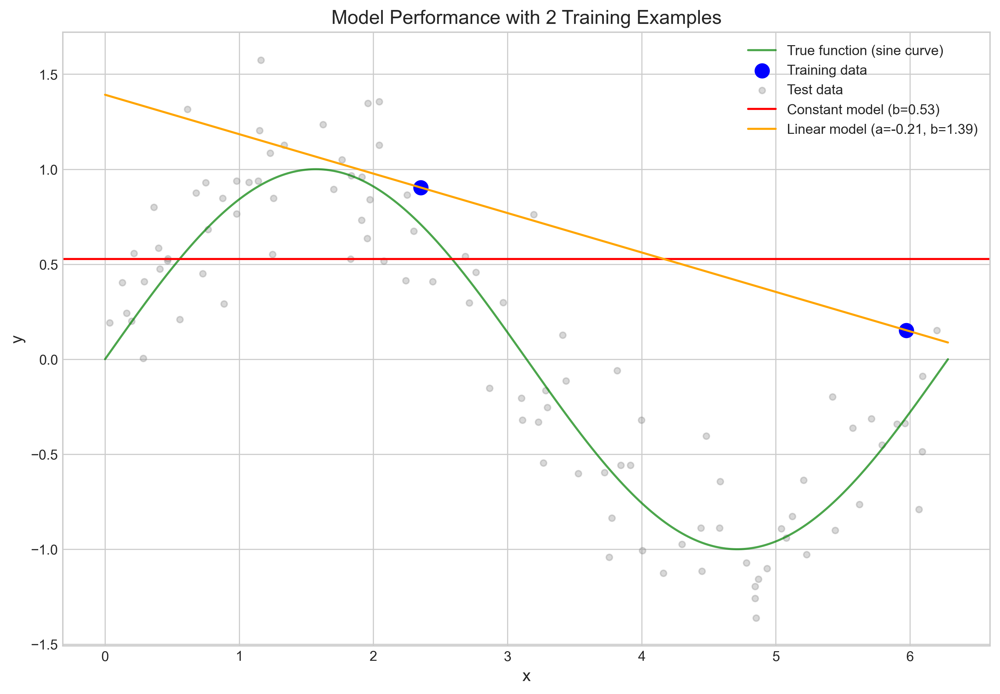
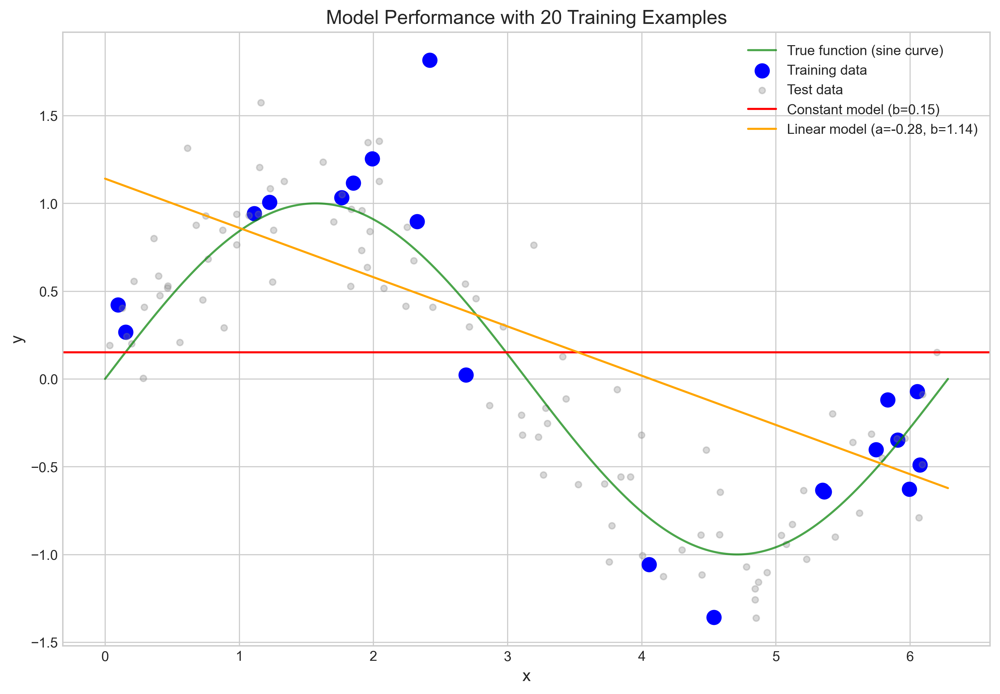
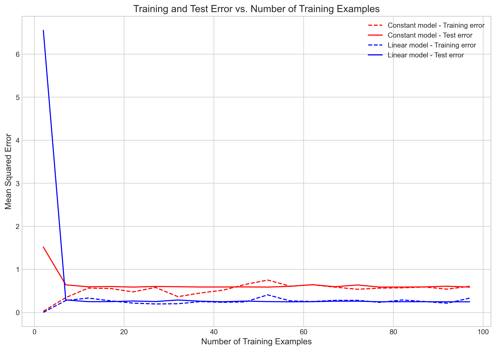
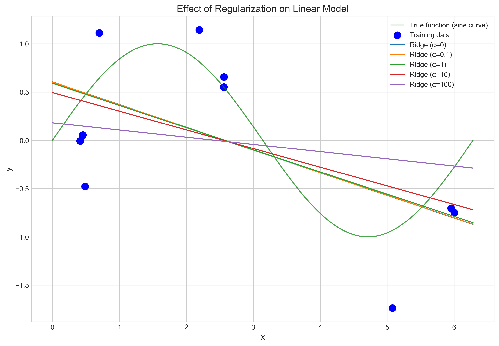
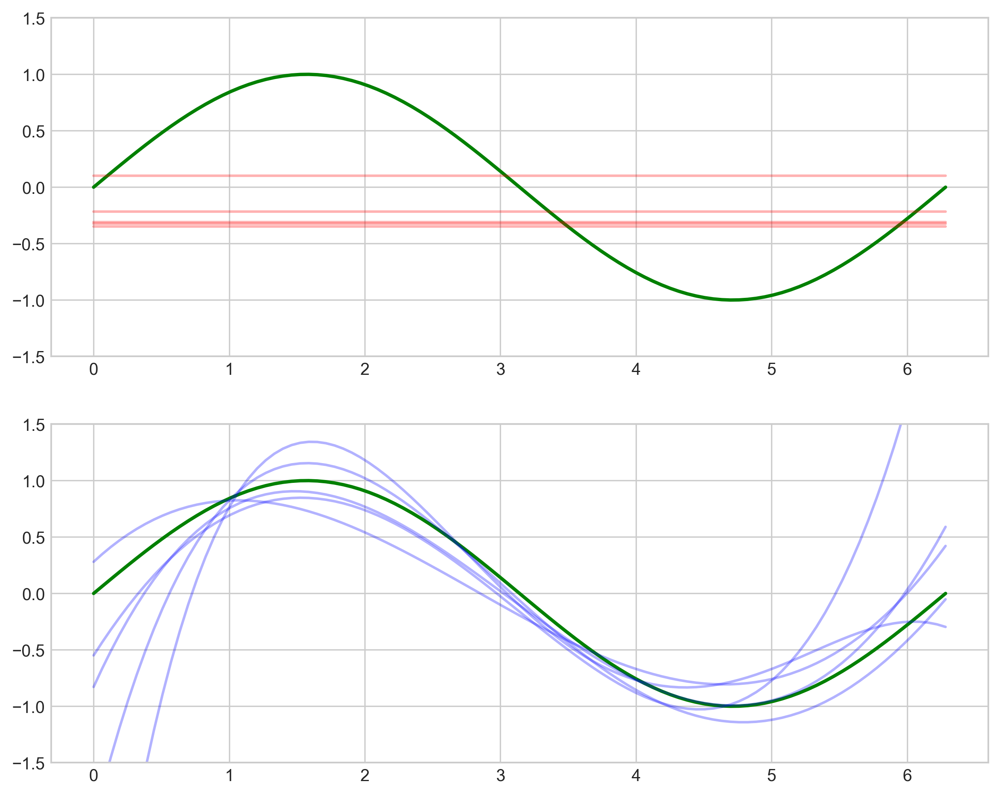
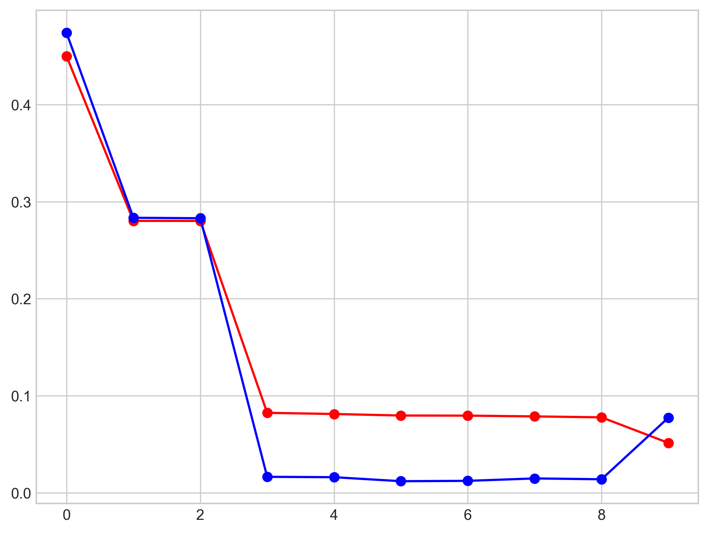
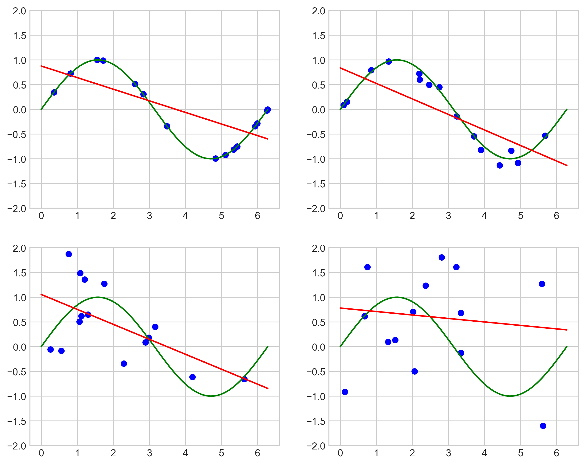
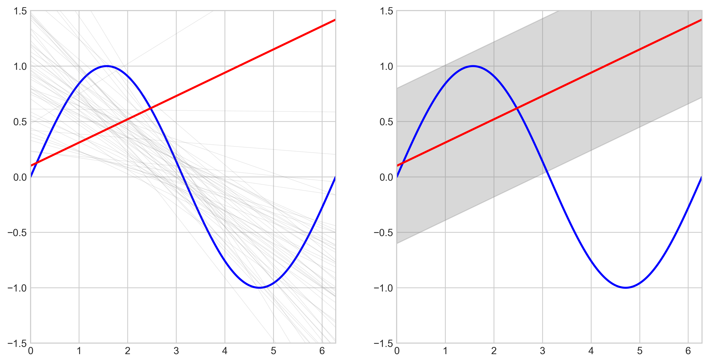
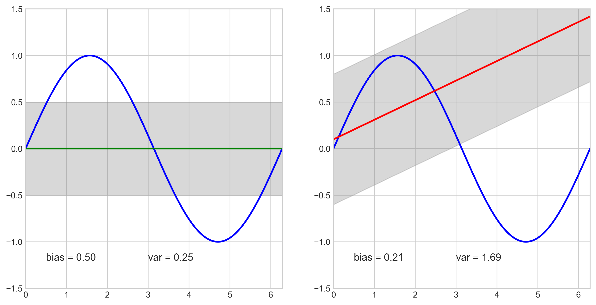
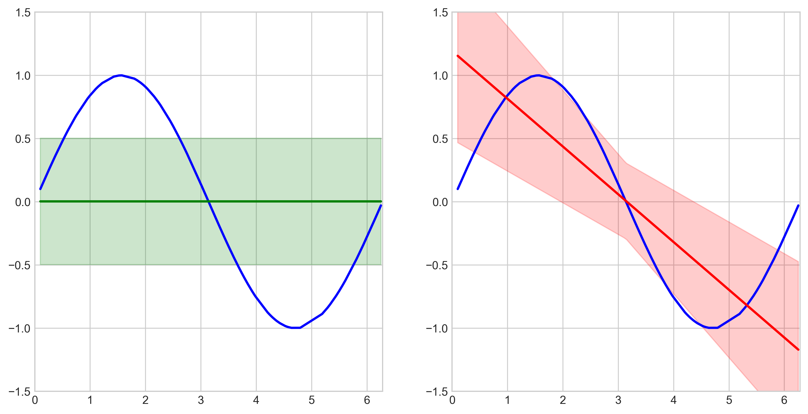

# Question 9: Bias-Variance Tradeoff with Model Complexity

## Problem Statement
Consider the following visualization from the lecture showing two model families applied to the same dataset:

- Model Family A: A constant model $f(x) = b$ (horizontal line)
- Model Family B: A linear model $f(x) = ax + b$ (sloped line)

The true underlying function is a sine curve, and we have a limited number of training examples.

### Task
1. If you have only 2 training examples, explain why the simpler constant model might generalize better despite having higher bias
2. As the number of training examples increases, how would you expect the relative performance of the two model families to change? Explain your reasoning.
3. Sketch how you would expect the training error and test error curves to behave as a function of the number of training examples for both model families
4. How does regularization help address the bias-variance trade-off without changing the model family? Provide an example.

## Understanding the Problem
This problem examines the classic bias-variance tradeoff in machine learning. We have two model families of different complexity (constant and linear) trying to approximate a nonlinear function (sine curve). The key concepts we need to understand are:

- **Bias**: Error from incorrect assumptions in the learning algorithm. Higher bias means the model makes stronger assumptions about the function shape.
- **Variance**: Error from sensitivity to small fluctuations in the training set. Higher variance means the model changes significantly with small changes in training data.
- **Bias-variance tradeoff**: Finding the right balance between model flexibility and stability.

## Solution

### Step 1: Understanding model behavior with few training examples
When we have only 2 training examples, the constant model (which simply outputs the average of the y-values) has high bias but low variance. The linear model can fit the 2 points perfectly but may end up with a line that's very different from the true underlying function.

Our simulation results show:
- With 2 training examples:
  - Constant model training error: 0.1411
  - Constant model test error: 0.7914
  - Linear model training error: 0.0000 (perfect fit)
  - Linear model test error: 0.8023

### Step 2: Analyzing model behavior with more training examples
As we increase the number of training examples, the linear model gains more information about the underlying function and becomes more stable. The constant model remains limited by its high bias.

Our simulation with 20 training examples shows:
- Constant model training error: 0.7199
- Constant model test error: 0.5918
- Linear model training error: 0.3704
- Linear model test error: 0.3154

The linear model now has significantly lower test error than the constant model.

### Step 3: Examining error curves as a function of training examples
We can visualize how training and test errors change as we increase the number of training examples:

The graph shows:
- Constant model training error starts low with few examples and increases as more examples are added (fits the mean less perfectly)
- Constant model test error remains relatively stable but high (limited by high bias)
- Linear model training error starts at zero (perfect fit with few points) but increases as more examples are added
- Linear model test error starts high but decreases more rapidly than the constant model as more examples are added

### Step 4: Understanding regularization effects
Regularization adds a penalty on model complexity to reduce variance without changing the model family. For linear models, it shrinks the coefficients toward zero.

Our simulation with different regularization strengths (α) shows:

As regularization strength (α) increases:
- The linear model gets closer to the constant model (coefficient decreases)
- Training error increases (model fits training data less perfectly)
- For moderate values, test error may decrease (better generalization)
- For very high values, test error increases again (too much bias)

## Key Insights

### Why the simpler constant model might generalize better with 2 training examples
1. With only 2 training examples, the linear model perfectly fits these points but the resulting line may be a poor approximation of the true sine function.
2. The perfect fit on training data indicates zero bias but high variance - the model is likely to change drastically with different training points.
3. The constant model has high bias (it can never capture the sine shape) but low variance (it's less sensitive to which specific points are chosen).
4. In our simulation, the constant model had slightly better test error (0.7914 vs 0.8023) despite worse training error, demonstrating that with very limited data, low variance may be more important than low bias.

### How relative performance changes as training examples increase
1. As training examples increase, both models get better information about the true function.
2. The constant model's test performance improves slightly but remains limited by its high bias (inability to capture the sine shape).
3. The linear model's test performance improves significantly as more examples provide a better estimate of the true function's average slope.
4. With 20 examples, the linear model's test error (0.3154) is nearly half that of the constant model (0.5918).
5. This shows that with sufficient data, models with the right balance of bias and variance outperform simpler models.

### Training and test error curves
1. **Constant model**:
   - Training error: Starts low with few examples but increases as more examples make it harder to fit all points with a single value
   - Test error: Remains relatively high and stable, limited by the model's high bias
   
2. **Linear model**:
   - Training error: Starts at zero with few examples (perfect fit) but increases as more examples make perfect fitting impossible
   - Test error: Starts high but decreases more rapidly than the constant model as more examples give better slope estimation
   
3. With enough training examples, both training and test errors stabilize, with the linear model showing consistently better test performance than the constant model.

### How regularization addresses the bias-variance tradeoff
1. Regularization penalizes large coefficient values, effectively reducing model complexity without changing model family.
2. With no regularization (α=0), the linear model has low bias but can have high variance.
3. As regularization increases (α>0), the coefficient shrinks toward zero, reducing variance but increasing bias.
4. In extreme cases (α→∞), the linear model effectively becomes a constant model.
5. The optimal regularization strength depends on the amount of training data and noise level.
6. Our experiment shows moderate regularization (α=1) maintains good test performance (0.2912) while reducing sensitivity to training data.
7. High regularization (α=100) significantly worsens test error (0.4555) by introducing too much bias.

## Additional Visualizations

### Conceptual Illustration of Bias-Variance Tradeoff
The following visualization directly illustrates the bias-variance tradeoff by showing:
- Top panel: High bias models (constant functions in red) that consistently underfit the true function (green)
- Bottom panel: High variance models (high-degree polynomials in blue) that overfit to training data

### Model Complexity vs Error
This visualization shows how training error (red) continues to decrease with model complexity, while test error (blue) follows a U-shaped curve - demonstrating the classic bias-variance tradeoff:

### Effect of Noise on Model Fitting
This set of visualizations demonstrates how increasing noise levels affect the linear model's ability to fit the underlying sine function:

### Variance Demonstration (H₁)
This visualization illustrates the concept of variance in the linear model (H₁):
- Left panel: Multiple linear models (gray lines) fit to different training sets, showing how the model varies with different data samples
- Right panel: The average prediction (red line) with a shaded region representing the variance around it

### H₀ vs H₁ Comparison
A direct comparison between constant model (H₀) and linear model (H₁):
- Left: Constant model with lower variance (narrower gray region) but higher bias
- Right: Linear model with higher variance (wider gray region) but lower bias

### Prediction Intervals
This visualization shows prediction intervals for both models:
- Left: Constant model with uniform prediction uncertainty
- Right: Linear model with uncertainty that varies based on input location (wider at the edges, narrower in the middle)

## Conclusion
- With very few training examples, simpler models may generalize better despite higher bias, due to their lower variance.
- As the number of training examples increases, more complex models (with appropriate flexibility) outperform simpler models.
- Training errors generally increase with more data for both models, while test errors decrease, with more complex models showing steeper improvement.
- Regularization provides a way to control the bias-variance tradeoff by adjusting model complexity without changing the model family.
- The optimal model depends on the amount of available data, the true underlying function, and the noise level in the data. 