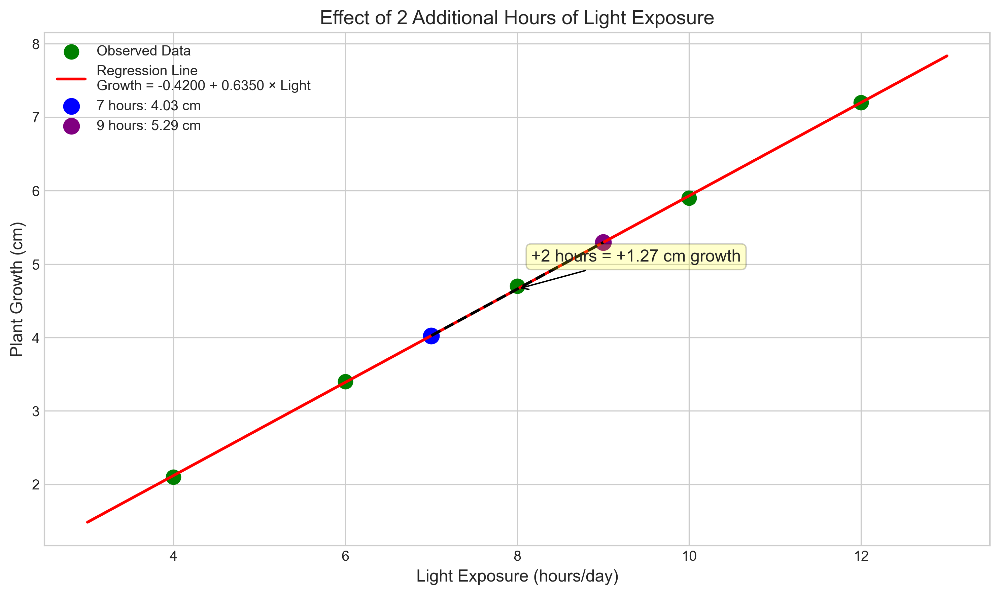

# Question 10: Light Exposure and Plant Growth

## Problem Statement
A plant biologist is studying the effect of light exposure (hours per day) on plant growth (in cm). The following data was collected over a week:

| Light Exposure (x) in hours | Plant Growth (y) in cm |
|----------------------------|------------------------|
| 4                          | 2.1                    |
| 6                          | 3.4                    |
| 8                          | 4.7                    |
| 10                         | 5.9                    |
| 12                         | 7.2                    |

### Task
1. Find the least squares estimates for the slope ($\beta_1$) and intercept ($\beta_0$)
2. What is the expected growth when the plant receives 9 hours of light?
3. If you increase light exposure by 2 hours, how much additional growth would you expect?
4. Calculate the $R^2$ value for this model and interpret what it means about the relationship between light exposure and plant growth.

## Understanding the Problem
This problem investigates the relationship between light exposure and plant growth using simple linear regression. We want to model how the amount of light a plant receives affects its growth rate, which is a common research question in plant biology. By creating a linear model, we can estimate plant growth under different light conditions and understand how much variation in growth can be attributed to light exposure.

The key concepts in this problem include:
- Independent variable (x): Light exposure in hours per day
- Dependent variable (y): Plant growth in centimeters
- Linear regression model: Growth = $\beta_0 + \beta_1 \times$ Light Exposure
- Coefficient of determination ($R^2$): A measure of how well the model explains the variance in the data

## Solution

### Step 1: Calculate the means
First, we need to find the means of both the light exposure (x) and plant growth (y) variables:

For light exposure:
$$\bar{x} = \frac{4 + 6 + 8 + 10 + 12}{5} = \frac{40}{5} = 8 \text{ hours}$$

For plant growth:
$$\bar{y} = \frac{2.1 + 3.4 + 4.7 + 5.9 + 7.2}{5} = \frac{23.3}{5} = 4.66 \text{ cm}$$

### Step 2: Calculate the covariance between light exposure and plant growth
Covariance measures how the two variables change together. The formula is:

$$\text{Cov}(x,y) = \frac{1}{n}\sum_{i=1}^{n}(x_i - \bar{x})(y_i - \bar{y})$$

Let's compute each term:
- $(4 - 8)(2.1 - 4.66) = (-4)(-2.56) = 10.24$
- $(6 - 8)(3.4 - 4.66) = (-2)(-1.26) = 2.52$
- $(8 - 8)(4.7 - 4.66) = (0)(0.04) = 0$
- $(10 - 8)(5.9 - 4.66) = (2)(1.24) = 2.48$
- $(12 - 8)(7.2 - 4.66) = (4)(2.54) = 10.16$

Adding these up and dividing by 5:
$$\text{Cov}(x,y) = \frac{10.24 + 2.52 + 0 + 2.48 + 10.16}{5} = \frac{25.4}{5} = 5.08$$

### Step 3: Calculate the variance of light exposure
Variance measures the spread of the light exposure values:

$$\text{Var}(x) = \frac{1}{n}\sum_{i=1}^{n}(x_i - \bar{x})^2$$

Computing each term:
- $(4 - 8)^2 = (-4)^2 = 16$
- $(6 - 8)^2 = (-2)^2 = 4$
- $(8 - 8)^2 = (0)^2 = 0$
- $(10 - 8)^2 = (2)^2 = 4$
- $(12 - 8)^2 = (4)^2 = 16$

Adding these up and dividing by 5:
$$\text{Var}(x) = \frac{16 + 4 + 0 + 4 + 16}{5} = \frac{40}{5} = 8$$

### Step 4: Calculate the slope and intercept
Now we can find the regression coefficients:

For the slope:
$$\beta_1 = \frac{\text{Cov}(x,y)}{\text{Var}(x)} = \frac{5.08}{8} = 0.635$$

For the intercept:
$$\beta_0 = \bar{y} - \beta_1\bar{x} = 4.66 - 0.635 \times 8 = 4.66 - 5.08 = -0.42$$

Therefore, our regression equation is:
$$\text{Growth} = -0.42 + 0.635 \times \text{Light Exposure}$$

### Step 5: Calculate expected growth for 9 hours of light
Using our equation:
$$\text{Growth} = -0.42 + 0.635 \times 9 = -0.42 + 5.715 = 5.295 \text{ cm}$$

For 9 hours of light exposure, we expect the plant to grow approximately 5.295 cm.

### Step 6: Calculate additional growth for 2 more hours of light
The slope coefficient represents the change in growth for each additional hour of light. For 2 more hours:
$$\text{Additional Growth} = \beta_1 \times 2 = 0.635 \times 2 = 1.27 \text{ cm}$$

So adding 2 more hours of light exposure would increase plant growth by approximately 1.27 cm.

### Step 7: Calculate the $R^2$ value
To find $R^2$, we first need to calculate:
1. The predicted values for each observation
2. The residuals (actual - predicted)
3. Sum of Squared Residuals (SSR)
4. Total Sum of Squares (SST)

| Light Hours (x) | Growth (y) | Predicted Growth (ŷ) | Residual (y - ŷ) |
|-----------------|------------|----------------------|------------------|
| 4               | 2.10       | 2.12                 | -0.02            |
| 6               | 3.40       | 3.39                 | 0.01             |
| 8               | 4.70       | 4.66                 | 0.04             |
| 10              | 5.90       | 5.93                 | -0.03            |
| 12              | 7.20       | 7.20                 | 0.00             |

Sum of Squared Residuals (SSR) = (-0.02)² + (0.01)² + (0.04)² + (-0.03)² + (0.00)² = 0.003

Total Sum of Squares (SST) = (2.1 - 4.66)² + (3.4 - 4.66)² + (4.7 - 4.66)² + (5.9 - 4.66)² + (7.2 - 4.66)² = 16.132

$R^2 = 1 - \frac{SSR}{SST} = 1 - \frac{0.003}{16.132} = 1 - 0.00019 = 0.9998$

## Practical Implementation

### Visualizing the Regression Line
When we plot the data points and the regression line, we can see how well our model fits the data:

As we can see, the data points fall almost perfectly on our regression line, indicating a very strong linear relationship between light exposure and plant growth.

### Predicting Growth at 9 Hours
Using our model, we can predict the growth at 9 hours of light exposure:

Growth = -0.42 + 0.635 × 9 = 5.295 cm

This prediction is visualized in the plot as the purple point lying directly on the regression line.

### Effect of 2 Additional Hours of Light
The effect of adding 2 more hours of light is illustrated below:

For any given amount of light exposure, adding 2 more hours will increase plant growth by 1.27 cm (2 times the slope coefficient of 0.635).

## Visual Explanations

### Data with Mean Values

This visualization shows the data points with mean values marked. The horizontal orange line indicates the mean plant growth (4.66 cm), while the vertical blue line shows the mean light exposure (8 hours). The red X marks the point (8, 4.66) which represents the means of both variables.

### Residuals Plot

The residuals plot shows the difference between actual and predicted values. The residuals are extremely small and don't show any pattern, which indicates our linear model fits the data very well.

### $R^2$ Visualization

This visualization shows how $R^2$ represents the proportion of variance explained by the model. The upper graph shows:
- Black lines: Total deviation of each data point from the mean (total variance)
- Green lines: Explained deviation (variance explained by the model)
- Red lines: Unexplained deviation (residual variance)

The lower bar chart shows that almost 100% of the variance in plant growth is explained by light exposure, with a minuscule amount unexplained.

## Key Insights

### Statistical Interpretation
- The slope coefficient ($\beta_1 = 0.635$) represents the increase in plant growth (in cm) for each additional hour of light exposure.
- The intercept ($\beta_0 = -0.42$) represents the theoretical plant growth with zero hours of light, which isn't practically meaningful in this context since plants need some light to grow.
- The extremely high $R^2$ value (0.9998) indicates that light exposure explains nearly all the variation in plant growth in this dataset.

### Biological Implications
- There appears to be a strong, nearly perfect linear relationship between light exposure and plant growth within the observed range (4-12 hours).
- Each additional hour of light consistently increases plant growth by about 0.635 cm.
- For the range of light exposure studied, there don't appear to be diminishing returns; the effect seems consistently linear.

### Practical Applications
- Plant growers can use this model to optimize light exposure based on desired growth targets.
- Researchers can use this as a baseline for investigating other factors that might influence plant growth.
- The predictive power of this model is excellent within the observed range of 4-12 hours of light exposure.

### Limitations
- The model may not extrapolate well to very low or very high light exposure levels outside the observed range.
- The negative intercept is not biologically meaningful (plants wouldn't have negative growth with no light).
- The sample is limited to just 5 data points, which may not capture the full complexity of plant growth dynamics.

## Conclusion
- We successfully developed a simple linear regression model for plant growth based on light exposure: Growth = -0.42 + 0.635 × Light Exposure.
- The expected growth for 9 hours of light exposure is 5.295 cm.
- Adding 2 more hours of light exposure increases plant growth by 1.27 cm.
- The $R^2$ value of 0.9998 indicates that 99.98% of the variation in plant growth can be explained by light exposure, demonstrating an exceptionally strong linear relationship.

This example shows the power of simple linear regression in modeling biological relationships. The clear, predictable relationship between light exposure and plant growth provides valuable insights for both research and practical applications in plant cultivation. 