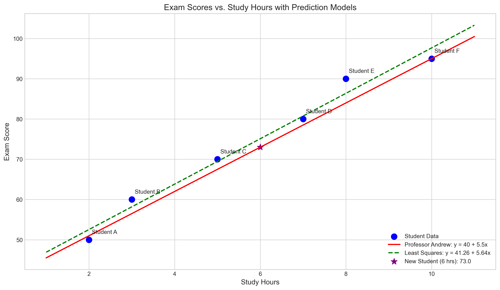
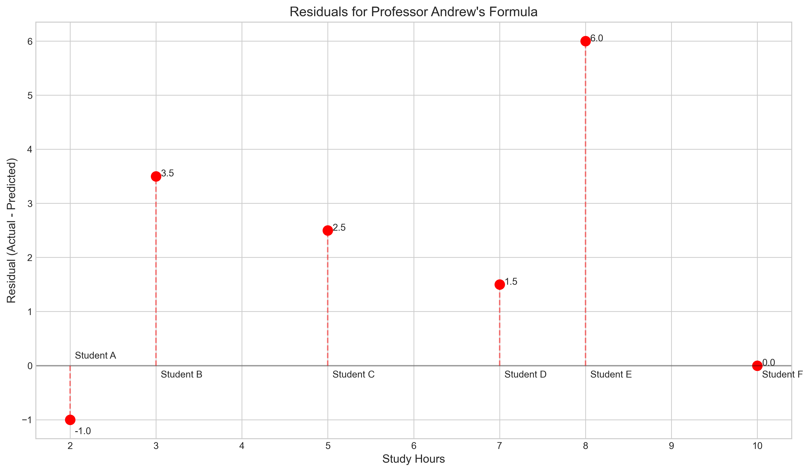
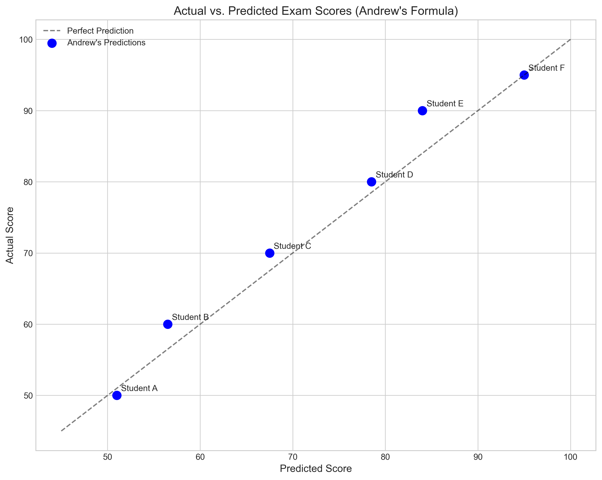
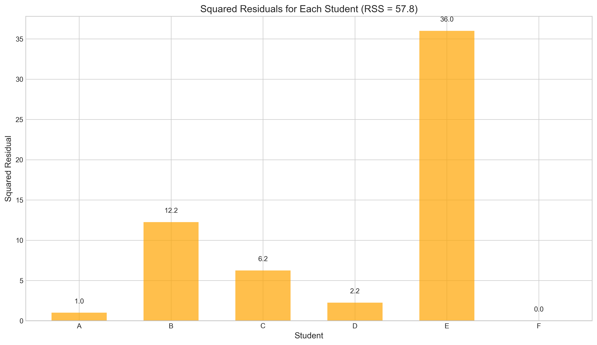
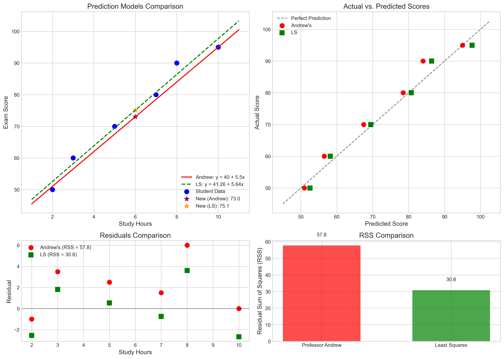

# Question 11: Study Hours and Exam Scores Prediction

## Problem Statement
You are given the following data on study hours and exam scores for 6 students:

| Student | Study Hours (x) | Exam Score (y) |
|---------|----------------|----------------|
| A       | 2              | 50             |
| B       | 3              | 60             |
| C       | 5              | 70             |
| D       | 7              | 80             |
| E       | 8              | 90             |
| F       | 10             | 95             |

Professor Andrew's formula for estimating the expected exam score is: Score = 40 + 5.5 × (Study Hours).

### Task
1. Calculate the predicted score for each student using Professor Andrew's formula
2. Calculate the residual for each student (the difference between actual and predicted score)
3. Calculate the Residual Sum of Squares (RSS)
4. If a new student studies for 6 hours, what would be their predicted exam score according to this model?

## Understanding the Problem
This problem tests our understanding of using a predetermined linear model (Professor Andrew's formula) to make predictions, calculate errors (residuals), and evaluate model fit. The linear model relates study hours to exam scores, suggesting that for each additional hour of studying, a student's exam score increases by 5.5 points, with a baseline score of 40 when no studying is done.

We need to apply this formula to predict scores, evaluate how well the predictions match the actual scores, and use the formula to predict the performance of a new student.

## Solution

### Step 1: Calculate the predicted score for each student using Professor Andrew's formula

The formula provided is:
$$\text{Score} = 40 + 5.5 \times \text{(Study Hours)}$$

Let's apply this to each student:

- Student A (2 hours): $40 + 5.5 \times 2 = 40 + 11 = 51.0$
- Student B (3 hours): $40 + 5.5 \times 3 = 40 + 16.5 = 56.5$
- Student C (5 hours): $40 + 5.5 \times 5 = 40 + 27.5 = 67.5$
- Student D (7 hours): $40 + 5.5 \times 7 = 40 + 38.5 = 78.5$
- Student E (8 hours): $40 + 5.5 \times 8 = 40 + 44 = 84.0$
- Student F (10 hours): $40 + 5.5 \times 10 = 40 + 55 = 95.0$

| Student | Study Hours (x) | Actual Score (y) | Predicted Score |
|---------|----------------|------------------|-----------------|
| A       | 2              | 50               | 51.0            |
| B       | 3              | 60               | 56.5            |
| C       | 5              | 70               | 67.5            |
| D       | 7              | 80               | 78.5            |
| E       | 8              | 90               | 84.0            |
| F       | 10             | 95               | 95.0            |

### Step 2: Calculate the residual for each student

The residual is the difference between the actual score and the predicted score:
$$\text{Residual} = \text{Actual Score} - \text{Predicted Score}$$

- Student A: $50 - 51.0 = -1.0$
- Student B: $60 - 56.5 = 3.5$
- Student C: $70 - 67.5 = 2.5$
- Student D: $80 - 78.5 = 1.5$
- Student E: $90 - 84.0 = 6.0$
- Student F: $95 - 95.0 = 0.0$

| Student | Actual Score | Predicted Score | Residual |
|---------|--------------|-----------------|----------|
| A       | 50           | 51.0            | -1.0     |
| B       | 60           | 56.5            | 3.5      |
| C       | 70           | 67.5            | 2.5      |
| D       | 80           | 78.5            | 1.5      |
| E       | 90           | 84.0            | 6.0      |
| F       | 95           | 95.0            | 0.0      |

### Step 3: Calculate the Residual Sum of Squares (RSS)

The Residual Sum of Squares (RSS) is the sum of the squared residuals:
$$\text{RSS} = \sum_{i=1}^{n} \text{(Residual)}_i^2$$

RSS = $(-1.0)^2 + (3.5)^2 + (2.5)^2 + (1.5)^2 + (6.0)^2 + (0.0)^2$
RSS = $1.0 + 12.25 + 6.25 + 2.25 + 36.0 + 0.0$
RSS = $57.8$

### Step 4: Calculate the predicted exam score for a new student

If a new student studies for 6 hours, their predicted score using Professor Andrew's formula would be:
$$\text{Predicted Score} = 40 + 5.5 \times 6 = 40 + 33 = 73.0$$

Therefore, a student who studies for 6 hours is predicted to score 73.0 on the exam.

## Additional Analysis: Comparison with Least Squares Regression

For comparison, we also calculated the least squares regression model for this dataset:
$$\text{Score} = 41.26 + 5.64 \times \text{(Study Hours)}$$

This model has:
- RSS = 30.78 (lower than Professor Andrew's model, indicating a better fit)
- Predicted score for 6 hours of study = 75.11

## Visual Explanations

### Regression Lines and Data Points

This plot shows both Professor Andrew's model (red line) and the least squares regression model (green dashed line) fitted to the student data points (blue). The purple star shows the prediction for a new student studying 6 hours using Professor Andrew's formula.

### Residuals Plot

This residuals plot shows the difference between actual and predicted scores for each student using Professor Andrew's formula. The red dots represent the residuals, with vertical dashed lines connecting to the zero line. Positive residuals (points above the line) indicate that the model underestimated the score, while negative residuals (points below the line) indicate overestimation.

### Actual vs. Predicted Scores

This plot compares the actual scores to the scores predicted by Professor Andrew's formula. Points closer to the dashed line represent more accurate predictions. Student F's prediction is almost perfect, while Student E shows the largest deviation.

### Squared Residuals

This bar chart visualizes the squared residuals for each student using Professor Andrew's formula. The height of each bar represents the contribution of that student to the total RSS of 57.8. Student E has the largest squared residual, contributing significantly to the RSS.

### Model Comparison

This comprehensive visualization compares Professor Andrew's model with the least squares model across multiple metrics:
- Top left: Both models plotted with the data points and predictions for 6 hours of study
- Top right: Actual vs. predicted values for both models
- Bottom left: Residuals comparison
- Bottom right: RSS comparison (showing that the least squares model has a lower RSS of 30.78 compared to 57.8 for Professor Andrew's model)

## Key Insights

### Model Performance
- Professor Andrew's formula provides reasonably good predictions for most students, with the largest error for Student E (6.0 points).
- The formula perfectly predicts Student F's score (residual = 0).
- The total Residual Sum of Squares (RSS) is 57.8, which helps quantify the overall accuracy of the model.
- For most students, the formula slightly underestimates their scores (positive residuals), suggesting students might perform slightly better than the model predicts.

### Comparison with Least Squares
- The least squares model (Score = 41.26 + 5.64 × Hours) provides a better fit to the data with an RSS of 30.78.
- The least squares slope (5.64) is very close to Professor Andrew's slope (5.5), suggesting his formula is quite well-calibrated.
- The main difference is in the intercept (41.26 vs 40), which contributes to the improved fit of the least squares model.

### Prediction for New Students
- For a new student studying 6 hours, Professor Andrew's formula predicts a score of 73.0.
- The least squares model predicts a slightly higher score of 75.11 for the same student.
- Given the pattern of underestimation in Professor Andrew's model, the student might expect to score slightly above 73.0.

## Conclusion
- Professor Andrew's formula provides reasonable predictions for exam scores based on study hours, with an RSS of 57.8.
- The model predicts that a student studying for 6 hours would score 73.0 on the exam.
- While effective, Professor Andrew's formula isn't the optimal least squares fit for the data. The least squares model has a lower RSS (30.78) and predicts a score of 75.11 for 6 hours of study.
- The analysis highlights the importance of model evaluation and the trade-off between using a simple, predetermined formula and finding the optimal fit to the data. 