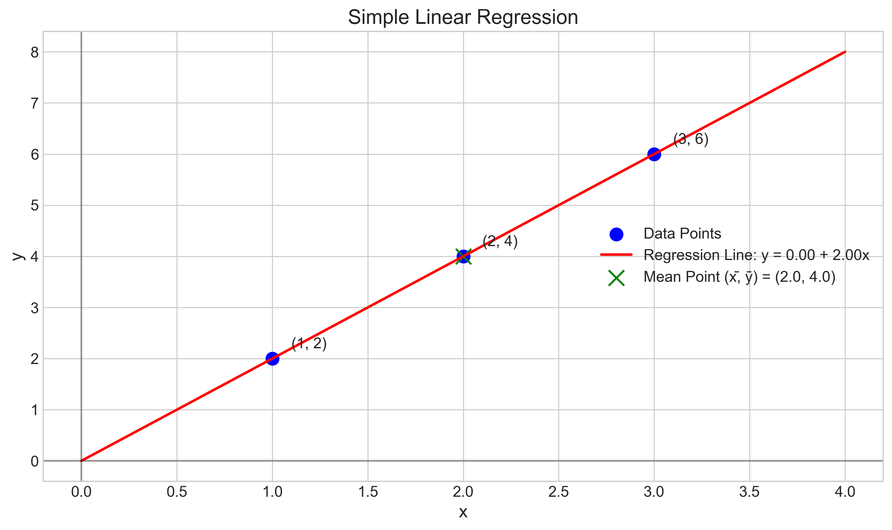
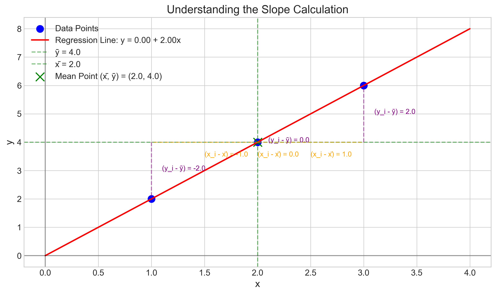
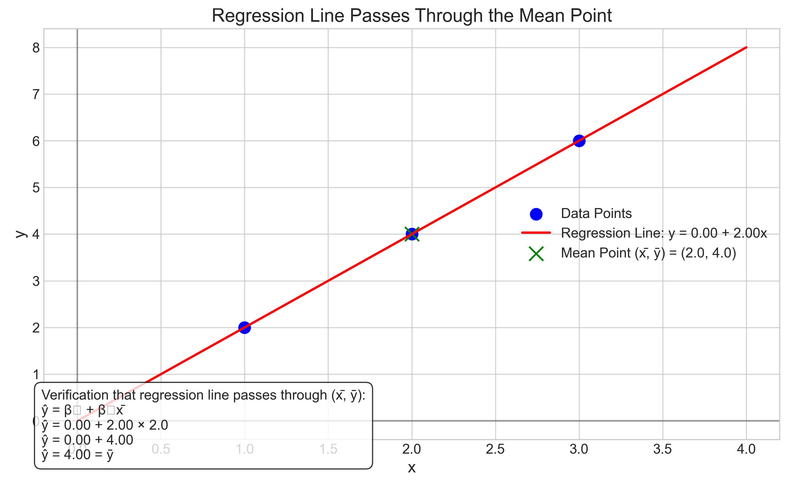
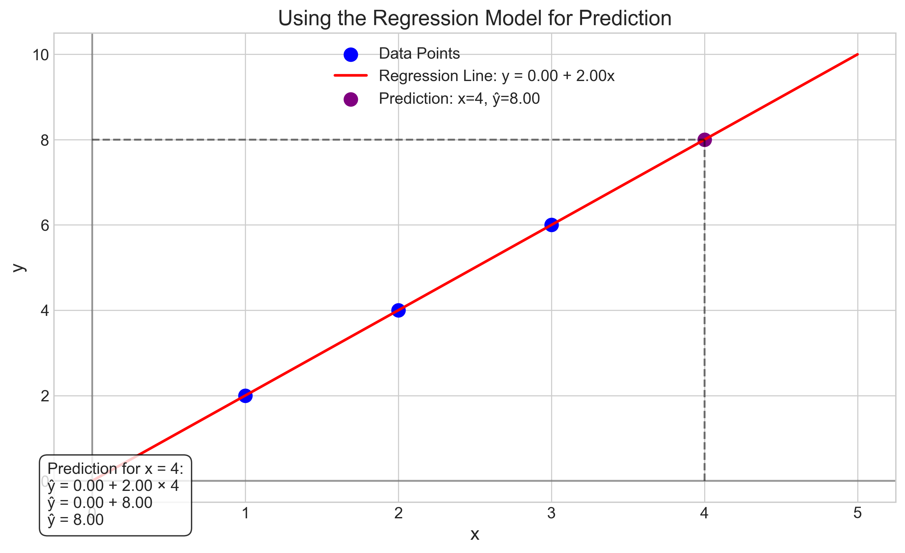

# Question 12: Simple Linear Regression Calculation

## Problem Statement
Given the sample data points (1, 2), (2, 4), and (3, 6):

### Task
1. Using only these three points, calculate the means $x̄$ and $ȳ$
2. Find the slope of the simple linear regression model by hand
3. Find the intercept of the model
4. Write down the resulting equation for predicting y from x

## Understanding the Problem
This problem tests our understanding of the fundamental calculations involved in simple linear regression. Given three data points, we need to manually determine the regression line by finding the slope and intercept. The regression line takes the form ŷ = β₀ + β₁x, where β₀ is the intercept and β₁ is the slope.

## Solution

### Step 1: Calculate the means x̄ and ȳ

First, we calculate the mean of the x-values:
$$\bar{x} = \frac{1 + 2 + 3}{3} = \frac{6}{3} = 2$$

Next, we calculate the mean of the y-values:
$$\bar{y} = \frac{2 + 4 + 6}{3} = \frac{12}{3} = 4$$

Therefore, the mean point is (x̄, ȳ) = (2, 4).

### Step 2: Find the slope of the simple linear regression model

The formula for the slope in simple linear regression is:

$$\beta_1 = \frac{\sum_{i=1}^{n}(x_i - \bar{x})(y_i - \bar{y})}{\sum_{i=1}^{n}(x_i - \bar{x})^2}$$

Let's calculate the numerator:
- For point (1, 2): (1 - 2)(2 - 4) = (-1)(-2) = 2
- For point (2, 4): (2 - 2)(4 - 4) = (0)(0) = 0
- For point (3, 6): (3 - 2)(6 - 4) = (1)(2) = 2
- Sum: 2 + 0 + 2 = 4

Now, let's calculate the denominator:
- For point (1, 2): (1 - 2)² = (-1)² = 1
- For point (2, 4): (2 - 2)² = (0)² = 0
- For point (3, 6): (3 - 2)² = (1)² = 1
- Sum: 1 + 0 + 1 = 2

Therefore, the slope is:
$$\beta_1 = \frac{4}{2} = 2$$

### Step 3: Find the intercept of the model

The formula for the intercept in simple linear regression is:

$$\beta_0 = \bar{y} - \beta_1 \bar{x}$$

Substituting our values:
$$\beta_0 = 4 - 2 \times 2 = 4 - 4 = 0$$

### Step 4: Write down the resulting equation for predicting y from x

With our calculated slope and intercept, the regression equation is:

$$\hat{y} = 0 + 2x = 2x$$

This means that for each unit increase in x, the predicted value of y increases by 2 units. Also, when x = 0, the predicted value of y is 0.

## Visual Explanations

### Regression Line and Data Points

This plot shows the three data points and the resulting regression line (y = 2x). The green "x" marks the mean point (2, 4), which the regression line passes through. This is a general property of simple linear regression - the line always passes through the point $(\bar{x}, \bar{y})$.

### Understanding the Slope Calculation

This visualization helps understand how the slope is calculated. The purple lines show the deviations of each y-value from the mean $\bar{y}$, while the orange lines show the deviations of each x-value from the mean $\bar{x}$. The slope formula essentially calculates how these deviations correlate with each other.

### Verification of Mean Point Property

This plot verifies that the regression line passes through the mean point (2, 4). We can confirm this by substituting x = 2 into our equation:
$$ŷ = 0 + 2 × 2 = 4 = ȳ$$

### Using the Model for Prediction

This visualization demonstrates how to use the regression model to make predictions. For example, if x = 4, the predicted y-value would be:
$$ŷ = 0 + 2 × 4 = 8$$

## Key Insights

### Mathematical Properties
- The least squares regression line always passes through the point $(\bar{x}, \bar{y})$.
- The slope β₁ represents the average change in the dependent variable (y) for each unit change in the independent variable (x).
- The intercept β₀ represents the predicted value of y when x = 0.
- In this special case, the intercept is exactly 0, which means our regression line passes through the origin (0, 0).

### Pattern Recognition
- The data points in this problem follow a perfect linear pattern (y = 2x), which is why our regression line fits the data perfectly.
- In real-world data, such perfect patterns are rare, and there would typically be some residual error.

### Conceptual Understanding
- The slope calculation can be understood as measuring how much the x and y variables co-vary, relative to the variance in x.
- When the points follow a perfect linear pattern (as in this case), the regression line will pass through all the data points, resulting in zero residuals.

## Conclusion
- We calculated the means: $\bar{x} = 2$ and $\bar{y} = 4$
- We found the slope: β₁ = 2
- We found the intercept: β₀ = 0
- The resulting regression equation is: ŷ = 2x

This example illustrates a perfect linear relationship between x and y, where y is exactly twice x. The regression line passes through all three data points as well as the origin, resulting in an equation that perfectly models the relationship between the variables. 