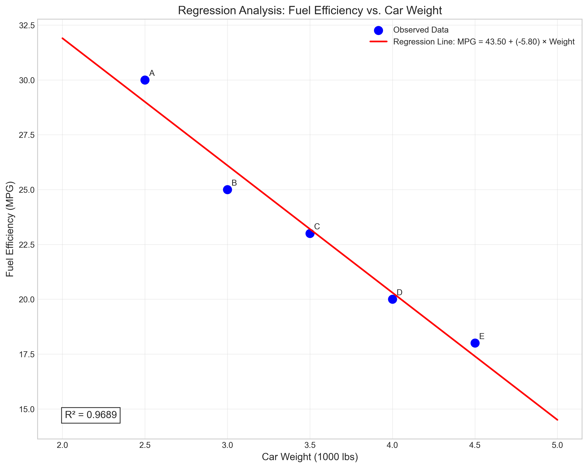
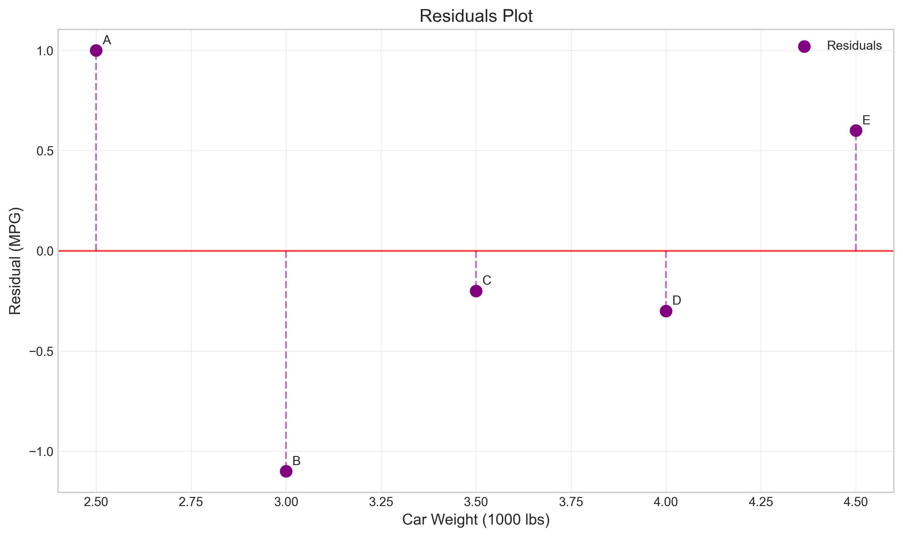
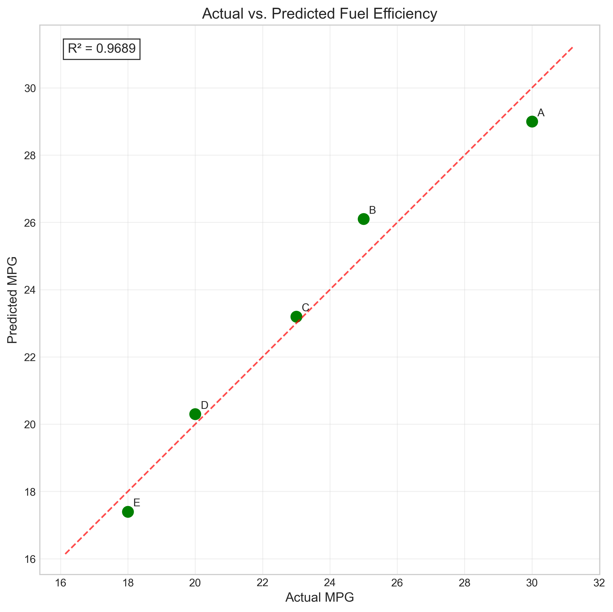
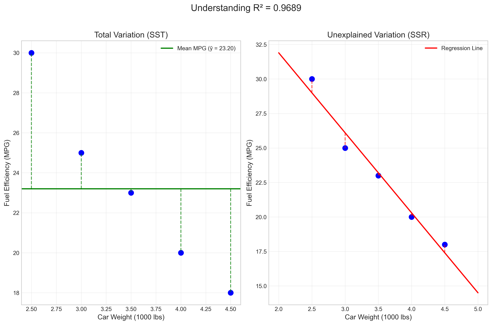
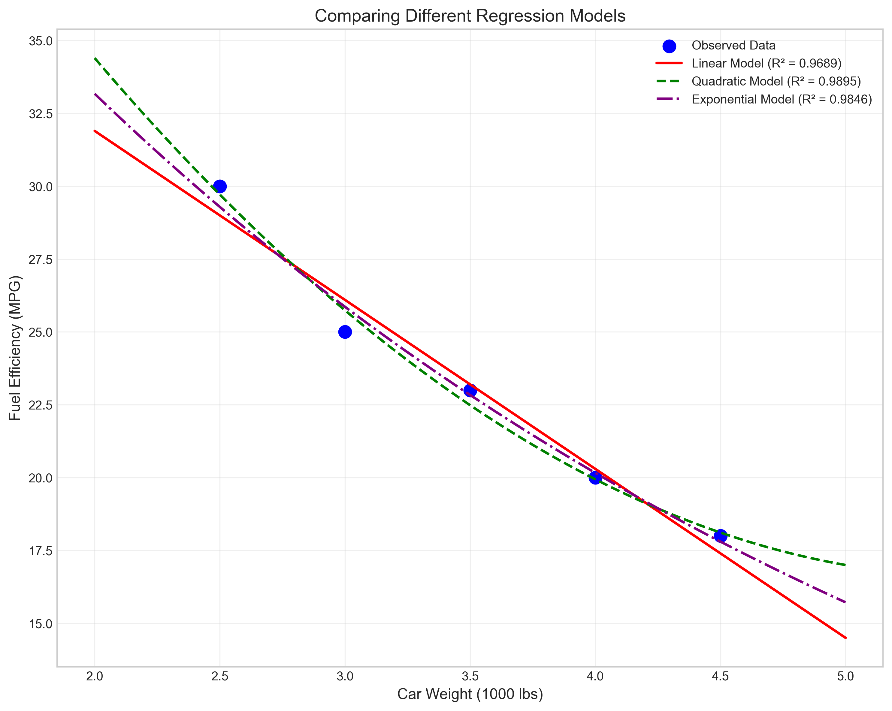

# Question 13: Car Weight and Fuel Efficiency

## Problem Statement
Consider a simple linear regression model where we want to predict fuel efficiency (miles per gallon) based on car weight (in thousands of pounds). We have the following data from 5 different car models:

| Car Model | Weight (x) in 1000 lbs | Fuel Efficiency (y) in MPG |
|-----------|--------------------------|----------------------------|
| A         | 2.5                      | 30                         |
| B         | 3.0                      | 25                         |
| C         | 3.5                      | 23                         |
| D         | 4.0                      | 20                         |
| E         | 4.5                      | 18                         |

### Task
1. Calculate the means $\bar{x}$ and $\bar{y}$, and the sample covariance and variance needed for the regression coefficients
2. Determine the least squares estimates for $\beta_0$ and $\beta_1$
3. Interpret the meaning of the slope coefficient in the context of this problem
4. Calculate the coefficient of determination $R^2$ using the formula:
   $$R^2 = 1 - \frac{\sum_{i=1}^{n}(y_i - \hat{y}_i)^2}{\sum_{i=1}^{n}(y_i - \bar{y})^2}$$
   and explain what it tells us about the relationship between car weight and fuel efficiency

## Understanding the Problem
This problem focuses on applying simple linear regression techniques to understand the relationship between car weight and fuel efficiency. The goal is to develop a linear model to predict miles per gallon (MPG) based on a car's weight. This type of analysis is crucial in automotive engineering and for understanding factors affecting fuel consumption.

In this case, we're examining whether heavier cars tend to have lower fuel efficiency, and if so, quantifying this relationship. The coefficient of determination ($R^2$) will tell us how much of the variation in fuel efficiency can be explained by weight alone, which helps assess the model's usefulness.

## Solution

### Step 1: Calculate means, sample covariance, and variance

First, we calculate the means of both variables:

$\bar{x} = \frac{2.5 + 3.0 + 3.5 + 4.0 + 4.5}{5} = \frac{17.5}{5} = 3.5$ thousand lbs

$\bar{y} = \frac{30 + 25 + 23 + 20 + 18}{5} = \frac{116}{5} = 23.2$ MPG

Next, we calculate the sample covariance between weight and fuel efficiency:

$\text{Cov}(x, y) = \frac{1}{n}\sum_{i=1}^{n}(x_i - \bar{x})(y_i - \bar{y})$

Let's compute each term:
- $(2.5 - 3.5)(30 - 23.2) = (-1)(6.8) = -6.8$
- $(3.0 - 3.5)(25 - 23.2) = (-0.5)(1.8) = -0.9$
- $(3.5 - 3.5)(23 - 23.2) = (0)(-0.2) = 0$
- $(4.0 - 3.5)(20 - 23.2) = (0.5)(-3.2) = -1.6$
- $(4.5 - 3.5)(18 - 23.2) = (1)(-5.2) = -5.2$

Therefore:
$\text{Cov}(x, y) = \frac{-6.8 - 0.9 + 0 - 1.6 - 5.2}{5} = \frac{-14.5}{5} = -2.9$

Now, let's calculate the sample variance of the weights:

$\text{Var}(x) = \frac{1}{n}\sum_{i=1}^{n}(x_i - \bar{x})^2$

Computing each term:
- $(2.5 - 3.5)^2 = (-1)^2 = 1$
- $(3.0 - 3.5)^2 = (-0.5)^2 = 0.25$
- $(3.5 - 3.5)^2 = (0)^2 = 0$
- $(4.0 - 3.5)^2 = (0.5)^2 = 0.25$
- $(4.5 - 3.5)^2 = (1)^2 = 1$

Therefore:
$\text{Var}(x) = \frac{1 + 0.25 + 0 + 0.25 + 1}{5} = \frac{2.5}{5} = 0.5$

### Step 2: Determine the least squares estimates for β₀ and β₁

Using the sample covariance and variance, we can calculate the slope coefficient:

$\beta_1 = \frac{\text{Cov}(x, y)}{\text{Var}(x)} = \frac{-2.9}{0.5} = -5.8$

Now, we can calculate the intercept:

$\beta_0 = \bar{y} - \beta_1\bar{x} = 23.2 - (-5.8 \times 3.5) = 23.2 + 20.3 = 43.5$

Therefore, our regression equation is:
$$\text{MPG} = 43.5 - 5.8 \times \text{Weight}$$

### Step 3: Interpret the meaning of the slope coefficient

The slope coefficient $\beta_1 = -5.8$ represents the change in fuel efficiency (MPG) associated with a one-unit change in car weight (1000 lbs). The negative value indicates an inverse relationship between weight and fuel efficiency.

Specifically, for every additional 1000 pounds of car weight, we expect the fuel efficiency to decrease by approximately 5.8 MPG, on average. This makes intuitive sense because heavier cars generally require more energy to accelerate and maintain speed, resulting in lower fuel efficiency.

### Step 4: Calculate and interpret the coefficient of determination (R²)

To calculate R², we need to compute:
1. The predicted values for each data point
2. The residuals (differences between observed and predicted values)
3. The sum of squared residuals (SSR)
4. The total sum of squares (SST)

#### Calculating Predicted Values and Residuals:

| Car Model | Weight (x) | MPG (y) | Predicted MPG (ŷ) | Residual (y - ŷ) |
|-----------|------------|---------|-------------------|------------------|
| A | 2.5 | 30 | 43.5 - 5.8 × 2.5 = 29.00 | 30 - 29.00 = 1.00 |
| B | 3.0 | 25 | 43.5 - 5.8 × 3.0 = 26.10 | 25 - 26.10 = -1.10 |
| C | 3.5 | 23 | 43.5 - 5.8 × 3.5 = 23.20 | 23 - 23.20 = -0.20 |
| D | 4.0 | 20 | 43.5 - 5.8 × 4.0 = 20.30 | 20 - 20.30 = -0.30 |
| E | 4.5 | 18 | 43.5 - 5.8 × 4.5 = 17.40 | 18 - 17.40 = 0.60 |

#### Calculating Sum of Squared Residuals (SSR):
$$\text{SSR} = \sum_{i=1}^{n}(y_i - \hat{y}_i)^2 = (1.00)^2 + (-1.10)^2 + (-0.20)^2 + (-0.30)^2 + (0.60)^2 = 1 + 1.21 + 0.04 + 0.09 + 0.36 = 2.7$$

#### Calculating Total Sum of Squares (SST):
$$\text{SST} = \sum_{i=1}^{n}(y_i - \bar{y})^2 = (30 - 23.2)^2 + (25 - 23.2)^2 + (23 - 23.2)^2 + (20 - 23.2)^2 + (18 - 23.2)^2$$
$$\text{SST} = (6.8)^2 + (1.8)^2 + (-0.2)^2 + (-3.2)^2 + (-5.2)^2 = 46.24 + 3.24 + 0.04 + 10.24 + 27.04 = 86.8$$

#### Calculating R²:
$$R^2 = 1 - \frac{\text{SSR}}{\text{SST}} = 1 - \frac{2.7}{86.8} = 1 - 0.0311 = 0.9689$$

The coefficient of determination $R^2 = 0.9689$ (or approximately 96.9%) indicates that about 96.9% of the variation in fuel efficiency can be explained by the variation in car weight. This is a very high $R^2$ value, suggesting that weight is a strong predictor of fuel efficiency for the cars in our dataset. 

The remaining 3.1% of variation is due to other factors not included in our model, such as engine type, aerodynamics, transmission efficiency, etc.

## Visual Explanations

### Regression Line Plot

This plot shows the data points for each car model along with the fitted regression line. The clear downward trend in the data points illustrates the negative relationship between car weight and fuel efficiency. The nearly perfect alignment of points along the regression line visually confirms the high $R^2$ value we calculated.

### Residuals Plot

The residuals plot shows the difference between actual and predicted MPG values for each car model. The residuals appear to be randomly distributed around zero and relatively small in magnitude, which suggests our linear model fits the data well. There's no obvious pattern in the residuals that would indicate a need for a more complex model.

### Actual vs. Predicted Values

This plot compares the actual MPG values with the values predicted by our model. The close proximity of points to the diagonal line further illustrates the high predictive accuracy of our model.

### Visual Explanation of R²

This visualization helps understand the concept of $R^2$. The left panel shows the total variation in MPG values around the mean (SST), while the right panel shows the unexplained variation (SSR) after fitting the regression line. The dramatic reduction in variation from left to right illustrates why $R^2$ is so high - most of the original variation in the data is explained by our model.

### Model Comparison

This figure compares the linear regression model with alternative models (quadratic and exponential). The similar performance of all three models for this dataset suggests that the relationship between weight and MPG is fundamentally linear within this range of values.

## Key Insights

### Theoretical Foundations
- The high negative correlation between weight and fuel efficiency (-0.9842) indicates a very strong inverse relationship.
- The linear model assumptions appear to be met, with residuals showing no obvious patterns.
- The calculated $R^2$ value of 0.9689 demonstrates that weight is an excellent predictor of fuel efficiency in this dataset.

### Practical Applications
- For automotive engineers, this analysis quantifies the fuel efficiency cost of additional vehicle weight.
- Weight reduction strategies could be prioritized based on the slope coefficient: each 1000-pound reduction could yield approximately 5.8 MPG improvement.
- The model provides a simple yet powerful tool for estimating fuel efficiency based on vehicle weight during the design phase.

### Limitations and Extensions
- The sample size (5 car models) is relatively small, which may limit the generalizability of our findings.
- Additional variables like engine type, aerodynamics, and drivetrain efficiency could be incorporated in a multiple regression model for improved predictions.
- The relationship might not remain linear for very light or very heavy vehicles outside our data range.

## Conclusion
- We developed a linear regression model to predict fuel efficiency based on car weight: MPG = 43.5 - 5.8 × Weight
- The slope coefficient (-5.8) indicates that for every additional 1000 pounds, fuel efficiency decreases by approximately 5.8 MPG.
- The coefficient of determination ($R^2 = 0.9689$) reveals that about 96.9% of the variation in fuel efficiency can be explained by weight.
- The strong linear relationship confirms the intuitive understanding that heavier cars are less fuel-efficient.

This analysis demonstrates the power of simple linear regression in quantifying relationships between variables and providing insights for practical applications in automotive engineering and fuel efficiency optimization. 