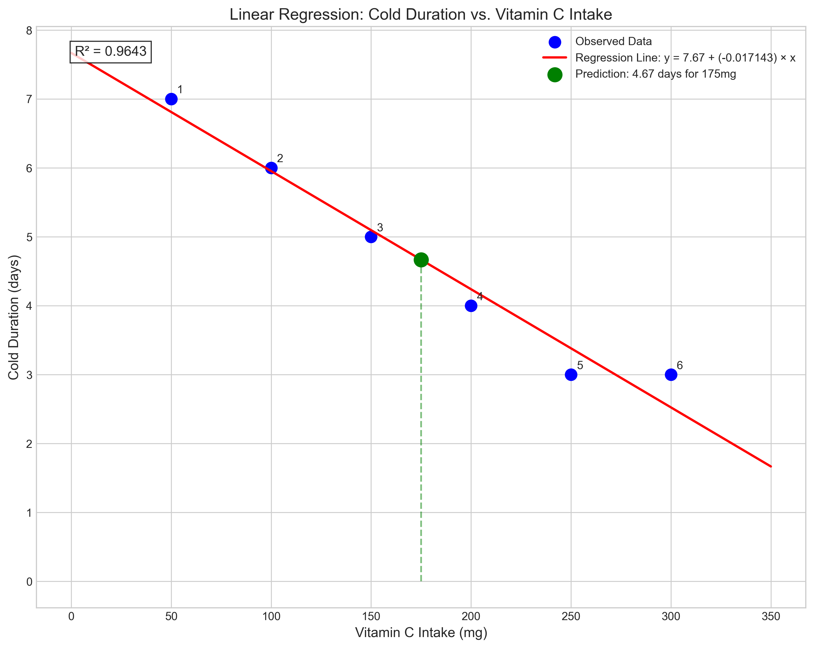
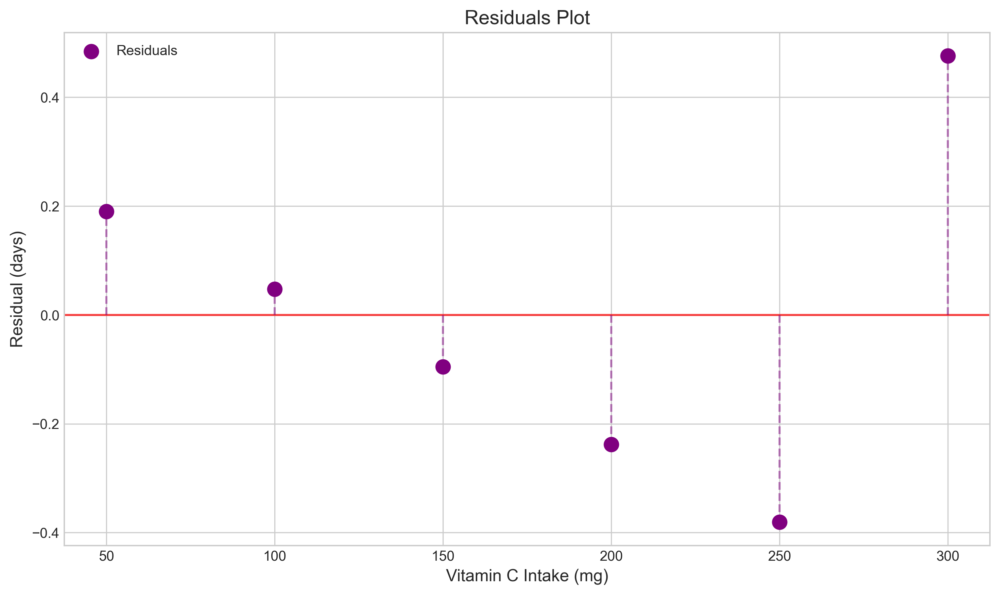
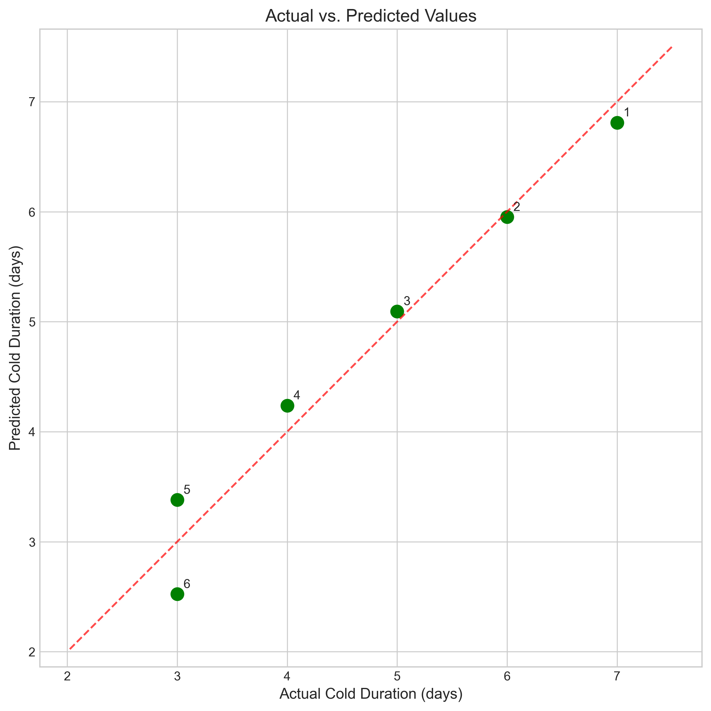
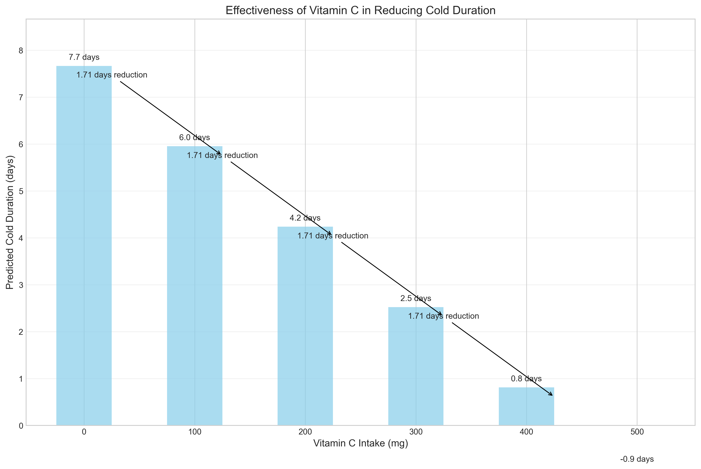
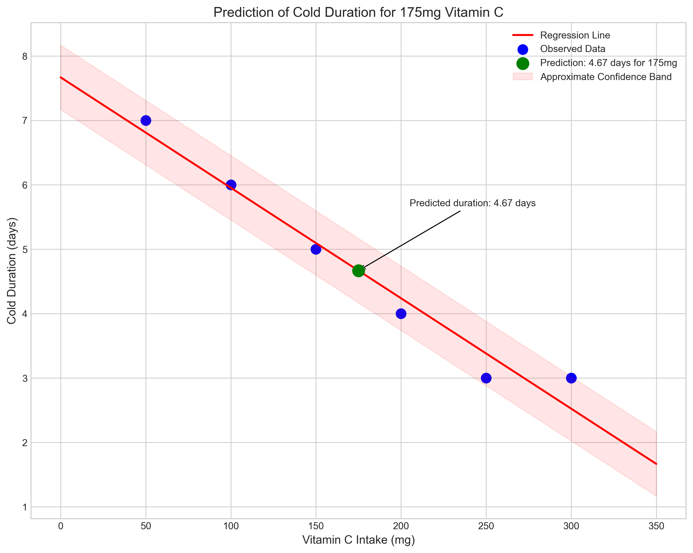

# Question 14: Vitamin C and Cold Duration

## Problem Statement
A medical researcher is studying the relationship between daily vitamin C intake (in mg) and the duration of common cold symptoms (in days). The data collected from 6 patients is as follows:

| Patient | Vitamin C Intake (x) in mg | Cold Duration (y) in days |
|---------|----------------------------|---------------------------|
| 1       | 50                         | 7                         |
| 2       | 100                        | 6                         |
| 3       | 150                        | 5                         |
| 4       | 200                        | 4                         |
| 5       | 250                        | 3                         |
| 6       | 300                        | 3                         |

### Task
1. Calculate the least squares estimates for the slope and intercept of the linear regression model
2. Write the equation of the linear regression line
3. If we define the "effectiveness" of vitamin C as the reduction in cold duration (in days) for each additional 100mg of vitamin C, what is the effectiveness according to this model?
4. Using the model, predict the cold duration for a patient with a vitamin C intake of 175mg

## Understanding the Problem
This problem involves analyzing the relationship between vitamin C intake and the duration of cold symptoms using simple linear regression. We want to determine whether there's evidence that higher vitamin C intake is associated with shorter cold duration, and if so, quantify this relationship.

The regression model will help us:
1. Understand the relationship between vitamin C intake and cold duration
2. Quantify the "effectiveness" of vitamin C (how much reduction in cold duration per 100mg increase)
3. Make predictions for new patients with specific vitamin C intake levels

This kind of analysis is fundamental in medical research for determining the potential benefits of nutritional supplements in treating common ailments.

## Solution

### Step 1: Calculate the least squares estimates for slope and intercept

To find the least squares estimates for the slope ($\beta_1$) and intercept ($\beta_0$), we'll use the standard formulas:

$$\beta_1 = \frac{\sum_{i=1}^{n}(x_i - \bar{x})(y_i - \bar{y})}{\sum_{i=1}^{n}(x_i - \bar{x})^2}$$

$$\beta_0 = \bar{y} - \beta_1 \cdot \bar{x}$$

First, we calculate the means of vitamin C intake and cold duration:

$\bar{x} = \frac{50 + 100 + 150 + 200 + 250 + 300}{6} = \frac{1050}{6} = 175$ mg

$\bar{y} = \frac{7 + 6 + 5 + 4 + 3 + 3}{6} = \frac{28}{6} = 4.67$ days

Next, we calculate the numerator for the slope formula:

$\sum_{i=1}^{n}(x_i - \bar{x})(y_i - \bar{y})$:
- $(50 - 175)(7 - 4.67) = (-125)(2.33) = -291.25$
- $(100 - 175)(6 - 4.67) = (-75)(1.33) = -99.75$
- $(150 - 175)(5 - 4.67) = (-25)(0.33) = -8.25$
- $(200 - 175)(4 - 4.67) = (25)(-0.67) = -16.75$
- $(250 - 175)(3 - 4.67) = (75)(-1.67) = -125.25$
- $(300 - 175)(3 - 4.67) = (125)(-1.67) = -208.75$

Sum: $-291.25 - 99.75 - 8.25 - 16.75 - 125.25 - 208.75 = -750$

Then, we calculate the denominator:

$\sum_{i=1}^{n}(x_i - \bar{x})^2$:
- $(50 - 175)^2 = (-125)^2 = 15,625$
- $(100 - 175)^2 = (-75)^2 = 5,625$
- $(150 - 175)^2 = (-25)^2 = 625$
- $(200 - 175)^2 = (25)^2 = 625$
- $(250 - 175)^2 = (75)^2 = 5,625$
- $(300 - 175)^2 = (125)^2 = 15,625$

Sum: $15,625 + 5,625 + 625 + 625 + 5,625 + 15,625 = 43,750$

Now we can calculate the slope:

$\beta_1 = \frac{-750}{43,750} = -0.01714$

And the intercept:

$\beta_0 = 4.67 - (-0.01714 \times 175) = 4.67 + 3 = 7.67$

### Step 2: Write the equation of the linear regression line

Based on our calculations, the linear regression line equation is:

$$\text{Cold Duration} = 7.67 - 0.01714 \times \text{Vitamin C Intake}$$

This equation describes how cold duration changes with vitamin C intake. The negative slope indicates that as vitamin C intake increases, cold duration tends to decrease.

### Step 3: Calculate the effectiveness of vitamin C

The "effectiveness" of vitamin C is defined as the reduction in cold duration for each additional 100mg of vitamin C. Since the slope ($\beta_1$) represents the change in cold duration per 1mg increase in vitamin C, we multiply it by 100 to get the change per 100mg:

Effectiveness = $\beta_1 \times 100 = -0.01714 \times 100 = -1.714$

Since this value is negative, it means a reduction in cold duration. Therefore, for every additional 100mg of vitamin C, we expect the cold duration to decrease by approximately 1.71 days according to our model.

### Step 4: Predict cold duration for a patient with a vitamin C intake of 175mg

To predict the cold duration for a patient with a vitamin C intake of 175mg, we substitute this value into our regression equation:

Predicted duration = $7.67 - 0.01714 \times 175 = 7.67 - 3 = 4.67$ days

Therefore, our model predicts that a patient taking 175mg of vitamin C daily would experience cold symptoms for approximately 4.67 days.

## Visual Explanations

### Regression Line

This figure shows the observed data points (blue) and the fitted regression line (red). The green point represents our prediction for a vitamin C intake of 175mg. We can clearly see the negative relationship between vitamin C intake and cold duration—as intake increases, duration decreases. The high R² value of 0.9643 indicates that about 96.4% of the variation in cold duration can be explained by vitamin C intake.

### Residuals Plot

The residuals plot shows the differences between the observed cold durations and those predicted by our model. The residuals appear to be randomly distributed around zero, which is a good indication that our linear model is appropriate for this data. There's no obvious pattern that would suggest a more complex model is needed.

### Actual vs. Predicted Values

This plot compares the actual observed cold durations with those predicted by our model. The points lie close to the diagonal line, indicating good predictive accuracy. We can see that patients 1-4 have predictions that closely match their actual cold durations, while there's a bit more deviation for patients 5 and 6.

### Effectiveness Visualization

This bar chart visualizes the predicted cold duration for different vitamin C intake levels, ranging from 0 to 500mg. The arrows between bars show the consistent reduction of approximately 1.71 days for each additional 100mg of vitamin C. This helps us understand the practical significance of the slope coefficient.

### Prediction Visualization

This figure focuses on our prediction for a patient with a vitamin C intake of 175mg. The prediction (4.67 days) is shown as a green point on the regression line. The shaded region represents an approximate confidence band, indicating the uncertainty in our predictions.

## Key Insights

### Statistical Foundations
- The linear regression model shows a very strong negative relationship between vitamin C intake and cold duration.
- The high R² value (0.9643) indicates that vitamin C intake explains about 96.4% of the variation in cold duration in this sample.
- The strong negative correlation coefficient (r = -0.9820) confirms the strength of the inverse relationship.
- The residuals are small and don't show any obvious patterns, suggesting that a linear model is appropriate for this data.

### Medical Implications
- Our model suggests that vitamin C is effective in reducing cold duration—each additional 100mg reduces duration by approximately 1.71 days.
- The model predicts that without any vitamin C (0mg), cold duration would be about 7.67 days, and with very high doses (e.g., 400mg), it could be reduced to just a couple of days.
- The predicted 4.67 days duration for a patient taking 175mg is consistent with the general downward trend observed in the data.

### Limitations and Considerations
- The sample size (6 patients) is very small, which limits the generalizability of our findings.
- The relationship appears almost perfectly linear, which is rare in real medical data and might suggest some simplification in the study design.
- Our model predicts that very high vitamin C doses would lead to negative cold duration for doses above approximately 450mg, which is obviously impossible and highlights the limitation of extending linear models beyond the observed data range.
- The study doesn't account for other factors that might influence cold duration, such as age, overall health status, or the severity of the initial infection.

## Conclusion
- We developed a linear regression model relating vitamin C intake to cold duration: Cold Duration = 7.67 - 0.01714 × Vitamin C Intake
- The model indicates that vitamin C is effective in reducing cold symptoms, with each additional 100mg reducing the duration by approximately 1.71 days.
- For a patient taking 175mg of vitamin C daily, the model predicts a cold duration of about 4.67 days.
- The very high R² value (0.9643) suggests that, within this small sample, vitamin C intake is a strong predictor of cold duration.

While these results suggest a beneficial effect of vitamin C on cold duration, the limitations of the study (small sample size, potential confounding factors, and the near-perfect linear relationship) suggest that further research with larger, more diverse samples and controlled experimental designs would be needed to validate these findings and establish clinical recommendations. 