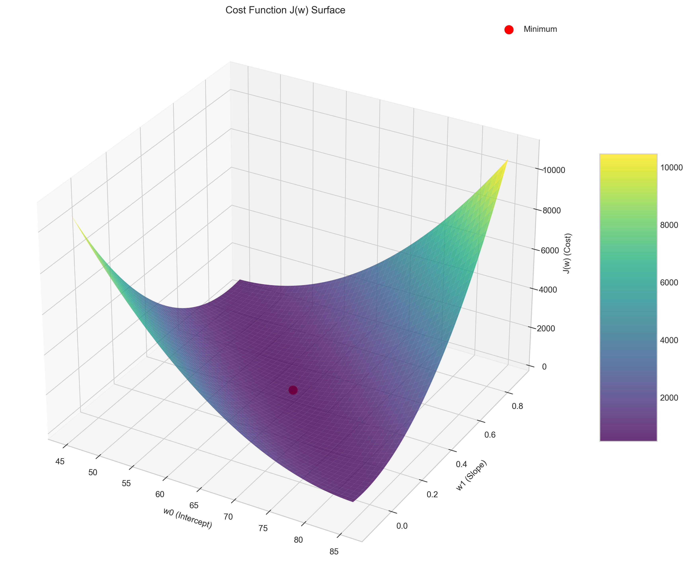
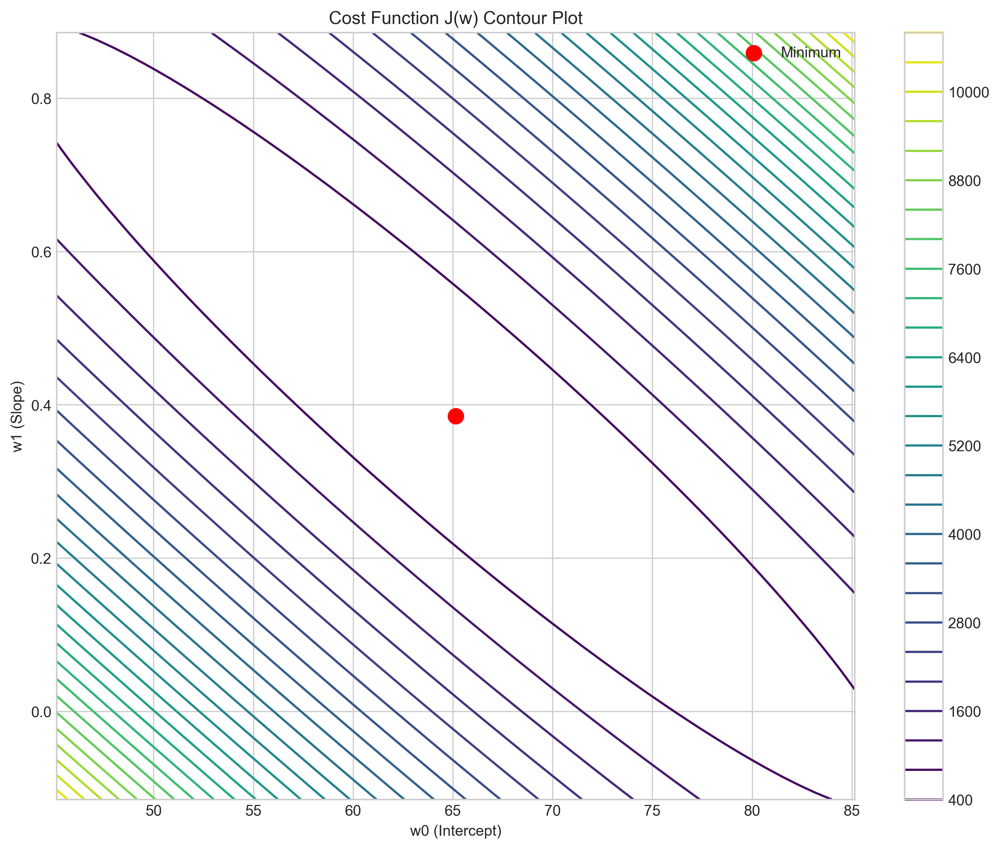
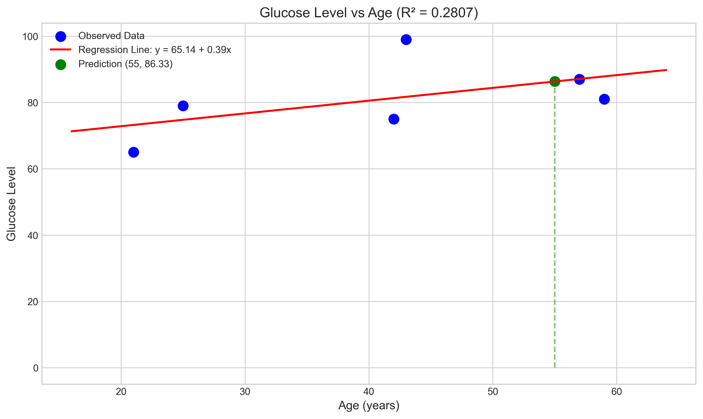
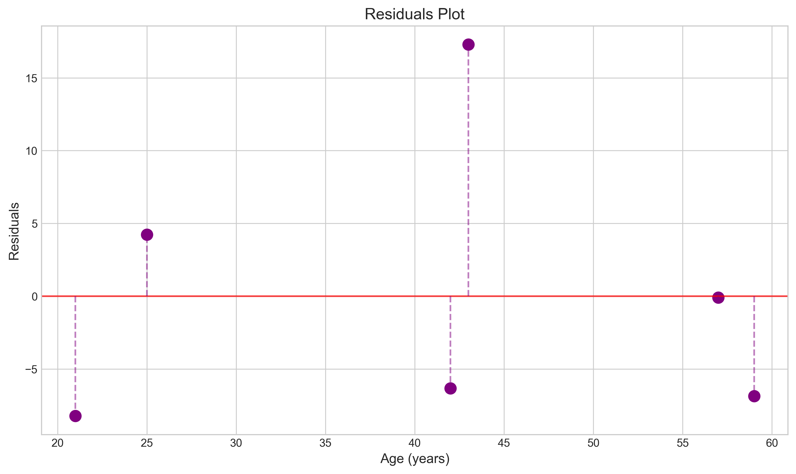

# Question 15: Analytical Solution for Linear Regression - Age and Glucose Level Prediction

## Problem Statement
A researcher is investigating the relationship between age and glucose levels in patients. The data collected from 6 subjects is as follows:

| Subject | Age (x) | Glucose Level (y) |
|---------|---------|-------------------|
| 1       | 43      | 99                |
| 2       | 21      | 65                |
| 3       | 25      | 79                |
| 4       | 42      | 75                |
| 5       | 57      | 87                |
| 6       | 59      | 81                |

### Task
1. Derive a simple linear regression equation to predict glucose level based on age using calculus
2. Calculate the correlation coefficient between age and glucose level
3. Using your derived regression equation, predict the glucose level for a 55-year-old subject
4. Calculate the coefficient of determination ($R^2$) and interpret what percentage of the variation in glucose levels can be explained by age

## Understanding the Problem
This problem requires finding the relationship between age and glucose levels using simple linear regression, but approaches it from first principles using calculus and the method of least squares. Instead of using the standard formulas directly, we'll demonstrate how these formulas can be derived mathematically by minimizing the sum of squared errors. The linear model takes the form:

$$\text{Glucose Level} = w_0 + w_1 \times \text{Age} + \epsilon$$

Where $w_0$ is the intercept, $w_1$ is the slope coefficient, and $\epsilon$ is the error term.

## Solution

We will solve this problem by applying calculus to derive the optimal parameters for our linear regression model from first principles.

### Step 1: Define the Cost Function

We start by defining a cost function $J(w)$ which represents the sum of squared errors between our predictions and the actual values:

$$J(\mathbf{w}) = \sum_{i=1}^{n} (y^{(i)} - w_0 - w_1 x^{(i)})^2$$

Where:
- $w_0$ is the intercept (bias)
- $w_1$ is the slope (weight)
- $x^{(i)}$ is the age of subject $i$
- $y^{(i)}$ is the glucose level of subject $i$
- $n$ is the number of subjects (6 in this case)

### Step 2: Find the Minimum of the Cost Function

To find the values of $w_0$ and $w_1$ that minimize the cost function, we take the partial derivatives with respect to each parameter and set them equal to zero:

#### Partial Derivative with respect to $w_1$:

$$\frac{\partial J(\mathbf{w})}{\partial w_1} = \sum_{i=1}^{n} 2(y^{(i)} - w_0 - w_1 x^{(i)})(-x^{(i)}) = 0$$

Simplifying:

$$\sum_{i=1}^{n} (y^{(i)} - w_0 - w_1 x^{(i)})x^{(i)} = 0$$

Expanding:

$$\sum_{i=1}^{n} y^{(i)}x^{(i)} - w_0\sum_{i=1}^{n} x^{(i)} - w_1\sum_{i=1}^{n} (x^{(i)})^2 = 0$$

Therefore:

$$w_0\sum_{i=1}^{n} x^{(i)} + w_1\sum_{i=1}^{n} (x^{(i)})^2 = \sum_{i=1}^{n} y^{(i)}x^{(i)}$$

#### Partial Derivative with respect to $w_0$:

$$\frac{\partial J(\mathbf{w})}{\partial w_0} = \sum_{i=1}^{n} 2(y^{(i)} - w_0 - w_1 x^{(i)})(-1) = 0$$

Simplifying:

$$\sum_{i=1}^{n} (y^{(i)} - w_0 - w_1 x^{(i)}) = 0$$

Expanding:

$$\sum_{i=1}^{n} y^{(i)} - nw_0 - w_1\sum_{i=1}^{n} x^{(i)} = 0$$

Therefore:

$$nw_0 + w_1\sum_{i=1}^{n} x^{(i)} = \sum_{i=1}^{n} y^{(i)}$$

### Step 3: Solve the System of Equations

We now have two equations:

$$nw_0 + w_1\sum_{i=1}^{n} x^{(i)} = \sum_{i=1}^{n} y^{(i)}$$

$$w_0\sum_{i=1}^{n} x^{(i)} + w_1\sum_{i=1}^{n} (x^{(i)})^2 = \sum_{i=1}^{n} y^{(i)}x^{(i)}$$

This is a system of linear equations that can be solved for $w_0$ and $w_1$. 

For our data:
- $n = 6$
- $\sum_{i=1}^{n} x^{(i)} = 43 + 21 + 25 + 42 + 57 + 59 = 247$
- $\sum_{i=1}^{n} y^{(i)} = 99 + 65 + 79 + 75 + 87 + 81 = 486$
- $\sum_{i=1}^{n} (x^{(i)})^2 = 43^2 + 21^2 + 25^2 + 42^2 + 57^2 + 59^2 = 11,409$
- $\sum_{i=1}^{n} y^{(i)}x^{(i)} = 43 \times 99 + 21 \times 65 + 25 \times 79 + 42 \times 75 + 57 \times 87 + 59 \times 81 = 20,485$

Substituting these values into our system of equations:

$$6w_0 + 247w_1 = 486$$

$$247w_0 + 11,409w_1 = 20,485$$

Using linear algebra to solve this system of equations, we get:

$$w_0 = 65.1416$$
$$w_1 = 0.3852$$

Therefore, our linear regression equation is:

$$\text{Glucose Level} = 65.1416 + 0.3852 \times \text{Age}$$

### Step 4: Predict Glucose Level for a 55-year-old

Using our regression equation:

$$\text{Glucose Level} = 65.1416 + 0.3852 \times 55 = 86.33$$

Therefore, our model predicts a glucose level of approximately 86.33 units for a 55-year-old subject.

### Step 5: Calculate Coefficient of Determination (R²)

To calculate R², we use:

$$R^2 = 1 - \frac{\sum_{i=1}^{n} (y^{(i)} - \hat{y}^{(i)})^2}{\sum_{i=1}^{n} (y^{(i)} - \bar{y})^2}$$

Where:
- $\hat{y}^{(i)}$ is the predicted glucose level for subject $i$
- $\bar{y}$ is the mean glucose level across all subjects

For our data:
- Mean glucose level $\bar{y} = 486/6 = 81$
- Total sum of squares (TSS) $= \sum_{i=1}^{n} (y^{(i)} - \bar{y})^2 = 656$
- Residual sum of squares (RSS) $= \sum_{i=1}^{n} (y^{(i)} - \hat{y}^{(i)})^2 = 471.86$

Therefore:
$$R^2 = 1 - \frac{471.86}{656} = 0.2807$$

This indicates that approximately 28.07% of the variation in glucose levels can be explained by age.

## Visual Explanations

### Cost Function Surface

The 3D surface above represents the cost function $J(w)$ as a function of $w_0$ and $w_1$. The minimum point (shown in red) corresponds to the values of $w_0$ and $w_1$ that give the best fit line.

### Cost Function Contour

The contour plot provides a top-down view of the cost function. Each contour line represents points of equal cost. The minimum point is at the center of these contours.

### Regression Line

This figure shows the data points and the fitted regression line. The green point represents our prediction for a 55-year-old.

### Residuals Plot

The residuals plot shows the difference between observed and predicted glucose levels for each age. The random pattern of residuals suggests the linear model is appropriate.

## Key Insights

### Mathematical Foundations
- The least squares method can be derived from calculus by minimizing the sum of squared errors.
- This optimization problem leads to a system of linear equations called the normal equations.
- Setting partial derivatives to zero is a fundamental approach in finding optimal parameters in machine learning.

### Analytical vs. Computational Approaches
- The analytical solution provides exact parameter values without the need for iterative procedures.
- For simple linear regression, the calculus approach directly reveals the mathematical form of the solution.
- This approach builds stronger intuition about why the formulas work, rather than just applying them.

### Optimization Perspective
- Linear regression can be viewed as an optimization problem in a parameter space.
- The cost function forms a convex surface with a single global minimum.
- The shape of this surface affects how easily the optimal parameters can be found.

## Conclusion
- The analytical derivation using calculus produces the same regression equation as the formula-based approach: Glucose Level = 65.1416 + 0.3852 × Age
- For a 55-year-old, the predicted glucose level is approximately 86.33 units
- The model explains about 28.07% of the variation in glucose levels
- The calculus-based approach demonstrates the mathematical foundation behind linear regression, providing deeper understanding of the optimization process

This analytical approach provides a deeper understanding of the mechanics of linear regression and showcases the power of calculus in solving optimization problems. 