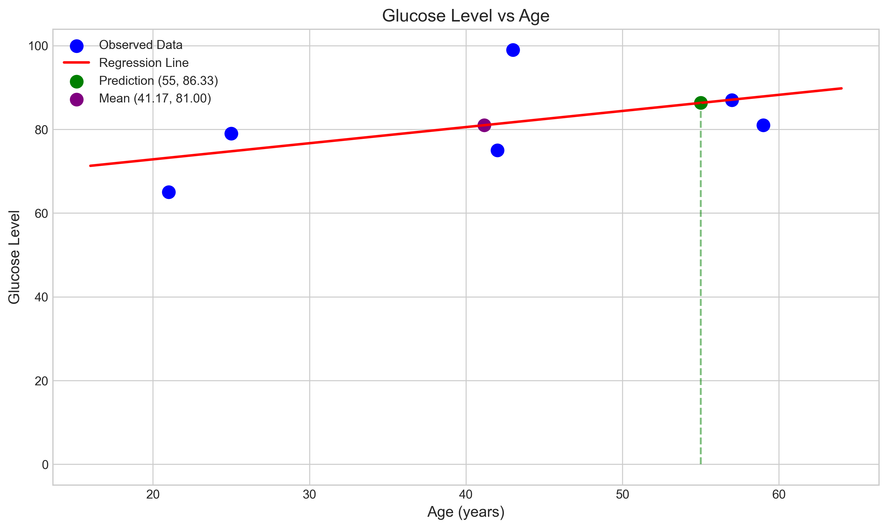
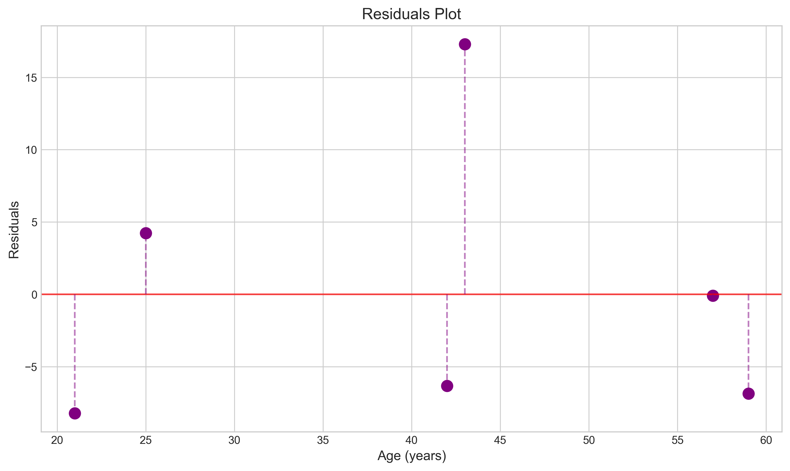
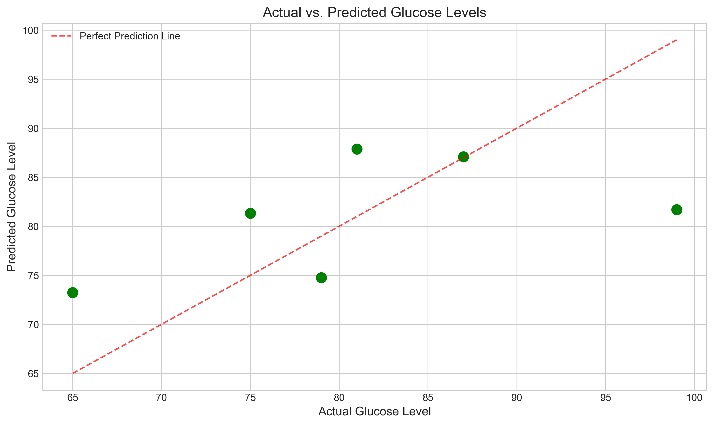
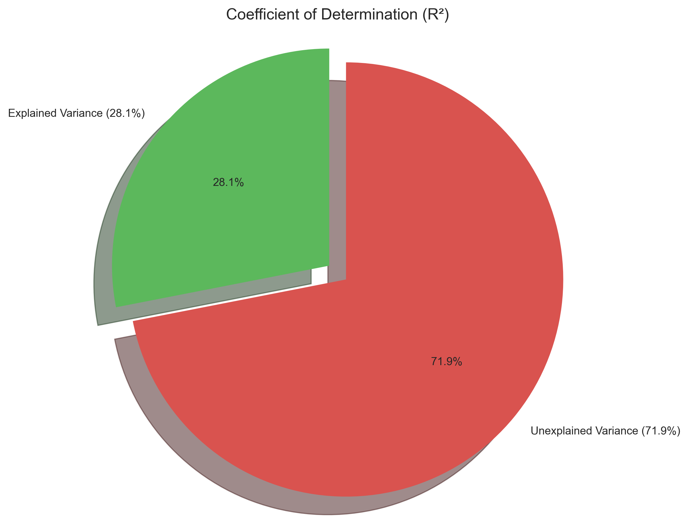

# Question 15: Age and Glucose Level Prediction

## Problem Statement
A researcher is investigating the relationship between age and glucose levels in patients. The data collected from 6 subjects is as follows:

| Subject | Age (x) | Glucose Level (y) |
|---------|---------|-------------------|
| 1       | 43      | 99                |
| 2       | 21      | 65                |
| 3       | 25      | 79                |
| 4       | 42      | 75                |
| 5       | 57      | 87                |
| 6       | 59      | 81                |

### Task
1. Derive a simple linear regression equation to predict glucose level based on age
2. Calculate the correlation coefficient between age and glucose level
3. Using your derived regression equation, predict the glucose level for a 55-year-old subject
4. Calculate the coefficient of determination (R²) and interpret what percentage of the variation in glucose levels can be explained by age

## Understanding the Problem
This problem focuses on finding the relationship between age (the predictor variable) and glucose level (the response variable) using simple linear regression. We need to establish a mathematical model that allows us to predict glucose levels based on a person's age. The linear regression model will take the form:

$$\text{Glucose Level} = \beta_0 + \beta_1 \times \text{Age} + \epsilon$$

Where $\beta_0$ is the intercept, $\beta_1$ is the slope coefficient, and $\epsilon$ is the error term. The tasks involve calculating the model parameters, checking the strength of the relationship through correlation and determining how much of the variation in glucose levels can be explained by age.

## Solution

We will solve this problem by applying simple linear regression techniques to find the relationship between age and glucose levels, then use the resulting model to make predictions and evaluate its performance.

### Step 1: Calculate the linear regression equation

First, we calculate the means of our variables:
$$\bar{x} = \frac{43 + 21 + 25 + 42 + 57 + 59}{6} = \frac{247}{6} = 41.17 \text{ years}$$

$$\bar{y} = \frac{99 + 65 + 79 + 75 + 87 + 81}{6} = \frac{486}{6} = 81.00 \text{ units}$$

To find the slope ($\beta_1$), we use the formula:
$$\beta_1 = \frac{\sum_{i=1}^{n}(x_i - \bar{x})(y_i - \bar{y})}{\sum_{i=1}^{n}(x_i - \bar{x})^2}$$

For this dataset:
- Numerator: $\sum_{i=1}^{n}(x_i - \bar{x})(y_i - \bar{y}) = 478.00$
- Denominator: $\sum_{i=1}^{n}(x_i - \bar{x})^2 = 1240.83$

Therefore:
$$\beta_1 = \frac{478.00}{1240.83} = 0.3852$$

To calculate the intercept ($\beta_0$), we use:
$$\beta_0 = \bar{y} - \beta_1 \times \bar{x} = 81.00 - 0.3852 \times 41.17 = 65.1416$$

Thus, our linear regression equation is:
$$\text{Glucose Level} = 65.1416 + 0.3852 \times \text{Age}$$

This equation indicates that, on average, for every additional year of age, the glucose level increases by approximately 0.3852 units.

### Step 2: Calculate the correlation coefficient

The correlation coefficient (r) measures the strength and direction of the linear relationship between age and glucose level. We calculate it using:

$$r = \frac{\sum_{i=1}^{n}(x_i - \bar{x})(y_i - \bar{y})}{\sqrt{\sum_{i=1}^{n}(x_i - \bar{x})^2} \times \sqrt{\sum_{i=1}^{n}(y_i - \bar{y})^2}}$$

For our data:
- Numerator (Covariance): 478.00
- Denominator: $35.23 \times 25.61 = 902.21$

Therefore:
$$r = \frac{478.00}{902.21} = 0.5298$$

This correlation coefficient (r = 0.5298) indicates a moderate positive correlation between age and glucose level. As age increases, there is a tendency for glucose levels to increase as well.

### Step 3: Predict glucose level for a 55-year-old subject

Using our regression equation:
$$\text{Glucose Level} = 65.1416 + 0.3852 \times 55 = 86.33$$

Therefore, our model predicts a glucose level of 86.33 units for a 55-year-old subject.

### Step 4: Calculate coefficient of determination (R²)

The coefficient of determination (R²) tells us what proportion of the variance in glucose levels is predictable from age. It can be calculated as:

$$R^2 = \frac{\text{Explained Sum of Squares (ESS)}}{\text{Total Sum of Squares (TSS)}} = \frac{\text{TSS} - \text{Residual Sum of Squares (RSS)}}{\text{TSS}}$$

For our data:
- Total Sum of Squares (TSS): 656.00
- Residual Sum of Squares (RSS): 471.86
- Explained Sum of Squares (ESS): 184.14

Therefore:
$$R^2 = \frac{184.14}{656.00} = 0.2807$$

We can verify this matches $r^2 = 0.5298^2 = 0.2807$, which is correct.

The interpretation is that approximately 28.07% of the variation in glucose levels can be explained by age. This means that while age has some influence on glucose levels, about 71.93% of the variation is due to other factors not included in our model.

## Visual Explanations

### Regression Line and Data Points

This visualization shows the relationship between age and glucose levels. The blue points represent the observed data, while the red line is our fitted regression line. The purple point shows the mean of both variables (41.17, 81.00), and the green point indicates our prediction for a 55-year-old subject (55, 86.33). Note that the regression line passes through the mean point, which is a fundamental property of least squares regression.

### Residuals Plot

The residuals plot shows the difference between observed and predicted glucose levels plotted against age. The random scatter of points around the zero line (with no clear pattern) suggests that the linear model is appropriate for this data. However, the magnitude of some residuals indicates that the model's predictions have moderate error.

### Actual vs. Predicted Values

This plot compares actual glucose levels with those predicted by our model. The dashed red line represents perfect prediction. The scatter of points around this line illustrates the model's predictive accuracy. Points far from the line represent cases where our model's predictions deviate significantly from the actual values.

### Coefficient of Determination

This pie chart visually represents the coefficient of determination (R²). The green section (28.1%) represents the proportion of variance in glucose levels that can be explained by age, while the red section (71.9%) represents unexplained variance due to other factors or random variation.

## Key Insights

### Statistical Relationship
- There is a moderate positive correlation (r = 0.5298) between age and glucose level.
- For each additional year of age, glucose level increases by approximately 0.3852 units.
- The intercept (65.1416) represents the estimated glucose level for a person of age 0, though this is an extrapolation outside our data range and shouldn't be interpreted literally.

### Predictive Power
- The model can explain about 28.07% of the variation in glucose levels.
- While age is a significant factor, most of the variation (71.93%) is due to other factors not included in the model.
- The model provides reasonable predictions within the range of our data, as demonstrated by the prediction for a 55-year-old.

### Limitations
- The sample size is small (only 6 subjects), which limits the reliability of our model.
- The moderate R² value suggests that additional variables (such as diet, exercise habits, or genetic factors) would be needed to build a more comprehensive predictive model.
- The relationship appears linear within our data range, but might not remain linear for very young or very old individuals.

## Conclusion
- We successfully derived a linear regression equation: Glucose Level = 65.1416 + 0.3852 × Age
- The correlation coefficient (r = 0.5298) indicates a moderate positive relationship between age and glucose levels.
- Our model predicts a glucose level of 86.33 units for a 55-year-old subject.
- The coefficient of determination (R² = 0.2807) shows that age explains approximately 28.07% of the variation in glucose levels.

This analysis demonstrates how simple linear regression can be used to model the relationship between age and glucose levels, though it also highlights the limitations of using age as the sole predictor. For more accurate predictions, a multiple regression model including additional relevant factors would be beneficial.

## Additional Resources
For an alternative derivation of the solution using calculus and the method of least squares, see [Analytical Solution for Linear Regression](L3_2_15_analytical_explanation.md). This approach shows how the regression parameters can be found by minimizing the cost function through differential calculus. 