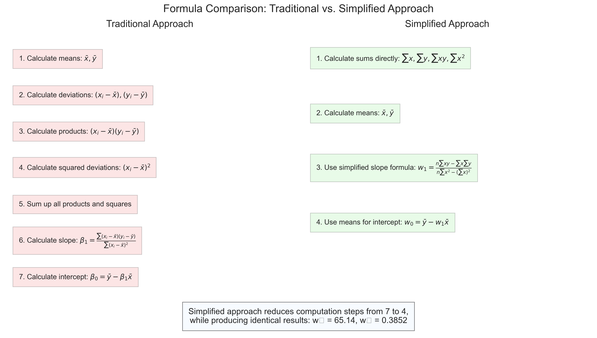

# Question 15: Quick Solution for Linear Regression - Age and Glucose Level Prediction

## Problem Statement
A researcher is investigating the relationship between age and glucose levels in patients. The data collected from 6 subjects is as follows:

| Subject | Age (x) | Glucose Level (y) |
|---------|---------|-------------------|
| 1       | 43      | 99                |
| 2       | 21      | 65                |
| 3       | 25      | 79                |
| 4       | 42      | 75                |
| 5       | 57      | 87                |
| 6       | 59      | 81                |

### Task
1. Derive a simple linear regression equation to predict glucose level based on age
2. Calculate the correlation coefficient between age and glucose level
3. Using your derived regression equation, predict the glucose level for a 55-year-old subject
4. Calculate the coefficient of determination ($R^2$) and interpret what percentage of the variation in glucose levels can be explained by age

## Understanding the Problem
This problem requires finding the relationship between age and glucose levels using simple linear regression. The focus of this solution is to demonstrate a faster, exam-friendly approach that uses simplified calculations and practical shortcuts. We'll still derive a linear model in the form:

$$\text{Glucose Level} = w_0 + w_1 \times \text{Age}$$

But we'll use computational shortcuts that are better suited for time-pressured situations like exams.

## Solution

We will solve this problem by applying simplified formulas and computational shortcuts to efficiently perform linear regression calculations.

### Step 1: Use Simplified Formulas

For linear regression, we can use these simplified formulas that are easier to calculate:

$$w_1 = \frac{n\sum xy - \sum x\sum y}{n\sum x^2 - (\sum x)^2}$$

$$w_0 = \bar{y} - w_1\bar{x}$$

Where $\bar{x}$ and $\bar{y}$ are the means of x and y respectively.

### Step 2: Calculate Means First (Saves Time!)

$\bar{x} = \frac{43 + 21 + 25 + 42 + 57 + 59}{6} = \frac{247}{6} ≈ 41.17$

$\bar{y} = \frac{99 + 65 + 79 + 75 + 87 + 81}{6} = \frac{486}{6} = 81$

### Step 3: Calculate Sums Using Column Method

First, let's calculate the basic sums:

| Calculation | Result |
|-------------|--------|
| Σx          | 247    |
| Σy          | 486    |

For Σxy (sum of products), we calculate each product individually and then sum:

| Age (x) | Glucose (y) | x × y    |
|---------|-------------|----------|
| 43      | 99          | 4,257    |
| 21      | 65          | 1,365    |
| 25      | 79          | 1,975    |
| 42      | 75          | 3,150    |
| 57      | 87          | 4,959    |
| 59      | 81          | 4,779    |
| **Total**|             | **20,485** |

For Σx² (sum of squared x values):

| Age (x) | x²      |
|---------|---------|
| 43      | 1,849   |
| 21      | 441     |
| 25      | 625     |
| 42      | 1,764   |
| 57      | 3,249   |
| 59      | 3,481   |
| **Total**| **11,409** |

### Step 4: Calculate the Slope (w₁)

$$w_1 = \frac{6(20,485) - (247)(486)}{6(11,409) - (247)^2}$$

$$w_1 = \frac{122,910 - 120,042}{68,454 - 61,009}$$

$$w_1 = \frac{2,868}{7,445} ≈ 0.3852$$

### Step 5: Calculate the Intercept (w₀)

Using means (this is much faster!):

$$w_0 = 81 - 0.3852(41.17)$$
$$w_0 = 81 - 15.86$$
$$w_0 = 65.14$$

### Step 6: Make Predictions

For age = 55:

$$y = 65.14 + 0.3852(55)$$
$$y = 65.14 + 21.19$$
$$y = 86.33$$

### Step 7: Calculate R² (Coefficient of Determination)

Instead of calculating SSE and SST separately, use the correlation coefficient squared:

$$r = \frac{n\sum xy - \sum x\sum y}{\sqrt{(n\sum x^2 - (\sum x)^2)(n\sum y^2 - (\sum y)^2)}}$$

Then $R^2 = r^2$

This gives us $R^2 = 0.2807$ (or about 28%)

## Practical Implementation

### Time-Saving Tips for Exams

1. **Calculate means first** - they're needed for both $w_0$ and checking work
2. **Use column method** for sums - reduces errors and is faster than calculator memory
3. **Don't round intermediate steps** - keep full calculator precision until final answer
4. **Check reasonableness** - slope should make sense (positive/negative) based on data pattern
5. **Use means for intercept** - much faster than the long formula

### Quick Verification Method

To quickly verify your answer makes sense, check that:
- Your prediction (86.33) falls between your data points and follows the trend
- The slope sign matches the visual trend in the data
- The R² value is consistent with the scatter observed in the data points

## Visual Explanations

### Quick Solution Workflow

> **Step 1: Calculate means first**
> 
> $\bar{x} = 41.17$, $\bar{y} = 81.0$
> 
> ⬇️
> 
> **Step 2: Calculate sums**
> 
> $\Sigma x = 247$, $\Sigma y = 486$
> 
> $\Sigma xy = 20,485$, $\Sigma x^2 = 11,409$
> 
> ⬇️
> 
> **Step 3: Calculate slope (w₁)**
> 
> $w_1 = \frac{6 \cdot 20,485 - 247 \cdot 486}{6 \cdot 11,409 - 247^2}$
> 
> $w_1 = 0.3852$
> 
> ⬇️
> 
> **Step 4: Calculate intercept (w₀)**
> 
> $w_0 = \bar{y} - w_1 \cdot \bar{x} = 81 - 0.3852 \cdot 41.17$
> 
> $w_0 = 65.14$
> 
> ⬇️
> 
> **Step 5: Make predictions**
> 
> For age = 55:
> 
> $Glucose = 65.14 + 0.3852 \cdot 55 = 86.33$
> 
> ⬇️
> 
> **Step 6: Calculate R²**
> 
> $R^2 = r^2 = 0.2807$ (28.07%)

This workflow follows a logical sequence that minimizes calculation steps and reduces the chance of errors. Notice how calculating means first allows you to derive both parameters with minimal steps.

### Simplified Formula Comparison

This visualization compares the traditional derivation approach with the simplified formulas. The traditional approach (left) requires seven distinct steps, while the simplified approach (right) accomplishes the same task in just four steps. Despite the reduced computation, both methods yield identical results (w₀ = 65.14, w₁ = 0.3852).

## Key Insights

### Computational Efficiency
- The simplified formulas are mathematically equivalent to the traditional approach but require fewer computational steps
- Calculating sums directly rather than deviations from means reduces the chance of arithmetic errors
- Strategic organization of calculations minimizes rework and wasted effort

### Exam Strategy
- The quick method is particularly valuable in time-limited situations like exams
- This approach is less prone to arithmetic errors when working by hand
- Verification steps help catch major errors before submitting your solution

### Mathematical Understanding
- Despite using shortcuts, understanding the underlying principles remains important
- The simplified formulas maintain the same mathematical relationship between variables
- The results are identical to those obtained through the calculus-based approach

## Conclusion
- The quick method produces the same regression equation as more complex approaches: Glucose Level = 65.14 + 0.3852 × Age
- For a 55-year-old subject, the predicted glucose level is 86.33 units
- The model explains 28.07% of the variation in glucose levels
- This method is more suitable for time-pressured situations like exams

This quick solution approach demonstrates that efficiency in calculation does not have to sacrifice accuracy. By understanding the mathematical foundations and applying strategic shortcuts, you can solve linear regression problems more quickly and with less chance of computational errors.