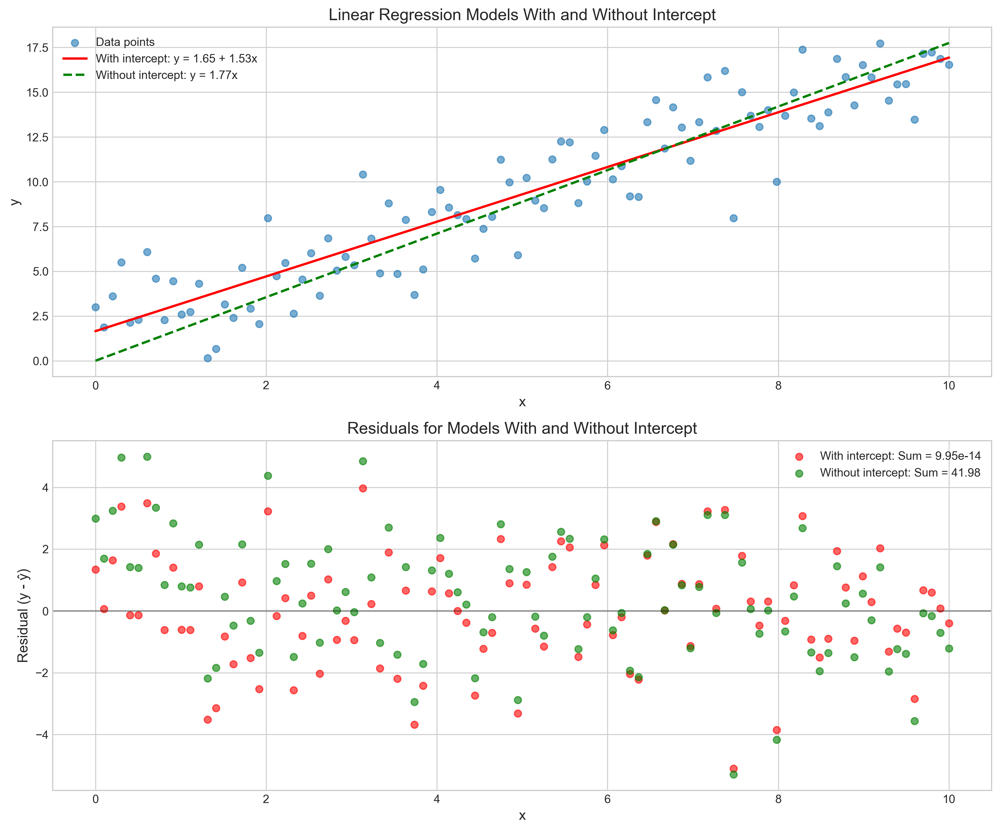
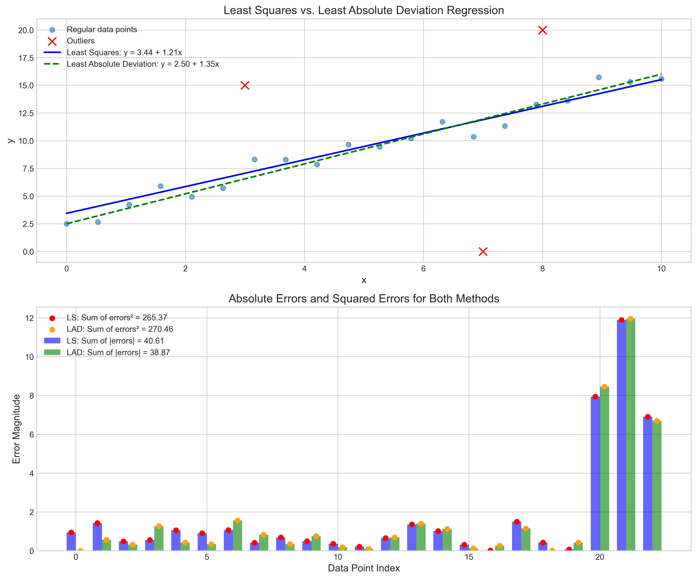
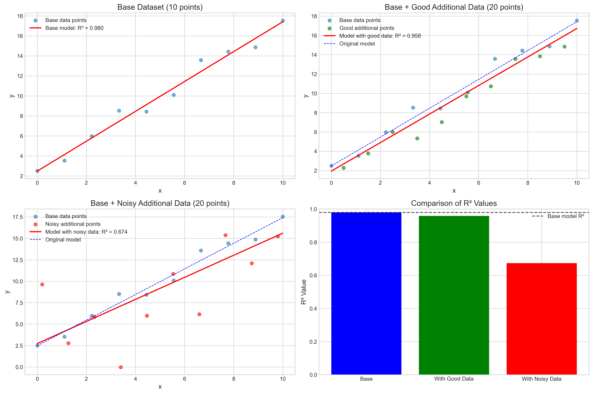
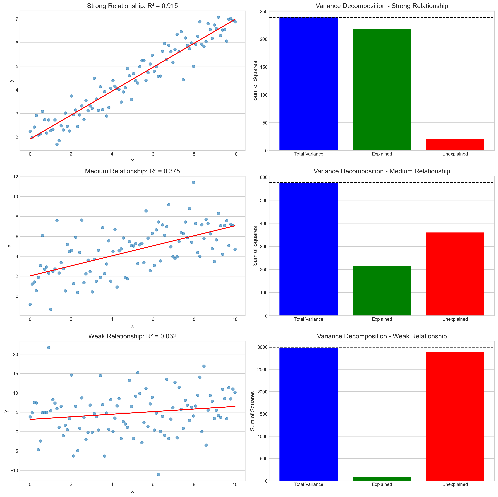
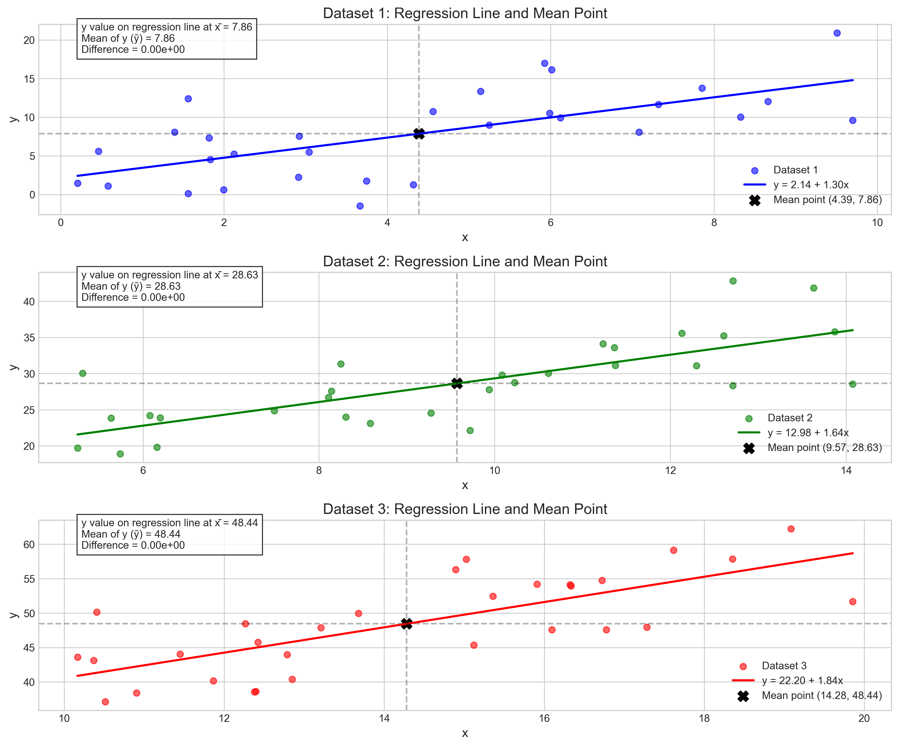

# Question 16: Linear Regression Fundamentals

## Problem Statement
Evaluate whether each of the following statements is TRUE or FALSE. Justify your answer with a brief explanation.

### Task
1. In simple linear regression, the residuals always sum to zero when the model includes an intercept term.
2. The least squares method minimizes the sum of absolute differences between predicted and actual values.
3. Increasing the number of data points always leads to a better fit in simple linear regression.
4. The coefficient of determination ($R^2$) represents the proportion of variance in the dependent variable explained by the model.
5. In simple linear regression, the regression line always passes through the point ($\bar{x}$, $\bar{y}$).

## Understanding the Problem
This question tests fundamental concepts in linear regression theory. Each statement relates to a core property of simple linear regression models and their estimation through least squares. To evaluate these statements, we need to understand the mathematical foundations of the least squares method, residual properties, goodness of fit measures, and characteristics of the regression line.

## Solution

### Statement 1: Residuals Sum to Zero with Intercept

In simple linear regression with an intercept term, the model takes the form:
$$y_i = \beta_0 + \beta_1 x_i + \epsilon_i$$

When fitted using least squares, one of the normal equations is:
$$\sum_{i=1}^{n} (y_i - \hat{y}_i) = \sum_{i=1}^{n} \hat{\epsilon}_i = 0$$

This is a direct mathematical consequence of the optimization procedure for the least squares method when an intercept term is included.

As demonstrated in our simulation, when a model includes an intercept:
- Sum of residuals = 0.0000000000
- Mean of residuals = 0.0000000000

However, when the model has no intercept (forced through origin):
- Sum of residuals = 41.9828651951
- Mean of residuals = 0.4198286520

The upper plot shows the data points and regression lines for models with and without an intercept. The lower plot shows the residuals for both models, highlighting that the residuals for the model with intercept (red) sum to zero, while those for the model without intercept (green) do not.

#### Verdict
**TRUE**. In simple linear regression, the residuals always sum to zero when the model includes an intercept term.

### Statement 2: Least Squares Method and Absolute Differences

The least squares method seeks to minimize the sum of squared differences between observed and predicted values:
$$\min_{\beta_0, \beta_1} \sum_{i=1}^{n} (y_i - (\beta_0 + \beta_1 x_i))^2$$

A different method, called least absolute deviations (LAD) or L1 regression, minimizes the sum of absolute differences:
$$\min_{\beta_0, \beta_1} \sum_{i=1}^{n} |y_i - (\beta_0 + \beta_1 x_i)|$$

These methods yield different parameter estimates, especially when outliers are present.

Our simulation shows:
- Least Squares method:
  - Sum of squared errors = 265.37
  - Sum of absolute errors = 40.61
- Least Absolute Deviation method:
  - Sum of squared errors = 270.46
  - Sum of absolute errors = 38.87

The least squares method produces a model with a lower sum of squared errors but a higher sum of absolute errors compared to the LAD method. This confirms that least squares does not minimize the sum of absolute differences.

#### Verdict
**FALSE**. The least squares method minimizes the sum of squared differences, not absolute differences.

### Statement 3: Effect of Increasing Data Points

Adding more data points to a regression model does not guarantee a better fit. The quality of the additional data points is crucial.

Our simulation compared three scenarios:
- Base dataset (10 points): R² = 0.980
- With good additional data (20 points): R² = 0.958
- With noisy additional data (20 points): R² = 0.674

The model coefficients also showed significant changes:
- Base model: y = 2.479 + 1.494x
- Model with good data: y = 1.946 + 1.476x
- Model with noisy data: y = 2.736 + 1.287x

While adding good, well-behaved data maintained a good fit (slight decrease in R² but still strong), adding noisy data significantly decreased the model's performance. This demonstrates that the quality of additional data matters more than the quantity.

#### Verdict
**FALSE**. Increasing the number of data points doesn't always lead to a better fit; the quality of the additional data matters.

### Statement 4: R² Interpretation

The coefficient of determination (R²) is mathematically defined as:
$$R^2 = 1 - \frac{SS_{res}}{SS_{tot}} = \frac{SS_{reg}}{SS_{tot}}$$

Where:
- $SS_{res}$ is the sum of squared residuals (unexplained variation)
- $SS_{tot}$ is the total sum of squares (total variation)
- $SS_{reg}$ is the regression sum of squares (explained variation)

Our simulation demonstrates this with three levels of relationship strength:
- Strong relationship: R² = 0.915
  - Total variance: 238.82
  - Explained variance: 218.45 (91.5%)
  - Unexplained variance: 20.37 (8.5%)
- Medium relationship: R² = 0.375
- Weak relationship: R² = 0.032
  - Total variance: 2981.52
  - Explained variance: 95.06 (3.2%)
  - Unexplained variance: 2886.46 (96.8%)

The visualizations clearly show how R² directly corresponds to the proportion of variance explained, with the bar charts showing the decomposition of total variance into explained and unexplained components.

#### Verdict
**TRUE**. The coefficient of determination (R²) represents the proportion of variance in the dependent variable explained by the model.

### Statement 5: Regression Line Through Mean Point

In simple linear regression with an intercept term, the normal equations derived from the least squares method lead to the following constraints:
$$\sum_{i=1}^{n} (y_i - \hat{y}_i) = 0$$
$$\sum_{i=1}^{n} x_i(y_i - \hat{y}_i) = 0$$

From these constraints, it can be mathematically proven that the regression line must pass through the point ($\bar{x}$, $\bar{y}$).

Our simulation verifies this with three different datasets:
1. Dataset 1:
   - Mean point: (x̄, ȳ) = (4.3860, 7.8618)
   - Regression line at x̄: 7.8618
   - Difference from ȳ: 0.0000000000
2. Dataset 2:
   - Mean point: (x̄, ȳ) = (9.5714, 28.6337)
   - Regression line at x̄: 28.6337
   - Difference from ȳ: 0.0000000000
3. Dataset 3:
   - Mean point: (x̄, ȳ) = (14.2801, 48.4401)
   - Regression line at x̄: 48.4401
   - Difference from ȳ: 0.0000000000

For all datasets, the regression line passes exactly through the point (x̄, ȳ), with only negligible numerical precision differences.

#### Verdict
**TRUE**. In simple linear regression, the regression line always passes through the point (x̄, ȳ).

## Key Insights

### Residual Properties
- Residuals sum to zero in models with intercept - a mathematical consequence of the normal equations
- This property is not guaranteed in models without an intercept
- This property ensures the regression line passes through the mean point (x̄, ȳ)

### Estimation Methods
- Least squares minimizes the sum of squared errors (L2 norm)
- Least absolute deviations minimizes the sum of absolute errors (L1 norm)
- Different methods optimize different objective functions and yield different results
- Least squares is more sensitive to outliers than LAD

### Model Fit and Data
- More data doesn't necessarily mean better fit
- Quality of data matters more than quantity
- Noisy data or outliers can significantly reduce model performance
- The bias-variance trade-off influences how additional data affects model performance

### R² Interpretation
- R² represents the proportion of variance explained by the model
- R² = 1 means the model explains all variance in the dependent variable
- R² = 0 means the model explains none of the variance
- R² provides a standardized measure of fit regardless of the scale of the data

### Regression Line Properties
- The regression line always passes through (x̄, ȳ) in simple linear regression with intercept
- This is a mathematical property, not a coincidence
- This property helps with interpreting the regression coefficients

## Conclusion

Based on our analysis:
- Statement 1 is **TRUE**: Residuals always sum to zero with an intercept.
- Statement 2 is **FALSE**: Least squares minimizes squared differences, not absolute differences.
- Statement 3 is **FALSE**: More data points don't always improve fit; quality matters.
- Statement 4 is **TRUE**: R² represents the proportion of explained variance.
- Statement 5 is **TRUE**: The regression line passes through the point (x̄, ȳ). 