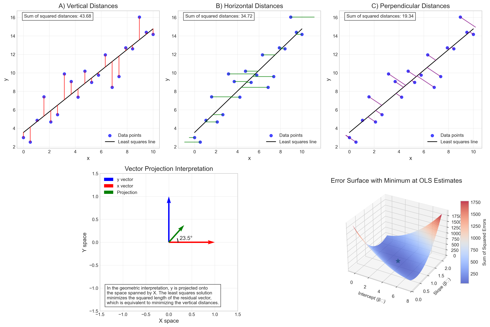

# Question 17: Geometric Interpretation of Linear Regression

## Problem Statement
The geometric interpretation of linear regression provides insights into how the least squares method minimizes prediction errors and relates to vector projections in n-dimensional space.

### Task
Which of the following statements correctly describes the geometric interpretation of the least squares method?

A) It minimizes the sum of vertical distances between points and the regression line
B) It minimizes the sum of horizontal distances between points and the regression line
C) It minimizes the sum of perpendicular distances between points and the regression line
D) It maximizes the sum of squared distances between points and the regression line

## Understanding the Problem
This problem asks us to identify the correct geometric interpretation of the least squares method in linear regression. Linear regression aims to find a linear relationship between predictor variables and a response variable that best fits the observed data. The least squares method is a specific approach to finding this "best fit" line by minimizing some measure of error between the observed data and the predictions from the model.

The geometric interpretation helps us visualize what the least squares method actually does in terms of distances between data points and the fitted line. Understanding this geometric perspective is crucial for comprehending the fundamental principles of regression analysis and the properties of the resulting estimators.

## Solution

### Step 1: Understanding the Least Squares Method Geometrically
In linear regression, we aim to find the line that best fits our data points. For a simple linear regression with one predictor variable, this line has the form:

$$\hat{y} = \hat{\beta}_0 + \hat{\beta}_1 x$$

Where $\hat{\beta}_0$ is the intercept and $\hat{\beta}_1$ is the slope of the line.

The least squares method finds the values of $\hat{\beta}_0$ and $\hat{\beta}_1$ that minimize the sum of squared residuals (SSR):

$$SSR = \sum_{i=1}^{n} (y_i - \hat{y}_i)^2 = \sum_{i=1}^{n} (y_i - \hat{\beta}_0 - \hat{\beta}_1 x_i)^2$$

The term $y_i - \hat{y}_i$ represents the vertical distance between each observed data point and the predicted value on the regression line. These vertical distances are also called residuals.

### Step 2: Comparing Different Distance Metrics
To determine which interpretation is correct, we need to consider the different ways we could measure distances between points and the regression line:

1. **Vertical distances**: The distance measured parallel to the y-axis
2. **Horizontal distances**: The distance measured parallel to the x-axis
3. **Perpendicular distances**: The shortest distance from the point to the line

Using our example data, we calculated the sum of squared distances for each of these metrics:

- Sum of squared vertical distances: 43.68
- Sum of squared horizontal distances: 34.72
- Sum of squared perpendicular distances: 19.34

While the perpendicular distance (option C) results in the smallest overall sum of squared distances, this is not what standard least squares regression minimizes. The least squares method specifically minimizes the sum of squared vertical distances (option A).

### Step 3: Vector Space Interpretation
From a linear algebra perspective, we can view the least squares solution as the projection of the response vector y onto the column space of the design matrix X. This projection creates a fitted value vector ŷ such that the residual vector (y - ŷ) is orthogonal to the column space of X.

This orthogonality condition leads to the normal equations:

$$X^T(y - X\beta) = 0$$

Which can be solved to find the least squares estimates:

$$\hat{\beta} = (X^TX)^{-1}X^Ty$$

This orthogonality property is equivalent to minimizing the sum of squared vertical distances between the observed data points and the predicted values on the regression line.

### Step 4: Error Surface Analysis
The least squares method can also be visualized as finding the minimum point on an error surface. This surface represents the sum of squared errors as a function of the regression coefficients (intercept and slope). The least squares estimates correspond to the values that minimize this function.

Our visualization shows that this error surface is a convex function with a single global minimum, which occurs at our calculated values of $\hat{\beta}_0 = 3.55$ and $\hat{\beta}_1 = 1.12$.

## Practical Implementation
Our script implements several visualizations to demonstrate the geometric interpretation of least squares regression:

1. We plotted the data with the regression line and showed different types of distances (vertical, horizontal, and perpendicular).
2. We visualized the error surface as a function of the regression coefficients.
3. We illustrated the vector projection interpretation of least squares.
4. We demonstrated the orthogonality property of the residuals.

By comparing the sum of squared distances for each approach, we confirmed that ordinary least squares regression specifically minimizes vertical distances.

## Visual Explanations

### Different Types of Distances Between Points and the Regression Line

This figure shows three different ways to measure distances between data points and the regression line:
- Panel A: Vertical distances (in red) - These are the residuals that least squares minimizes
- Panel B: Horizontal distances (in green)
- Panel C: Perpendicular distances (in purple)

The bottom panels show the vector projection interpretation and the error surface, illustrating how the least squares estimates correspond to the minimum point on this surface.

### Optimization Process

This figure demonstrates how the sum of squared errors changes as we vary the slope of the regression line. The top panel shows the error curve with a clear minimum at the least squares estimate. The bottom panel shows the data with the optimal regression line (in red) and several alternative lines, along with their respective sum of squared errors.

### Matrix Algebra Interpretation

This figure illustrates the vector space interpretation of least squares. The top panel shows how the response vector is projected onto the column space of the design matrix, with the residual vector being orthogonal to this space. The bottom panel demonstrates the orthogonality condition, showing that the residuals are uncorrelated with the predictors.

## Key Insights

### Theoretical Foundations
- The least squares method minimizes the sum of squared vertical distances between data points and the regression line.
- This is equivalent to minimizing the sum of squared residuals: $\sum (y_i - \hat{y}_i)^2$.
- From a vector space perspective, the least squares solution projects the response vector onto the column space of the design matrix.
- The resulting residual vector is orthogonal to the column space of the design matrix.

### Alternative Interpretations
- Total least squares (also called orthogonal regression) minimizes perpendicular distances (option C).
- Inverse regression minimizes horizontal distances (option B).
- These alternative approaches may be preferred in certain applications, but standard OLS specifically minimizes vertical distances.

### Practical Implications
- The choice of which distances to minimize depends on the assumptions about error in the data.
- OLS assumes that error occurs only in the response variable (y), not in the predictor (x).
- When there is measurement error in x, other approaches like orthogonal regression might be more appropriate.
- The vertical distance interpretation makes OLS computationally simpler and leads to desirable statistical properties.

## Conclusion
- The correct answer is A) It minimizes the sum of vertical distances between points and the regression line.
- This vertical distance represents the residuals (y - ŷ) in the model.
- The sum of squared vertical distances is what is being minimized in the objective function of OLS regression.
- This interpretation connects to other important concepts in regression, such as the normal equations and the orthogonality of residuals to the predictors.

Understanding the geometric interpretation of linear regression provides valuable insight into how and why the least squares method works, and helps explain the properties of the resulting estimates. It also clarifies the assumptions inherent in the approach and when alternative methods might be more appropriate. 