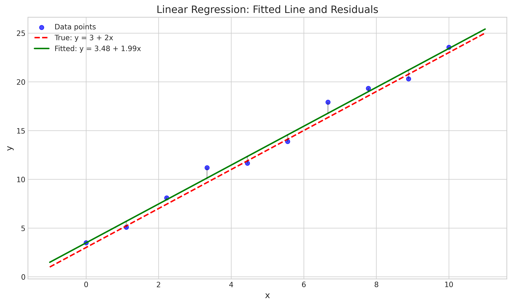
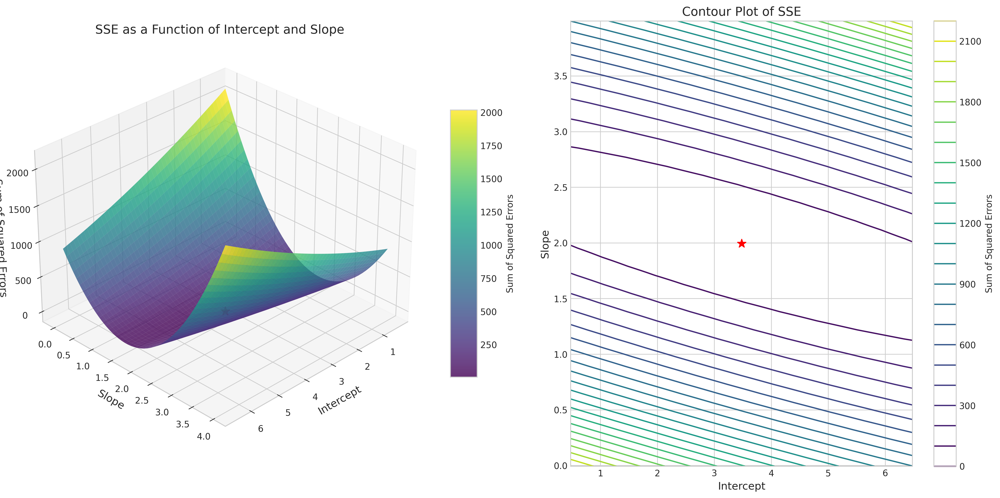
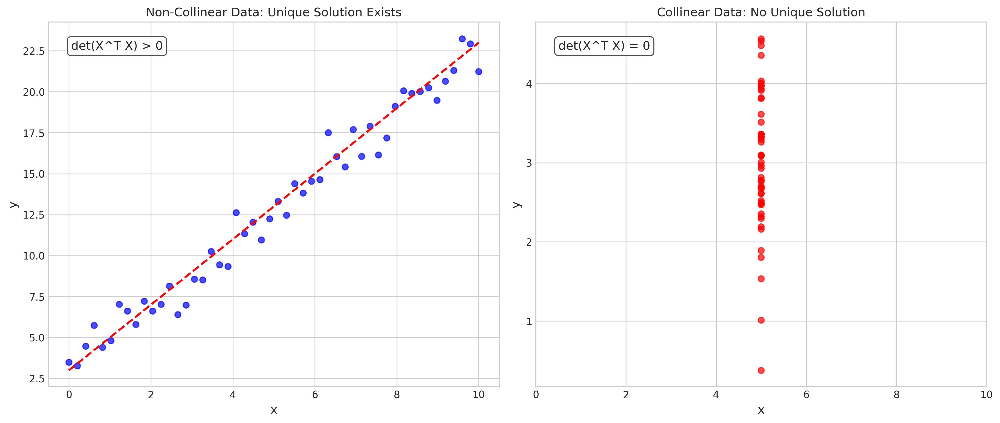
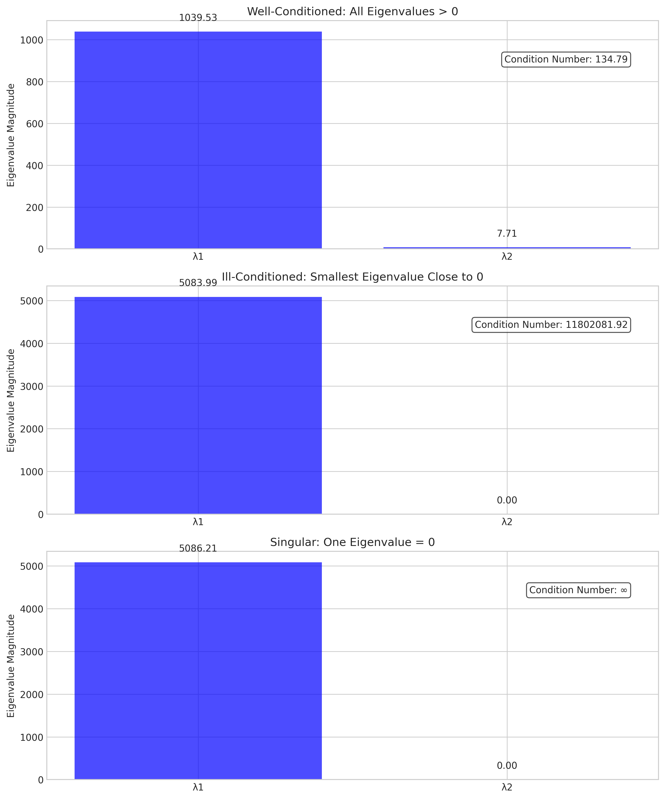
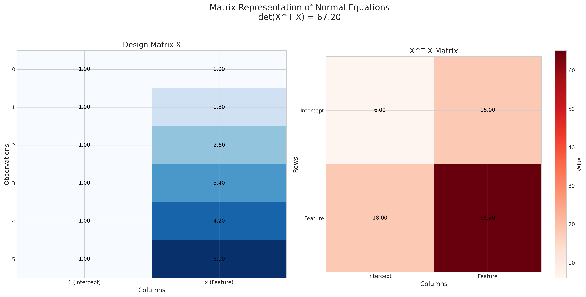
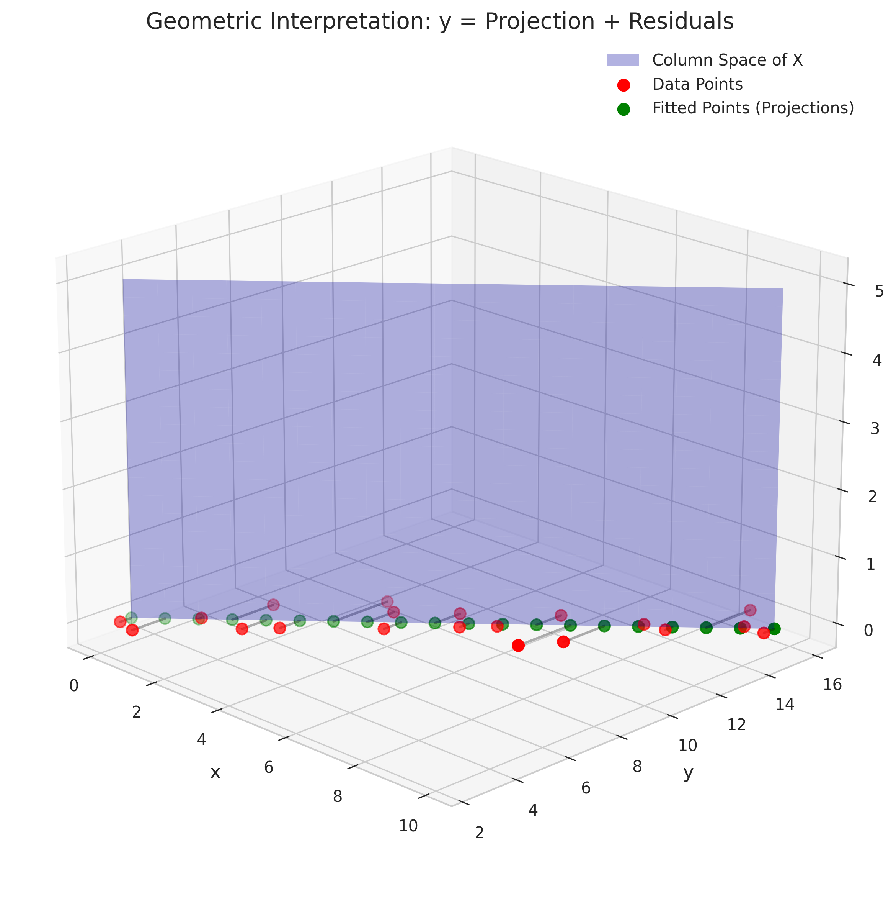

# Question 18: Normal Equations in Linear Regression

## Problem Statement
The normal equations provide an analytical solution to the linear regression problem by finding parameter values that minimize the sum of squared errors. Understanding their matrix formulation is crucial for theoretical analysis.

### Task
Given a simple linear regression model $y = \beta_0 + \beta_1x$ with $n$ data points:

1. Write down the formula for the normal equations in matrix form
2. What matrix property ensures that a unique solution exists?

## Understanding the Problem
This problem focuses on the mathematical foundation of linear regression - specifically how we can use matrix algebra to derive closed-form solutions for finding the best-fitting parameters. The normal equations are a set of equations derived from the principle of least squares, which provide the analytical solution to linear regression problems. 

In linear regression, we aim to find the parameters (coefficients) that minimize the sum of squared differences between observed and predicted values. The matrix form of the normal equations allows us to concisely represent and solve this minimization problem for any number of predictors.

## Solution

### Step 1: Deriving the Normal Equations in Matrix Form
To solve a linear regression problem, we first express the model in matrix form. For a simple linear regression model $y = \beta_0 + \beta_1x$ with $n$ data points, we can write:

$$y = X\beta + \varepsilon$$

Where:
- $y$ is an $n \times 1$ vector of response values
- $X$ is an $n \times 2$ design matrix where the first column contains all 1s (for the intercept) and the second column contains the $x$ values
- $\beta$ is a $2 \times 1$ vector $[\beta_0, \beta_1]^T$ of parameters
- $\varepsilon$ is an $n \times 1$ vector of error terms

The objective in linear regression is to minimize the sum of squared errors:

$$\min S(\beta) = (y - X\beta)^T(y - X\beta)$$

To find the values of $\beta$ that minimize this function, we take the derivative with respect to $\beta$ and set it equal to zero:

$$\frac{\partial S}{\partial \beta} = -2X^T(y - X\beta) = 0$$

Simplifying this equation:

$$X^T(y - X\beta) = 0$$
$$X^Ty - X^TX\beta = 0$$
$$X^TX\beta = X^Ty$$

This final equation, $X^TX\beta = X^Ty$, is the formula for the normal equations in matrix form. 

The solution to this equation is:

$$\beta = (X^TX)^{-1}X^Ty$$

This formula gives us the least squares estimates of the regression coefficients.

### Step 2: Matrix Property for Unique Solution

The key matrix property that ensures a unique solution exists is that $X^TX$ must be invertible (non-singular).

For $X^TX$ to be invertible, the following conditions must be met:
1. The matrix $X$ must have full column rank
2. There must be at least as many observations as parameters ($n \geq p$, where $p$ is the number of parameters)
3. The columns of $X$ must be linearly independent

In our simple linear regression case with $y = \beta_0 + \beta_1x$:
- We have 2 parameters ($\beta_0$ and $\beta_1$)
- We need at least 2 data points ($n \geq 2$)
- The $x$ values must not all be identical (otherwise the second column would be a scalar multiple of the first)

When $X^TX$ is invertible, the normal equations have a unique solution. When $X^TX$ is not invertible (singular), the system is rank-deficient, and either no solution exists or infinitely many solutions exist.

The condition that $X^TX$ is invertible is equivalent to saying that the determinant of $X^TX$ is non-zero:

$$\det(X^TX) \neq 0$$

If this determinant is zero, it indicates perfect collinearity (linear dependence) among the predictor variables, making it impossible to determine unique coefficient values.

## Practical Implementation
Let's demonstrate these concepts with a simple example.

### Example with a Well-Conditioned Matrix
For a dataset with 10 points where the true model is $y = 3 + 2x$ with some random noise:

1. We construct the design matrix $X$ with a column of 1s and a column of $x$ values.

2. Computing $X^TX$:
   ```
   X^T X matrix:
     [10.00, 50.00]
     [50.00, 351.85]
   ```

3. Calculating the determinant:
   ```
   Determinant of X^T X: 1018.52
   ```
   Since the determinant is non-zero, $X^TX$ is invertible and a unique solution exists.

4. Solving for $\beta$ using the normal equations:
   ```
   Solution using normal equations:
     β₀ = 3.4791
     β₁ = 1.9938
   ```
   These values are close to the true parameters (3 and 2), with small differences due to random noise.

### Example with a Singular Matrix
To demonstrate what happens when $X^TX$ is not invertible, we can create a case where all $x$ values are identical (perfect collinearity):

```
In this example, all x values are identical (x = 5).
X^T X matrix for singular case:
  [10.00, 50.00]
  [50.00, 250.00]

Determinant of X^T X: 0.0000000000
```

Since the determinant is zero, $X^TX$ is not invertible. Attempting to solve the normal equations directly results in an error:

```
Linear algebra error: Singular matrix cannot be inverted.
```

This confirms that no unique solution exists when $X^TX$ is singular. In such cases, we might use techniques like the pseudoinverse to find one of infinitely many solutions that minimize the sum of squared errors.

## Visual Explanations

### Linear Regression Model and Fitted Line


This figure shows the data points (blue), the fitted line (green), and the true underlying relationship (red dashed line). The vertical black lines represent the residuals between observed and predicted values, which the normal equations help minimize.

### Sum of Squared Errors Surface


The 3D surface (left) illustrates how the sum of squared errors varies with different values of intercept and slope parameters. The red star marks the unique minimum found by solving the normal equations. The contour plot (right) provides a top-down view of this surface, with contour lines representing equal SSE values.

### Collinearity vs Non-Collinearity


This comparison illustrates the difference between non-collinear data (left) and collinear data (right). In the non-collinear case, the x-values vary, making X^T X invertible (det(X^T X) > 0) and ensuring a unique solution exists. In the collinear case, all x-values are identical, making X^T X singular (det(X^T X) = 0) and resulting in no unique solution.

### Eigenvalues of X^T X Matrix


This visualization compares the eigenvalues of X^T X in three scenarios:
- **Well-conditioned case**: Both eigenvalues are significantly above zero, indicating a stable, invertible matrix
- **Ill-conditioned case**: The smallest eigenvalue approaches zero, resulting in a nearly singular matrix
- **Singular case**: One eigenvalue equals zero, making the matrix non-invertible

The condition number (ratio of largest to smallest eigenvalue) quantifies the numerical stability of solving the normal equations.

### Matrix Representation


This visualization illustrates the actual matrices involved in the normal equations. The left panel shows the design matrix X with a column of ones (intercept) and a column of x-values. The right panel shows the resulting X^T X matrix, which must be invertible for a unique solution to exist. The determinant value in the title quantifies this invertibility.

### Geometric Interpretation


This 3D visualization demonstrates the geometric interpretation of the normal equations. The blue plane represents the column space of X (all possible linear combinations of the predictor variables). The red points are the original data points, and the green points are their projections onto the column space. The black lines show that these projections are orthogonal to the column space, illustrating that X^T(y - X𝛽) = 0, which is equivalent to the normal equations.

## Key Insights

### Theoretical Foundations
- The normal equations provide a direct analytical solution to the linear regression problem: $X^TX\beta = X^Ty$
- The solution minimizes the sum of squared errors between observed and predicted values
- The solution is a global minimum when $X^TX$ is invertible
- The geometry of the sum of squared errors is a quadratic (paraboloid) surface with a unique minimum when $X^TX$ is invertible

### Properties and Conditions
- For a unique solution to exist, $X^TX$ must be invertible (non-singular)
- This requires that the columns of $X$ are linearly independent
- Perfect collinearity among predictors makes $X^TX$ singular, resulting in no unique solution
- Near collinearity (multicollinearity) makes $X^TX$ poorly conditioned, leading to unstable solutions
- The eigenvalues of $X^TX$ provide insight into its conditioning and invertibility

### Practical Implications
- The normal equations provide a computationally efficient solution for small to moderate-sized problems
- For numerical stability, it's better to use QR decomposition or Singular Value Decomposition rather than directly inverting $X^TX$
- Regularization techniques (like ridge regression) can help address multicollinearity by making $X^TX$ more stable
- Understanding the normal equations is fundamental to extensions like weighted least squares, generalized least squares, and ridge regression

## Conclusion
- The normal equations in matrix form are $X^TX\beta = X^Ty$, providing an analytical solution to linear regression.
- The key matrix property that ensures a unique solution exists is that $X^TX$ must be invertible (non-singular).
- This invertibility depends on the linear independence of the columns of $X$, which requires sufficient data points and no perfect collinearity among predictors.

Understanding the normal equations and the conditions for their solution is essential for theoretical analysis of linear regression and provides the foundation for more advanced regression techniques. 