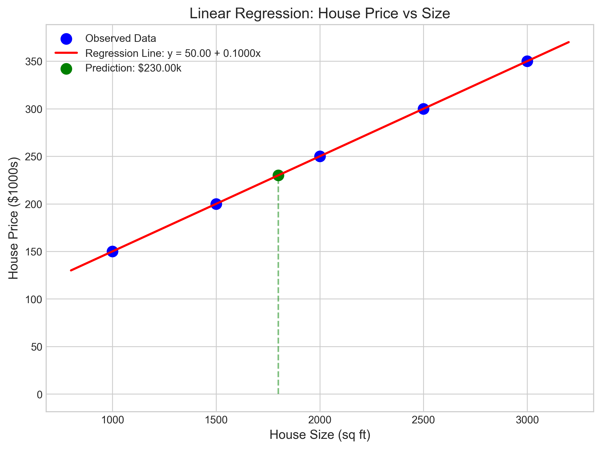
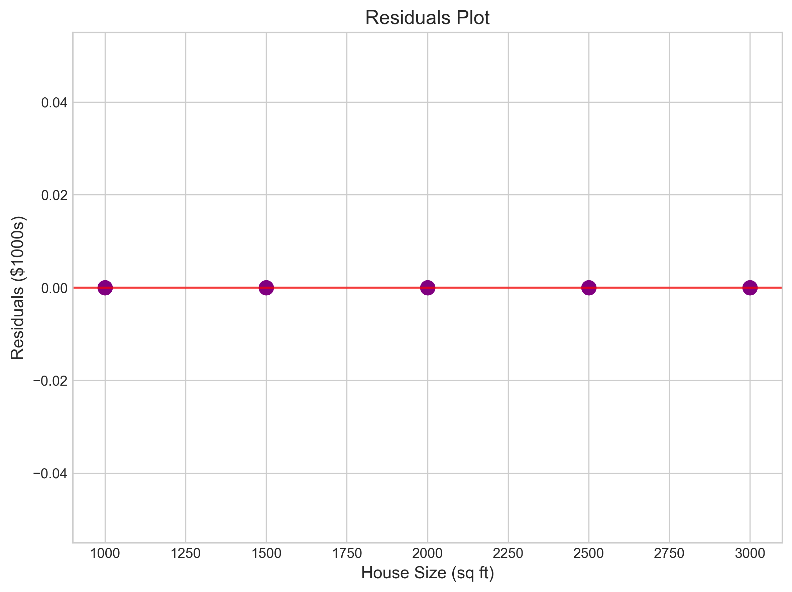
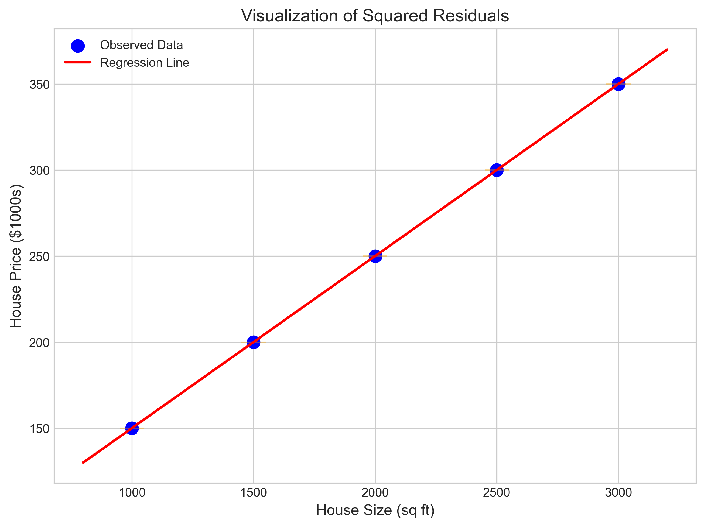
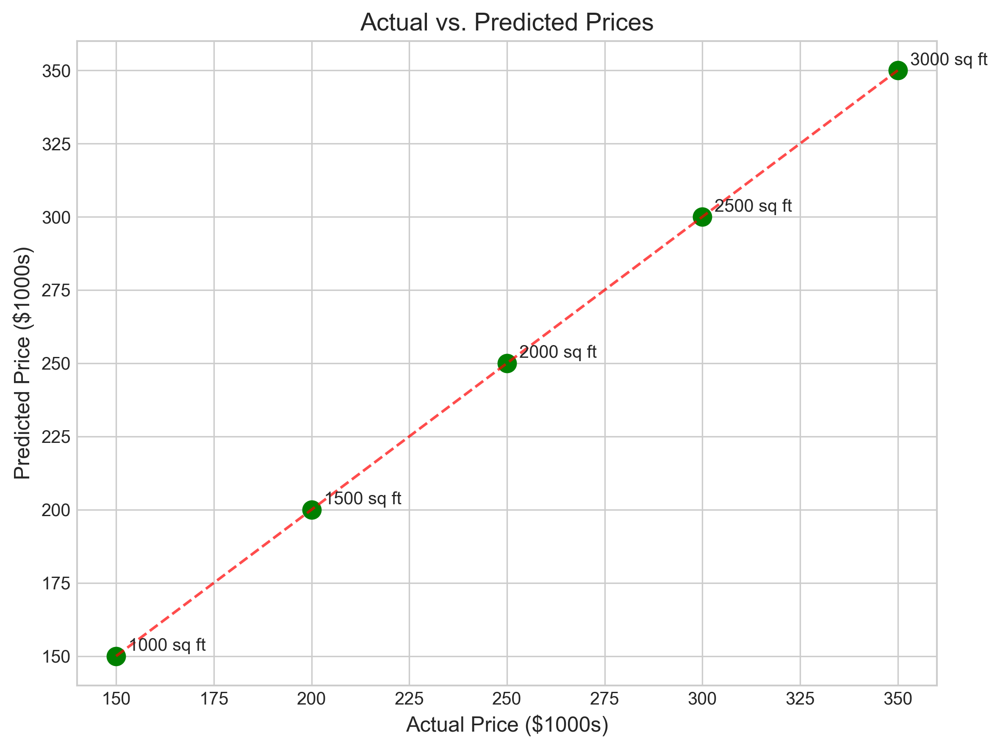
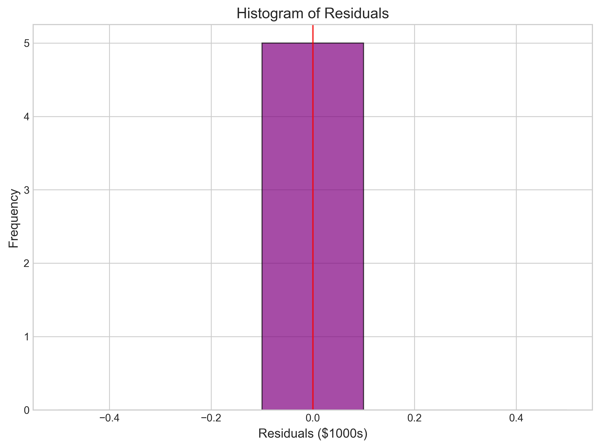

# Question 1: Simple Linear Regression for House Prices

## Problem Statement
Consider a simple linear regression model for predicting house prices based on house size (in square feet). The following data points are observed:

| House Size (x) | Price (y) in $1000s |
|----------------|---------------------|
| 1000           | 150                 |
| 1500           | 200                 |
| 2000           | 250                 |
| 2500           | 300                 |
| 3000           | 350                 |

### Task
1. Find the least squares estimates for the slope ($\beta_1$) and intercept ($\beta_0$) of the linear regression model
2. Interpret the meaning of the slope coefficient in the context of this problem
3. Calculate the prediction for a house with 1800 square feet
4. Calculate the residuals for each data point and the residual sum of squares (RSS)

## Understanding the Problem
This problem asks us to build a simple linear regression model that relates house prices to their sizes. The goal is to find the line of best fit that minimizes the sum of squared differences between the observed prices and the prices predicted by our model. The linear regression model takes the form:

$$\text{Price} = \beta_0 + \beta_1 \times \text{Size} + \epsilon$$

where $\beta_0$ is the intercept, $\beta_1$ is the slope coefficient, and $\epsilon$ represents the error term. Once we find $\beta_0$ and $\beta_1$, we can use the model to predict house prices for houses of different sizes.

## Solution

### Step 1: Calculate the least squares estimates for slope and intercept

To find the least squares estimates, we use the following formulas:

$$\beta_1 = \frac{\sum_{i=1}^{n}(x_i - \bar{x})(y_i - \bar{y})}{\sum_{i=1}^{n}(x_i - \bar{x})^2}$$

$$\beta_0 = \bar{y} - \beta_1 \bar{x}$$

where $\bar{x}$ is the mean of the x-values (house sizes) and $\bar{y}$ is the mean of the y-values (house prices).

First, let's calculate the means:
$\bar{x} = \frac{1000 + 1500 + 2000 + 2500 + 3000}{5} = \frac{10000}{5} = 2000$ sq ft

$\bar{y} = \frac{150 + 200 + 250 + 300 + 350}{5} = \frac{1250}{5} = 250$ thousand dollars

Next, let's compute the numerator and denominator for the slope formula:

Numerator: $\sum_{i=1}^{n}(x_i - \bar{x})(y_i - \bar{y})$
- $(1000 - 2000)(150 - 250) = (-1000)(-100) = 100,000$
- $(1500 - 2000)(200 - 250) = (-500)(-50) = 25,000$
- $(2000 - 2000)(250 - 250) = (0)(0) = 0$
- $(2500 - 2000)(300 - 250) = (500)(50) = 25,000$
- $(3000 - 2000)(350 - 250) = (1000)(100) = 100,000$
- Sum = $100,000 + 25,000 + 0 + 25,000 + 100,000 = 250,000$

Denominator: $\sum_{i=1}^{n}(x_i - \bar{x})^2$
- $(1000 - 2000)^2 = (-1000)^2 = 1,000,000$
- $(1500 - 2000)^2 = (-500)^2 = 250,000$
- $(2000 - 2000)^2 = (0)^2 = 0$
- $(2500 - 2000)^2 = (500)^2 = 250,000$
- $(3000 - 2000)^2 = (1000)^2 = 1,000,000$
- Sum = $1,000,000 + 250,000 + 0 + 250,000 + 1,000,000 = 2,500,000$

Now, we can calculate the slope:
$$\beta_1 = \frac{250,000}{2,500,000} = 0.1$$

And the intercept:
$$\beta_0 = 250 - 0.1 \times 2000 = 250 - 200 = 50$$

Therefore, our linear regression model is:
$$\text{Price} = 50 + 0.1 \times \text{Size}$$

### Step 2: Interpret the meaning of the slope coefficient

The slope coefficient $\beta_1 = 0.1$ represents the change in house price (in $1000s) for each additional square foot of house size. In other words, for every additional square foot, the house price increases by $0.1 \times 1000 = $100. This makes intuitive sense - larger houses generally cost more, and in this dataset, each additional square foot adds $100 to the price on average.

### Step 3: Calculate the prediction for a house with 1800 square feet

Using our regression model, we can predict the price of a house with 1800 square feet:

$$\text{Predicted Price} = 50 + 0.1 \times 1800 = 50 + 180 = 230$$

So, our model predicts that a house with 1800 square feet would cost $230,000.

### Step 4: Calculate residuals and RSS

The residual for each observation is the difference between the actual value and the predicted value: $e_i = y_i - \hat{y}_i$, where $\hat{y}_i = \beta_0 + \beta_1 x_i$.

Let's calculate the predicted values and residuals for each data point:

| House Size (x) | Price (y) | Predicted Price (ŷ) | Residual (y - ŷ) |
|----------------|-----------|---------------------|------------------|
| 1000           | 150       | 50 + 0.1×1000 = 150 | 150 - 150 = 0    |
| 1500           | 200       | 50 + 0.1×1500 = 200 | 200 - 200 = 0    |
| 2000           | 250       | 50 + 0.1×2000 = 250 | 250 - 250 = 0    |
| 2500           | 300       | 50 + 0.1×2500 = 300 | 300 - 300 = 0    |
| 3000           | 350       | 50 + 0.1×3000 = 350 | 350 - 350 = 0    |

The Residual Sum of Squares (RSS) is the sum of the squared residuals:
$$\text{RSS} = \sum_{i=1}^{n} (y_i - \hat{y}_i)^2 = 0^2 + 0^2 + 0^2 + 0^2 + 0^2 = 0$$

In this particular example, the RSS is 0, which is a special case indicating that our linear regression model perfectly fits the data. All the data points lie exactly on the regression line. This is not typical in real-world data, where there's usually some noise and variation that can't be explained by the model.

## Visual Explanations

### Regression Line and Data Points

This visualization shows how house prices relate to house sizes, with the regression line. The green point shows our prediction for a house of 1800 sq ft.

### Residuals Plot

The residuals plot shows the difference between actual and predicted values. In this case, all residuals are zero, so they all lie on the horizontal line.

### Squared Residuals Visualization

A visualization of the squared residuals (though in this perfect-fit case, they're all zero).

### Actual vs. Predicted Values

Actual vs. predicted prices, with all points falling exactly on the 45-degree line, indicating perfect prediction.

### Residuals Distribution

A histogram of residuals, which in this case is just a single bar at zero.

## Key Insights

### Mathematical Foundations
- Linear regression finds the line that minimizes the sum of squared residuals (RSS).
- The formulas for the slope and intercept involve the means of the x and y values, as well as the covariance of x and y, and the variance of x.
- In this special case, we have a perfect fit with RSS = 0, but in real data, this is extremely rare.

### Practical Applications
- The slope coefficient has a practical interpretation: each additional square foot adds $100 to the house price.
- With the linear model, we can make predictions for houses of any size within a reasonable range.
- The linear relationship between house size and price is perfect in this dataset, but in real estate, other factors often introduce non-linearities.

### Limitations and Extensions
- This model assumes a strictly linear relationship between house size and price.
- In real estate, many other factors affect house prices beyond just size (location, age, features, etc.).
- The perfect fit in this example is unusual and suggests this might be synthetic data or that the relationship was constructed to be exactly linear.

## Conclusion
- We successfully built a linear regression model: Price = 50 + 0.1 × Size, where price is in thousands of dollars and size is in square feet.
- The slope coefficient (0.1) indicates that each additional square foot adds $100 to the house price.
- The model predicts that a house with 1800 square feet would cost $230,000.
- The model fits the data perfectly, with zero residuals and zero RSS, which is uncommon in real-world data.

This problem demonstrates the fundamental concepts of simple linear regression, including parameter estimation, interpretation, prediction, and evaluation of model fit. In practice, we would typically deal with data that doesn't fit perfectly along a line, and we would need to assess how well our model generalizes to new data. 