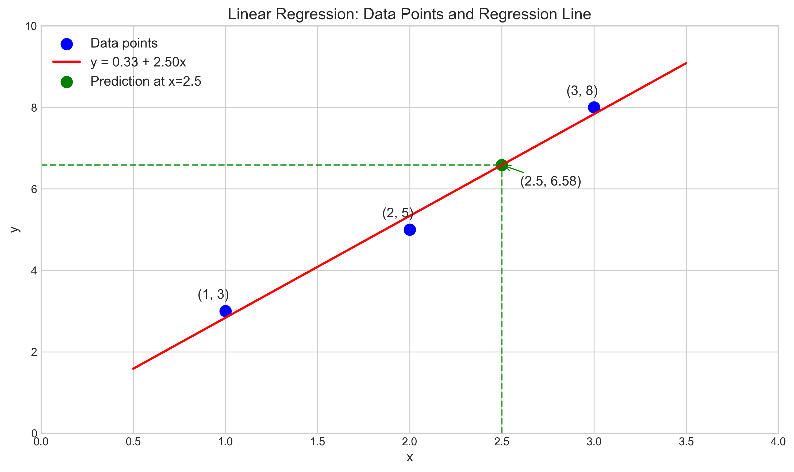
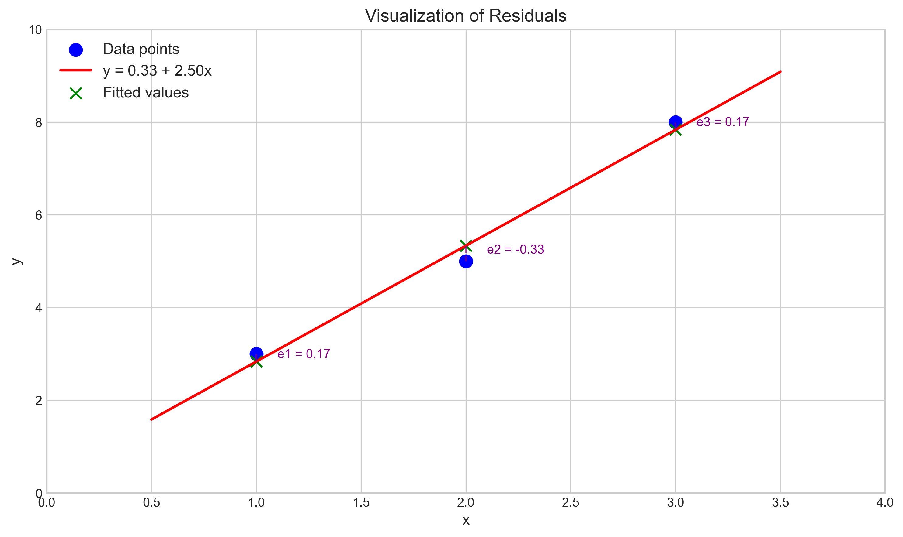
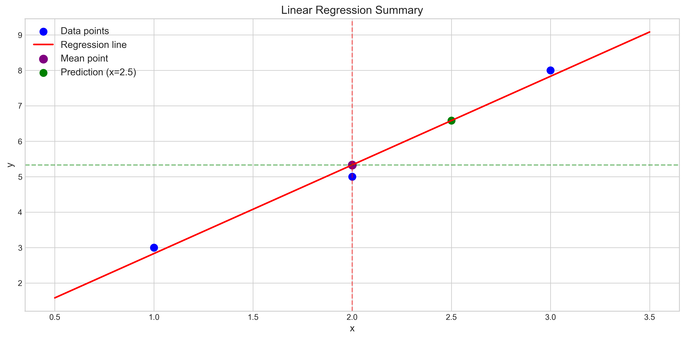

# Question 20: Linear Regression by Hand

## Problem Statement
Calculating linear regression coefficients by hand reinforces understanding of the underlying mathematics and provides insight into how the model parameters are derived from data.

### Task
Consider these three data points: $(1,3)$, $(2,5)$, and $(3,8)$.

1. Calculate the least squares estimates for $\beta_0$ and $\beta_1$ by hand
2. Find the predicted value when $x = 2.5$
3. Calculate the residual sum of squares (RSS)

## Understanding the Problem
This problem asks us to apply the fundamental technique of linear regression to a small dataset. Linear regression finds the line of best fit for a set of data points by minimizing the sum of squared differences between observed and predicted values (residuals). The line has the form $y = \beta_0 + \beta_1 x$, where $\beta_0$ is the intercept and $\beta_1$ is the slope. 

The least squares method allows us to find the optimal values of these coefficients by minimizing the residual sum of squares (RSS). For a simple linear regression model, we can derive these coefficients using specific formulas rather than using iterative optimization methods.

## Solution

### Step 1: Calculate the least squares estimates for β₀ and β₁

First, we need to find the slope ($\beta_1$) and intercept ($\beta_0$) of the regression line using the least squares formulas.

#### Step 1.1: Calculate the means
Calculate the mean of x and y values:
$$\bar{x} = \frac{1 + 2 + 3}{3} = 2$$
$$\bar{y} = \frac{3 + 5 + 8}{3} = 5.33$$

#### Step 1.2: Calculate the deviations from means
For each data point, calculate how far it is from the means:

For the first point $(1, 3)$:
$x_1 - \bar{x} = 1 - 2 = -1$
$y_1 - \bar{y} = 3 - 5.33 = -2.33$

For the second point $(2, 5)$:
$x_2 - \bar{x} = 2 - 2 = 0$
$y_2 - \bar{y} = 5 - 5.33 = -0.33$

For the third point $(3, 8)$:
$x_3 - \bar{x} = 3 - 2 = 1$
$y_3 - \bar{y} = 8 - 5.33 = 2.67$

#### Step 1.3: Calculate the products and squares of deviations
For each point, calculate the product of x and y deviations, and the square of x deviations:

For the first point:
$(x_1 - \bar{x})(y_1 - \bar{y}) = (-1)(-2.33) = 2.33$
$(x_1 - \bar{x})^2 = (-1)^2 = 1$

For the second point:
$(x_2 - \bar{x})(y_2 - \bar{y}) = (0)(-0.33) = 0$
$(x_2 - \bar{x})^2 = (0)^2 = 0$

For the third point:
$(x_3 - \bar{x})(y_3 - \bar{y}) = (1)(2.67) = 2.67$
$(x_3 - \bar{x})^2 = (1)^2 = 1$

#### Step 1.4: Calculate the sums
$$\sum_{i=1}^{3} (x_i - \bar{x})(y_i - \bar{y}) = 2.33 + 0 + 2.67 = 5$$
$$\sum_{i=1}^{3} (x_i - \bar{x})^2 = 1 + 0 + 1 = 2$$

#### Step 1.5: Calculate β₁ (slope)
Using the formula for the slope:
$$\beta_1 = \frac{\sum_{i=1}^{n} (x_i - \bar{x})(y_i - \bar{y})}{\sum_{i=1}^{n} (x_i - \bar{x})^2} = \frac{5}{2} = 2.5$$

#### Step 1.6: Calculate β₀ (intercept)
Using the formula for the intercept:
$$\beta_0 = \bar{y} - \beta_1 \bar{x} = 5.33 - 2.5 \times 2 = 5.33 - 5 = 0.33$$

Therefore, our regression line equation is:
$$y = 0.33 + 2.5x$$

### Step 2: Find the predicted value when x = 2.5

To find the predicted value when $x = 2.5$, we substitute this value into our regression equation:
$$y = 0.33 + 2.5 \times 2.5 = 0.33 + 6.25 = 6.58$$

Therefore, the predicted value at $x = 2.5$ is 6.58.

### Step 3: Calculate the residual sum of squares (RSS)

The residual for each data point is the difference between the observed (actual) y-value and the predicted y-value:

#### Step 3.1: Calculate fitted values
For $x_1 = 1$: $\hat{y}_1 = 0.33 + 2.5 \times 1 = 2.83$
For $x_2 = 2$: $\hat{y}_2 = 0.33 + 2.5 \times 2 = 5.33$
For $x_3 = 3$: $\hat{y}_3 = 0.33 + 2.5 \times 3 = 7.83$

#### Step 3.2: Calculate residuals
$e_1 = y_1 - \hat{y}_1 = 3 - 2.83 = 0.17$
$e_2 = y_2 - \hat{y}_2 = 5 - 5.33 = -0.33$
$e_3 = y_3 - \hat{y}_3 = 8 - 7.83 = 0.17$

#### Step 3.3: Square the residuals
$e_1^2 = (0.17)^2 = 0.0289$
$e_2^2 = (-0.33)^2 = 0.1089$
$e_3^2 = (0.17)^2 = 0.0289$

#### Step 3.4: Sum the squared residuals
$$\text{RSS} = \sum_{i=1}^{n} e_i^2 = 0.0289 + 0.1089 + 0.0289 = 0.1667$$

Therefore, the residual sum of squares (RSS) is approximately 0.1667.

## Visual Explanations

### Regression Line with Data Points


This visualization shows the three data points (blue) along with the regression line (red) we calculated: $y = 0.33 + 2.5x$. The green point represents our predicted value when $x = 2.5$, which is $y = 6.58$. The dashed green lines help visualize the coordinate position of the predicted point.

### Visualization of Residuals


This visualization illustrates the residuals (vertical purple dashed lines) between each actual data point (blue) and the corresponding predicted point on the regression line (green X markers). The length of each line represents the magnitude of the residual. The RSS (0.1667) is the sum of the squares of these residuals.

### Linear Regression Summary


This figure provides a summary overview of our linear regression analysis, showing:
- The original data points (blue)
- The regression line (red)
- The mean point (purple) at $(2, 5.33)$
- The prediction point (green) at $(2.5, 6.58)$
- Reference lines for the mean values of x and y (dashed lines)

## Formula Explanation

The least squares estimates for a simple linear regression are based on these key formulas:

```
β1 = Σ(xi - x_mean)(yi - y_mean) / Σ(xi - x_mean)²
   = 5.0 / 2.0 = 2.5
   
β0 = y_mean - β1 × x_mean
   = 5.33 - 2.5 × 2.0 = 0.33

Regression Equation: y = 0.33 + 2.5x
```

## Residuals Calculation
```
e1 = y1 - y_hat1 = 3 - 2.83 = 0.17
e2 = y2 - y_hat2 = 5 - 5.33 = -0.33
e3 = y3 - y_hat3 = 8 - 7.83 = 0.17
RSS = Σe_i² = 0.0278 + 0.1111 + 0.0278 = 0.1667
```

## Key Insights

### Theoretical Foundations
- The least squares method minimizes the sum of squared residuals between observed and predicted values.
- The coefficients β₀ and β₁ are calculated using specific formulas derived from calculus principles.
- The slope coefficient β₁ represents how much y changes for a unit change in x.
- The intercept coefficient β₀ represents the expected value of y when x equals zero.

### Practical Applications
- Linear regression is useful for understanding relationships between variables and making predictions.
- Residuals provide information about the model's accuracy for individual data points.
- RSS serves as a measure of the overall fit of the model—smaller values indicate better fit.
- Interpreting the slope coefficient gives practical meaning to the relationship between variables.

### Common Pitfalls
- Using only a few data points may lead to a model that doesn't generalize well to new data.
- Linear regression assumes a linear relationship between variables, which may not always be the case.
- Outliers can significantly affect the coefficients, especially with small datasets.
- Extrapolating far beyond the range of observed x-values may lead to unreliable predictions.

## Conclusion
- We successfully calculated the linear regression coefficients: β₀ = 0.33 and β₁ = 2.5.
- The regression equation is y = 0.33 + 2.5x, which provides the best linear fit to the given data points.
- For x = 2.5, the predicted value is y = 6.58.
- The residual sum of squares (RSS) is 0.1667, which is relatively small, indicating a good fit.

This example demonstrates the fundamental mechanics of linear regression by hand, highlighting the mathematical foundations of this widely-used statistical technique. 