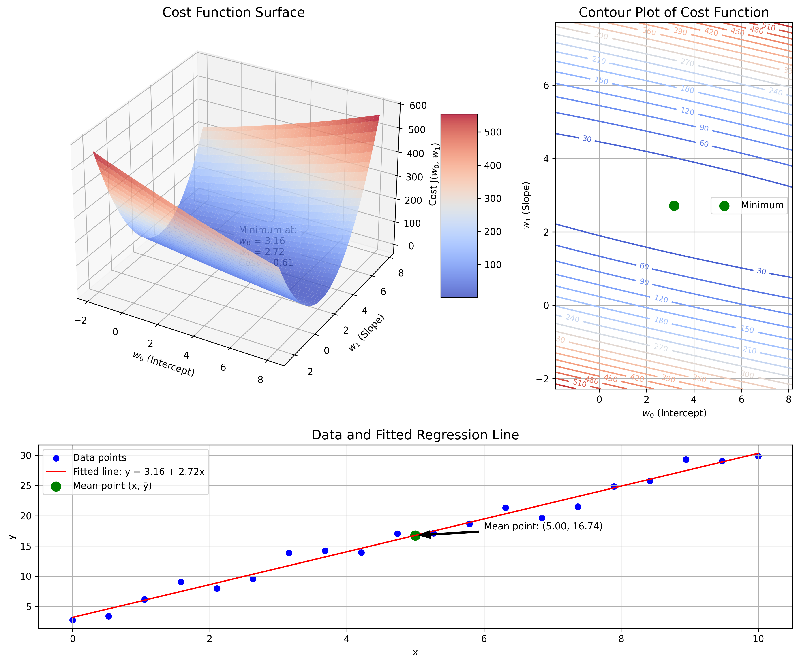
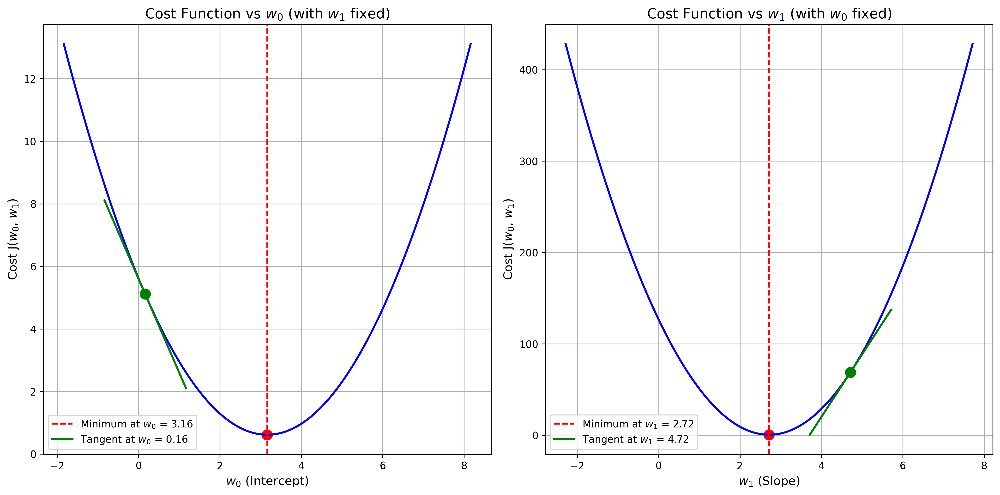
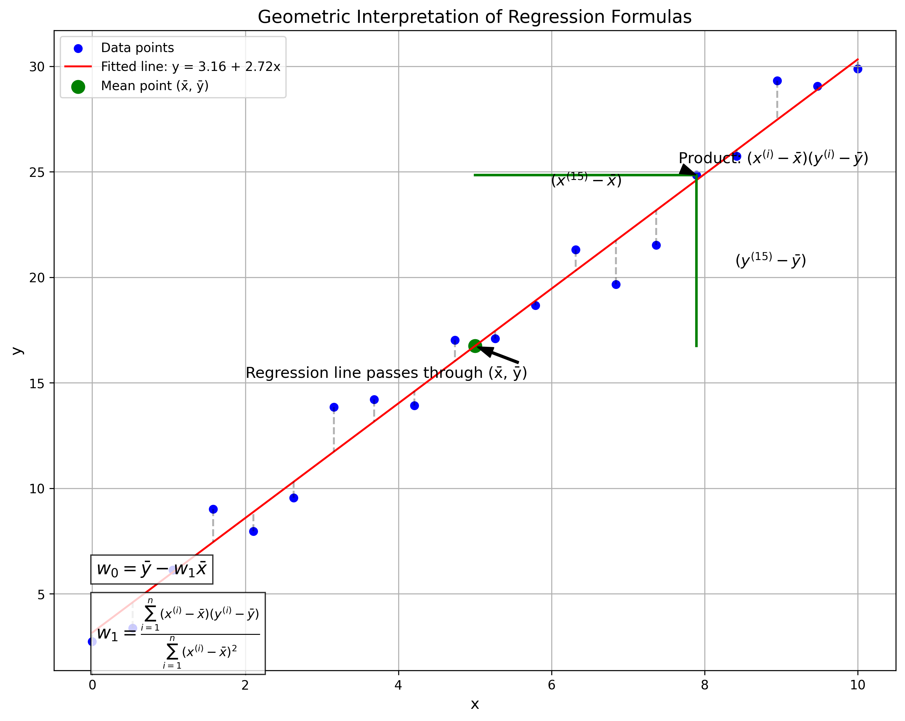

# Question 25: Deriving Linear Regression Parameters

## Problem Statement
Consider the following cost function for linear regression:
$$J(w_0, w_1) = \frac{1}{2n}\sum_{i=1}^{n}(w_0 + w_1x^{(i)} - y^{(i)})^2$$

### Task
1. Take the partial derivative of this cost function with respect to $w_0$
2. Take the partial derivative with respect to $w_1$
3. Set both partial derivatives to zero and solve for $w_0$ and $w_1$
4. Show how this gives the standard formulas for the intercept and slope in simple linear regression

## Understanding the Problem
This problem focuses on the mathematical derivation of the optimal parameters for linear regression by minimizing the cost function. Linear regression aims to find a linear relationship between input features and output values by identifying the best-fitting line through the data points. The cost function quantifies the error between the predicted values and actual values, and by minimizing this cost function, we can find the optimal parameters ($w_0$ and $w_1$) that make the best predictions.

The Mean Squared Error (MSE) cost function used here measures the average squared difference between predicted values ($w_0 + w_1x^{(i)}$) and actual values ($y^{(i)}$). By taking the partial derivatives of this cost function with respect to each parameter and setting them to zero, we can find the values of $w_0$ and $w_1$ that minimize the error, leading to the standard formulas for linear regression.

## Solution

### Step 1: Take the partial derivative of the cost function with respect to $w_0$
First, we need to compute the partial derivative of $J(w_0, w_1)$ with respect to $w_0$. Let's start by looking at the derivative of a single term inside the sum.

For a single data point $(x^{(i)}, y^{(i)})$, the derivative of $(w_0 + w_1x^{(i)} - y^{(i)})^2$ with respect to $w_0$ is:
$$\frac{\partial}{\partial w_0}(w_0 + w_1x^{(i)} - y^{(i)})^2 = 2(w_0 + w_1x^{(i)} - y^{(i)}) \times 1 = 2(w_0 + w_1x^{(i)} - y^{(i)})$$

Now, for the entire cost function, using the linearity of differentiation and summation:
$$\frac{\partial J}{\partial w_0} = \frac{1}{2n} \times 2 \sum_{i=1}^{n}(w_0 + w_1x^{(i)} - y^{(i)}) = \frac{1}{n}\sum_{i=1}^{n}(w_0 + w_1x^{(i)} - y^{(i)})$$

We can simplify this further:
$$\frac{\partial J}{\partial w_0} = \frac{1}{n}[nw_0 + w_1\sum_{i=1}^{n}x^{(i)} - \sum_{i=1}^{n}y^{(i)}]$$

Using the notation $\bar{x} = \frac{1}{n}\sum_{i=1}^{n}x^{(i)}$ and $\bar{y} = \frac{1}{n}\sum_{i=1}^{n}y^{(i)}$ for the means, we get:
$$\frac{\partial J}{\partial w_0} = w_0 + w_1\bar{x} - \bar{y}$$

### Step 2: Take the partial derivative with respect to $w_1$
Similarly, for a single data point, the derivative with respect to $w_1$ is:
$$\frac{\partial}{\partial w_1}(w_0 + w_1x^{(i)} - y^{(i)})^2 = 2(w_0 + w_1x^{(i)} - y^{(i)}) \times x^{(i)} = 2(w_0 + w_1x^{(i)} - y^{(i)})x^{(i)}$$

For the entire cost function:
$$\frac{\partial J}{\partial w_1} = \frac{1}{n}\sum_{i=1}^{n}(w_0 + w_1x^{(i)} - y^{(i)})x^{(i)}$$

Expanding this expression:
$$\frac{\partial J}{\partial w_1} = \frac{1}{n}[w_0\sum_{i=1}^{n}x^{(i)} + w_1\sum_{i=1}^{n}(x^{(i)})^2 - \sum_{i=1}^{n}y^{(i)}x^{(i)}]$$

Let's define:
- $\bar{x} = \frac{1}{n}\sum_{i=1}^{n}x^{(i)}$ (mean of x values)
- $\bar{y} = \frac{1}{n}\sum_{i=1}^{n}y^{(i)}$ (mean of y values)
- $SS_{xx} = \sum_{i=1}^{n}(x^{(i)})^2$ (sum of squared x values)
- $SS_{xy} = \sum_{i=1}^{n}x^{(i)}y^{(i)}$ (sum of products of x and y)

Then we can rewrite the partial derivative as:
$$\frac{\partial J}{\partial w_1} = w_0\bar{x} + w_1\frac{SS_{xx}}{n} - \frac{SS_{xy}}{n}$$

### Step 3: Set both partial derivatives to zero and solve for $w_0$ and $w_1$
Setting $\frac{\partial J}{\partial w_0} = 0$:
$$w_0 + w_1\bar{x} - \bar{y} = 0$$
$$w_0 = \bar{y} - w_1\bar{x} \quad \ldots (1)$$

Setting $\frac{\partial J}{\partial w_1} = 0$:
$$w_0\bar{x} + w_1\frac{SS_{xx}}{n} - \frac{SS_{xy}}{n} = 0$$

Substituting equation (1) for $w_0$:
$$(\bar{y} - w_1\bar{x})\bar{x} + w_1\frac{SS_{xx}}{n} - \frac{SS_{xy}}{n} = 0$$
$$\bar{y}\bar{x} - w_1\bar{x}^2 + w_1\frac{SS_{xx}}{n} - \frac{SS_{xy}}{n} = 0$$

Solving for $w_1$:
$$w_1\left(\frac{SS_{xx}}{n} - \bar{x}^2\right) = \frac{SS_{xy}}{n} - \bar{y}\bar{x}$$

Note that:
$$\frac{SS_{xx}}{n} - \bar{x}^2 = \frac{1}{n}\sum_{i=1}^{n}(x^{(i)})^2 - \left(\frac{1}{n}\sum_{i=1}^{n}x^{(i)}\right)^2 = \frac{1}{n}\sum_{i=1}^{n}(x^{(i)} - \bar{x})^2 = Var(x)$$

And:
$$\frac{SS_{xy}}{n} - \bar{y}\bar{x} = \frac{1}{n}\sum_{i=1}^{n}x^{(i)}y^{(i)} - \frac{1}{n}\sum_{i=1}^{n}x^{(i)} \cdot \frac{1}{n}\sum_{i=1}^{n}y^{(i)} = \frac{1}{n}\sum_{i=1}^{n}(x^{(i)} - \bar{x})(y^{(i)} - \bar{y}) = Cov(x, y)$$

Therefore:
$$w_1 = \frac{Cov(x, y)}{Var(x)} = \frac{\sum_{i=1}^{n}(x^{(i)} - \bar{x})(y^{(i)} - \bar{y})}{\sum_{i=1}^{n}(x^{(i)} - \bar{x})^2}$$

And substituting back into equation (1):
$$w_0 = \bar{y} - w_1\bar{x}$$

### Step 4: Show how this gives the standard formulas for simple linear regression
The standard formulas for simple linear regression are:

Slope (β₁):
$$\beta_1 = \frac{\sum_{i=1}^{n}(x_i - \bar{x})(y_i - \bar{y})}{\sum_{i=1}^{n}(x_i - \bar{x})^2}$$

Intercept (β₀):
$$\beta_0 = \bar{y} - \beta_1\bar{x}$$

Our derived formulas are identical:
$$w_1 = \frac{\sum_{i=1}^{n}(x^{(i)} - \bar{x})(y^{(i)} - \bar{y})}{\sum_{i=1}^{n}(x^{(i)} - \bar{x})^2}$$
$$w_0 = \bar{y} - w_1\bar{x}$$

Therefore, by minimizing the squared error cost function through differentiation, we arrive at the standard formulas for simple linear regression parameters where $w_0 = \beta_0$ (intercept) and $w_1 = \beta_1$ (slope).

## Practical Implementation
To better understand these formulas and their implications, let's visualize the cost function and the optimization process.

### Visualizing the Cost Function
The cost function $J(w_0, w_1)$ can be visualized as a surface in 3D space, where different combinations of $w_0$ and $w_1$ values result in different values of the cost. The goal of optimization is to find the point on this surface with the minimum cost.

The visualization below shows the cost function surface and contour plot for a sample dataset. The green point represents the minimum of the function, which corresponds to the optimal values of $w_0$ and $w_1$ that minimize the cost.

### Understanding the Partial Derivatives
Partial derivatives of the cost function with respect to $w_0$ and $w_1$ provide the direction and magnitude of the steepest increase in the cost. At the minimum point of the cost function, both partial derivatives equal zero, indicating no gradient (or slope) in any direction.

The visualization shows the cost function plotted against $w_0$ (with $w_1$ fixed at its optimal value) and against $w_1$ (with $w_0$ fixed at its optimal value). The red dotted lines indicate the minimum points, where the derivatives are zero. The green lines show the tangent at a non-optimal point, illustrating the non-zero slope that points toward the minimum.

### Geometric Interpretation of the Formulas
The derived formulas can also be understood geometrically. The formula for the slope ($w_1$) represents the ratio of the covariance between $x$ and $y$ to the variance of $x$. This measures how much $y$ changes when $x$ changes, normalized by the variability in $x$.

The formula for the intercept ($w_0$) ensures that the regression line passes through the point of means $(\bar{x}, \bar{y})$. This is a fundamental property of the least squares solution.

## Visual Explanations

### Cost Function Visualization

This figure illustrates the cost function as a 3D surface and a contour plot. The cost function $J(w_0, w_1)$ measures the average squared error between predictions and actual values. The green point represents the minimum of the cost function, which occurs at the optimal values of $w_0$ and $w_1$. The bottom plot shows the data points and the fitted regression line, with the mean point $(\bar{x}, \bar{y})$ marked in green.

### Partial Derivatives Visualization

This visualization shows how the cost function changes with respect to $w_0$ (left) and $w_1$ (right), with the other parameter held constant at its optimal value. The red dotted lines indicate the minimum points where the derivatives are zero. The green lines show the tangent at non-optimal points, illustrating the non-zero derivative that points toward the minimum. At the minimum, the slopes (derivatives) become zero, confirming our mathematical derivation.

### Geometric Interpretation of Regression Formulas

This figure provides a geometric interpretation of the regression formulas. The data points are shown in blue, and the fitted regression line in red. The green point represents the mean $(\bar{x}, \bar{y})$, which the regression line must pass through. The vertical dashed lines show the residuals (errors) between the data points and the fitted line. For a specific data point (highlighted), the figure shows the deviations from the means $(x^{(i)} - \bar{x})$ and $(y^{(i)} - \bar{y})$, which are the components of the slope formula. The formula for $w_1$ (slope) and $w_0$ (intercept) are displayed in the bottom left of the plot.

## Key Insights

### Mathematical Properties
- The cost function $J(w_0, w_1)$ is a convex function, which means it has a single global minimum.
- At the minimum of the cost function, the partial derivatives with respect to both parameters are zero.
- The optimal parameters can be found analytically by solving a system of linear equations derived from setting the partial derivatives to zero.
- The optimal parameters ensure that the sum of the residuals equals zero and that the residuals are uncorrelated with the predictor variable.

### Statistical Interpretations
- The formula for $w_1$ (slope) represents the change in the predicted value for a one-unit change in the predictor variable.
- The formula for $w_0$ (intercept) represents the predicted value when the predictor variable is zero.
- The regression line always passes through the point of means $(\bar{x}, \bar{y})$.
- The optimal parameters minimize the sum of squared vertical distances from the data points to the regression line.

### Practical Applications
- The derived formulas provide a direct way to calculate the optimal parameters from the data without using iterative methods.
- Understanding the mathematical derivation helps in extending these concepts to multiple linear regression and other regression models.
- The geometric interpretation provides intuition about how the regression line relates to the data and why these specific formulas yield the best fit.
- These formulas form the foundation for many machine learning algorithms and statistical methods.

## Conclusion
- The partial derivative of the linear regression cost function with respect to $w_0$ is $w_0 + w_1\bar{x} - \bar{y}$.
- The partial derivative with respect to $w_1$ is $w_0\bar{x} + w_1\frac{SS_{xx}}{n} - \frac{SS_{xy}}{n}$.
- Setting these derivatives to zero and solving for $w_0$ and $w_1$ gives us $w_1 = \frac{\sum_{i=1}^{n}(x^{(i)} - \bar{x})(y^{(i)} - \bar{y})}{\sum_{i=1}^{n}(x^{(i)} - \bar{x})^2}$ and $w_0 = \bar{y} - w_1\bar{x}$.
- These formulas are identical to the standard formulas for the slope and intercept in simple linear regression.

The process of deriving these formulas illustrates the power of calculus in finding optimal solutions in machine learning. The resulting formulas provide a direct method for fitting a linear regression model to data, which is computationally efficient and statistically sound. Understanding this derivation also provides a foundation for more complex regression models and optimization problems in machine learning. 