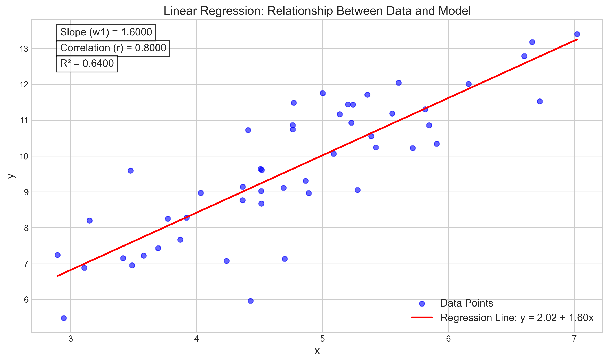
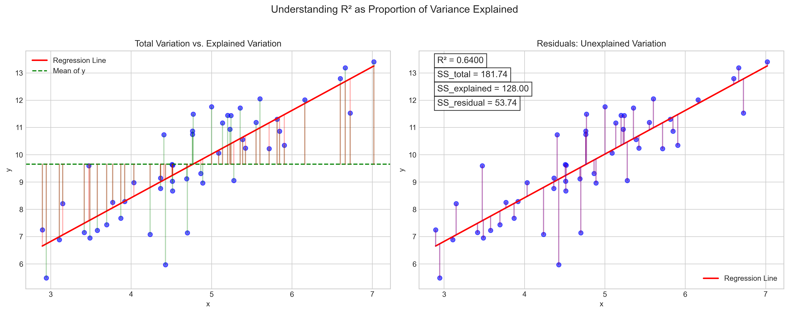
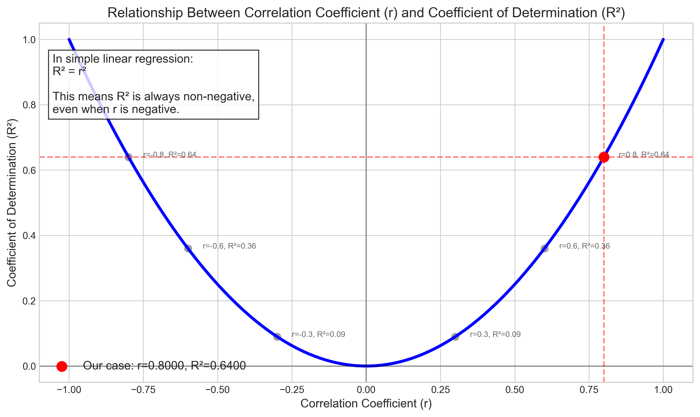

# Question 26: Linear Regression Analysis

## Problem Statement
For a simple linear regression model, you've calculated that $\sum_{i=1}^{n}(x_i - \bar{x})^2 = 50$, $\sum_{i=1}^{n}(y_i - \bar{y})^2 = 200$, and $\sum_{i=1}^{n}(x_i - \bar{x})(y_i - \bar{y}) = 80$.

### Task
1. Calculate the slope coefficient $w_1$
2. Calculate the correlation coefficient $r$
3. Calculate the coefficient of determination $R^2$ without performing any additional calculations
4. Explain the relationship between $r$ and $R^2$ in simple linear regression

## Understanding the Problem
In simple linear regression, we model the relationship between a dependent variable $y$ and an independent variable $x$ using a linear equation $y = w_0 + w_1x$. The parameters $w_0$ (intercept) and $w_1$ (slope) are estimated from data.

The correlation coefficient $r$ measures the strength and direction of the linear relationship between two variables, ranging from -1 to 1. The coefficient of determination $R^2$ indicates the proportion of variance in the dependent variable that is predictable from the independent variable.

This problem provides us with summary statistics: the sum of squared deviations for $x$ and $y$, and their cross product. We need to use these to calculate key regression metrics and understand their relationships.

## Solution

### Step 1: Calculate the slope coefficient $w_1$
The formula for the slope coefficient in simple linear regression is:

$$w_1 = \frac{\sum_{i=1}^{n}(x_i - \bar{x})(y_i - \bar{y})}{\sum_{i=1}^{n}(x_i - \bar{x})^2}$$

Substituting the given values:

$$w_1 = \frac{80}{50} = 1.6$$

Therefore, the slope coefficient $w_1 = 1.6$. This means that for each unit increase in $x$, we expect $y$ to increase by 1.6 units.

### Step 2: Calculate the correlation coefficient $r$
The correlation coefficient can be calculated using the formula:

$$r = \frac{\sum_{i=1}^{n}(x_i - \bar{x})(y_i - \bar{y})}{\sqrt{\sum_{i=1}^{n}(x_i - \bar{x})^2 \sum_{i=1}^{n}(y_i - \bar{y})^2}}$$

Substituting the given values:

$$r = \frac{80}{\sqrt{50 \times 200}} = \frac{80}{\sqrt{10000}} = \frac{80}{100} = 0.8$$

Therefore, the correlation coefficient $r = 0.8$. This indicates a strong positive linear relationship between $x$ and $y$.

### Step 3: Calculate the coefficient of determination $R^2$
In simple linear regression, the coefficient of determination $R^2$ is equal to the square of the correlation coefficient $r$:

$$R^2 = r^2$$

Therefore:

$$R^2 = (0.8)^2 = 0.64$$

This means that approximately 64% of the variability in $y$ can be explained by the linear relationship with $x$.

### Step 4: Explain the relationship between $r$ and $R^2$
In simple linear regression (with only one predictor variable), $R^2$ is exactly equal to the square of the correlation coefficient $r$, i.e., $R^2 = r^2$. This important relationship has several implications:

1. Since $r$ ranges from -1 to 1, $R^2$ ranges from 0 to 1.
2. $R^2$ is always non-negative, even when $r$ is negative.
3. The sign of $r$ indicates the direction of the relationship (positive or negative), while $R^2$ only indicates the strength of the relationship.
4. When $r = 0$, $R^2 = 0$, indicating no linear relationship.
5. When $|r| = 1$, $R^2 = 1$, indicating a perfect linear relationship.

In our case, $r = 0.8$ and $R^2 = 0.64$, which means that 64% of the variability in $y$ is explained by the linear relationship with $x$. The positive value of $r$ indicates a positive linear relationship, which is consistent with the positive slope coefficient $w_1 = 1.6$.

## Practical Implementation
We can better understand these concepts by visualizing a dataset that has the given statistical properties.

### Linear Regression Visualization

This visualization shows a simulated dataset with the statistical properties given in the problem. The red line represents the regression line with slope $w_1 = 1.6$. The correlation coefficient $r = 0.8$ indicates a strong positive linear relationship, and the coefficient of determination $R^2 = 0.64$ indicates that 64% of the variability in $y$ is explained by the linear relationship with $x$.

### Understanding $R^2$ as Proportion of Variance Explained

The left panel shows the total variation (green vertical lines from points to the mean line) and the explained variation (red vertical lines from the mean line to the regression line). The right panel shows the residual or unexplained variation (purple vertical lines from points to the regression line). The ratio of explained variation to total variation is $R^2 = 0.64$.

### Relationship Between $r$ and $R^2$

This plot illustrates the quadratic relationship between the correlation coefficient $r$ and the coefficient of determination $R^2$. The red point highlights our case where $r = 0.8$ and $R^2 = 0.64$. Note that whether $r$ is positive or negative, $R^2$ remains positive and equals $r^2$.

## Key Insights

### Theoretical Foundations
- The slope coefficient $w_1$ represents the change in $y$ for a one-unit change in $x$.
- The correlation coefficient $r$ measures the strength and direction of the linear relationship.
- The coefficient of determination $R^2$ represents the proportion of variance explained by the model.
- In simple linear regression, $R^2 = r^2$, which is a special case that doesn't hold for multiple regression.

### Statistical Implications
- The sign of $r$ (and thus $w_1$) indicates whether the relationship is positive or negative.
- Higher absolute values of $r$ indicate stronger linear relationships.
- $R^2 = 0.64$ means that 64% of the variability in $y$ is explained by $x$.
- The remaining 36% of the variability is due to factors not included in the model or random variation.

### Practical Applications
- When $r$ and $R^2$ are high, we can make more reliable predictions using the regression model.
- The slope $w_1 = 1.6$ can be used for predictions and to understand the magnitude of the effect.
- For decision-making, it's important to consider both the direction (sign of $r$) and strength ($R^2$) of the relationship.
- In business contexts, $R^2 = 0.64$ would typically be considered a moderately strong effect, useful for predictions.

## Conclusion
- The slope coefficient $w_1 = 1.6$, indicating that $y$ increases by 1.6 units for each unit increase in $x$.
- The correlation coefficient $r = 0.8$, indicating a strong positive linear relationship between $x$ and $y$.
- The coefficient of determination $R^2 = 0.64$, indicating that 64% of the variability in $y$ is explained by the linear relationship with $x$.
- In simple linear regression, $R^2$ is exactly equal to the square of the correlation coefficient $r$. 