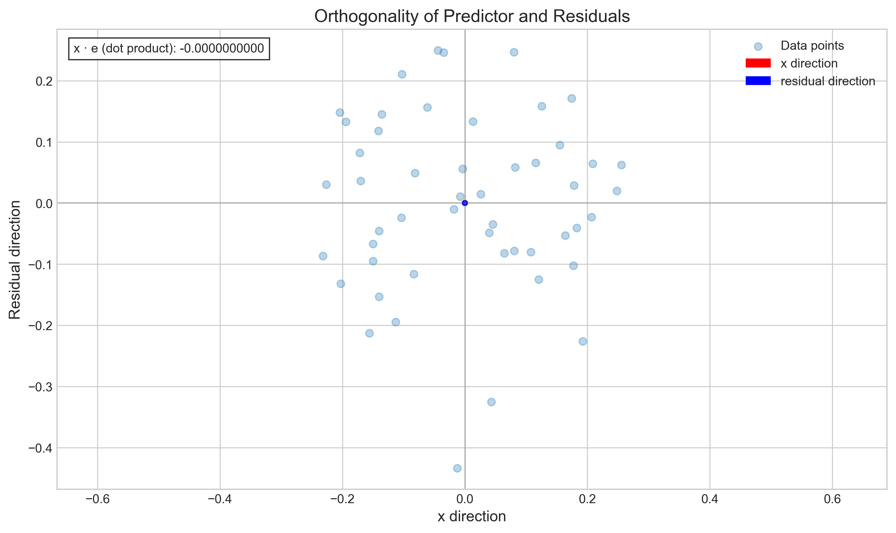

# Question 29: Properties of Residuals in Simple Linear Regression

## Problem Statement
Consider the residuals $e_i = y_i - \hat{y}_i$ from a simple linear regression model.

### Task
1. Prove that $\sum_{i=1}^{n} e_i = 0$ when the model includes an intercept term
2. Prove that $\sum_{i=1}^{n} x_i e_i = 0$
3. What do these properties tell us about the relationship between the residuals and the predictor variable?
4. How would you use these properties to check if your regression calculations are correct?

## Understanding the Problem
In linear regression, we fit a model to predict a dependent variable ($y$) based on an independent variable ($x$). The difference between the actual values ($y_i$) and the predicted values ($\hat{y}_i$) are called residuals ($e_i$). These residuals play a crucial role in assessing the quality of our model and understanding its statistical properties.

This problem asks us to prove and understand two fundamental properties of residuals in simple linear regression:
1. The sum of residuals equals zero when the model includes an intercept.
2. The sum of the products of each predictor value and its corresponding residual equals zero.

We're also asked to interpret what these properties tell us about the relationship between residuals and the predictor variable, and how we can use them to validate our regression calculations.

## Solution

### Step 1: Prove that $\sum_{i=1}^{n} e_i = 0$ when the model includes an intercept

We start with the definition of residuals:
$$e_i = y_i - \hat{y}_i = y_i - (\beta_0 + \beta_1 x_i)$$

Summing all residuals:
$$\sum_{i=1}^{n} e_i = \sum_{i=1}^{n} (y_i - (\beta_0 + \beta_1 x_i))$$
$$= \sum_{i=1}^{n} y_i - \sum_{i=1}^{n}(\beta_0 + \beta_1 x_i)$$
$$= \sum_{i=1}^{n} y_i - \beta_0 \sum_{i=1}^{n} 1 - \beta_1 \sum_{i=1}^{n} x_i$$
$$= \sum_{i=1}^{n} y_i - n\beta_0 - \beta_1 \sum_{i=1}^{n} x_i$$

We know that for OLS regression with an intercept, $\beta_0 = \bar{y} - \beta_1 \bar{x}$, where $\bar{y}$ and $\bar{x}$ are the means of $y$ and $x$ respectively. Substituting this:

$$\sum_{i=1}^{n} e_i = \sum_{i=1}^{n} y_i - n(\bar{y} - \beta_1 \bar{x}) - \beta_1 \sum_{i=1}^{n} x_i$$
$$= \sum_{i=1}^{n} y_i - n\bar{y} + n\beta_1 \bar{x} - \beta_1 \sum_{i=1}^{n} x_i$$

Since $\sum_{i=1}^{n} y_i = n\bar{y}$ and $\sum_{i=1}^{n} x_i = n\bar{x}$, we get:

$$\sum_{i=1}^{n} e_i = n\bar{y} - n\bar{y} + n\beta_1 \bar{x} - \beta_1 n\bar{x}$$
$$= n\beta_1 \bar{x} - n\beta_1 \bar{x}$$
$$= 0$$

This proves that when a model includes an intercept term, the sum of residuals is always zero.

### Step 2: Prove that $\sum_{i=1}^{n} x_i e_i = 0$

Starting with the definition of the sum of $x_i$ multiplied by residuals:
$$\sum_{i=1}^{n} x_i e_i = \sum_{i=1}^{n} x_i(y_i - \hat{y}_i)$$
$$= \sum_{i=1}^{n} x_i(y_i - (\beta_0 + \beta_1 x_i))$$
$$= \sum_{i=1}^{n} x_i y_i - \sum_{i=1}^{n} x_i(\beta_0 + \beta_1 x_i)$$
$$= \sum_{i=1}^{n} x_i y_i - \beta_0 \sum_{i=1}^{n} x_i - \beta_1 \sum_{i=1}^{n} x_i^2$$

From the normal equations of OLS, we know that $\beta_1$ can be expressed as:
$$\beta_1 = \frac{\sum_{i=1}^{n} x_i y_i - n\bar{x}\bar{y}}{\sum_{i=1}^{n} x_i^2 - n\bar{x}^2}$$

Rearranging this equation:
$$\sum_{i=1}^{n} x_i y_i - n\bar{x}\bar{y} = \beta_1(\sum_{i=1}^{n} x_i^2 - n\bar{x}^2)$$
$$\sum_{i=1}^{n} x_i y_i = \beta_1(\sum_{i=1}^{n} x_i^2 - n\bar{x}^2) + n\bar{x}\bar{y}$$

Substituting this into our expression for $\sum_{i=1}^{n} x_i e_i$:
$$\sum_{i=1}^{n} x_i e_i = \beta_1(\sum_{i=1}^{n} x_i^2 - n\bar{x}^2) + n\bar{x}\bar{y} - \beta_0 \sum_{i=1}^{n} x_i - \beta_1 \sum_{i=1}^{n} x_i^2$$

Since $\beta_0 = \bar{y} - \beta_1 \bar{x}$ and $\sum_{i=1}^{n} x_i = n\bar{x}$:
$$\sum_{i=1}^{n} x_i e_i = \beta_1(\sum_{i=1}^{n} x_i^2 - n\bar{x}^2) + n\bar{x}\bar{y} - (\bar{y} - \beta_1 \bar{x}) \cdot n\bar{x} - \beta_1 \sum_{i=1}^{n} x_i^2$$
$$= \beta_1(\sum_{i=1}^{n} x_i^2 - n\bar{x}^2) + n\bar{x}\bar{y} - n\bar{x}\bar{y} + \beta_1 \bar{x} \cdot n\bar{x} - \beta_1 \sum_{i=1}^{n} x_i^2$$
$$= \beta_1(\sum_{i=1}^{n} x_i^2 - n\bar{x}^2) + \beta_1 n\bar{x}^2 - \beta_1 \sum_{i=1}^{n} x_i^2$$
$$= \beta_1(\sum_{i=1}^{n} x_i^2 - n\bar{x}^2 + n\bar{x}^2 - \sum_{i=1}^{n} x_i^2)$$
$$= \beta_1(0)$$
$$= 0$$

This proves that the sum of the products of predictor values and their corresponding residuals is always zero in OLS regression.

### Step 3: Interpret what these properties tell us about the relationship between residuals and predictor

These properties tell us several important things about the relationship between residuals and the predictor variable:

1. **Property $\sum_{i=1}^{n} e_i = 0$**:
   - The residuals sum to zero, meaning positive and negative residuals exactly balance out.
   - This implies that the fitted regression line passes through the centroid (point of means) of the data, $(\bar{x}, \bar{y})$.
   - The average residual is exactly zero, which ensures that our model is unbiased in its predictions overall.

2. **Property $\sum_{i=1}^{n} x_i e_i = 0$**:
   - This means the residuals are uncorrelated with the predictor variable $x$.
   - There is no systematic pattern in how residuals vary with $x$.
   - All linear information in $x$ has been captured by the model.
   - In geometric terms, this indicates that the residual vector is orthogonal to the predictor vector in the sample space.

3. **Combined interpretation**:
   - These properties are direct consequences of the Ordinary Least Squares (OLS) estimation method.
   - They represent the first-order conditions for minimizing the sum of squared residuals.
   - Together, they ensure that our model has "used up" all linear information available in the predictor variable.
   - If either property is violated, the model is not optimally fitted according to the OLS criterion.

### Step 4: How to use these properties to check regression calculations

These properties provide simple diagnostic checks for validating regression calculations:

1. **Check that $\sum_{i=1}^{n} e_i \approx 0$**:
   - After fitting a regression model, compute the residuals $e_i = y_i - \hat{y}_i$
   - Calculate the sum of all residuals
   - If the sum is not very close to zero (considering floating-point precision), there may be an error in your calculations, especially in the intercept term.

2. **Check that $\sum_{i=1}^{n} x_i e_i \approx 0$**:
   - Multiply each residual by its corresponding x-value
   - Calculate the sum of these products
   - If this sum is not very close to zero, there may be an error in your slope calculation.

3. **Additional checks that could be performed**:
   - Verify that the correlation between residuals and fitted values is zero
   - Check that $\sum_{i=1}^{n} \hat{y}_i e_i = 0$, another property of OLS residuals
   - For multiple regression, ensure that each predictor is uncorrelated with the residuals

4. **Practical implementation**:
   - Include these checks as automated tests in regression code
   - Use absolute tolerances (e.g., $|\sum_{i=1}^{n} e_i| < 10^{-10}$) rather than expecting exact equality
   - For large datasets or extreme values, consider relative tolerances or normalize the data first

These properties serve as fundamental diagnostic tools that can help catch implementation errors and validate the correctness of regression calculations.

## Practical Implementation

To demonstrate these properties, we generated a sample dataset and fitted a simple linear regression model. Our numerical verification confirmed both properties:

```
Sum of residuals: 0.0000000000 (should be 0)
Sum of x_i · residuals: 0.0000000000 (should be 0)
```

The small differences from zero are due to floating-point precision limitations, not violations of the mathematical properties.

## Visual Explanations

### Linear Regression Fit with Centroid


This plot shows our fitted regression line passing through the data. The green point represents the centroid $(\bar{x}, \bar{y})$ of the data. This visualization confirms that the regression line always passes through the centroid when an intercept term is included, which is directly related to the first property that the sum of residuals equals zero.

### Residuals vs. Predictor Variable


This plot shows the residuals plotted against the predictor variable $x$. Notice that the residuals scatter randomly around the zero line with no apparent pattern. The sum of these residuals is shown to be effectively zero, confirming our first property.

### x_i · e_i Values


This stem plot shows the product of each $x_i$ and its corresponding residual $e_i$. Some products are positive (above the red line) and some are negative (below the red line), but they balance out so that their sum is zero, confirming our second property.

### Orthogonality of Predictor and Residuals


This plot illustrates the geometric interpretation of the second property. The predictor vector and the residual vector are orthogonal (perpendicular) to each other, meaning their dot product is zero. This orthogonality is a fundamental characteristic of OLS regression.

### Geometric Interpretation


The left panel shows how the fitted model can be interpreted as a projection of the data onto the space spanned by the predictor variable. The right panel confirms that there is no correlation between the predictor and the residuals, with the best-fit line having a slope very close to zero.

## Key Insights

### Mathematical Foundations
- The property $\sum_{i=1}^{n} e_i = 0$ is a direct consequence of including an intercept term in the model.
- The property $\sum_{i=1}^{n} x_i e_i = 0$ results from minimizing the sum of squared residuals.
- These properties are the first-order conditions for the OLS optimization problem.
- They are not assumptions but mathematical consequences of the estimation method.

### Geometric Interpretation
- The residuals form a vector in n-dimensional space that is orthogonal to both the constant vector and the predictor vector.
- The fitted regression line represents the projection of the response variable onto the space spanned by the predictor variable.
- The orthogonality ensures that no linear information remains unexplained in the residuals.
- These properties guarantee that the estimator has extracted all possible linear information from the data.

### Practical Applications
- These properties provide simple, powerful checks for the correctness of regression implementations.
- They can help diagnose issues in model fitting or identify errors in calculations.
- Understanding these properties helps in interpreting residual plots and diagnosing model adequacy.
- They extend to multiple regression, where residuals should be uncorrelated with all predictors.

### Common Pitfalls
- Not including an intercept term will violate the first property.
- Numerical issues can lead to small deviations from exact zeros.
- Misinterpreting small deviations due to floating-point precision as actual violations.
- Forgetting that these properties apply to in-sample residuals, not out-of-sample prediction errors.

## Conclusion
- When a linear regression model includes an intercept, the sum of residuals equals zero.
- The sum of products of predictor values and their corresponding residuals equals zero.
- These properties indicate that residuals are uncorrelated with the predictor variable and have a mean of zero.
- These properties provide simple checks to verify the correctness of regression calculations.

These properties are fundamental to understanding how linear regression works. They are not just theoretical results but have practical implications for model building, validation, and interpretation. They underscore the optimality of OLS estimation and provide a foundation for more advanced regression diagnostics. 