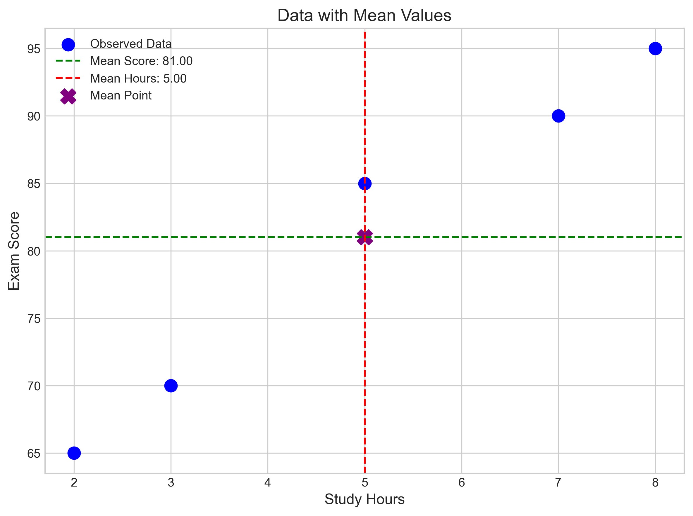
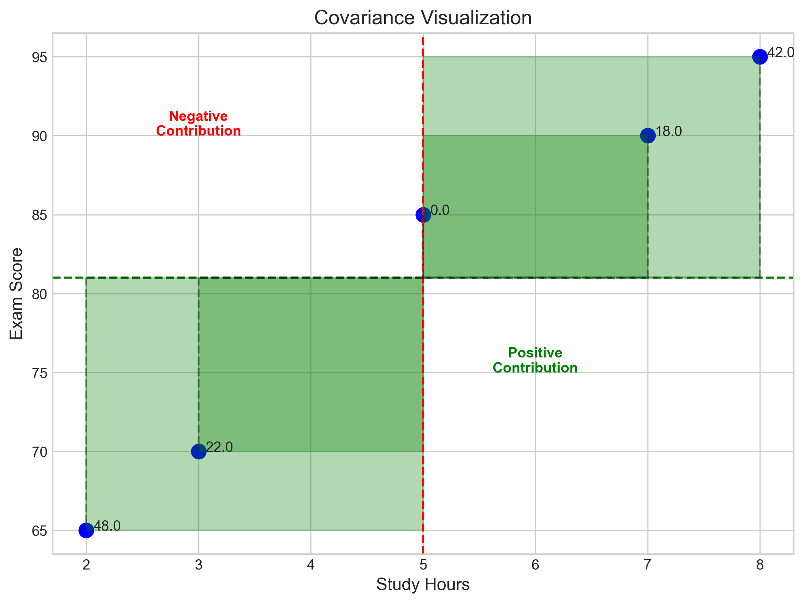
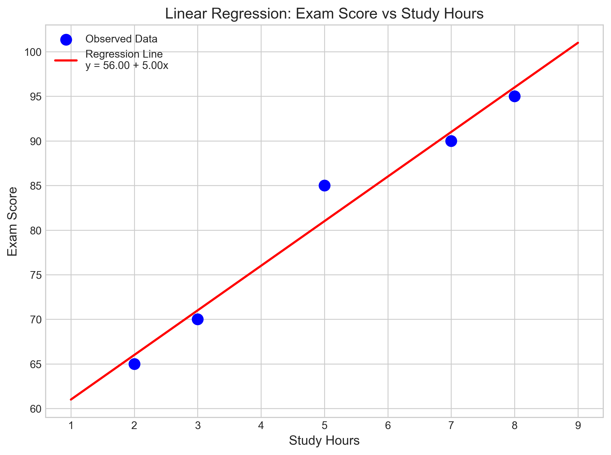
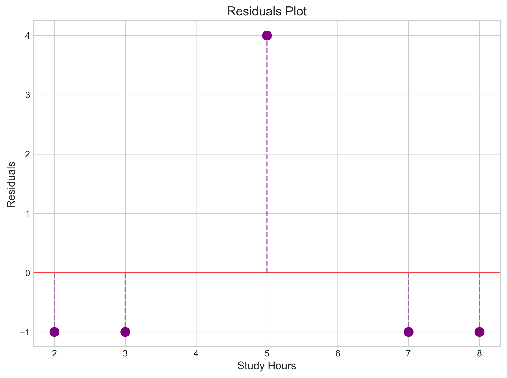
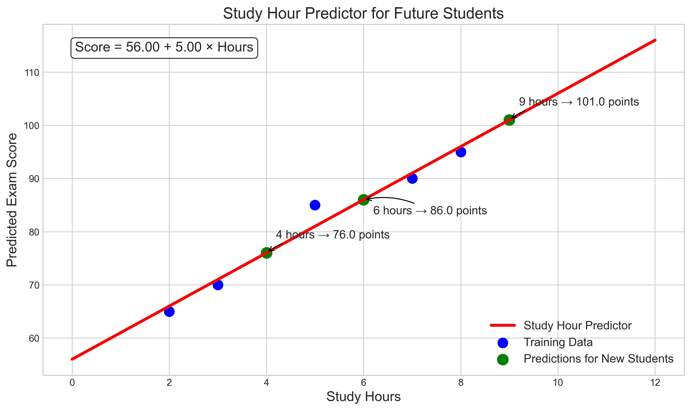

# Question 2: Study Time and Exam Performance Regression

## Problem Statement
Professor Statistics wants to help first-year students understand how study time affects exam performance. She collected data from 5 students who tracked their study hours before the final exam:

| Hours Studying (x) | Exam Score (y) |
|--------------------|----------------|
| 2                  | 65             |
| 3                  | 70             |
| 5                  | 85             |
| 7                  | 90             |
| 8                  | 95             |

Professor Statistics believes this is a perfect opportunity to demonstrate simple linear regression and wants to create a "Study Hour Predictor" for future students.

### Task
1. Calculate the average study time ($\bar{x}$) and average exam score ($\bar{y}$)
2. Calculate the covariance between study hours and exam scores:
   $$\text{Cov}(x,y) = \frac{1}{n}\sum_{i=1}^{n}(x_i - \bar{x})(y_i - \bar{y})$$
3. Calculate the variance of study hours:
   $$\text{Var}(x) = \frac{1}{n}\sum_{i=1}^{n}(x_i - \bar{x})^2$$
4. Using these values, compute the "magic formula" (the slope $\beta_1$ and intercept $\beta_0$) for predicting exam scores:
   $$\beta_1 = \frac{\text{Cov}(x,y)}{\text{Var}(x)} \quad \text{and} \quad \beta_0 = \bar{y} - \beta_1\bar{x}$$

## Understanding the Problem
This problem illustrates how simple linear regression can be derived and applied in an educational context. We want to establish a relationship between study time (independent variable) and exam performance (dependent variable). The goal is to find a linear equation that best describes this relationship, which can then be used to predict how well students might perform based on how many hours they study.

The key statistical concepts involved are:
- Mean (average) as a measure of central tendency
- Covariance as a measure of how two variables change together
- Variance as a measure of dispersion or spread
- Linear regression coefficients ($\beta_0$ and $\beta_1$) that define the line of best fit

## Solution

### Step 1: Calculate the average study time and average exam score
The mean of a set of values is calculated by summing them and dividing by the number of values.

For study hours:
$$\bar{x} = \frac{2 + 3 + 5 + 7 + 8}{5} = \frac{25}{5} = 5 \text{ hours}$$

For exam scores:
$$\bar{y} = \frac{65 + 70 + 85 + 90 + 95}{5} = \frac{405}{5} = 81 \text{ points}$$

So the average student in this sample studied for 5 hours and scored 81 points on the exam.

### Step 2: Calculate the covariance between study hours and exam scores
Covariance measures how much two variables change together. It's calculated using the formula:

$$\text{Cov}(x,y) = \frac{1}{n}\sum_{i=1}^{n}(x_i - \bar{x})(y_i - \bar{y})$$

Let's compute each term in the sum:
- $(2 - 5)(65 - 81) = (-3)(-16) = 48$
- $(3 - 5)(70 - 81) = (-2)(-11) = 22$
- $(5 - 5)(85 - 81) = (0)(4) = 0$
- $(7 - 5)(90 - 81) = (2)(9) = 18$
- $(8 - 5)(95 - 81) = (3)(14) = 42$

Adding these up and dividing by the number of data points:
$$\text{Cov}(x,y) = \frac{48 + 22 + 0 + 18 + 42}{5} = \frac{130}{5} = 26$$

The positive covariance indicates that study hours and exam scores tend to increase together, which aligns with our intuition that more studying leads to better performance.

### Step 3: Calculate the variance of study hours
Variance measures the spread or dispersion of a set of values. It's calculated using the formula:

$$\text{Var}(x) = \frac{1}{n}\sum_{i=1}^{n}(x_i - \bar{x})^2$$

Let's compute each term in the sum:
- $(2 - 5)^2 = (-3)^2 = 9$
- $(3 - 5)^2 = (-2)^2 = 4$
- $(5 - 5)^2 = (0)^2 = 0$
- $(7 - 5)^2 = (2)^2 = 4$
- $(8 - 5)^2 = (3)^2 = 9$

Adding these up and dividing by the number of data points:
$$\text{Var}(x) = \frac{9 + 4 + 0 + 4 + 9}{5} = \frac{26}{5} = 5.2$$

The variance of 5.2 indicates moderate variability in study hours among the students in the sample.

### Step 4: Calculate the slope and intercept for the regression line
Using our computed values, we can now determine the regression coefficients:

For the slope:
$$\beta_1 = \frac{\text{Cov}(x,y)}{\text{Var}(x)} = \frac{26}{5.2} = 5$$

For the intercept:
$$\beta_0 = \bar{y} - \beta_1\bar{x} = 81 - 5 \times 5 = 81 - 25 = 56$$

Therefore, our regression equation (the "Study Hour Predictor") is:
$$\text{Score} = 56 + 5 \times \text{Hours}$$

This equation suggests that:
- A student who doesn't study at all (0 hours) would be expected to score 56 points
- Each additional hour of studying is associated with a 5-point increase in exam score

## Practical Implementation

### Creating the Study Hour Predictor
Now that we have our equation, let's use it to make some predictions:

1. For a student who studies for 4 hours:
   $$\text{Predicted Score} = 56 + 5 \times 4 = 56 + 20 = 76 \text{ points}$$

2. For a student who studies for 6 hours:
   $$\text{Predicted Score} = 56 + 5 \times 6 = 56 + 30 = 86 \text{ points}$$

3. For a student who studies for 9 hours:
   $$\text{Predicted Score} = 56 + 5 \times 9 = 56 + 45 = 101 \text{ points}$$

Note that the prediction for 9 hours exceeds 100 points, which might not be realistic if the exam is scored out of 100. This highlights a limitation of the model when extrapolating beyond the range of the original data.

### Assessing the Model Fit
We can assess how well our model fits the data by calculating the predicted scores for each of the original data points and comparing them to the actual scores:

| Hours (x) | Actual Score (y) | Predicted Score (ŷ) | Residual (y - ŷ) |
|-----------|------------------|---------------------|------------------|
| 2         | 65               | 66                  | -1               |
| 3         | 70               | 71                  | -1               |
| 5         | 85               | 81                  | 4                |
| 7         | 90               | 91                  | -1               |
| 8         | 95               | 96                  | -1               |

The residual sum of squares (RSS) is:
$$\text{RSS} = (-1)^2 + (-1)^2 + (4)^2 + (-1)^2 + (-1)^2 = 1 + 1 + 16 + 1 + 1 = 20$$

The small residuals indicate that our model fits the data quite well.

## Visual Explanations

### Data with Mean Values

The data points with the mean values marked. The purple X shows the point $(\bar{x}, \bar{y}) = (5, 81)$, which is a key reference point for our calculations.

### Covariance Visualization

A visualization of the covariance calculation. The rectangles represent the products $(x_i - \bar{x})(y_i - \bar{y})$ for each data point. Green rectangles indicate positive contributions to the covariance (when x and y are both above or both below their means), while red rectangles indicate negative contributions (when one variable is above its mean while the other is below).

### Regression Line

The regression line fitted to the data points. The equation shows our derived formula: Score = 56 + 5 × Hours.

### Residuals Plot

The residuals plot, showing the difference between actual and predicted scores for each data point. The residuals are quite small and don't show any obvious pattern, which is good.

### Study Hour Predictor

The Study Hour Predictor in action, showing predictions for new students who study for 4, 6, and 9 hours. This is the practical application of our regression model.

## Key Insights

### Statistical Foundations
- The regression coefficients can be derived directly from basic statistical measures (means, variance, and covariance).
- The slope ($\beta_1$) can be interpreted as the change in the dependent variable associated with a one-unit increase in the independent variable.
- The intercept ($\beta_0$) represents the expected value of the dependent variable when the independent variable is zero, though this may not always be meaningful in context.

### Educational Implications
- There appears to be a strong positive linear relationship between study time and exam performance.
- According to this model, each additional hour of study is associated with a 5-point increase in exam score.
- While the model suggests a student would score 56 points without studying, real-world factors might make this baseline different.

### Limitations and Considerations
- The model assumes a strictly linear relationship, which might not hold for very high or very low study hours.
- The sample size is quite small (5 students), which limits the statistical reliability of the model.
- Other factors besides study time (like prior knowledge, study efficiency, and test-taking skills) also influence exam performance.
- The model doesn't account for diminishing returns, where additional study time might yield smaller improvements after a certain point.

## Conclusion
- We successfully developed a simple linear regression model to predict exam scores based on study hours: Score = 56 + 5 × Hours.
- The model fits the sample data well, with relatively small residuals.
- Each hour of studying is associated with a 5-point increase in exam score.
- The Study Hour Predictor can be a valuable tool for students to set expectations and plan their study time accordingly.

This example demonstrates how statistical concepts can be applied to create practical tools that help students understand the relationship between effort and performance. While simple, this model captures the essence of the study-performance relationship and provides actionable insights. 