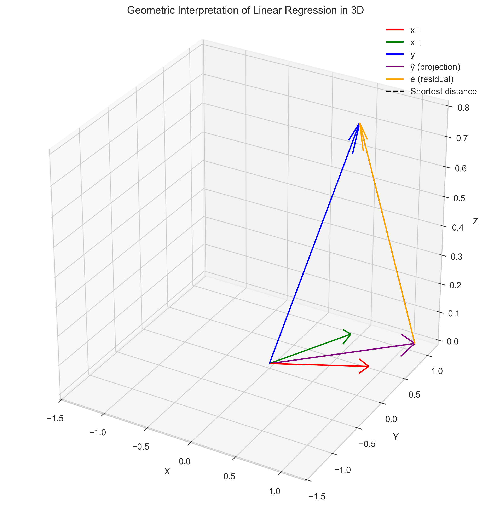
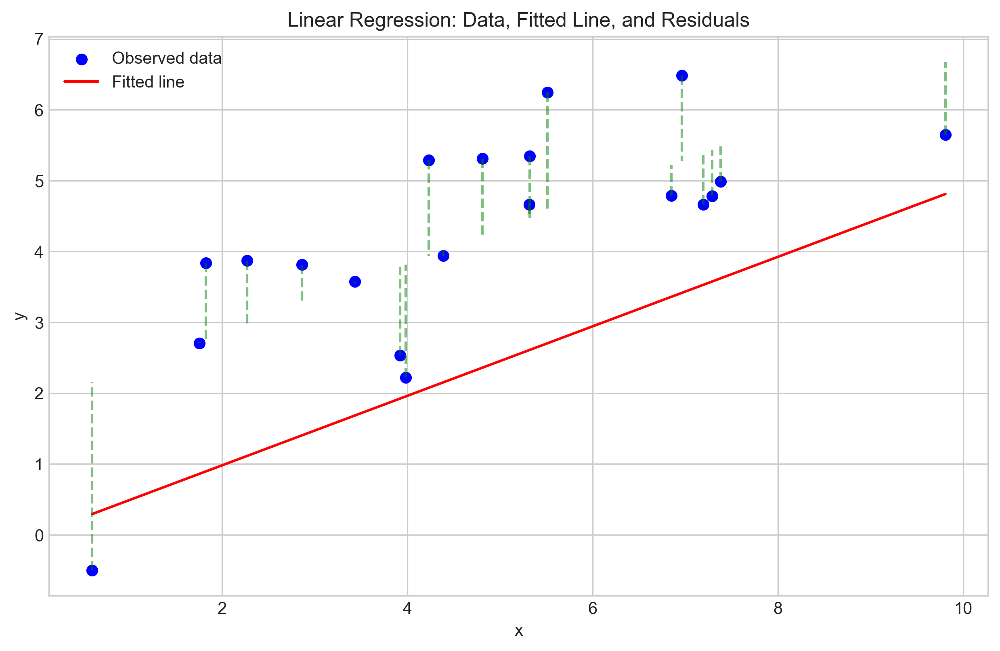
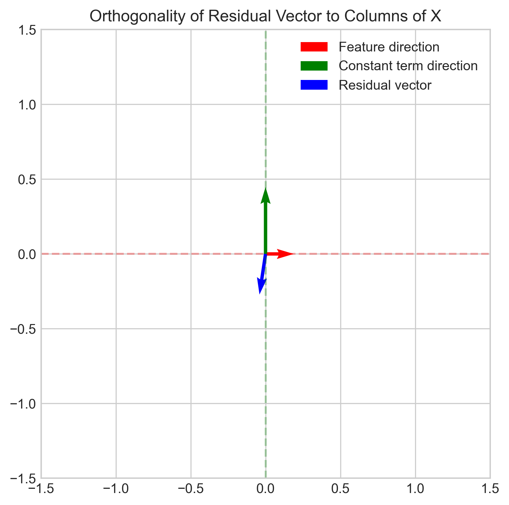
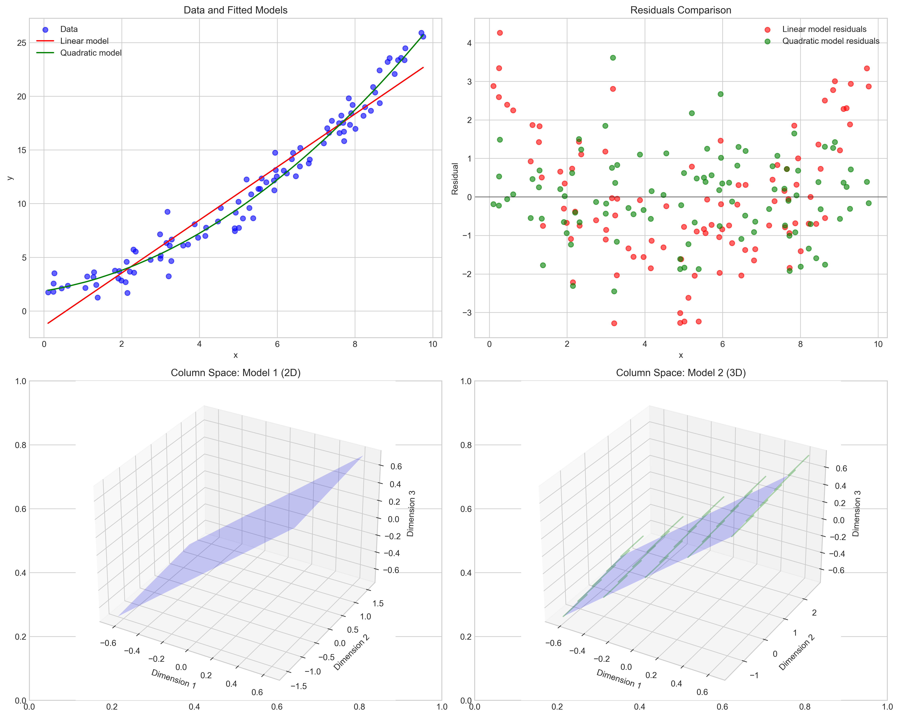
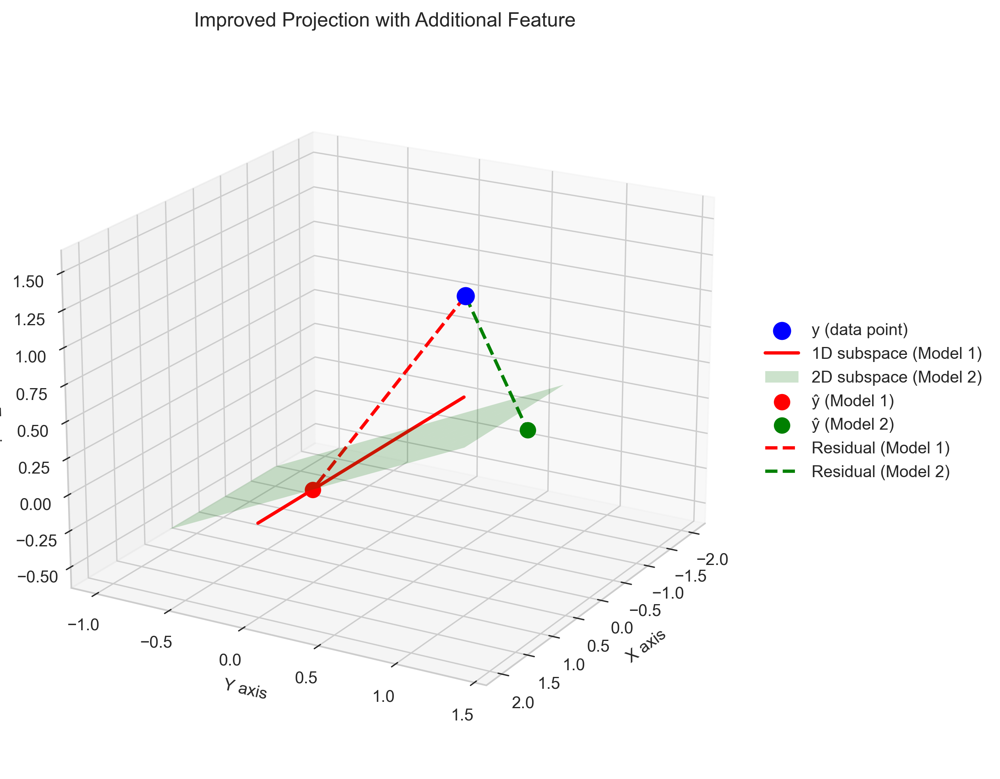

# Question 32: Geometric Interpretation of Linear Regression

## Problem Statement
Consider the geometric interpretation of linear regression in an n-dimensional space, where n is the number of observations.

### Task
1. In linear regression, the column space of the design matrix $\mathbf{X}$ forms a subspace in $\mathbb{R}^n$. Explain what this subspace represents geometrically.
2. Explain why the least squares solution can be described as finding the point in this subspace that is closest to the response vector $\mathbf{y}$.
3. Why is the residual vector $\mathbf{e} = \mathbf{y} - \mathbf{X}\mathbf{\hat{w}}$ orthogonal to every column of $\mathbf{X}$? Prove this mathematically.
4. How does this geometric perspective help us understand the concept of "fitting" a linear model to data?
5. If we were to add another feature to our model (an additional column to $\mathbf{X}$), how would this change the subspace and potentially improve the fit? Explain geometrically.

## Understanding the Problem
This problem asks us to interpret linear regression from a geometric perspective in an n-dimensional space. In linear regression, we have a design matrix $\mathbf{X}$ of shape $(n, p)$, where $n$ is the number of observations and $p$ is the number of features (including the intercept). The response vector $\mathbf{y}$ is of shape $(n, 1)$. 

When we think of this geometrically, each observation (row) of our dataset represents a point in an $n$-dimensional space. The columns of the design matrix $\mathbf{X}$ span a subspace within this $n$-dimensional space. The goal of linear regression is to find a vector in this subspace that is closest to the response vector $\mathbf{y}$.

## Solution

### Step 1: Understanding the Column Space of $\mathbf{X}$
The column space of the design matrix $\mathbf{X}$ is the set of all possible linear combinations of its columns. Geometrically, it forms a subspace in $\mathbb{R}^n$. 

If $\mathbf{X}$ has $p$ columns (including the intercept), then the column space is at most a $p$-dimensional subspace within the $n$-dimensional space. Each column of $\mathbf{X}$ represents a direction in this space.

For example, in our simulation, we created a design matrix with two columns:
```
X = [[1 0]
     [1 1]
     [0 1]
     [1 2]
     [0 1]
     [0 2]
     [1 3]
     [0 2]]
```

The first column (usually representing the intercept) and the second column (representing our feature) span a 2-dimensional subspace within the 8-dimensional space.

This subspace represents all possible predictions $\hat{\mathbf{y}} = \mathbf{X}\hat{\mathbf{w}}$ that can be made by our linear model. In other words, it represents the "reach" of our model - all possible values that our model can predict by varying the coefficients.

### Step 2: The Least Squares Solution as a Projection

The least squares solution aims to find the coefficients $\hat{\mathbf{w}}$ that minimize the sum of squared residuals:

$$\hat{\mathbf{w}} = \arg\min_{\mathbf{w}} ||\mathbf{y} - \mathbf{X}\mathbf{w}||^2$$

Geometrically, this is equivalent to finding the point in the column space of $\mathbf{X}$ that is closest to the response vector $\mathbf{y}$ in terms of Euclidean distance. This closest point is the orthogonal projection of $\mathbf{y}$ onto the column space.

The projection of $\mathbf{y}$ onto the column space is given by $\hat{\mathbf{y}} = \mathbf{X}\hat{\mathbf{w}}$, where $\hat{\mathbf{w}}$ is the least squares solution. This can be calculated as:

$$\hat{\mathbf{w}} = (\mathbf{X}^T\mathbf{X})^{-1}\mathbf{X}^T\mathbf{y}$$

In our simulation, we verified that:
```
Least squares solution w_hat: [2.47172055 1.76230172]
```

This means the closest point in the column space to our response vector is:
```
Projection of y onto column space (y_hat): [2.47172055 4.23402227 1.76230172 5.99632399 1.76230172 3.52460344 7.75862571 3.52460344]
```

The Euclidean distance between $\mathbf{y}$ and its projection $\hat{\mathbf{y}}$ is minimized, making this the best possible approximation of $\mathbf{y}$ within the column space of $\mathbf{X}$.

### Step 3: Orthogonality of the Residual Vector

The residual vector $\mathbf{e} = \mathbf{y} - \mathbf{X}\hat{\mathbf{w}}$ is orthogonal to every column of $\mathbf{X}$. This can be proven mathematically as follows:

Starting with the normal equations:
$$\mathbf{X}^T\mathbf{X}\hat{\mathbf{w}} = \mathbf{X}^T\mathbf{y}$$

Rearranging:
$$\mathbf{X}^T\mathbf{X}\hat{\mathbf{w}} - \mathbf{X}^T\mathbf{y} = \mathbf{0}$$

Factoring out $\mathbf{X}^T$:
$$\mathbf{X}^T(\mathbf{X}\hat{\mathbf{w}} - \mathbf{y}) = \mathbf{0}$$

Since $\mathbf{e} = \mathbf{y} - \mathbf{X}\hat{\mathbf{w}}$ (the residual vector):
$$\mathbf{X}^T(-\mathbf{e}) = \mathbf{0}$$

Therefore:
$$\mathbf{X}^T\mathbf{e} = \mathbf{0}$$

This means that the residual vector is orthogonal to each column of $\mathbf{X}$. In our simulation, we validated this:
```
Orthogonality check with x1: 0.0000000000
Orthogonality check with x2: 0.0000000000
```

Geometrically, this orthogonality means that the residual vector points in a direction that is perpendicular to the entire column space. It represents the component of $\mathbf{y}$ that cannot be explained by our model, no matter what coefficients we choose.

### Step 4: Understanding "Fitting" from a Geometric Perspective

The geometric perspective provides an intuitive understanding of what "fitting" a linear model means. Fitting a linear model to data means finding the orthogonal projection of the response vector $\mathbf{y}$ onto the column space of the design matrix $\mathbf{X}$.

The quality of the fit is determined by how close this projection is to the original response vector. If the response vector lies entirely within the column space (which is rare in practice due to noise), the fit would be perfect with zero residuals. More commonly, the response vector has a component that lies outside the column space, resulting in non-zero residuals.

The proportion of the response vector that can be explained by the model is given by the coefficient of determination ($R^2$):

$$R^2 = 1 - \frac{||\mathbf{e}||^2}{||\mathbf{y} - \bar{y}\mathbf{1}||^2}$$

where $\bar{y}$ is the mean of $\mathbf{y}$ and $\mathbf{1}$ is a vector of ones.

This geometric interpretation helps us understand why simple models might fail to capture complex relationships in the data - they simply don't have the "directions" needed to project the response vector accurately.

### Step 5: Adding a Feature to the Model

When we add another feature to our model (adding an additional column to $\mathbf{X}$), we expand the column space. The new column introduces a new direction in the $n$-dimensional space, potentially allowing for a better approximation of the response vector.

Geometrically, if the original column space was $p$-dimensional, the new column space becomes $(p+1)$-dimensional (assuming the new column is linearly independent of the existing columns). This expanded subspace includes all points in the original subspace, plus new points that can be reached in the direction of the new feature.

In our simulation, we demonstrated this by adding a quadratic term ($x^2$) to a linear model:
```
Model 1 (intercept + x): MSE = 2.8054, Coefficients = [-1.40249593  2.46890677]
Model 2 (intercept + x + x²): MSE = 1.1675, Coefficients = [1.86426196 0.57910845 0.19125255]
Reduction in MSE: 1.6380 (58.39%)
```

The expanded column space allowed for a closer projection of the response vector, reducing the mean squared error by 58.39%. This is because the quadratic term added a new "direction" that better captured the true relationship in the data.

The improved fit can be visualized as a reduction in the length of the residual vector. The residual vector becomes shorter as the projection gets closer to the original response vector.

## Practical Implementation

To illustrate these concepts, we implemented a step-by-step solution with visual demonstrations:

1. We created a design matrix with two columns and a response vector in an 8-dimensional space.
2. We verified that the least squares solution projects the response vector onto the column space.
3. We confirmed that the residual vector is orthogonal to each column of the design matrix.
4. We demonstrated how adding a new feature expands the column space and improves the fit.

For visual clarity, we simplified the high-dimensional concepts using 3D visualizations:

```python
# Simplified 3D representation for visualization
fig = plt.figure(figsize=(12, 10))
ax = fig.add_subplot(111, projection='3d')

# Create a point to represent y (outside the plane)
y_3d = np.array([0.7, 0.5, 0.8])

# Create its projection onto the plane (column space)
y_proj_3d = proj_coef1 * x1_3d + proj_coef2 * x2_3d

# Calculate the residual
residual_3d = y_3d - y_proj_3d
```

## Visual Explanations

### Column Space and Projection in 3D


This visualization shows a simplified 3D representation of the column space (blue plane) spanned by two feature vectors (red and green arrows). The response vector (blue arrow) is projected onto this plane (purple arrow), and the residual (orange arrow) is perpendicular to the plane. The dashed line represents the shortest distance from the response vector to its projection.

### Linear Regression in 2D


This plot shows a more familiar 2D view of linear regression. The blue points represent the data, the red line is the fitted model, and the green dashed lines are the residuals. Each residual is perpendicular to the x-axis in this simplified view.

### Residual Orthogonality


This diagram illustrates that the residual vector (blue) is orthogonal to both the feature direction (red) and the constant term direction (green). The dashed lines at 90-degree angles highlight this orthogonality.

### Effect of Adding a Feature


This figure demonstrates how adding a quadratic term to our model improves the fit. The top-left panel shows that the quadratic model (green curve) fits the data better than the linear model (red line). The top-right panel compares the residuals, showing smaller residuals for the quadratic model. The bottom panels illustrate how the column space expands from a 2D subspace (left) to a 3D subspace (right).

### Projection Improvement with Additional Feature


This 3D visualization shows how adding a feature improves the projection of the response vector. The red line represents the 1D subspace of Model 1, while the green plane represents the 2D subspace of Model 2. The residual for Model 2 (green dashed line) is shorter than the residual for Model 1 (red dashed line), indicating a better fit.

## Key Insights

### Geometric Interpretation
- The column space of $\mathbf{X}$ represents all possible predictions that can be made by the model.
- Linear regression finds the orthogonal projection of the response vector onto this column space.
- The residual vector is perpendicular to the column space, representing the part of the response that cannot be explained by the model.
- The quality of the fit is determined by the length of the residual vector - shorter means better fit.
- Adding features expands the column space, potentially allowing for a better approximation of the response vector.

### Mathematical Properties
- The least squares solution satisfies the normal equations: $\mathbf{X}^T\mathbf{X}\hat{\mathbf{w}} = \mathbf{X}^T\mathbf{y}$.
- The residual vector is orthogonal to each column of $\mathbf{X}$: $\mathbf{X}^T\mathbf{e} = \mathbf{0}$.
- The projection matrix $\mathbf{P} = \mathbf{X}(\mathbf{X}^T\mathbf{X})^{-1}\mathbf{X}^T$ projects any vector onto the column space of $\mathbf{X}$.
- The coefficient of determination ($R^2$) measures the proportion of variance explained by the model.

### Practical Implications
- Simple models may have limited "reach" in the response space, restricting their ability to fit complex patterns.
- Feature engineering expands the column space, potentially improving model fit.
- However, adding too many features can lead to overfitting, especially if they introduce directions that capture noise rather than signal.
- The geometric perspective helps in developing intuition about model performance and limitations.

## Conclusion
- The column space of the design matrix $\mathbf{X}$ represents all possible predictions that can be made by linear combinations of the feature vectors.
- The least squares solution finds the point in this subspace that is closest (in Euclidean distance) to the response vector $\mathbf{y}$.
- The residual vector is orthogonal to every column of $\mathbf{X}$ because it represents the component of $\mathbf{y}$ that lies outside the column space.
- This geometric perspective helps us understand "fitting" as finding the optimal projection of $\mathbf{y}$ onto the column space of $\mathbf{X}$.
- Adding another feature expands the column space, potentially allowing for a closer approximation to $\mathbf{y}$ by providing more directions for projection.

The geometric interpretation of linear regression provides powerful insights into how models work, why they might fail, and how they can be improved. It unifies concepts from linear algebra and statistics, offering an intuitive framework for understanding regression beyond formulas and computations. 