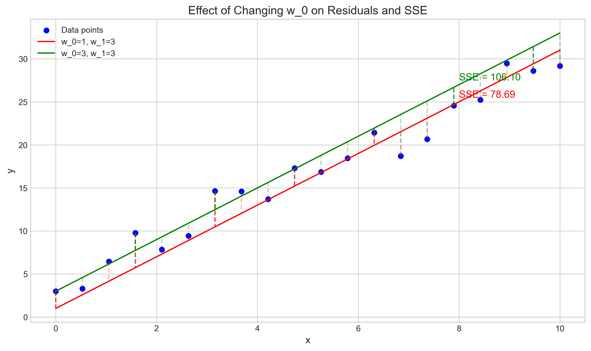
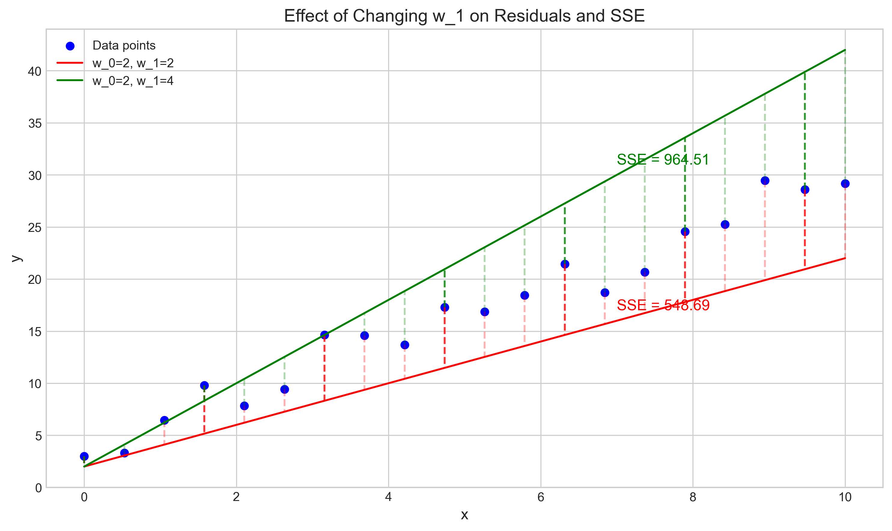
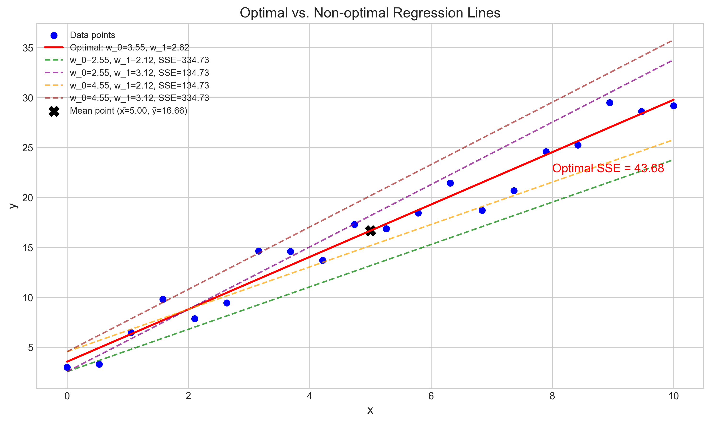
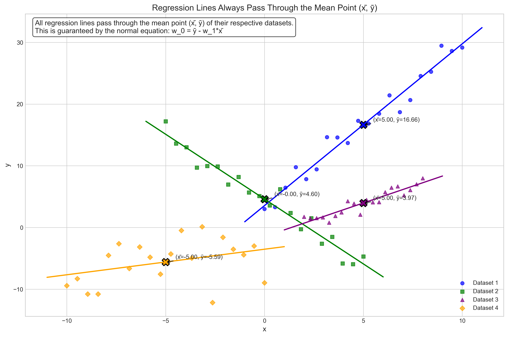
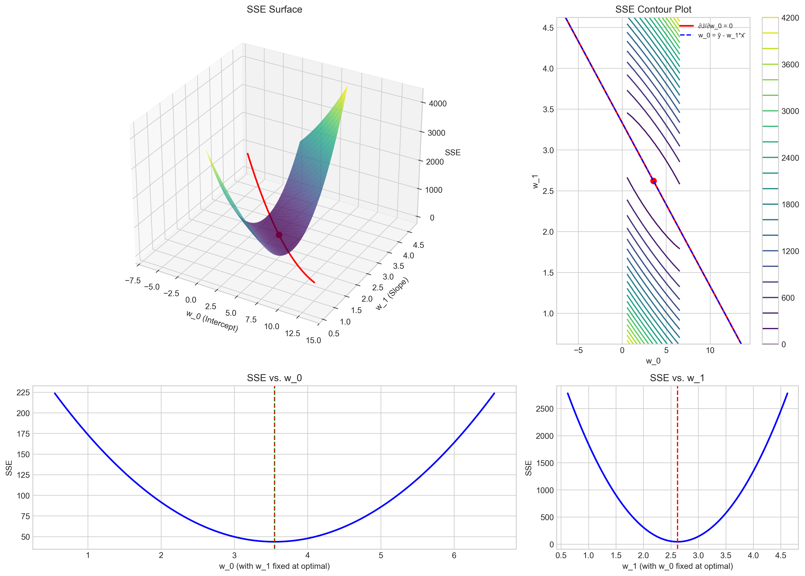

# Question 33: Deriving the Normal Equations for Linear Regression

## Problem Statement
Consider a simple linear regression problem where we want to minimize the sum of squared errors (SSE) cost function:

$$J(w_0, w_1) = \sum_{i=1}^{n} (y^{(i)} - w_0 - w_1 x^{(i)})^2$$

### Task
1. Take the partial derivative of the cost function with respect to $w_0$
2. Take the partial derivative with respect to $w_1$ 
3. Set both derivatives equal to zero and solve for $w_0$ and $w_1$ to derive the normal equations
4. Show that the intercept parameter $w_0$ ensures that the regression line passes through the point $(\bar{x}, \bar{y})$, where $\bar{x}$ and $\bar{y}$ are the means of the features and target values, respectively

## Understanding the Problem
This problem focuses on deriving the normal equations for linear regression by minimizing the sum of squared errors cost function. In linear regression, we model the relationship between a dependent variable $y$ and an independent variable $x$ using a linear function. The goal is to find the optimal parameters $w_0$ (intercept) and $w_1$ (slope) that minimize the difference between our predictions and the actual values.

The Sum of Squared Errors (SSE) is a commonly used cost function in regression that measures the total squared deviation of predicted values from actual values. By taking derivatives of this cost function with respect to the model parameters and setting them to zero, we can find the values of $w_0$ and $w_1$ that minimize the error.

## Solution

### Step 1: Calculate the partial derivative with respect to $w_0$
We start with the cost function for linear regression:

$$J(w_0, w_1) = \sum_{i=1}^{n} (y^{(i)} - w_0 - w_1 x^{(i)})^2$$

Let's denote the prediction for a single data point as:

$$\hat{y}^{(i)} = w_0 + w_1 x^{(i)}$$

Then the cost function can be rewritten as:

$$J(w_0, w_1) = \sum_{i=1}^{n} (y^{(i)} - \hat{y}^{(i)})^2 = \sum_{i=1}^{n} (y^{(i)} - w_0 - w_1 x^{(i)})^2$$

To find the partial derivative with respect to $w_0$, we need to compute how the cost function changes when we slightly modify $w_0$ while keeping $w_1$ constant. We'll apply the chain rule of differentiation.

First, let's consider a single term in the summation for data point $i$:

$$J_i(w_0, w_1) = (y^{(i)} - w_0 - w_1 x^{(i)})^2$$

Now we take the derivative of this term with respect to $w_0$:

$$\frac{\partial J_i}{\partial w_0} = \frac{\partial}{\partial w_0}[(y^{(i)} - w_0 - w_1 x^{(i)})^2]$$

Using the chain rule: $\frac{d}{dx}[f(g(x))] = f'(g(x)) \cdot g'(x)$, where:
- $f(u) = u^2$, so $f'(u) = 2u$
- $g(w_0) = y^{(i)} - w_0 - w_1 x^{(i)}$, so $g'(w_0) = -1$

We get:

$$\frac{\partial J_i}{\partial w_0} = 2(y^{(i)} - w_0 - w_1 x^{(i)}) \cdot (-1)$$

$$\frac{\partial J_i}{\partial w_0} = -2(y^{(i)} - w_0 - w_1 x^{(i)})$$

Now, to get the partial derivative of the entire cost function, we sum up the derivatives for all data points:

$$\frac{\partial J}{\partial w_0} = \sum_{i=1}^{n} \frac{\partial J_i}{\partial w_0} = \sum_{i=1}^{n} -2(y^{(i)} - w_0 - w_1 x^{(i)})$$

$$\frac{\partial J}{\partial w_0} = -2\sum_{i=1}^{n}(y^{(i)} - w_0 - w_1 x^{(i)})$$

We can also express this in terms of the residuals $r^{(i)} = y^{(i)} - \hat{y}^{(i)}$:

$$\frac{\partial J}{\partial w_0} = -2\sum_{i=1}^{n} r^{(i)}$$

This derivative represents how the cost function changes when we adjust the intercept parameter $w_0$. If the derivative is negative, increasing $w_0$ decreases the cost function; if positive, increasing $w_0$ increases the cost function.

### Step 2: Calculate the partial derivative with respect to $w_1$
Similarly, for the partial derivative with respect to $w_1$, we need to compute how the cost function changes when we slightly modify $w_1$ while keeping $w_0$ constant.

For a single term in the summation:

$$\frac{\partial J_i}{\partial w_1} = \frac{\partial}{\partial w_1}[(y^{(i)} - w_0 - w_1 x^{(i)})^2]$$

Using the chain rule again:
- $f(u) = u^2$, so $f'(u) = 2u$
- $g(w_1) = y^{(i)} - w_0 - w_1 x^{(i)}$, so $g'(w_1) = -x^{(i)}$

We get:

$$\frac{\partial J_i}{\partial w_1} = 2(y^{(i)} - w_0 - w_1 x^{(i)}) \cdot (-x^{(i)})$$

$$\frac{\partial J_i}{\partial w_1} = -2x^{(i)}(y^{(i)} - w_0 - w_1 x^{(i)})$$

For the entire cost function:

$$\frac{\partial J}{\partial w_1} = \sum_{i=1}^{n} \frac{\partial J_i}{\partial w_1} = \sum_{i=1}^{n} -2x^{(i)}(y^{(i)} - w_0 - w_1 x^{(i)})$$

$$\frac{\partial J}{\partial w_1} = -2\sum_{i=1}^{n} x^{(i)}(y^{(i)} - w_0 - w_1 x^{(i)})$$

In terms of residuals:

$$\frac{\partial J}{\partial w_1} = -2\sum_{i=1}^{n} x^{(i)} \cdot r^{(i)}$$

This derivative represents how the cost function changes when we adjust the slope parameter $w_1$. It involves not just the residuals, but also the product of each residual with its corresponding $x$ value.

### Step 3: Derive the normal equations by setting derivatives to zero
To find the optimal values of $w_0$ and $w_1$ that minimize the cost function, we set both partial derivatives equal to zero and solve the resulting system of equations.

#### Step 3.1: Set the derivative with respect to $w_0$ equal to zero

$$\frac{\partial J}{\partial w_0} = -2\sum_{i=1}^{n}(y^{(i)} - w_0 - w_1 x^{(i)}) = 0$$

First, divide both sides by -2 to simplify:

$$\sum_{i=1}^{n}(y^{(i)} - w_0 - w_1 x^{(i)}) = 0$$

Next, expand the summation:

$$\sum_{i=1}^{n}y^{(i)} - \sum_{i=1}^{n}w_0 - \sum_{i=1}^{n}w_1 x^{(i)} = 0$$

Since $w_0$ and $w_1$ are constants with respect to the summation, we can simplify:

$$\sum_{i=1}^{n}y^{(i)} - w_0 \cdot \sum_{i=1}^{n}1 - w_1 \cdot \sum_{i=1}^{n}x^{(i)} = 0$$

$$\sum_{i=1}^{n}y^{(i)} - w_0 \cdot n - w_1 \cdot \sum_{i=1}^{n}x^{(i)} = 0$$

Now, let's solve for $w_0$:

$$w_0 \cdot n = \sum_{i=1}^{n}y^{(i)} - w_1 \cdot \sum_{i=1}^{n}x^{(i)}$$

$$w_0 = \frac{\sum_{i=1}^{n}y^{(i)}}{n} - w_1 \cdot \frac{\sum_{i=1}^{n}x^{(i)}}{n}$$

These fractions are simply the means of our variables:

$$\bar{y} = \frac{\sum_{i=1}^{n}y^{(i)}}{n} \quad \text{and} \quad \bar{x} = \frac{\sum_{i=1}^{n}x^{(i)}}{n}$$

Therefore:

$$w_0 = \bar{y} - w_1 \cdot \bar{x}$$

This is our first normal equation. It states that the optimal intercept $w_0$ is such that when we use the mean feature value $\bar{x}$, we predict the mean target value $\bar{y}$.

#### Step 3.2: Set the derivative with respect to $w_1$ equal to zero

$$\frac{\partial J}{\partial w_1} = -2\sum_{i=1}^{n} x^{(i)}(y^{(i)} - w_0 - w_1 x^{(i)}) = 0$$

Dividing by -2:

$$\sum_{i=1}^{n} x^{(i)}(y^{(i)} - w_0 - w_1 x^{(i)}) = 0$$

Expanding the summation:

$$\sum_{i=1}^{n} x^{(i)}y^{(i)} - \sum_{i=1}^{n} x^{(i)}w_0 - \sum_{i=1}^{n} x^{(i)}w_1 x^{(i)} = 0$$

$$\sum_{i=1}^{n} x^{(i)}y^{(i)} - w_0 \sum_{i=1}^{n} x^{(i)} - w_1 \sum_{i=1}^{n} (x^{(i)})^2 = 0$$

Now, let's substitute our expression for $w_0$ from the first normal equation:

$$\sum_{i=1}^{n} x^{(i)}y^{(i)} - (\bar{y} - w_1 \bar{x})\sum_{i=1}^{n} x^{(i)} - w_1 \sum_{i=1}^{n} (x^{(i)})^2 = 0$$

Distribute the summation term:

$$\sum_{i=1}^{n} x^{(i)}y^{(i)} - \bar{y}\sum_{i=1}^{n} x^{(i)} + w_1 \bar{x}\sum_{i=1}^{n} x^{(i)} - w_1 \sum_{i=1}^{n} (x^{(i)})^2 = 0$$

We know that $\sum_{i=1}^{n} x^{(i)} = n \cdot \bar{x}$, so:

$$\sum_{i=1}^{n} x^{(i)}y^{(i)} - \bar{y} \cdot n \cdot \bar{x} + w_1 \bar{x} \cdot n \cdot \bar{x} - w_1 \sum_{i=1}^{n} (x^{(i)})^2 = 0$$

$$\sum_{i=1}^{n} x^{(i)}y^{(i)} - n \cdot \bar{x} \cdot \bar{y} + w_1 \cdot n \cdot (\bar{x})^2 - w_1 \sum_{i=1}^{n} (x^{(i)})^2 = 0$$

Rearranging to isolate terms with $w_1$:

$$\sum_{i=1}^{n} x^{(i)}y^{(i)} - n \cdot \bar{x} \cdot \bar{y} = w_1 \sum_{i=1}^{n} (x^{(i)})^2 - w_1 \cdot n \cdot (\bar{x})^2$$

$$\sum_{i=1}^{n} x^{(i)}y^{(i)} - n \cdot \bar{x} \cdot \bar{y} = w_1 \left( \sum_{i=1}^{n} (x^{(i)})^2 - n \cdot (\bar{x})^2 \right)$$

Solving for $w_1$:

$$w_1 = \frac{\sum_{i=1}^{n} x^{(i)}y^{(i)} - n \cdot \bar{x} \cdot \bar{y}}{\sum_{i=1}^{n} (x^{(i)})^2 - n \cdot (\bar{x})^2}$$

#### Step 3.3: Simplify the expression for $w_1$

Let's show that the numerator corresponds to the covariance of $x$ and $y$, multiplied by $n$:

$$\sum_{i=1}^{n} x^{(i)}y^{(i)} - n \cdot \bar{x} \cdot \bar{y}$$

We can demonstrate that this is equivalent to $\sum_{i=1}^{n} (x^{(i)} - \bar{x})(y^{(i)} - \bar{y})$:

Let's expand the latter expression:

$$\sum_{i=1}^{n} (x^{(i)} - \bar{x})(y^{(i)} - \bar{y}) = \sum_{i=1}^{n} [x^{(i)}y^{(i)} - x^{(i)}\bar{y} - \bar{x}y^{(i)} + \bar{x}\bar{y}]$$

$$= \sum_{i=1}^{n} x^{(i)}y^{(i)} - \bar{y}\sum_{i=1}^{n} x^{(i)} - \bar{x}\sum_{i=1}^{n} y^{(i)} + \bar{x}\bar{y}\sum_{i=1}^{n} 1$$

$$= \sum_{i=1}^{n} x^{(i)}y^{(i)} - \bar{y}(n\bar{x}) - \bar{x}(n\bar{y}) + \bar{x}\bar{y}n$$

$$= \sum_{i=1}^{n} x^{(i)}y^{(i)} - n\bar{x}\bar{y} - n\bar{x}\bar{y} + n\bar{x}\bar{y}$$

$$= \sum_{i=1}^{n} x^{(i)}y^{(i)} - n\bar{x}\bar{y}$$

Which is exactly the numerator in our expression for $w_1$.

Similarly, the denominator corresponds to the variance of $x$, multiplied by $n$:

$$\sum_{i=1}^{n} (x^{(i)})^2 - n \cdot (\bar{x})^2$$

We can show this is equivalent to $\sum_{i=1}^{n} (x^{(i)} - \bar{x})^2$:

$$\sum_{i=1}^{n} (x^{(i)} - \bar{x})^2 = \sum_{i=1}^{n} [(x^{(i)})^2 - 2x^{(i)}\bar{x} + (\bar{x})^2]$$

$$= \sum_{i=1}^{n} (x^{(i)})^2 - 2\bar{x}\sum_{i=1}^{n} x^{(i)} + (\bar{x})^2\sum_{i=1}^{n} 1$$

$$= \sum_{i=1}^{n} (x^{(i)})^2 - 2\bar{x}(n\bar{x}) + (\bar{x})^2n$$

$$= \sum_{i=1}^{n} (x^{(i)})^2 - 2n(\bar{x})^2 + n(\bar{x})^2$$

$$= \sum_{i=1}^{n} (x^{(i)})^2 - n(\bar{x})^2$$

Which is exactly the denominator in our expression for $w_1$.

Therefore, our formula for $w_1$ can be rewritten as:

$$w_1 = \frac{\sum_{i=1}^{n} (x^{(i)} - \bar{x})(y^{(i)} - \bar{y})}{\sum_{i=1}^{n} (x^{(i)} - \bar{x})^2} = \frac{\text{cov}(x,y)}{\text{var}(x)}$$

This is our second normal equation. It states that the optimal slope $w_1$ is the ratio of the covariance between $x$ and $y$ to the variance of $x$.

In summary, the normal equations for simple linear regression are:

$$w_1 = \frac{\text{cov}(x,y)}{\text{var}(x)} = \frac{\sum_{i=1}^{n} (x^{(i)} - \bar{x})(y^{(i)} - \bar{y})}{\sum_{i=1}^{n} (x^{(i)} - \bar{x})^2}$$

$$w_0 = \bar{y} - w_1 \bar{x}$$

### Step 4: Show that the regression line passes through the point $(\bar{x}, \bar{y})$
Now we need to show that the regression line always passes through the mean point $(\bar{x}, \bar{y})$, regardless of the dataset.

The equation of the regression line is:

$$y = w_0 + w_1 x$$

From our first normal equation, we know that:

$$w_0 = \bar{y} - w_1 \bar{x}$$

Let's substitute this value of $w_0$ into the regression line equation and then evaluate at the point $x = \bar{x}$:

$$y = (\bar{y} - w_1 \bar{x}) + w_1 x$$

When $x = \bar{x}$:

$$y = (\bar{y} - w_1 \bar{x}) + w_1 \bar{x}$$

$$y = \bar{y} - w_1 \bar{x} + w_1 \bar{x}$$

$$y = \bar{y}$$

This shows that when $x = \bar{x}$, we get $y = \bar{y}$, which proves that the point $(\bar{x}, \bar{y})$ lies on the regression line.

This means that regardless of how we compute $w_1$ (i.e., regardless of the specific dataset), the regression line will always pass through the center of mass of the data points, which is the point $(\bar{x}, \bar{y})$.

This property is an important consequence of the normal equation for $w_0$. It ensures that the regression line is anchored at the mean point of the data and pivots around this point as we adjust the slope $w_1$.

Geometrically, this means that the sum of the vertical distances from the data points to the regression line (some positive, some negative) is always zero:

$$\sum_{i=1}^{n} (y^{(i)} - \hat{y}^{(i)}) = \sum_{i=1}^{n} (y^{(i)} - w_0 - w_1 x^{(i)}) = 0$$

This is precisely the condition we derived when setting the partial derivative with respect to $w_0$ equal to zero.

## Visual Explanations

### Partial Derivative with respect to $w_0$

This figure illustrates how changing the intercept parameter $w_0$ affects the residuals and the sum of squared errors (SSE). When we adjust $w_0$, we move the regression line up or down, which changes the vertical distances (residuals) between the data points and the line. The optimal value of $w_0$ minimizes these squared residuals.

### Partial Derivative with respect to $w_1$

This figure demonstrates how changing the slope parameter $w_1$ affects the residuals and the sum of squared errors. When we adjust $w_1$, we rotate the regression line, which changes the pattern of residuals across different x-values. The optimal value of $w_1$ balances these residuals to minimize the overall squared error.

### Normal Equations Solution

This visualization shows the optimal regression line (in red) compared to several non-optimal lines. The optimal line minimizes the sum of squared errors and is determined by the normal equations. The black X marks the mean point $(\bar{x}, \bar{y})$, and as we can see, all regression lines pass through this point.

### Regression Line Through Mean Point

This figure demonstrates that regression lines for different datasets all pass through their respective mean points $(\bar{x}, \bar{y})$. This property is guaranteed by the normal equation $w_0 = \bar{y} - w_1 \bar{x}$, regardless of the dataset or the resulting slope.

### SSE Surface and Contour

This comprehensive visualization shows the sum of squared errors as a function of $w_0$ and $w_1$. The 3D surface has a bowl shape with a single minimum point, which corresponds to the optimal values of $w_0$ and $w_1$. The contour plot shows level curves of the SSE, and the red line represents the constraint imposed by the equation $w_0 = \bar{y} - w_1 \bar{x}$, which ensures the regression line passes through $(\bar{x}, \bar{y})$.

## Key Insights

### Mathematical Foundations
- The partial derivatives of the SSE with respect to model parameters provide the direction of steepest ascent in the error landscape.
- Setting these derivatives to zero gives us the critical points, which in this case are the global minimum due to the convexity of the SSE.
- The normal equations provide closed-form solutions for linear regression parameters, avoiding the need for iterative optimization methods.
- The constraint that $w_0 = \bar{y} - w_1 \bar{x}$ reduces the optimization problem from two parameters to one.

### Geometrical Interpretation
- The regression line passing through $(\bar{x}, \bar{y})$ means it pivots around the center of mass of the data.
- This property allows us to focus on finding the optimal slope, as the intercept is automatically determined once the slope is known.
- The SSE surface is a convex quadratic function of $w_0$ and $w_1$, ensuring a unique global minimum.
- The contour lines of the SSE form ellipses centered at the optimal parameter values.

### Practical Implications
- Understanding the normal equations allows us to directly compute optimal parameters without gradient descent.
- For simple and multiple linear regression, these closed-form solutions are computationally efficient.
- The intercept ensures the model captures the central tendency of the data.
- Even if the true relationship is not linear, the fitted line will pass through the mean point, minimizing error in a least-squares sense.

## Conclusion
- The partial derivative of the cost function with respect to $w_0$ is $\frac{\partial J}{\partial w_0} = -2\sum_{i=1}^{n}(y^{(i)} - w_0 - w_1 x^{(i)})$.
- The partial derivative with respect to $w_1$ is $\frac{\partial J}{\partial w_1} = -2\sum_{i=1}^{n}x^{(i)}(y^{(i)} - w_0 - w_1 x^{(i)})$.
- Setting these derivatives to zero yields the normal equations: $w_0 = \bar{y} - w_1 \bar{x}$ and $w_1 = \frac{\text{cov}(x,y)}{\text{var}(x)}$.
- The intercept equation $w_0 = \bar{y} - w_1 \bar{x}$ guarantees that the regression line passes through the mean point $(\bar{x}, \bar{y})$.

The normal equations provide a direct analytical solution to the linear regression problem, allowing us to find the optimal parameters that minimize the sum of squared errors without iterative optimization techniques. This mathematical foundation is crucial for understanding more complex regression models and optimization methods in machine learning. 