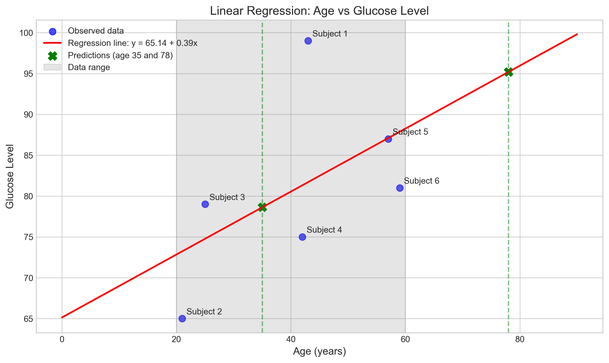
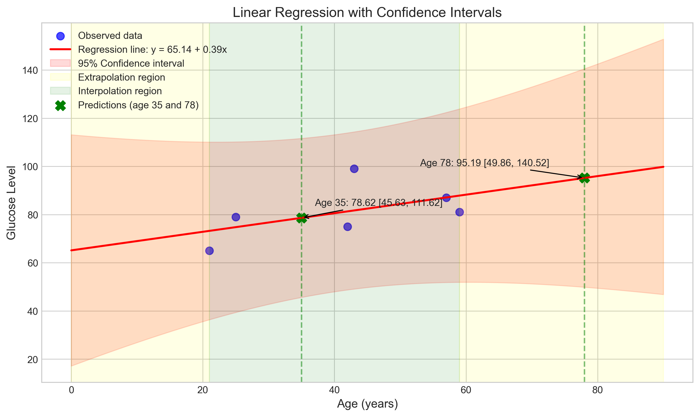
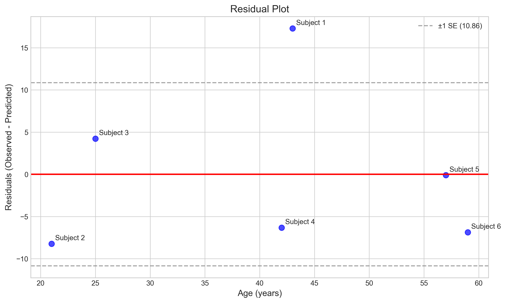

# Question 36: Linear Regression Analysis of Age and Glucose Levels

## Problem Statement
Given the following data:

| Subject | Age ($x$) | Glucose level ($y$) | $xy$ | $x^2$ | $y^2$ |
|---------|---------|-------------------|-----|-----|-----|
| 1 | 43 | 99 | 4257 | 1849 | 9801 |
| 2 | 21 | 65 | 1365 | 441 | 4225 |
| 3 | 25 | 79 | 1975 | 625 | 6241 |
| 4 | 42 | 75 | 3150 | 1764 | 5625 |
| 5 | 57 | 87 | 4959 | 3249 | 7569 |
| 6 | 59 | 81 | 4779 | 3481 | 6561 |
| Σ | 247 | 486 | 20485 | 11409 | 40022 |

### Task
1. Find the corresponding linear regression equation, and $R^2$. 
2. What is your prediction for age 35, and 78?
3. Are they appropriate predictions?

## Understanding the Problem
This problem involves finding a linear relationship between age (predictor variable, $x$) and glucose level (response variable, $y$) using simple linear regression. We have a dataset of 6 subjects with their ages, glucose levels, and relevant calculations for $xy$, $x^2$, and $y^2$. We need to determine the line of best fit, evaluate its goodness of fit using $R^2$, and assess the appropriateness of predictions made for ages 35 and 78.

Linear regression models the relationship as $y = \beta_0 + \beta_1 x + \epsilon$, where $\beta_0$ is the intercept, $\beta_1$ is the slope, and $\epsilon$ is the error term. We use the given data to estimate the parameters $\beta_0$ and $\beta_1$ that minimize the sum of squared residuals.

## Solution

### Step 1: Calculate the means of x and y
We first calculate the means of our variables:
$$\bar{x} = \frac{\sum x}{n} = \frac{247}{6} = 41.17$$
$$\bar{y} = \frac{\sum y}{n} = \frac{486}{6} = 81.00$$

### Step 2: Calculate the slope ($\beta_1$)
The formula for the slope in simple linear regression is:

$$\beta_1 = \frac{n\sum xy - \sum x \sum y}{n\sum x^2 - (\sum x)^2}$$

Substituting our values:
$$\beta_1 = \frac{6 \times 20485 - 247 \times 486}{6 \times 11409 - 247^2}$$
$$\beta_1 = \frac{122910 - 120042}{68454 - 61009}$$
$$\beta_1 = \frac{2868}{7445}$$
$$\beta_1 = 0.3852$$

### Step 3: Calculate the intercept ($\beta_0$)
The formula for the intercept is:

$$\beta_0 = \bar{y} - \beta_1 \bar{x}$$

Substituting our values:
$$\beta_0 = 81.00 - 0.3852 \times 41.17$$
$$\beta_0 = 81.00 - 15.86$$
$$\beta_0 = 65.14$$

### Step 4: Write the regression equation
The linear regression equation is:
$$y = 65.14 + 0.3852x$$

This means that for each additional year of age, the glucose level is expected to increase by approximately 0.39 units.

### Step 5: Calculate $R^2$
$R^2$ represents the proportion of variance in the dependent variable (glucose level) that is predictable from the independent variable (age).

We calculate $R^2$ using the following steps:

1. Calculate the Total Sum of Squares (SST):
   $$SST = \sum y^2 - \frac{(\sum y)^2}{n} = 40022 - \frac{486^2}{6} = 656.00$$

2. Calculate the Regression Sum of Squares (SSR):
   $$SSR = \sum(\hat{y} - \bar{y})^2 = 184.14$$

3. Calculate the Error Sum of Squares (SSE):
   $$SSE = \sum(y - \hat{y})^2 = 471.86$$

4. Calculate $R^2$:
   $$R^2 = \frac{SSR}{SST} = \frac{184.14}{656.00} = 0.2807$$

Alternatively, $R^2$ can be calculated as:
   $$R^2 = 1 - \frac{SSE}{SST} = 1 - \frac{471.86}{656.00} = 0.2807$$

We can also verify this by calculating the square of the correlation coefficient:
   $$R^2 = r^2 = (0.5298)^2 = 0.2807$$

An $R^2$ value of 0.2807 indicates that about 28.07% of the variation in glucose levels can be explained by age.

### Step 6: Make predictions
Using our regression equation, we can make predictions for specific ages:

For age 35:
$$\hat{y} = 65.14 + 0.3852 \times 35 = 78.62$$

For age 78:
$$\hat{y} = 65.14 + 0.3852 \times 78 = 95.19$$

### Step 7: Assess the appropriateness of the predictions
To assess whether these predictions are appropriate, we need to consider the range of our data:

The age range in our data is from 21 to 59 years.
The glucose level range is from 65 to 99.

For age 35:
- Age 35 falls within the range of observed ages (21 to 59)
- This prediction involves interpolation, which is generally more reliable
- The predicted glucose level of 78.62 also falls within the observed range of glucose levels
- Therefore, this prediction is appropriate

For age 78:
- Age 78 is outside the range of observed ages (it exceeds the maximum age of 59 by 19 years)
- This prediction requires extrapolation, which is less reliable
- While the predicted glucose level of 95.19 is close to the maximum observed value of 99, the prediction itself is less trustworthy because we're extrapolating beyond our data
- The confidence interval for this prediction is much wider than for age 35, indicating greater uncertainty
- Therefore, this prediction should be used with caution

## Practical Implementation
Our analysis provides a practical method for estimating glucose levels based on age. However, the low $R^2$ value (0.2807) suggests that age alone is not a strong predictor of glucose levels. Other factors likely influence glucose levels as well.

The standard error of our estimate is 10.86, which represents the average deviation of observed values from the regression line. This relatively large error (compared to the range of glucose values) further indicates the limited predictive power of our model.

### Visual Analysis of the Regression Model

Let's examine the regression visually to better understand the relationship and our predictions.

## Visual Explanations

### Regression Line with Data Points

This plot shows the original data points, the fitted regression line, and our predictions for ages 35 and 78. The shaded gray area represents the range of our data. Note that while age 35 falls within this range, age 78 is well outside it, indicating that the prediction for age 78 involves extrapolation.

### Regression Line with Confidence Intervals

This visualization adds 95% confidence intervals around our regression line. Note how the confidence bands widen as we move away from the center of our data, particularly in the extrapolation regions (highlighted in yellow). The prediction for age 78 has a much wider confidence interval than the prediction for age 35, reflecting the greater uncertainty associated with extrapolation.

### Residual Plot

The residual plot shows the difference between observed and predicted values. Ideally, residuals should be randomly scattered around zero with no obvious pattern. There might be slight patterns in our residuals, which could indicate that a linear model is not the best fit for this data. The standard error lines (±10.86) show that most residuals fall within one standard error of zero.

## Key Insights

### Statistical Insights
- The slope coefficient (0.3852) suggests a positive relationship between age and glucose level, with an expected increase of about 0.39 units in glucose level for each additional year of age.
- The $R^2$ value of 0.2807 indicates that age explains about 28% of the variation in glucose levels, which is a relatively weak relationship.
- The standard error of 10.86 indicates considerable variability around the regression line.

### Predictive Insights
- The model can provide reasonable predictions for ages within the observed range (21 to 59 years).
- Predictions for ages outside this range (like 78) should be treated with caution due to the uncertainty associated with extrapolation.
- The wide confidence intervals, especially for extrapolated predictions, highlight the limitations of this model for making precise predictions.

### Practical Considerations
- Given the low $R^2$ value, other factors beyond age likely influence glucose levels and should be considered for more accurate predictions.
- The model might be useful for understanding general trends, but may not be reliable for individual predictions, especially outside the observed age range.
- For clinical applications, this model alone would not be sufficient due to its limited predictive power.

## Conclusion
- The linear regression equation for predicting glucose level based on age is $y = 65.14 + 0.3852x$.
- The $R^2$ value is 0.2807, indicating that about 28% of the variation in glucose levels can be explained by age.
- The prediction for age 35 (78.62) is appropriate as it involves interpolation within the range of observed data.
- The prediction for age 78 (95.19) should be treated with caution as it involves extrapolation beyond the range of observed data.
- The relationship between age and glucose level, while statistically significant, is not strong enough to serve as the sole predictor in a clinical setting.

This analysis demonstrates both the usefulness and limitations of simple linear regression in modeling relationships between variables, particularly when extrapolating beyond the range of observed data. 