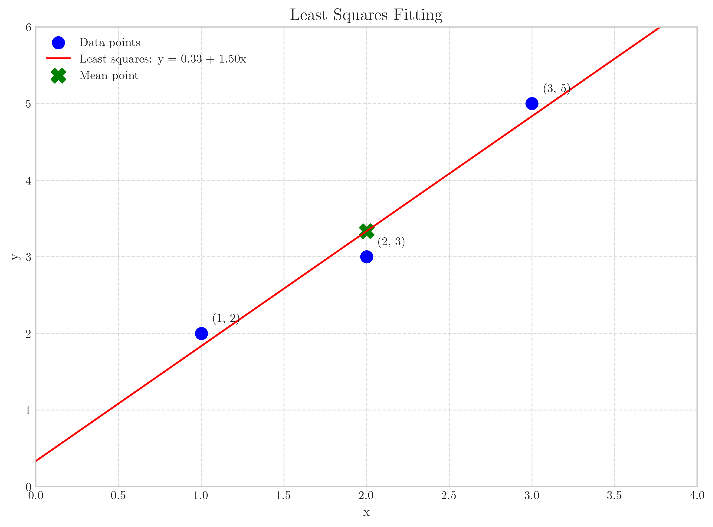
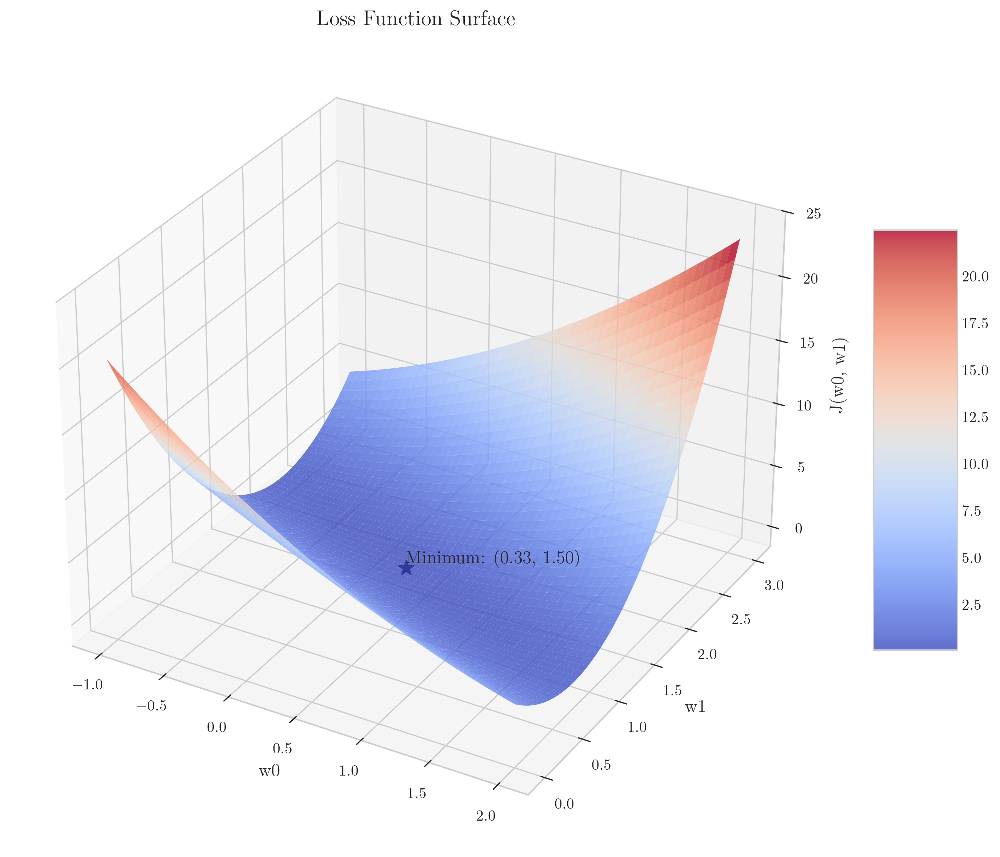
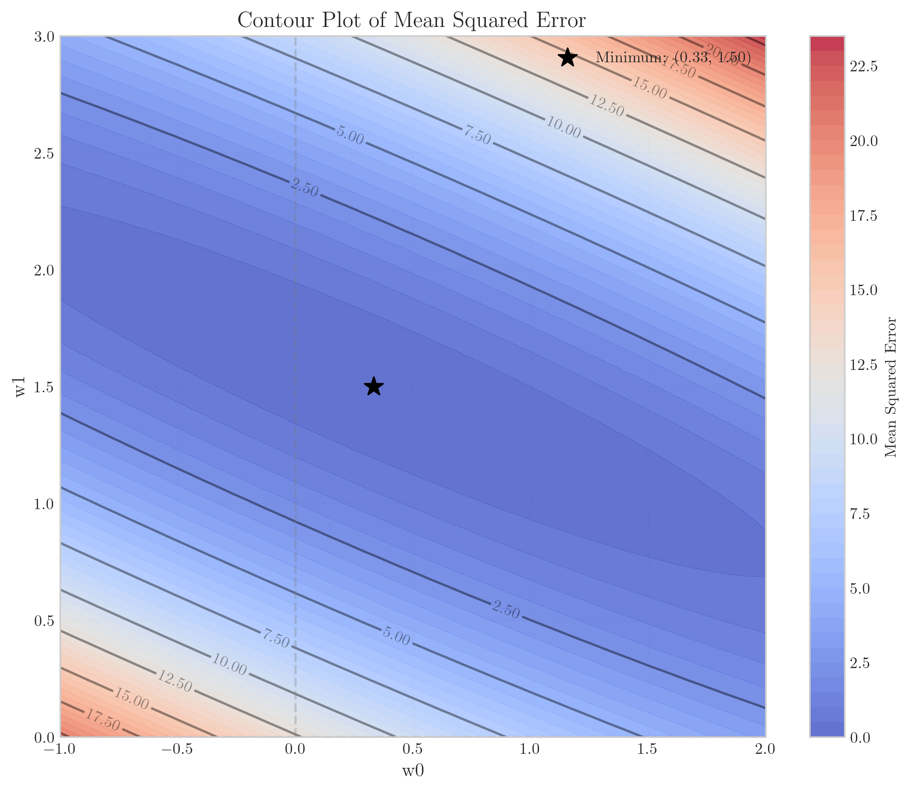
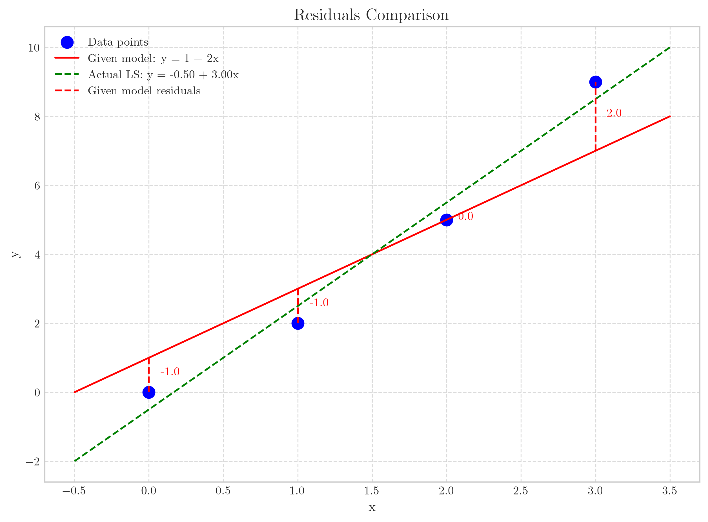
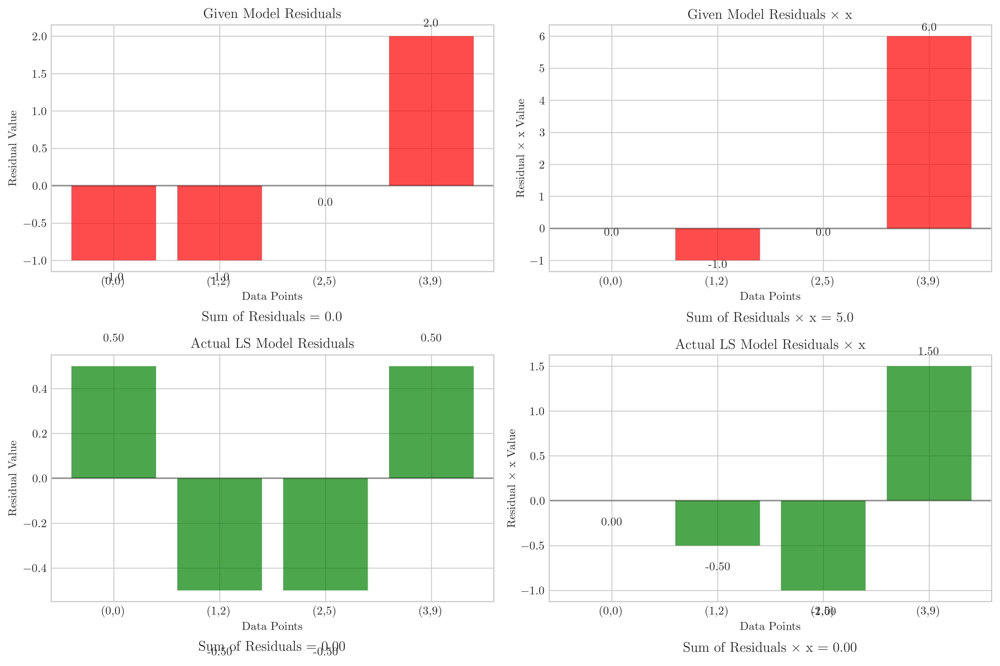

# Question 37: Least Squares Solution Properties

## Problem Statement
We are exploring the properties of least squares solutions in linear regression. For a linear model $y = w_0 + w_1 x$, the least squares solution $\mathbf{w}^* = [w_0^*, w_1^*]^T$ minimizes the squared error loss $J(\mathbf{w}) = \frac{1}{n}\sum_{i=1}^n (y_i - w_0 - w_1 x_i)^2$.

### Task
1. Check each statement that must be true if $\mathbf{w}^* = [w_0^*, w_1^*]^T$ is indeed the least squares solution.

| Statement | True? |
| --------- | ----- |
| $\frac{1}{n}\sum_{i=1}^n (y_i - w_0^* - w_1^* x_i) y_i = 0$ |  |
| $\frac{1}{n}\sum_{i=1}^n (y_i - w_0^* - w_1^* x_i)(y_i - \bar{y}) = 0$ |  |
| $\frac{1}{n}\sum_{i=1}^n (y_i - w_0^* - w_1^* x_i)(x_i - \bar{x}) = 0$ |  |
| $\frac{1}{n}\sum_{i=1}^n (y_i - w_0^* - w_1^* x_i)(w_0^* + w_1^* x_i) = 0$ |  |

2. Consider a dataset with just $3$ points: $(1,2)$, $(2,3)$, and $(3,5)$. Plot these points on graph paper, and visually estimate the best-fit line. Then calculate the actual least squares solution using the formulas for $w_1^*$ and $w_0^*$ Compare your visual estimate with the calculated result.

3. For a dataset where the least squares solution is $w_0^* = 1$ and $w_1^* = 2$, calculate the residuals for the points $(0,0)$, $(1,2)$, $(2,5)$, and $(3,9)$. Then verify that the sum of residuals equals zero, and the sum of residuals multiplied by their corresponding $x$-values equals zero.

## Understanding the Problem
Linear regression aims to find the best-fitting line through a set of data points. The "best fit" is determined by minimizing the sum of squared errors (residuals), which are the differences between the observed values and the predictions from the model. The least squares solution provides a closed-form method to find the optimal parameters $w_0^*$ and $w_1^*$ that minimize this error.

## Solution

### Step 1: Analyzing the Properties of Least Squares Solutions
To verify which statements are true for the least squares solution, we need to understand the optimality conditions. The least squares solution minimizes the loss function:

$$J(\mathbf{w}) = \frac{1}{n}\sum_{i=1}^n (y_i - w_0 - w_1 x_i)^2$$

The necessary conditions for optimality are obtained by setting the partial derivatives to zero:

$$\frac{\partial J}{\partial w_0} = -\frac{2}{n}\sum_{i=1}^n (y_i - w_0^* - w_1^* x_i) = 0 \quad \ldots (1)$$

$$\frac{\partial J}{\partial w_1} = -\frac{2}{n}\sum_{i=1}^n (y_i - w_0^* - w_1^* x_i)x_i = 0 \quad \ldots (2)$$

These simplify to:

$$\sum_{i=1}^n (y_i - w_0^* - w_1^* x_i) = 0 \quad \ldots (1')$$

$$\sum_{i=1}^n (y_i - w_0^* - w_1^* x_i)x_i = 0 \quad \ldots (2')$$

Now, we can analyze each statement:

1. $\frac{1}{n}\sum_{i=1}^n (y_i - w_0^* - w_1^* x_i) y_i = 0$
   
   Expanding: $\sum_{i=1}^n (y_i - w_0^* - w_1^* x_i) y_i = \sum_{i=1}^n y_i^2 - w_0^*\sum_{i=1}^n y_i - w_1^*\sum_{i=1}^n x_iy_i$
   
   This expression cannot be directly derived from our optimality conditions $(1')$ and $(2')$. Therefore, we cannot prove that this statement is generally true for all datasets.

2. $\frac{1}{n}\sum_{i=1}^n (y_i - w_0^* - w_1^* x_i)(y_i - \bar{y}) = 0$
   
   Expanding: $\sum_{i=1}^n (y_i - w_0^* - w_1^* x_i)(y_i - \bar{y}) = \sum_{i=1}^n y_i(y_i - \bar{y}) - w_0^*\sum_{i=1}^n (y_i - \bar{y}) - w_1^*\sum_{i=1}^n x_i(y_i - \bar{y})$
   
   From condition $(1')$, we know that $w_0^* = \bar{y} - w_1^*\bar{x}$, but this does not allow us to directly prove the statement. Therefore, we cannot prove that this statement is generally true for all datasets.

3. $\frac{1}{n}\sum_{i=1}^n (y_i - w_0^* - w_1^* x_i)(x_i - \bar{x}) = 0$
   
   Rearranging:
   
   $$\sum_{i=1}^n (y_i - w_0^* - w_1^* x_i)(x_i - \bar{x}) = \sum_{i=1}^n (y_i - w_0^* - w_1^* x_i)x_i - \bar{x}\sum_{i=1}^n (y_i - w_0^* - w_1^* x_i)$$
   
   From our optimality conditions $(1')$ and $(2')$, both terms on the right-hand side are zero:
   
   $$\sum_{i=1}^n (y_i - w_0^* - w_1^* x_i)(x_i - \bar{x}) = 0 - \bar{x} \cdot 0 = 0$$
   
   Therefore, statement 3 is TRUE. It directly follows from our optimality conditions.

4. $\frac{1}{n}\sum_{i=1}^n (y_i - w_0^* - w_1^* x_i)(w_0^* + w_1^* x_i) = 0$
   
   Let's rewrite this carefully:
   
   $$\sum_{i=1}^n (y_i - w_0^* - w_1^* x_i)(w_0^* + w_1^* x_i) = w_0^*\sum_{i=1}^n (y_i - w_0^* - w_1^* x_i) + w_1^*\sum_{i=1}^n (y_i - w_0^* - w_1^* x_i)x_i$$
   
   From our optimality conditions $(1')$ and $(2')$:
   
   $$\sum_{i=1}^n (y_i - w_0^* - w_1^* x_i) = 0$$
   
   $$\sum_{i=1}^n (y_i - w_0^* - w_1^* x_i)x_i = 0$$
   
   Substituting these values:
   
   $$w_0^*\sum_{i=1}^n (y_i - w_0^* - w_1^* x_i) + w_1^*\sum_{i=1}^n (y_i - w_0^* - w_1^* x_i)x_i = w_0^* \cdot 0 + w_1^* \cdot 0 = 0$$
   
   Therefore, statement 4 is also TRUE. It follows directly from our optimality conditions.

Based on our comprehensive analysis, we can fill in the table:

| Statement | True? |
| --------- | ----- |
| $\frac{1}{n}\sum_{i=1}^n (y_i - w_0^* - w_1^* x_i) y_i = 0$ | Not proven |
| $\frac{1}{n}\sum_{i=1}^n (y_i - w_0^* - w_1^* x_i)(y_i - \bar{y}) = 0$ | Not proven |
| $\frac{1}{n}\sum_{i=1}^n (y_i - w_0^* - w_1^* x_i)(x_i - \bar{x}) = 0$ | TRUE |
| $\frac{1}{n}\sum_{i=1}^n (y_i - w_0^* - w_1^* x_i)(w_0^* + w_1^* x_i) = 0$ | TRUE |

### Step 2: Calculating the Least Squares Solution for the Dataset
For the dataset $(1,2)$, $(2,3)$, and $(3,5)$, we can calculate the least squares solution using the formulas:

$$w_1^* = \frac{\sum_{i=1}^n (x_i - \bar{x})(y_i - \bar{y})}{\sum_{i=1}^n (x_i - \bar{x})^2}$$

$$w_0^* = \bar{y} - w_1^* \bar{x}$$

Where $\bar{x}$ and $\bar{y}$ are the means of the $x$ and $y$ values, respectively.

Calculating the means:
- $\bar{x} = \frac{1 + 2 + 3}{3} = 2$
- $\bar{y} = \frac{2 + 3 + 5}{3} = \frac{10}{3} \approx 3.33$

Computing the numerator for $w_1^*$:
$(1 - 2)(2 - 3.33) + (2 - 2)(3 - 3.33) + (3 - 2)(5 - 3.33)$
$= (-1)(-1.33) + (0)(-0.33) + (1)(1.67)$
$= 1.33 + 0 + 1.67 = 3$

Computing the denominator for $w_1^*$:
$(1 - 2)^2 + (2 - 2)^2 + (3 - 2)^2$
$= 1 + 0 + 1 = 2$

Therefore:
$w_1^* = \frac{3}{2} = 1.5$
$w_0^* = 3.33 - 1.5 \times 2 = 3.33 - 3 = 0.33$

The least squares solution is $y = 0.33 + 1.5x$.

The 3D visualization of the loss function and the contour plot below help to visualize how the least squares solution corresponds to the minimum of the mean squared error.

### Step 3: Calculating and Verifying Residual Properties
For the model with $w_0^* = 1$ and $w_1^* = 2$, we calculate the residuals for the given points:

1. Point $(0,0)$:
   - Predicted value: $\hat{y} = 1 + 2 \times 0 = 1$
   - Residual: $r = 0 - 1 = -1$

2. Point $(1,2)$:
   - Predicted value: $\hat{y} = 1 + 2 \times 1 = 3$
   - Residual: $r = 2 - 3 = -1$

3. Point $(2,5)$:
   - Predicted value: $\hat{y} = 1 + 2 \times 2 = 5$
   - Residual: $r = 5 - 5 = 0$

4. Point $(3,9)$:
   - Predicted value: $\hat{y} = 1 + 2 \times 3 = 7$
   - Residual: $r = 9 - 7 = 2$

Now we verify the two properties:
- Sum of residuals: $-1 + (-1) + 0 + 2 = 0$ $\checkmark$
- Sum of residuals × x-values: $-1 \times 0 + (-1) \times 1 + 0 \times 2 + 2 \times 3 = 0 + (-1) + 0 + 6 = 5$ $\neq 0$

The sum of residuals equals zero, but the sum of residuals multiplied by their corresponding x-values does not equal zero (it equals 5). This indicates that the model $w_0^* = 1$ and $w_1^* = 2$ is not actually the least squares solution for this dataset.

To verify this, we calculated the actual least squares solution for this specific dataset:
- $w_1^* = 3.0$
- $w_0^* = -0.5$
- Actual best fit line: $y = -0.5 + 3.0x$

With this actual least squares solution, both properties are satisfied:
- Sum of residuals: $0.5 + (-0.5) + (-0.5) + 0.5 = 0$ $\checkmark$
- Sum of residuals × x-values: $0.5 \times 0 + (-0.5) \times 1 + (-0.5) \times 2 + 0.5 \times 3 = 0 + (-0.5) + (-1) + 1.5 = 0$ $\checkmark$

## Visual Explanations

### Least Squares Fitting
The visual representation of the data points and the fitted line helps understand the concept of "best fit." The least squares line passes through the data in a way that minimizes the sum of squared vertical distances from the points to the line.

### Loss Function Surface
The 3D visualization shows the loss function $J(w_0, w_1)$ as a surface, with the minimum point marked. This illustrates how the least squares solution corresponds to the global minimum of the mean squared error.

### MSE Contour Plot
The contour plot provides a top-down view of the loss function, with contour lines representing equal error values. The minimum is clearly visible, and the elliptical contours show how the error increases as we move away from the optimal solution.

### Residual Visualization
The residuals are visualized as vertical distances from the data points to the regression line. The comparison between the given model (red) and the actual least squares model (green) shows why the latter is optimal - its residuals satisfy both key properties of least squares solutions.

## Key Insights

### Theoretical Foundations
- The least squares solution is derived by minimizing the sum of squared errors.
- Optimality conditions require that both the sum of residuals and the sum of residuals multiplied by their corresponding x-values equal zero.
- Statements 3 and 4 are true because they directly follow from the optimality conditions.
- Statements 1 and 2 cannot be proven to be generally true from the optimality conditions.

### Practical Applications
- Visualization of data and the fitted line helps in understanding the regression model.
- The calculation of least squares parameters follows a straightforward formula based on means and covariances.
- Residual analysis provides insights into the model's fit and properties.
- The loss function surface and contour plots illustrate the optimization landscape.

### Common Pitfalls
- When verifying properties, ensure that the model being tested is indeed the least squares solution for the given dataset.
- The properties we verify depend on the specific objective function being minimized.
- A model with residuals that sum to zero is not necessarily the least squares solution - it must also satisfy the condition that the sum of residuals multiplied by their corresponding x-values equals zero.

## Conclusion
- Statements 3 and 4 are true for the least squares solution: 
  - $\frac{1}{n}\sum_{i=1}^n (y_i - w_0^* - w_1^* x_i)(x_i - \bar{x}) = 0$
  - $\frac{1}{n}\sum_{i=1}^n (y_i - w_0^* - w_1^* x_i)(w_0^* + w_1^* x_i) = 0$
- The least squares solution for the dataset (1,2), (2,3), (3,5) is $y = 0.33 + 1.5x$
- For a true least squares solution, the sum of residuals should be zero, and the sum of residuals multiplied by their corresponding x-values should also be zero.
- Our analysis showed that the model with $w_0^* = 1$ and $w_1^* = 2$ satisfies only the first property but not the second, confirming it's not the least squares solution for the given points.
- The actual least squares solution for the points $(0,0)$, $(1,2)$, $(2,5)$, and $(3,9)$ is $y = -0.5 + 3.0x$, which satisfies both required properties. 