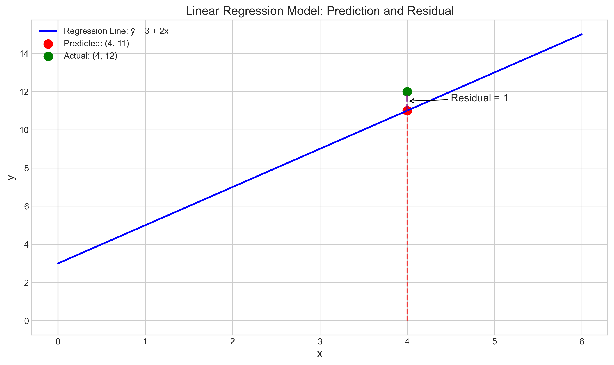
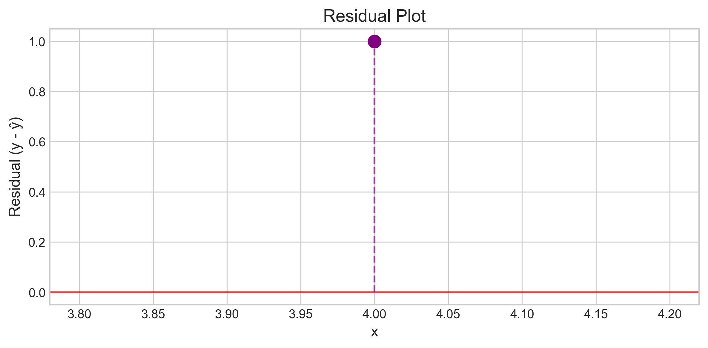
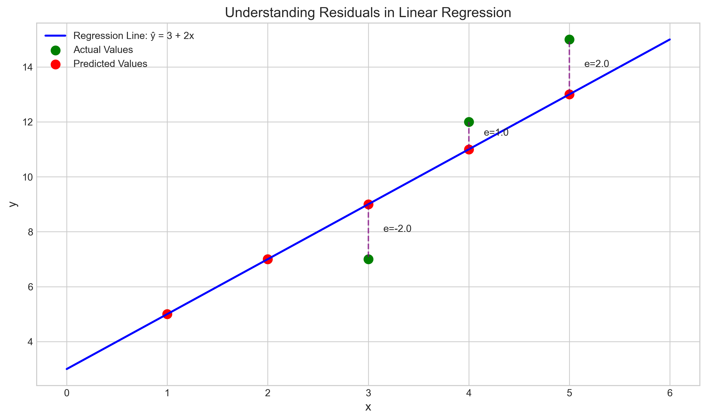

# Question 3: Basic Prediction and Residual Calculation

## Problem Statement
Given a simple linear regression model with the following equation: $\hat{y} = 3 + 2x$

### Task
1. Calculate the predicted value $\hat{y}$ when $x = 4$
2. If the actual observed value when $x = 4$ is $y = 12$, what is the residual?

## Understanding the Problem
This problem is focused on two fundamental concepts in linear regression:
1. Using a regression model to make predictions
2. Calculating residuals, which represent the difference between actual observations and model predictions

The given regression equation $\hat{y} = 3 + 2x$ is a simple linear model where:
- $\beta_0 = 3$ is the intercept (the predicted value when $x = 0$)
- $\beta_1 = 2$ is the slope (the change in $\hat{y}$ for a one-unit increase in $x$)

## Solution

### Step 1: Calculate the predicted value when $x = 4$

To find the predicted value, we substitute $x = 4$ into the regression equation:

$$\hat{y} = 3 + 2x$$
$$\hat{y} = 3 + 2 \times 4$$
$$\hat{y} = 3 + 8$$
$$\hat{y} = 11$$

Therefore, the predicted value when $x = 4$ is $\hat{y} = 11$.

### Step 2: Calculate the residual

The residual is defined as the difference between the actual observed value and the predicted value:

$$\text{Residual} = y - \hat{y}$$

Given that the actual observed value when $x = 4$ is $y = 12$, we can calculate the residual:

$$\text{Residual} = 12 - 11 = 1$$

Therefore, the residual is 1.

## Visual Explanations

### Linear Regression Model: Prediction and Residual

This visualization shows the regression line $\hat{y} = 3 + 2x$ (in blue), along with the predicted point $(4, 11)$ (in red) and the actual observed point $(4, 12)$ (in green). The vertical purple dashed line between these two points represents the residual, which has a value of 1.

### Residual Plot

This plot shows the residual value plotted against the $x$ value. The horizontal red line at $y = 0$ represents zero residual (perfect prediction). The purple point above this line indicates a positive residual, meaning the actual value is higher than the predicted value.

### Understanding Residuals in Linear Regression

This more general visualization demonstrates how residuals work in linear regression. It shows multiple data points (green), their corresponding predictions on the regression line (red), and the residuals represented by the vertical purple dashed lines between each actual value and its prediction.

## Key Insights

### Mathematical Foundations
- The prediction from a linear regression model is a simple calculation: $\hat{y} = \beta_0 + \beta_1x$
- Residuals measure the error of our model's predictions: $e_i = y_i - \hat{y}_i$
- Positive residuals indicate that the model underpredicts (actual > predicted)
- Negative residuals indicate that the model overpredicts (actual < predicted)

### Practical Applications
- Residuals are fundamental for assessing model fit; smaller residuals generally indicate better predictions
- The sum of residuals in a linear regression model with an intercept term will always equal zero
- The pattern of residuals can reveal whether a linear model is appropriate for the data

### Statistical Properties
- In a well-specified linear regression model, residuals should be randomly distributed around zero
- Systematic patterns in residuals may indicate model misspecification (e.g., missing predictors, non-linear relationships)
- The squared residuals form the basis for the Residual Sum of Squares (RSS), which is minimized by the least squares method

## Conclusion
- The predicted value when $x = 4$ is $\hat{y} = 11$
- The residual when $x = 4$ is $1$ (the actual value $y = 12$ is 1 unit higher than the predicted value)
- This simple example demonstrates how to use a regression model for prediction and how to calculate residuals
- Residuals are crucial for understanding how well our model fits the data and for diagnosing potential issues with model specification

Understanding how to calculate predictions and residuals is fundamental to linear regression analysis. These concepts form the foundation for more advanced topics like model evaluation, hypothesis testing, and confidence intervals in regression analysis. 