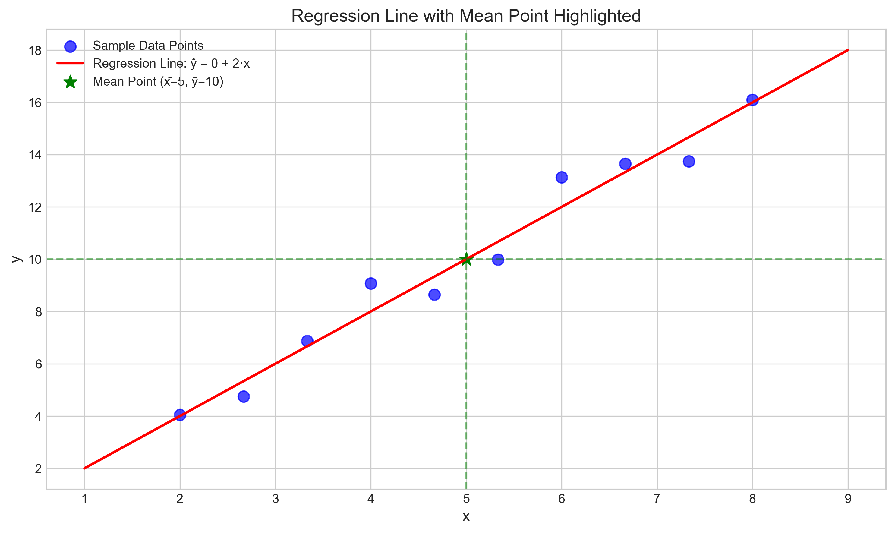
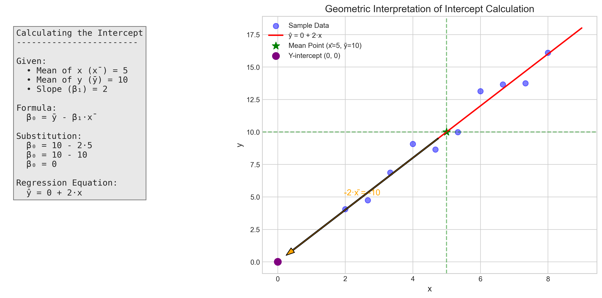
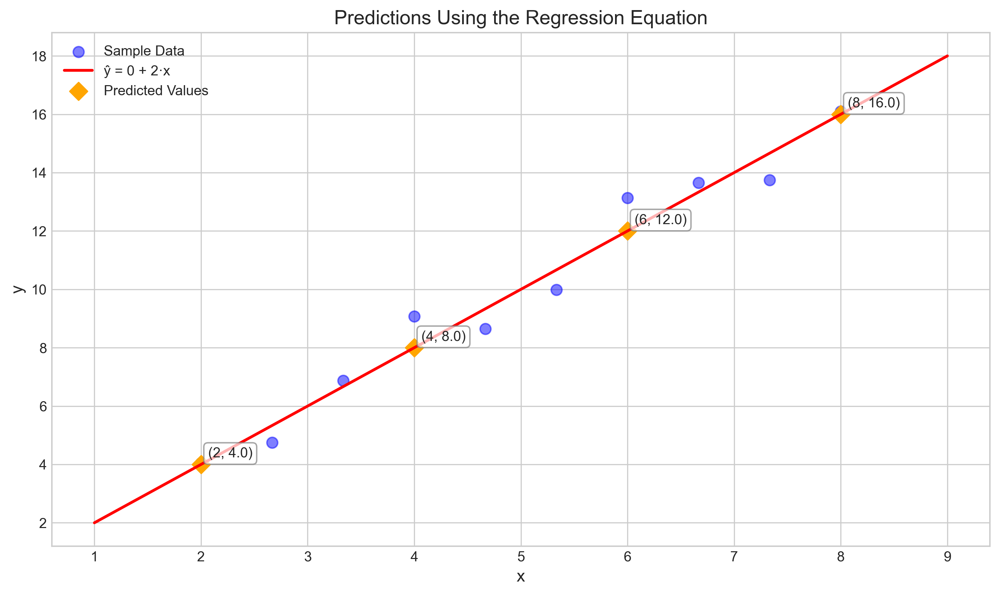

# Question 4: Finding the Intercept from Means

## Problem Statement
For a simple linear regression model, you're given that the mean of $x$ is $\bar{x} = 5$, the mean of $y$ is $\bar{y} = 10$, and the slope coefficient is $\beta_1 = 2$.

### Task
1. Calculate the intercept term $\beta_0$ of the regression line
2. Write down the complete regression equation

## Understanding the Problem
This problem tests our understanding of the relationship between the intercept and slope in a linear regression model, specifically how they relate to the means of the variables. In a simple linear regression, we know that the line always passes through the point $(\bar{x}, \bar{y})$ - the mean of $x$ and the mean of $y$. We can use this property to find the intercept when we know the slope and the means.

## Solution

### Step 1: Calculate the intercept term $\beta_0$

In simple linear regression, we model the relationship between an independent variable $x$ and a dependent variable $y$ with a linear equation:

$$\hat{y} = \beta_0 + \beta_1 x$$

where $\beta_0$ is the intercept and $\beta_1$ is the slope.

One fundamental property of least squares regression is that the regression line always passes through the point $(\bar{x}, \bar{y})$, which means:

$$\bar{y} = \beta_0 + \beta_1 \bar{x}$$

We can rearrange this equation to solve for $\beta_0$:

$$\beta_0 = \bar{y} - \beta_1 \bar{x}$$

Given the problem information:
- $\bar{x} = 5$ (mean of $x$)
- $\bar{y} = 10$ (mean of $y$)
- $\beta_1 = 2$ (slope coefficient)

We substitute these values into our formula:

$$\beta_0 = 10 - 2 \times 5 = 10 - 10 = 0$$

Therefore, the intercept term $\beta_0 = 0$.

### Step 2: Write down the complete regression equation

Now that we have both the intercept $\beta_0 = 0$ and the slope $\beta_1 = 2$, we can write the complete regression equation:

$$\hat{y} = 0 + 2x = 2x$$

This linear model predicts that the value of $y$ is simply twice the value of $x$. The intercept of 0 means that when $x = 0$, the predicted value of $y$ is also 0.

## Visual Explanations

### Regression Line with Mean Point

This visualization shows the regression line (in red) with the equation $\hat{y} = 2x$. The green star marks the point $(\bar{x}, \bar{y}) = (5, 10)$, which lies exactly on the regression line. The blue points represent sample data that would yield these means and regression coefficients.

### Geometric Interpretation of Intercept Calculation

This visualization illustrates the geometric relationship between the intercept, slope, and mean point. The left panel shows the algebraic steps to calculate the intercept. The right panel demonstrates how the intercept is determined: starting from the mean point (5, 10), we move along a slope of 2 until we reach the y-axis (x = 0). The orange arrow shows this movement, which corresponds to subtracting $\beta_1 \times \bar{x} = 2 \times 5 = 10$ from $\bar{y} = 10$, resulting in an intercept of 0.

### Predictions Using the Regression Equation

This plot demonstrates how the regression equation is used to make predictions for different values of $x$. For example, when $x = 2$, the predicted value is $\hat{y} = 2 \times 2 = 4$; when $x = 8$, the predicted value is $\hat{y} = 2 \times 8 = 16$.

## Key Insights

### Theoretical Foundations
- In least squares regression, the regression line always passes through the point $(\bar{x}, \bar{y})$.
- The intercept term $\beta_0$ can be directly calculated from the means and the slope: $\beta_0 = \bar{y} - \beta_1 \bar{x}$.
- When the intercept is 0, the regression line passes through the origin, meaning $y$ is directly proportional to $x$.

### Practical Applications
- This property of regression lines (passing through the means) allows us to quickly determine one parameter when we know the other.
- In practice, we often center our variables (subtract their means) to simplify calculations and interpretations.
- The intercept in a regression equation represents the predicted value of $y$ when $x = 0$, but this may not always be meaningful if $x = 0$ is outside the range of observed data.

### Interpretation
- In this specific problem, with a slope of 2 and an intercept of 0, the model suggests that $y$ increases by 2 units for every 1-unit increase in $x$.
- Since the intercept is 0, the relationship between $x$ and $y$ is directly proportional: $y = 2x$.
- The mean point (5, 10) satisfies this relationship exactly: $10 = 2 \times 5$.

## Conclusion
- The intercept term for the regression line is $\beta_0 = 0$.
- The complete regression equation is $\hat{y} = 2x$.
- This solution demonstrates the fundamental property that the regression line passes through the point of means $(\bar{x}, \bar{y})$.
- It illustrates how we can leverage this property to find one parameter when we know the other and the means of our variables.

This problem reinforces our understanding of the geometric interpretation of regression coefficients and their relationship to the statistical properties of our data. 