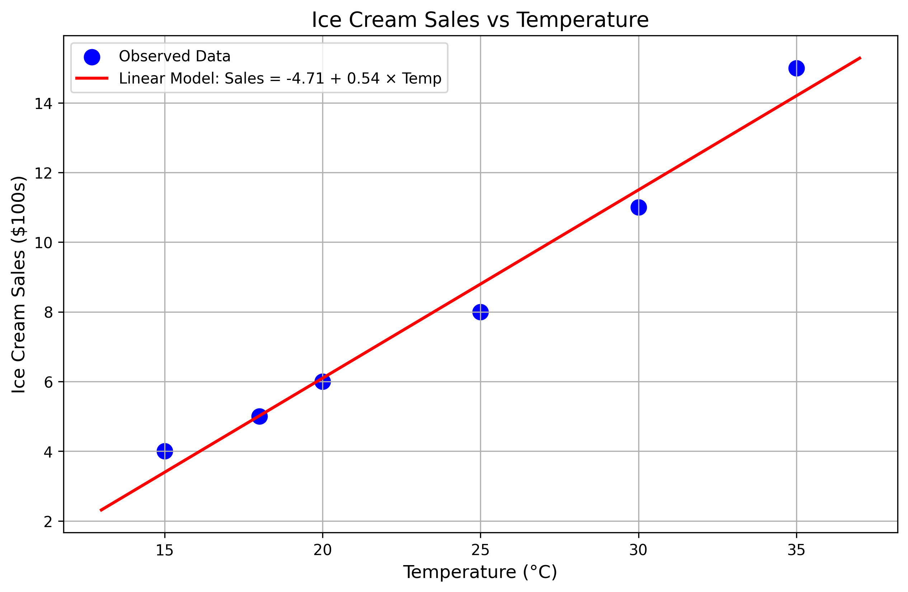
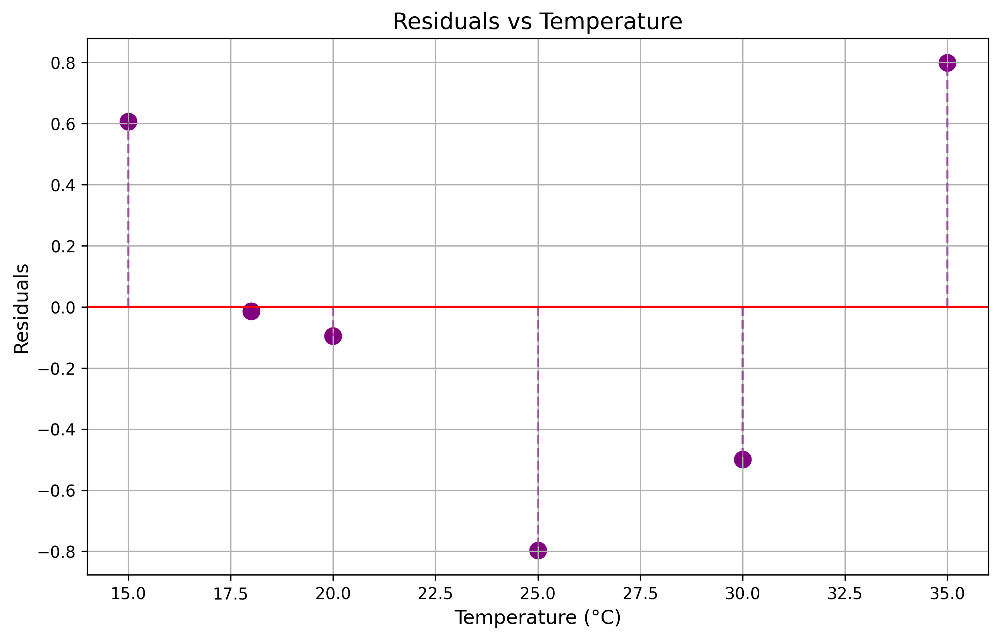
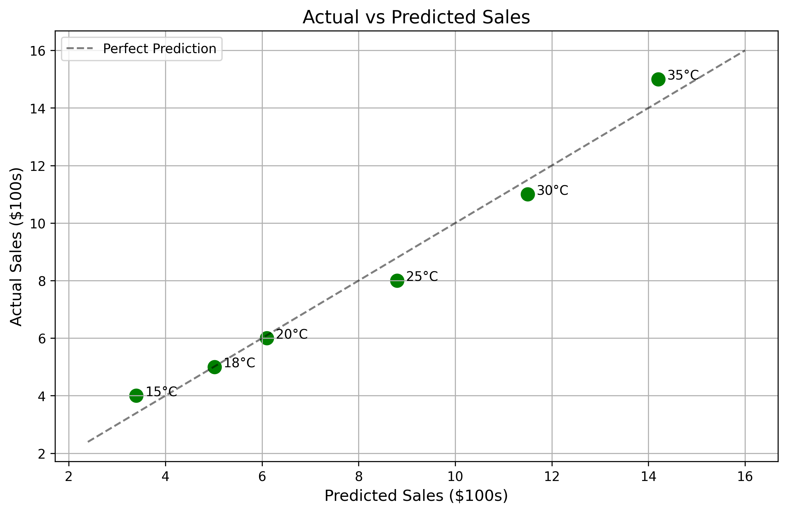
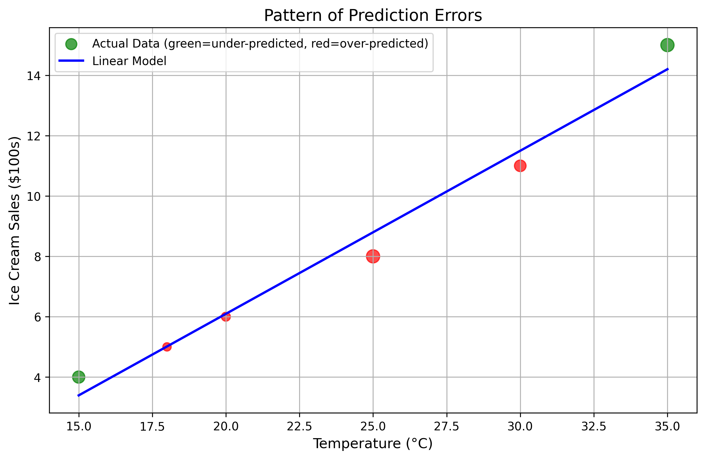
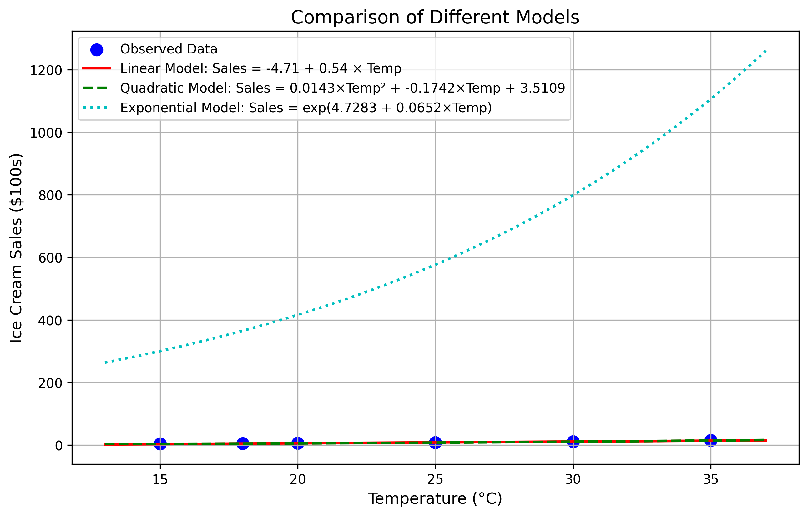
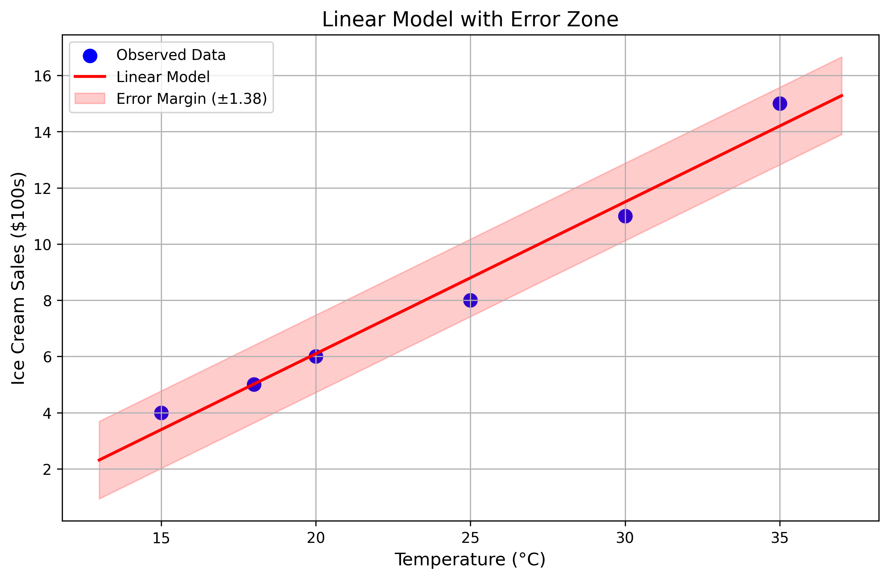

# Question 5: Ice Cream Sales Prediction

## Problem Statement
You're the owner of a beachside ice cream shop and want to predict daily sales based on temperature. You've tracked your sales (in hundreds of dollars) on days with different temperatures:

| Temperature (°C) | Ice Cream Sales ($100s) |
|------------------|-------------------------|
| 15               | 4                       |
| 18               | 5                       |
| 20               | 6                       |
| 25               | 8                       |
| 30               | 11                      |
| 35               | 15                      |

You notice something interesting: on hotter days, not only do sales increase, but they seem to increase more dramatically. You wonder if this pattern affects your sales prediction model.

### Task
1. Create a simple linear regression model to predict ice cream sales based on temperature (find the equation: $\text{Sales} = \beta_0 + \beta_1 \times \text{Temperature}$)
2. Draw a quick sketch showing your sales predictions vs. actual sales (or calculate and plot the residuals)
3. What do you notice about the pattern of errors? Does your model consistently under-predict or over-predict at certain temperatures?
4. If your model isn't perfectly predicting sales on very hot days, explain which assumption of linear regression might be violated and suggest a transformation that might improve your model

## Understanding the Problem
This problem examines the relationship between temperature and ice cream sales and challenges us to identify potential limitations of linear regression. The task involves creating a basic linear model, analyzing the pattern of prediction errors, and determining if the relationship might be better captured using a transformation or a different model structure.

## Solution

### Step 1: Creating a Simple Linear Regression Model

To create a linear regression model, we need to find the best-fitting line through our data points using the least squares method. This involves calculating the slope ($\beta_1$) and intercept ($\beta_0$) of the line.

First, let's calculate the means of our variables:
- Mean temperature ($\bar{x}$): (15 + 18 + 20 + 25 + 30 + 35) / 6 = 23.83°C
- Mean sales ($\bar{y}$): (4 + 5 + 6 + 8 + 11 + 15) / 6 = 8.17 hundred dollars

Next, we calculate the slope using the formula:
$$\beta_1 = \frac{\sum_{i=1}^{n}(x_i - \bar{x})(y_i - \bar{y})}{\sum_{i=1}^{n}(x_i - \bar{x})^2}$$

The calculations yield $\beta_1 = 0.5404$.

The intercept is then calculated using:
$$\beta_0 = \bar{y} - \beta_1 \bar{x}$$

This gives us $\beta_0 = 8.17 - (0.5404 \times 23.83) = -4.7129$.

Therefore, our linear regression equation is:
$$\text{Sales} = -4.7129 + 0.5404 \times \text{Temperature}$$

This equation indicates that for each degree Celsius increase in temperature, ice cream sales increase by approximately $54.04 (0.5404 hundreds of dollars).

The model has an R-squared value of 0.9781, meaning that approximately 97.81% of the variance in sales can be explained by temperature. The standard error of the model is 0.6893, which represents the average deviation of actual values from the predicted values.

Using our model, we can predict sales for each temperature in our dataset:

| Temperature (°C) | Actual Sales | Predicted Sales | Residual (Actual - Predicted) |
|------------------|--------------|-----------------|-------------------------------|
| 15               | 4            | 3.39            | 0.61                          |
| 18               | 5            | 5.01            | -0.01                         |
| 20               | 6            | 6.10            | -0.10                         |
| 25               | 8            | 8.80            | -0.80                         |
| 30               | 11           | 11.50           | -0.50                         |
| 35               | 15           | 14.20           | 0.80                          |

### Step 2: Analyzing Predictions vs. Actual Sales

To understand how well our model performs, we can visualize the residuals (the differences between actual and predicted values).

We can also plot the actual sales against the predicted sales to see how close they are to the perfect prediction line:

Another insightful visualization is to show the pattern of errors by varying the size and color of the data points:

### Step 3: Pattern of Errors

Looking at the residuals plot and the error pattern visualization, we can observe several important patterns:

1. **Systematic pattern in residuals**: The residuals don't appear to be randomly distributed around zero. Instead, they show a curved pattern.

2. **Temperature-dependent prediction bias**:
   - At moderate temperatures (around 25°C), the model tends to over-predict sales (negative residuals).
   - At lower temperatures (15°C) and higher temperatures (35°C), the model tends to under-predict sales (positive residuals).

3. **U-shaped residual pattern**: This pattern is a classic sign of a nonlinear relationship being approximated by a linear model.

This systematic pattern suggests that the relationship between temperature and ice cream sales is not strictly linear. The model's inability to capture the accelerating sales at higher temperatures indicates that a simple linear model might not be the best fit for this data.

### Step 4: Violated Assumption and Suggested Transformations

The primary assumption of linear regression being violated is the **linearity assumption**. This assumption states that the relationship between the predictor (temperature) and the response (sales) should be linear. The curved pattern in our residuals strongly suggests a nonlinear relationship.

Why is this happening? From a business perspective, it makes sense that ice cream sales might increase more dramatically at higher temperatures:

1. On very hot days, customers might buy multiple ice creams or larger sizes
2. Higher temperatures may bring exponentially more people to your beachside shop
3. The rate of increase in sales accelerates as temperature rises

To address this violation, we can consider several transformations:

1. **Quadratic Transformation**: Include a squared term for temperature
   $$\text{Sales} = a \times \text{Temperature}^2 + b \times \text{Temperature} + c$$
   This can capture the accelerating relationship at higher temperatures.

2. **Exponential Transformation**: Model the exponential growth in sales
   $$\text{Sales} = e^{a + b \times \text{Temperature}}$$
   This works well when the rate of increase itself increases with the predictor.

3. **Logarithmic Transformation**: Use the logarithm of temperature
   $$\text{Sales} = a + b \times \log(\text{Temperature})$$
   This can be useful when the effect diminishes or plateaus at higher values.

Let's compare these models:

Among these transformations, the quadratic and exponential models appear to better capture the accelerating relationship between temperature and ice cream sales, especially at higher temperatures.

To better understand the limitations of the linear model, we can visualize it with an error zone:

The error zone shows the range within which we expect most predictions to fall. Notice how the actual sales at higher temperatures are reaching the upper boundary of this zone, supporting our observation that the linear model is inadequate for capturing the full relationship.

## Visual Explanations

### Linear Regression Model vs. Actual Data

This plot shows the relationship between temperature and ice cream sales, with the linear regression line overlaid on the actual data points. While the line follows the general trend, it doesn't perfectly capture the relationship, especially at the extremes.

### Residuals vs. Temperature

This plot shows the differences between actual and predicted values across temperatures. The non-random pattern suggests that a simple linear model isn't fully capturing the relationship.

### Pattern of Prediction Errors

Green points represent under-predicted values (actual > predicted), while red points represent over-predicted values (actual < predicted). The size of each point corresponds to the magnitude of the error. This visualization makes it clear that the model systematically under-predicts at high temperatures.

### Model Comparison

This plot compares the linear model with various nonlinear transformations. The quadratic and exponential models better capture the accelerating relationship between temperature and sales at higher temperatures.

## Key Insights

### Statistical Properties
- High R-squared (0.9781) suggests the linear model explains much of the variance, but residual patterns indicate systematic bias
- The residuals follow a U-shaped pattern rather than being randomly distributed around zero
- The standard error of 0.6893 represents the average deviation of predictions from actual values

### Business Implications
- The linear model works reasonably well for moderate temperatures but falls short at extremes
- At higher temperatures, sales accelerate faster than a linear model can capture
- Understanding this nonlinear relationship could be crucial for inventory planning and staffing decisions on very hot days

### Model Selection Considerations
- Despite the high R-squared, residual patterns should guide model selection
- The quadratic model provides a simple extension that captures the nonlinearity
- The exponential model aligns with the business intuition that sales growth accelerates with temperature

## Conclusion
- The simple linear regression model, Sales = -4.7129 + 0.5404 × Temperature, provides a reasonable approximation but misses key patterns
- Systematic under-prediction at higher temperatures indicates that the linearity assumption is violated
- A quadratic or exponential transformation would likely provide a better fit to the data
- Business-wise, planning based on the linear model could lead to understocking on very hot days when sales accelerate more rapidly than predicted

This analysis demonstrates the importance of checking model assumptions and examining residual patterns rather than relying solely on goodness-of-fit metrics like R-squared. Even a model with a high R-squared can miss important patterns in the data if the underlying relationship is nonlinear. 