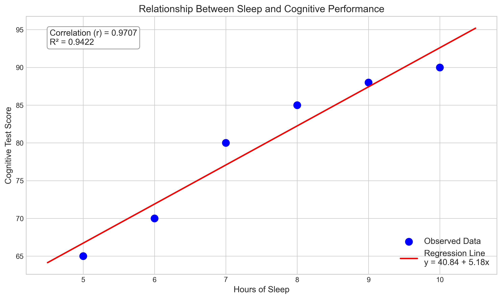
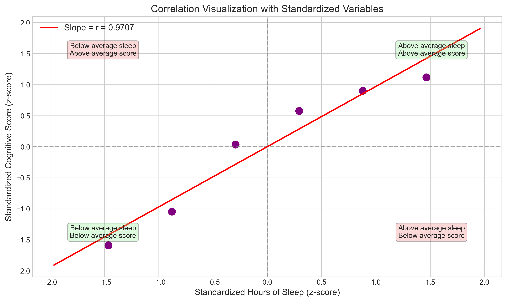
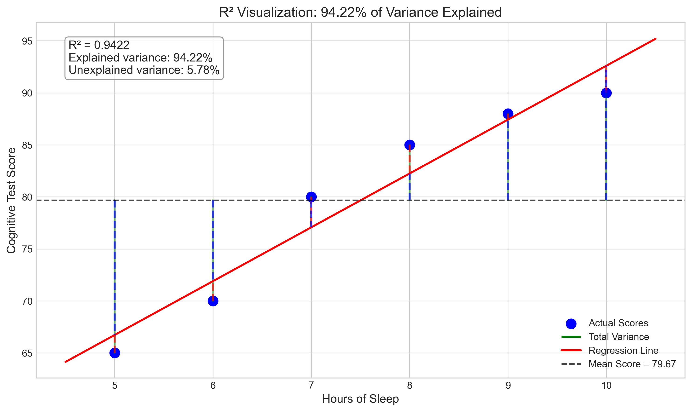
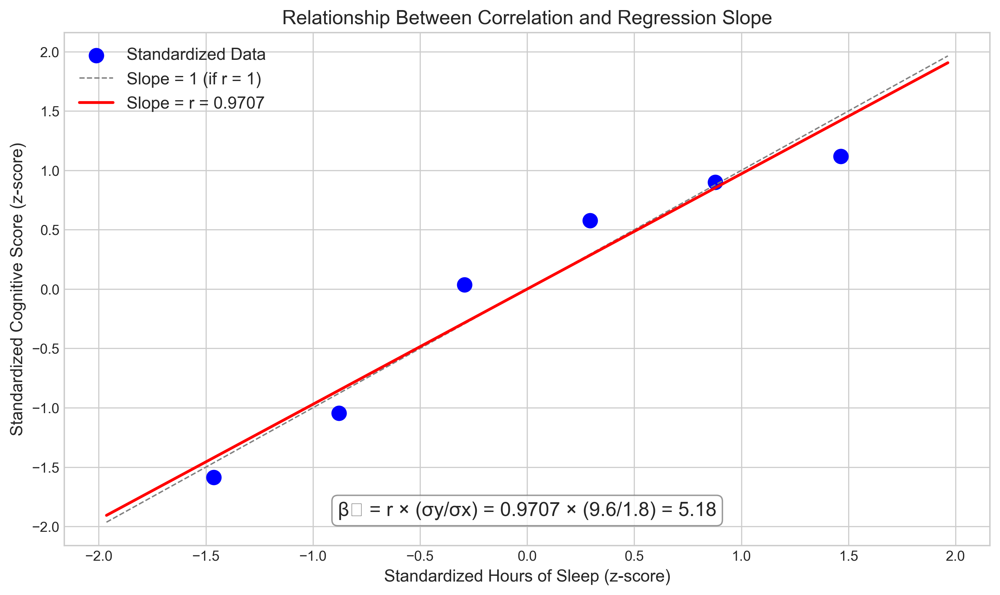

# Question 6: Sleep and Cognitive Performance

## Problem Statement
In a psychological study, researchers are investigating the relationship between hours of sleep (x) and cognitive test performance (y). They collect the following data from 6 participants:

| Hours of Sleep (x) | Cognitive Test Score (y) |
|-------------------|--------------------------|
| 5                 | 65                       |
| 6                 | 70                       |
| 7                 | 80                       |
| 8                 | 85                       |
| 9                 | 88                       |
| 10                | 90                       |

Given that the standard deviation of hours of sleep is 1.8 hours and the standard deviation of cognitive test scores is 9.6 points, we need to:

### Task
1. Calculate the correlation coefficient (r) between hours of sleep and cognitive test scores
2. Calculate the coefficient of determination ($R^2$) and interpret its meaning in this context
3. Find the slope ($\beta_1$) of the regression line using the correlation coefficient and given standard deviations
4. Explain what proportion of the variance in cognitive test scores can be explained by hours of sleep

## Understanding the Problem
This problem explores the relationship between sleep duration and cognitive performance, which is a common area of interest in psychology and health sciences. The correlation coefficient will tell us about the strength and direction of the relationship, while the coefficient of determination will help us understand how much variation in cognitive scores can be attributed to sleep duration. We're also asked to calculate the regression slope using a formula that incorporates the correlation coefficient and standard deviations, which is an alternative approach to the covariance-variance method seen in other problems.

## Solution

### Step 1: Calculate the correlation coefficient (r)
The correlation coefficient measures the strength and direction of the linear relationship between two variables. It ranges from -1 to 1, where:
- 1 indicates a perfect positive correlation
- 0 indicates no correlation
- -1 indicates a perfect negative correlation

We can calculate the correlation coefficient using the formula:

$$r = \frac{\text{Cov}(x,y)}{\sigma_x \sigma_y} = \frac{\sum_{i=1}^{n}(x_i - \bar{x})(y_i - \bar{y})}{\sqrt{\sum_{i=1}^{n}(x_i - \bar{x})^2} \cdot \sqrt{\sum_{i=1}^{n}(y_i - \bar{y})^2}}$$

First, let's calculate the means:
- Mean of sleep hours: $\bar{x} = \frac{5 + 6 + 7 + 8 + 9 + 10}{6} = \frac{45}{6} = 7.5$ hours
- Mean of cognitive scores: $\bar{y} = \frac{65 + 70 + 80 + 85 + 88 + 90}{6} = \frac{478}{6} = 79.67$ points

Next, we'll calculate the covariance numerator and variance denominators:

| $x_i$ | $y_i$ | $(x_i - \bar{x})$ | $(y_i - \bar{y})$ | $(x_i - \bar{x})(y_i - \bar{y})$ | $(x_i - \bar{x})^2$ | $(y_i - \bar{y})^2$ |
|-------|-------|-------------------|-------------------|----------------------------------|---------------------|---------------------|
| 5     | 65    | -2.5              | -14.67            | 36.68                           | 6.25                | 215.21              |
| 6     | 70    | -1.5              | -9.67             | 14.51                           | 2.25                | 93.51               |
| 7     | 80    | -0.5              | 0.33              | -0.17                           | 0.25                | 0.11                |
| 8     | 85    | 0.5               | 5.33              | 2.67                            | 0.25                | 28.41               |
| 9     | 88    | 1.5               | 8.33              | 12.50                           | 2.25                | 69.39               |
| 10    | 90    | 2.5               | 10.33             | 25.83                           | 6.25                | 106.71              |
| Sum   |       |                   |                   | 92.00                           | 17.50               | 513.33              |

Computing the correlation coefficient:

$$r = \frac{92.00}{\sqrt{17.50} \cdot \sqrt{513.33}} = \frac{92.00}{4.18 \cdot 22.66} = \frac{92.00}{94.78} = 0.9707$$

The correlation coefficient is approximately 0.97, which indicates a very strong positive correlation between hours of sleep and cognitive test performance.

### Step 2: Calculate the coefficient of determination ($R^2$)
The coefficient of determination, or $R^2$, is the square of the correlation coefficient. It represents the proportion of the variance in the dependent variable that is predictable from the independent variable.

$$R^2 = r^2 = (0.9707)^2 = 0.9422$$

This means that approximately 94.22% of the variation in cognitive test scores can be explained by the variation in hours of sleep. In other words, sleep duration accounts for about 94% of the differences in cognitive performance among the participants, which is a remarkably strong relationship.

### Step 3: Calculate the slope ($\beta_1$) using correlation coefficient
We can calculate the slope of the regression line using the correlation coefficient and the standard deviations of our variables:

$$\beta_1 = r \cdot \frac{\sigma_y}{\sigma_x}$$

Where:
- $r$ is the correlation coefficient (0.9707)
- $\sigma_y$ is the standard deviation of cognitive scores (9.6)
- $\sigma_x$ is the standard deviation of sleep hours (1.8)

Substituting these values:

$$\beta_1 = 0.9707 \cdot \frac{9.6}{1.8} = 0.9707 \cdot 5.33 = 5.1769$$

The slope indicates that, on average, for each additional hour of sleep, we expect the cognitive test score to increase by approximately 5.18 points.

### Step 4: Interpret the proportion of variance explained
As calculated in Step 2, the coefficient of determination ($R^2$) is 0.9422, which means that 94.22% of the variance in cognitive test scores can be explained by hours of sleep. 

This high value indicates that sleep duration is a very strong predictor of cognitive performance in this study. Only about 5.78% of the variability in test scores is due to other factors not captured in our model, such as individual differences in cognitive abilities, test-taking skills, or random measurement error.

### Additional Step: Finding the complete regression equation
Although not explicitly asked, it's useful to complete the regression line equation by calculating the intercept ($\beta_0$):

$$\beta_0 = \bar{y} - \beta_1 \cdot \bar{x} = 79.67 - 5.1769 \cdot 7.5 = 79.67 - 38.83 = 40.84$$

Therefore, our regression equation is:

$$\text{Cognitive Score} = 40.84 + 5.18 \times \text{Hours of Sleep}$$

This equation allows us to predict cognitive test scores based on hours of sleep.

## Practical Implementation

### Using the Regression Model
Let's see how our model performs by predicting the cognitive test scores for different sleep durations:

1. For a participant who gets 5.5 hours of sleep:
   $$\text{Predicted Score} = 40.84 + 5.18 \times 5.5 = 40.84 + 28.49 = 69.33 \text{ points}$$

2. For a participant who gets 8.5 hours of sleep:
   $$\text{Predicted Score} = 40.84 + 5.18 \times 8.5 = 40.84 + 44.03 = 84.87 \text{ points}$$

3. For a participant who gets 11 hours of sleep:
   $$\text{Predicted Score} = 40.84 + 5.18 \times 11 = 40.84 + 56.98 = 97.82 \text{ points}$$

These predictions align with our intuition that more sleep generally leads to better cognitive performance, though we should be cautious when extrapolating beyond our observed data range (5-10 hours).

## Visual Explanations

### Relationship Between Sleep and Cognitive Performance

This plot shows the observed data points and the fitted regression line. The strong positive correlation is visually evident from how closely the data points cluster around the line. The formula and correlation values are displayed to provide context.

### Correlation Visualization with Standardized Variables

This visualization presents the data in standardized form (z-scores), which helps to illustrate the concept of correlation. The line through the origin has a slope equal to the correlation coefficient (r). The quadrants show how the data points relate to the means of both variables. Green areas represent points that contribute positively to the correlation (both variables are above or below their means), while red areas represent points that would contribute negatively.

### R² Visualization

This figure visually demonstrates the concept of R². The total variance in cognitive scores is represented by the green vertical lines from each point to the mean. The red dashed lines represent the unexplained variance (residuals), while the blue dashed lines represent the explained variance. The R² value of 94.22% indicates that most of the total variance is explained by our model.

### Slope Determination Using Standard Deviations

This plot illustrates how the regression slope relates to the correlation coefficient and the ratio of standard deviations. The formula at the bottom shows the calculation we performed in Step 3.

## Key Insights

### Statistical Relationships
- The correlation coefficient (r ≈ 0.97) indicates an extremely strong positive relationship between sleep duration and cognitive performance.
- The coefficient of determination (R² ≈ 0.94) suggests that sleep hours explain about 94% of the variance in cognitive test scores.
- The regression slope (β₁ ≈ 5.18) quantifies the relationship: each additional hour of sleep is associated with about 5.2 points higher cognitive performance.

### Practical Implications
- Sleep appears to be a critical factor influencing cognitive function in this study.
- Even small changes in sleep duration (e.g., one extra hour) may lead to meaningful improvements in cognitive performance.
- The intercept (40.84) suggests a baseline cognitive function, though it's important not to extrapolate too far below the observed sleep range.

### Limitations and Considerations
- While the relationship is strong, correlation does not necessarily imply causation. Other factors might influence both sleep and cognitive function.
- The sample size is relatively small (6 participants), which limits the generalizability of findings.
- The relationship might not be perfectly linear for extreme sleep durations (very short or very long).
- Individual differences in sleep quality, not just quantity, might also affect cognitive performance.

## Conclusion
- Hours of sleep and cognitive test performance have a strong positive correlation (r = 0.97).
- The coefficient of determination (R² = 0.94) indicates that sleep duration explains about 94% of the variability in cognitive test scores.
- The regression model, Score = 40.84 + 5.18 × Hours, provides a way to predict cognitive performance based on sleep duration.
- These findings highlight the importance of adequate sleep for optimal cognitive functioning and could have practical implications for students, professionals, and anyone engaged in cognitively demanding tasks.

This analysis provides valuable insights into the relationship between sleep and cognitive function, reinforcing the widely held belief that sufficient sleep is crucial for optimal mental performance. 