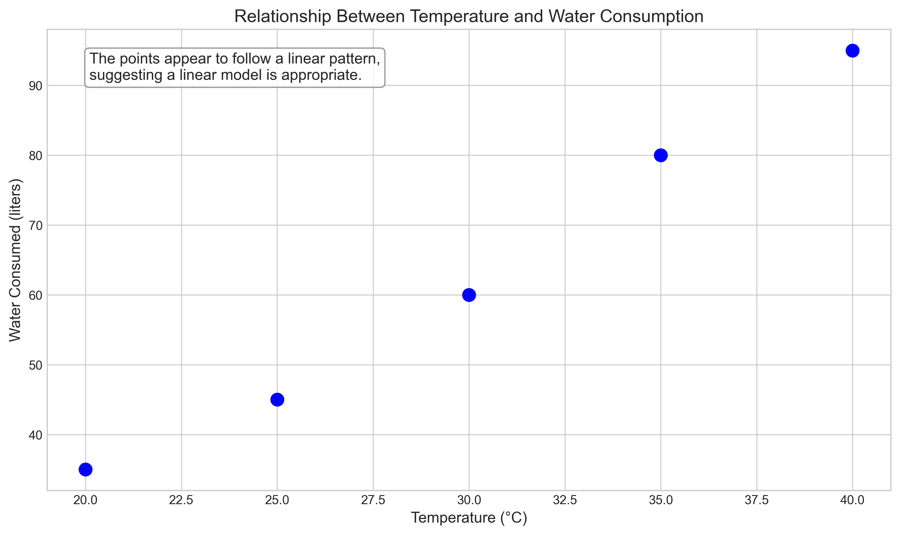
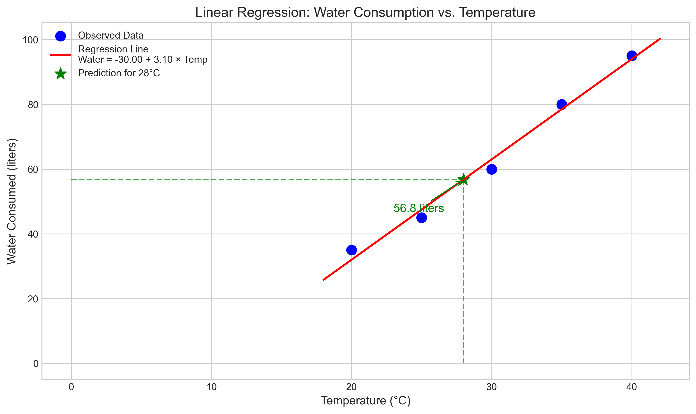
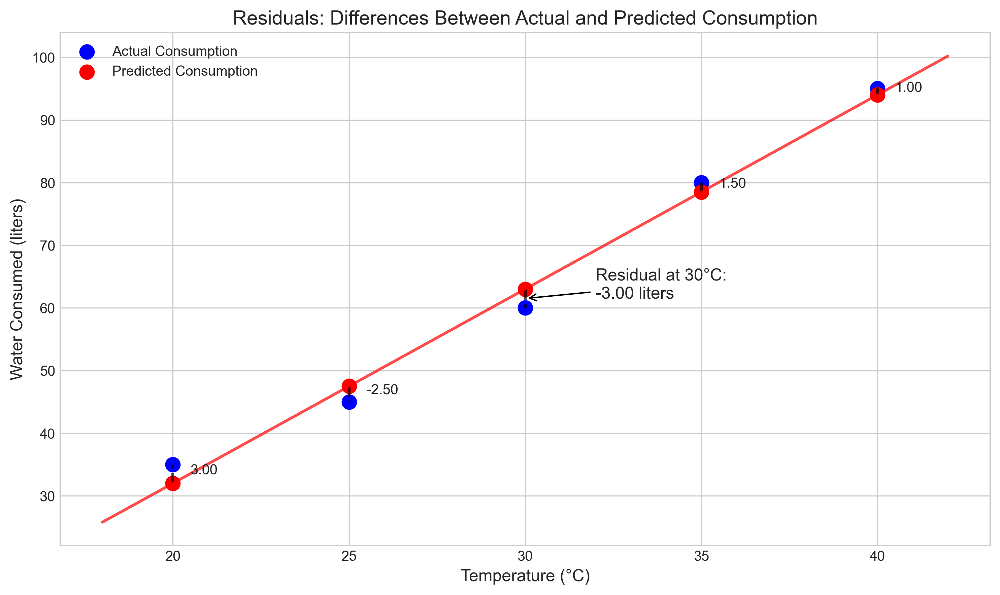
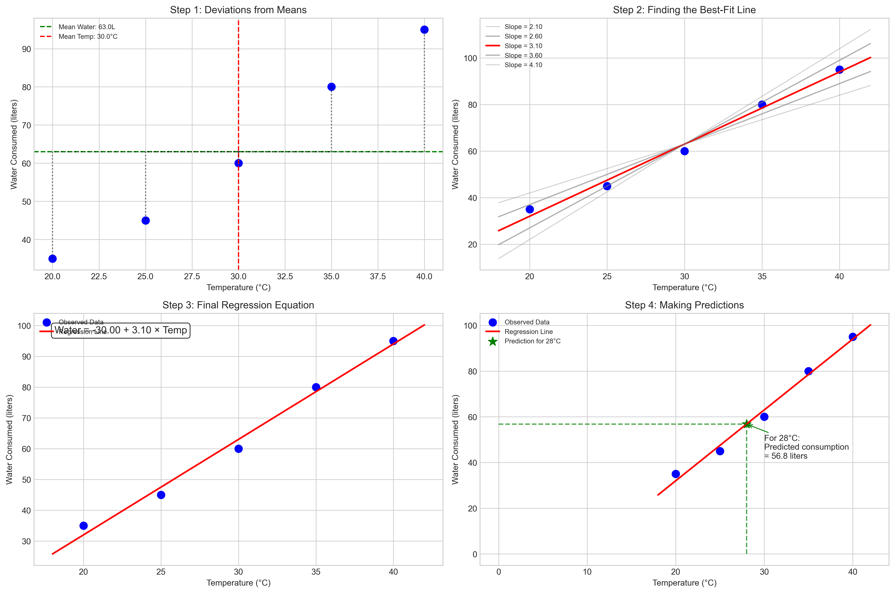

# Question 7: Temperature and Water Consumption

## Problem Statement
A restaurant owner wants to understand how outdoor temperature affects ice water consumption. Data was collected on 5 different days:

| Temperature (x) in °C | Water Consumed (y) in liters |
|----------------------|-----------------------------|
| 20                    | 35                          |
| 25                    | 45                          |
| 30                    | 60                          |
| 35                    | 80                          |
| 40                    | 95                          |

### Task
1. Sketch a scatter plot of the data points. Does a linear relationship seem appropriate?
2. Calculate the mean of $x$ and $y$ values.
3. Using the least squares method, find the linear equation that best fits this data.
4. If tomorrow's forecast is 28°C, how many liters of water should the restaurant prepare?
5. Calculate the residual for the day when temperature was 30°C.

## Understanding the Problem
This problem explores the relationship between outdoor temperature and water consumption in a restaurant setting. The restaurant owner wants to develop a model to predict how much water customers will consume based on the temperature, which will help with inventory planning and reduce waste. We need to determine if a linear model is appropriate, develop the model using the least squares method, and then use it to make a specific prediction for a 28°C day. We'll also analyze how well our model fits the observed data by calculating a residual.

## Solution

### Step 1: Examine if a linear relationship is appropriate
First, let's visualize the data by creating a scatter plot of temperature versus water consumption.

Based on the scatter plot, the relationship between temperature and water consumption appears to be approximately linear. The points generally follow a straight-line pattern, with water consumption increasing as temperature increases. This suggests that a linear regression model would be appropriate for this data.

### Step 2: Calculate the means of temperature and water consumption
To fit a regression line, we first need to calculate the means of our variables:

Mean temperature (x̄):
$$\bar{x} = \frac{20 + 25 + 30 + 35 + 40}{5} = \frac{150}{5} = 30 \text{ °C}$$

Mean water consumption (ȳ):
$$\bar{y} = \frac{35 + 45 + 60 + 80 + 95}{5} = \frac{315}{5} = 63 \text{ liters}$$

### Step 3: Find the linear equation that best fits the data using least squares
The linear regression model has the form:
$$\text{Water} = \beta_0 + \beta_1 \times \text{Temperature}$$

To find the slope ($\beta_1$) and intercept ($\beta_0$), we use the least squares method.

First, we calculate the slope ($\beta_1$):
$$\beta_1 = \frac{\sum_{i=1}^{n}(x_i - \bar{x})(y_i - \bar{y})}{\sum_{i=1}^{n}(x_i - \bar{x})^2}$$

Let's calculate the numerator (covariance):
- $(20 - 30)(35 - 63) = (-10)(-28) = 280$
- $(25 - 30)(45 - 63) = (-5)(-18) = 90$
- $(30 - 30)(60 - 63) = (0)(-3) = 0$
- $(35 - 30)(80 - 63) = (5)(17) = 85$
- $(40 - 30)(95 - 63) = (10)(32) = 320$
- Sum = $280 + 90 + 0 + 85 + 320 = 775$

Next, let's calculate the denominator (variance of x):
- $(20 - 30)^2 = (-10)^2 = 100$
- $(25 - 30)^2 = (-5)^2 = 25$
- $(30 - 30)^2 = (0)^2 = 0$
- $(35 - 30)^2 = (5)^2 = 25$
- $(40 - 30)^2 = (10)^2 = 100$
- Sum = $100 + 25 + 0 + 25 + 100 = 250$

Now we can calculate the slope:
$$\beta_1 = \frac{775}{250} = 3.1 \text{ liters/°C}$$

Next, we calculate the intercept ($\beta_0$):
$$\beta_0 = \bar{y} - \beta_1 \bar{x} = 63 - 3.1 \times 30 = 63 - 93 = -30 \text{ liters}$$

Therefore, our regression equation is:
$$\text{Water Consumed} = -30 + 3.1 \times \text{Temperature}$$

This means that for each 1°C increase in temperature, we expect water consumption to increase by approximately 3.1 liters.

### Step 4: Predict water consumption for a temperature of 28°C
Using our regression equation, we can predict the water consumption for a 28°C day:
$$\text{Water} = -30 + 3.1 \times 28 = -30 + 86.8 = 56.8 \text{ liters}$$

Therefore, if tomorrow's forecast is 28°C, the restaurant should prepare approximately 57 liters of water.

### Step 5: Calculate the residual for the day when temperature was 30°C
The residual is the difference between the actual observed value and the predicted value from our model.

First, let's calculate the predicted water consumption for a 30°C day:
$$\text{Predicted Water} = -30 + 3.1 \times 30 = -30 + 93 = 63 \text{ liters}$$

Now, we can calculate the residual:
$$\text{Residual} = \text{Actual} - \text{Predicted} = 60 - 63 = -3 \text{ liters}$$

The negative residual of -3 liters indicates that on the 30°C day, the actual water consumption (60 liters) was 3 liters less than what our model predicted (63 liters).

## Practical Implementation

### Implementing the Model for Restaurant Planning
The regression model provides a practical tool for the restaurant owner to plan water inventory based on temperature forecasts:

1. Monitor the weather forecast for upcoming days
2. Use the equation: Water = -30 + 3.1 × Temperature to predict water consumption
3. Prepare slightly more water than predicted to account for model uncertainty
4. Track the accuracy of predictions over time to refine the model

#### Example Predictions for Different Temperatures:
- For a 22°C day: Water = -30 + 3.1 × 22 = 38.2 liters
- For a 32°C day: Water = -30 + 3.1 × 32 = 69.2 liters
- For a 38°C day: Water = -30 + 3.1 × 38 = 87.8 liters

### Analyzing Model Performance
The residual we calculated for the 30°C day (-3 liters) suggests our model is reasonably accurate. However, one data point isn't enough to fully assess model performance. The restaurant owner should continue tracking actual consumption versus predictions and calculate more residuals to evaluate the model's overall accuracy.

## Visual Explanations

### Step-by-Step Regression Process

This combined visualization shows the entire regression process:
1. **Top Left**: How the data points deviate from the means
2. **Top Right**: How different slopes were considered to find the best fit
3. **Bottom Left**: The final regression equation
4. **Bottom Right**: Using the model to make predictions, specifically for 28°C

### Detailed Interpretation of Residuals
The residuals plot (shown earlier) illustrates the differences between observed and predicted values. The vertical distance between the blue points (actual consumption) and red points (predicted consumption) represents the residuals. The highlighted residual for 30°C shows that our model slightly overestimated water consumption for that temperature.

## Key Insights

### Statistical Relationships
- The relationship between temperature and water consumption appears strongly linear
- For each 1°C increase in temperature, water consumption increases by approximately 3.1 liters
- The negative intercept (-30 liters) doesn't have a physical interpretation in this context, since you can't have negative water consumption, but it works mathematically for the model in our temperature range

### Business Implications
- The restaurant owner now has a quantitative tool to predict water needs based on weather forecasts
- Accurate predictions can help optimize inventory and reduce waste
- On extremely hot days (above 35°C), water consumption increases substantially, indicating a need for extra preparation
- The linear relationship suggests that customers' thirst increases proportionally with temperature

### Limitations and Considerations
- The model is based on only 5 data points, which limits its statistical reliability
- The model assumes a strictly linear relationship, which may not hold for extreme temperatures
- Other factors beyond temperature (like humidity, menu items served, customer demographics) might also influence water consumption
- The negative intercept suggests the model shouldn't be used for temperatures much below the observed range (20-40°C)

## Conclusion
- Temperature and water consumption exhibit a strong linear relationship, with water consumption increasing by about 3.1 liters per 1°C increase
- For a 28°C day, the restaurant should prepare approximately 57 liters of water
- The residual analysis shows the model slightly overestimated consumption on the 30°C day by 3 liters
- This regression model provides a practical tool for the restaurant owner to optimize water inventory based on temperature forecasts

This analysis demonstrates how simple linear regression can be applied to solve practical business problems. By quantifying the relationship between temperature and water consumption, the restaurant owner can make data-driven decisions about inventory management, potentially reducing waste and ensuring customer satisfaction. 