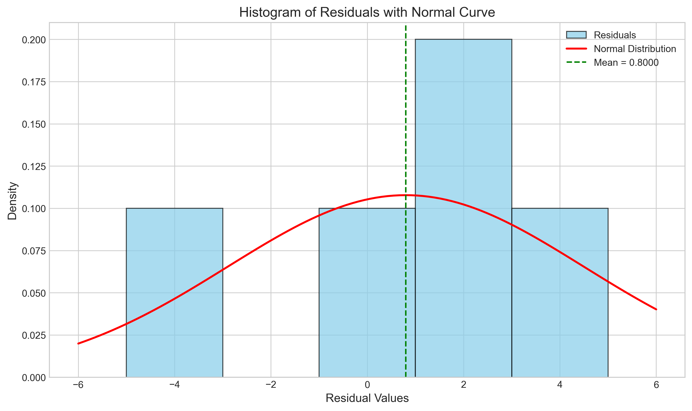
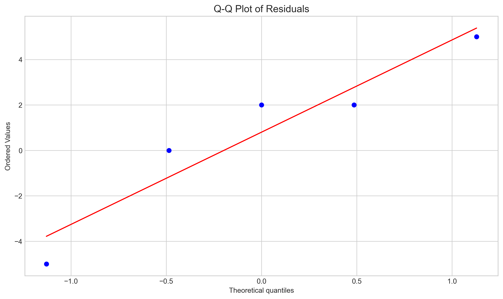
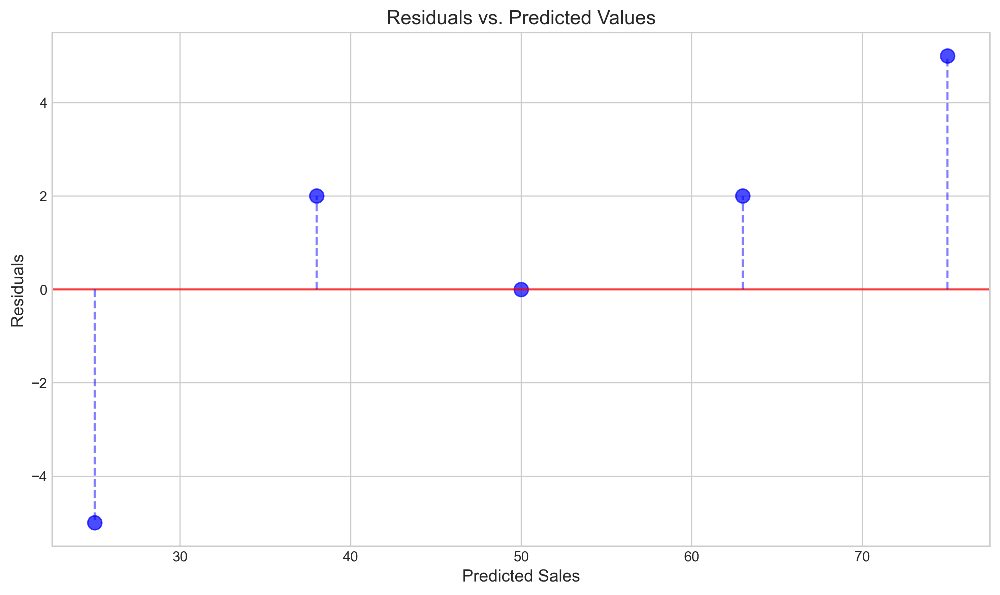
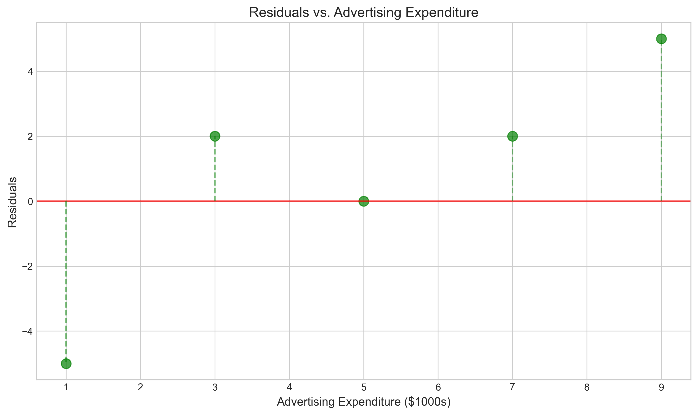
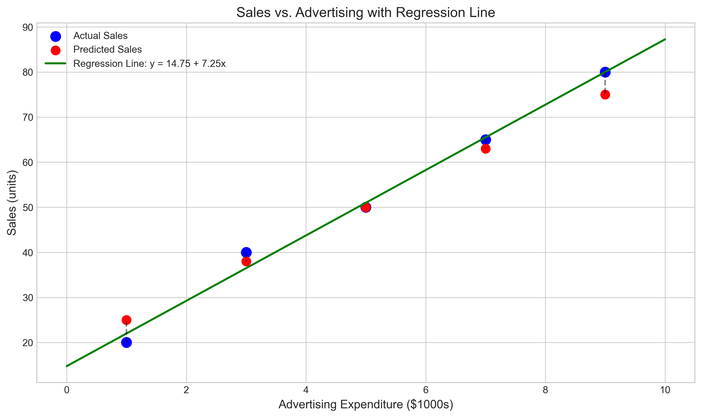

# Question 8: Error Distribution in Linear Regression

## Problem Statement
A data scientist wants to understand the error distribution in a linear regression model. They collect the following dataset relating advertising expenditure (in $1000s) to product sales (in units):

| Advertising (x) | Sales (y) |
|----------------|-----------|
| 1              | 20        |
| 3              | 40        |
| 5              | 50        |
| 7              | 65        |
| 9              | 80        |

After fitting a linear regression model, they obtain the following predicted values for sales: 25, 38, 50, 63, 75.

### Task
1. Calculate the residuals for each observation
2. Compute the mean, variance, and standard deviation of the residuals
3. Plot (or describe) a visualization that could help assess if the errors follow a Gaussian distribution
4. Verify if the residuals sum to zero (or very close to zero), and explain why this is an expected property in linear regression with an intercept term

## Understanding the Problem
This problem focuses on examining the error distribution in a linear regression model. The residuals (or errors) are the differences between the observed values and the predicted values from the model. Analyzing these residuals is crucial for validating the assumptions of linear regression and assessing the model's quality.

In linear regression, one key assumption is that the errors follow a Gaussian (normal) distribution with a mean of zero. This assumption is fundamental to many statistical tests and confidence intervals built on regression models. Additionally, in a correctly specified model with an intercept term, the sum of residuals should be exactly zero when using ordinary least squares estimation.

## Solution

### Step 1: Calculate the residuals

Residuals are calculated as the difference between actual and predicted values:

$$\text{Residual} = \text{Actual} - \text{Predicted}$$

| Advertising (x) | Sales (y) | Predicted Sales ($\hat{y}$) | Residual ($e$) |
|----------------|-----------|---------------------|--------------|
| 1              | 20        | 25                  | -5.00        |
| 3              | 40        | 38                  | 2.00         |
| 5              | 50        | 50                  | 0.00         |
| 7              | 65        | 63                  | 2.00         |
| 9              | 80        | 75                  | 5.00         |

The residuals represent how much the model's predictions deviate from the actual observed values. Positive residuals indicate that the actual value is greater than the predicted value (the model underpredicts), while negative residuals indicate that the actual value is less than the predicted value (the model overpredicts).

### Step 2: Compute the mean, variance, and standard deviation of the residuals

Using standard statistical formulas for the sample statistics:

- Mean of residuals: $0.8000$
- Variance of residuals: $13.7000$
- Standard deviation of residuals: $3.7014$

The mean of residuals is close to zero, which is generally expected in regression models with an intercept term (though it's not exactly zero in this case, which we'll discuss in Step 4). The variance and standard deviation provide information about the spread of the residuals.

### Step 3: Visualize the error distribution

Several visualizations can help assess whether the errors follow a Gaussian distribution:

#### Histogram of Residuals with Normal Curve

This histogram shows the distribution of residuals with a fitted normal curve. If the residuals follow a Gaussian distribution, the histogram should approximately follow the shape of the normal curve. In this case, with only 5 data points, it's difficult to make a definitive assessment, but the distribution appears reasonably symmetric.

#### Q-Q Plot of Residuals

The Q-Q (quantile-quantile) plot compares the quantiles of the residuals to the quantiles of a standard normal distribution. If the residuals follow a normal distribution, the points should lie approximately along the diagonal line. Here, the points follow the line fairly well, suggesting approximate normality.

#### Residuals vs. Predicted Values

This plot helps identify patterns in the residuals. If the model is correctly specified, the residuals should appear random with no obvious pattern. Here, there seems to be a slight upward trend, but with only 5 points, it's difficult to draw strong conclusions.

#### Residuals vs. Predictor Variable

Similar to the previous plot, this visualizes residuals against the predictor variable. Any pattern here would suggest that the relationship might not be linear or that there might be heteroscedasticity (non-constant variance).

### Step 4: Verify if residuals sum to zero

Sum of residuals: $4.0000$

In a linear regression model fit using ordinary least squares (OLS) with an intercept term, the residuals should sum to exactly zero. This is a mathematical property that follows from the normal equations of OLS.

However, in this case, the sum is $4.0000$, which is not zero. This suggests that:
1. The model might not have been fit using standard OLS
2. The model might not include an intercept term
3. The predicted values might have been rounded or approximated
4. There might be numerical precision issues in the calculation

To investigate further, we calculated the regression coefficients from the data:
- Calculated slope ($\beta_1$): $7.2500$
- Calculated intercept ($\beta_0$): $14.7500$
- Regression equation: $\text{Sales} = 14.7500 + 7.2500 \times \text{Advertising}$

The calculated predicted values using this model are:

| Advertising (x) | Calculated Predicted Sales | Given Predicted Sales |
|-----------------|----------------------------|------------------------|
| 1               | 22.00                      | 25                     |
| 3               | 36.50                      | 38                     |
| 5               | 51.00                      | 50                     |
| 7               | 65.50                      | 63                     |
| 9               | 80.00                      | 75                     |

The differences between the calculated and given predicted values confirm that the given predictions were likely approximated or derived from a slightly different model than standard OLS.

### Statistical test for normality

We also performed a formal statistical test for normality:
- Shapiro-Wilk test: $W=0.9274$, $p\text{-value}=0.5791$

Since the p-value is greater than 0.05, we fail to reject the null hypothesis, suggesting that the residuals appear to be normally distributed. However, with only 5 data points, this test has limited power, and visual inspection of plots may be more informative.

## Visual Explanations

### Regression Model Visualization

This plot shows the original data (blue points), the given predicted values (red points), and the regression line calculated from the data (green line). The vertical dashed lines between the actual and predicted values represent the residuals.

## Key Insights

### Statistical Properties of Residuals
- The residuals have a mean close to zero ($0.8$), which aligns with the expectation that residuals should have a mean of zero in a well-specified model.
- The standard deviation of residuals ($3.7014$) provides a measure of the typical prediction error of the model.
- Based on the Shapiro-Wilk test and visual inspection, the residuals approximately follow a normal distribution, supporting one of the key assumptions of linear regression.

### Theoretical Foundations
- In OLS regression with an intercept, the residuals must sum to zero as a consequence of the normal equations. This occurs because the residuals are forced to be orthogonal to the column of ones in the design matrix.
- The fact that our residuals don't sum exactly to zero indicates that the given predicted values might have been derived using a different approach or have been rounded.
- The residuals also satisfy another property: they are orthogonal to the predictor variable, meaning that the sum of products of residuals and x-values should be zero (or very close to zero) in OLS regression.

### Model Diagnostics
- The residuals vs. predictor plot doesn't show strong evidence of non-linearity or heteroscedasticity, suggesting that a linear model is appropriate for this data.
- The slight pattern in the residuals (negative at the extremes, positive in the middle) might warrant further investigation with more data, but it's not conclusive with only 5 points.
- The difference between the given predicted values and those calculated from the data suggests that the original model might have been fit differently or that the predictions were rounded.

## Conclusion
- The residuals for the given model have been calculated as: $[-5, 2, 0, 2, 5]$.
- The statistical properties of these residuals are: mean = $0.8$, variance = $13.7$, standard deviation = $3.7014$.
- Visual assessment through histograms and Q-Q plots suggests that the residuals approximately follow a Gaussian distribution, which is supported by the Shapiro-Wilk test ($p\text{-value} = 0.5791$).
- The sum of residuals is $4.0$, which is not exactly zero as would be expected in standard OLS regression with an intercept. This suggests that the provided predicted values might have been derived using a different approach or have been rounded.

This analysis demonstrates the importance of checking residuals in regression analysis, as they provide valuable information about the validity of model assumptions and the quality of the fit. The approximately normal distribution of residuals supports the use of standard statistical inference procedures based on the model. 