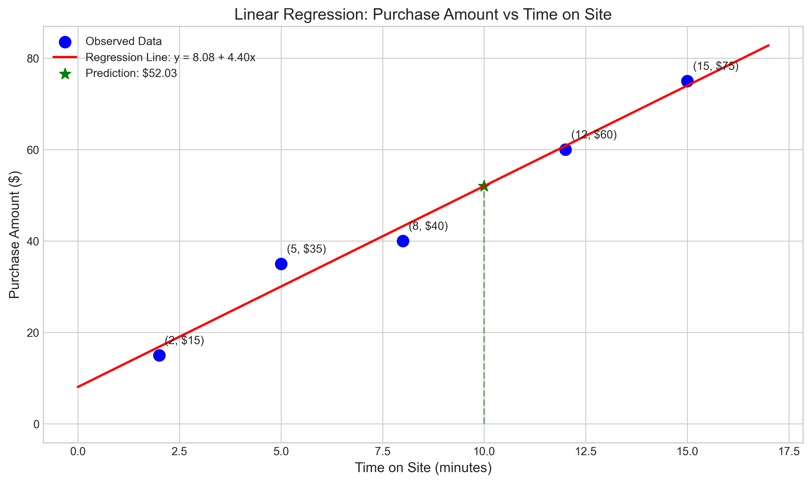
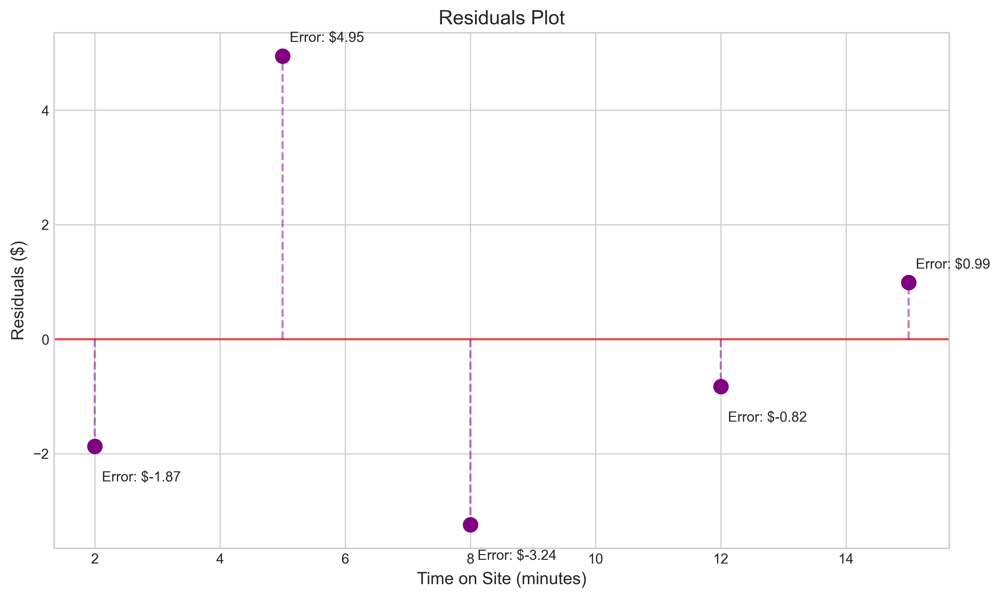
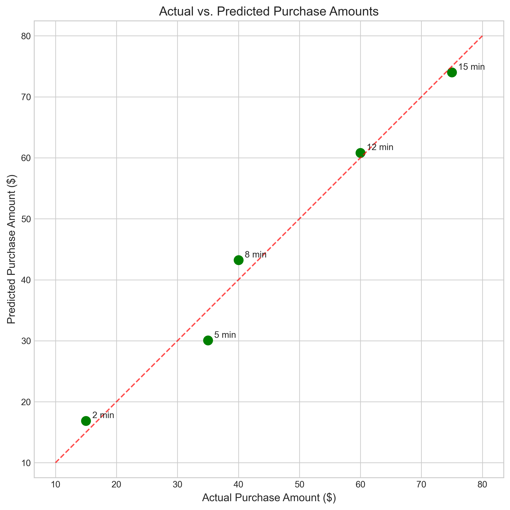
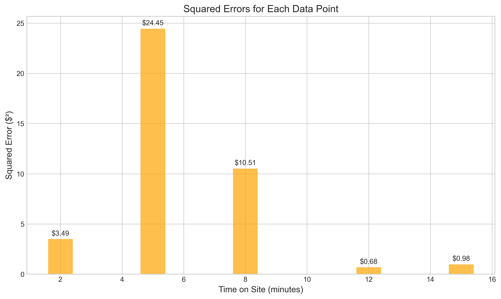

# Question 9: E-commerce Website Regression Analysis

## Problem Statement
An e-commerce company wants to understand the relationship between the time users spend on their website (in minutes) and the amount they spend on purchases (in dollars). They collect data from 5 random user sessions:

| Time on Site (x) in minutes | Purchase Amount (y) in $ |
|----------------------------|--------------------------|
| 2                          | 15                       |
| 5                          | 35                       |
| 8                          | 40                       |
| 12                         | 60                       |
| 15                         | 75                       |

### Task
1. Compute the least squares estimates for the slope ($\beta_1$) and intercept ($\beta_0$) using the following formulas:
   $$\beta_1 = \frac{\sum_{i=1}^{n}(x_i - \bar{x})(y_i - \bar{y})}{\sum_{i=1}^{n}(x_i - \bar{x})^2}$$
   $$\beta_0 = \bar{y} - \beta_1\bar{x}$$
2. Calculate the predicted purchase amount for a user who spends 10 minutes on the site
3. For each of the original data points, compute the squared error $(y_i - \hat{y}_i)^2$
4. Calculate the total Mean Squared Error (MSE) for this model

## Understanding the Problem
This problem asks us to analyze e-commerce data to determine if there's a relationship between how long customers spend on a website and how much they purchase. We need to build a simple linear regression model to predict purchase amounts based on time spent on the site. The model will have the form:

$$\text{Purchase Amount} = \beta_0 + \beta_1 \times \text{Time on Site}$$

where $\beta_0$ is the intercept (base amount) and $\beta_1$ is the slope (rate of increase in purchase amount per minute spent on the site).

## Solution

### Step 1: Compute the least squares estimates for slope and intercept

First, we calculate the means of our variables:
$$\bar{x} = \frac{2 + 5 + 8 + 12 + 15}{5} = \frac{42}{5} = 8.4 \text{ minutes}$$
$$\bar{y} = \frac{15 + 35 + 40 + 60 + 75}{5} = \frac{225}{5} = 45 \text{ dollars}$$

Next, we compute the numerator (covariance) for the slope formula:
$$\text{Covariance} = \sum_{i=1}^{n}(x_i - \bar{x})(y_i - \bar{y})$$

For each data point:
- $(2 - 8.4)(15 - 45) = (-6.4)(-30) = 192$
- $(5 - 8.4)(35 - 45) = (-3.4)(-10) = 34$
- $(8 - 8.4)(40 - 45) = (-0.4)(-5) = 2$
- $(12 - 8.4)(60 - 45) = (3.6)(15) = 54$
- $(15 - 8.4)(75 - 45) = (6.6)(30) = 198$

Total covariance = $192 + 34 + 2 + 54 + 198 = 480$

Then, we compute the denominator (variance of x):
$$\text{Variance of }x = \sum_{i=1}^{n}(x_i - \bar{x})^2$$

For each data point:
- $(2 - 8.4)^2 = (-6.4)^2 = 40.96$
- $(5 - 8.4)^2 = (-3.4)^2 = 11.56$
- $(8 - 8.4)^2 = (-0.4)^2 = 0.16$
- $(12 - 8.4)^2 = (3.6)^2 = 12.96$
- $(15 - 8.4)^2 = (6.6)^2 = 43.56$

Total variance = $40.96 + 11.56 + 0.16 + 12.96 + 43.56 = 109.2$

Now we can calculate the slope:
$$\beta_1 = \frac{\text{Covariance}}{\text{Variance of }x} = \frac{480}{109.2} = 4.40$$

And the intercept:
$$\beta_0 = \bar{y} - \beta_1 \bar{x} = 45 - 4.40 \times 8.4 = 45 - 36.96 = 8.08$$

Therefore, our regression equation is:
$$\text{Purchase Amount} = 8.08 + 4.40 \times \text{Time on Site}$$

### Step 2: Calculate the predicted purchase amount for a user who spends 10 minutes on the site

Using our regression equation:
$$\text{Predicted Purchase Amount} = 8.08 + 4.40 \times 10 = 8.08 + 44.00 = 52.08$$

A user who spends 10 minutes on the site is predicted to spend approximately $52.08.

### Step 3: Compute the squared error for each data point

For each data point, we calculate:
1. The predicted purchase amount: $\hat{y}_i = \beta_0 + \beta_1 x_i$
2. The error (residual): $e_i = y_i - \hat{y}_i$
3. The squared error: $e_i^2 = (y_i - \hat{y}_i)^2$

| Time (x) | Actual Purchase (y) | Predicted Purchase (ŷ) | Error (e) | Squared Error (e²) |
|----------|---------------------|------------------------|-----------|-------------------|
| 2        | $15                 | $16.87                 | $-1.87    | $3.49             |
| 5        | $35                 | $30.05                 | $4.95     | $24.45            |
| 8        | $40                 | $43.24                 | $-3.24    | $10.51            |
| 12       | $60                 | $60.82                 | $-0.82    | $0.68             |
| 15       | $75                 | $74.01                 | $0.99     | $0.98             |

### Step 4: Calculate the Mean Squared Error (MSE)

The Mean Squared Error is calculated as:
$$\text{MSE} = \frac{1}{n}\sum_{i=1}^{n}(y_i - \hat{y}_i)^2 = \frac{1}{n}\sum_{i=1}^{n}e_i^2$$

$$\text{MSE} = \frac{3.49 + 24.45 + 10.51 + 0.68 + 0.98}{5} = \frac{40.11}{5} = 8.02$$

The Mean Squared Error for our model is 8.02, which gives us a measure of the average squared deviation between our predicted values and the actual values.

## Visual Explanations

### Regression Line and Data Points

This plot shows the relationship between time on site and purchase amount. The blue points represent the original data, the red line is our fitted regression line, and the green star shows our prediction for a user who spends 10 minutes on the site.

### Residuals Plot

The residuals plot shows the difference between actual and predicted values. Points above the red line indicate instances where the model underestimates the purchase amount, while points below the line represent overestimation.

### Squared Errors Visualization

This visualization shows the squared errors for each data point. The orange regions represent the magnitude of the squared errors - larger areas indicate larger prediction errors.

### Actual vs. Predicted Values

This plot compares actual purchase amounts with predicted values. Points close to the red dashed line indicate good predictions. The annotations show the time spent on site for each data point.

### Squared Errors Bar Chart

The bar chart illustrates the squared error for each data point, making it easy to identify which observations have the largest prediction errors.

## Key Insights

### Mathematical Foundations
- The least squares method minimizes the sum of squared differences between observed and predicted values.
- The covariance between x and y (480) is strongly positive, indicating that longer time spent on the website is associated with higher purchase amounts.
- The slope coefficient (4.40) represents the average increase in purchase amount for each additional minute spent on the site.

### Practical Applications
- For this e-commerce website, each additional minute a user spends on the site is associated with approximately $4.40 more in purchases on average.
- The intercept (8.08) can be interpreted as the expected base purchase amount for minimal time spent on the site.
- Users who spend 10 minutes on the site can be expected to spend around $52, which helps the company predict revenue based on user engagement metrics.

### Error Analysis
- The largest squared error (24.45) occurs for the data point (5, 35), where the model significantly underestimates the purchase amount.
- The MSE of 8.02 provides a measure of the model's accuracy in predicting purchase amounts.
- The errors appear to be randomly distributed around zero, which is a good indication that a linear model is appropriate for this data.

## Conclusion
- We successfully built a linear regression model: Purchase Amount = 8.08 + 4.40 × Time on Site, which explains the relationship between time spent on the e-commerce website and the amount spent on purchases.
- The model confirms that there is a strong positive relationship between these variables, with each additional minute on the site associated with an increase of about $4.40 in purchases.
- For a user who spends 10 minutes on the site, the predicted purchase amount is approximately $52.08.
- The Mean Squared Error of 8.02 indicates reasonably good prediction accuracy considering the variability in customer behavior.

This analysis provides valuable insights for the e-commerce company. It suggests that strategies to keep users on the website longer could potentially increase sales. The company might consider implementing features that increase engagement and time spent on the site, such as personalized recommendations, interactive elements, or compelling content. 