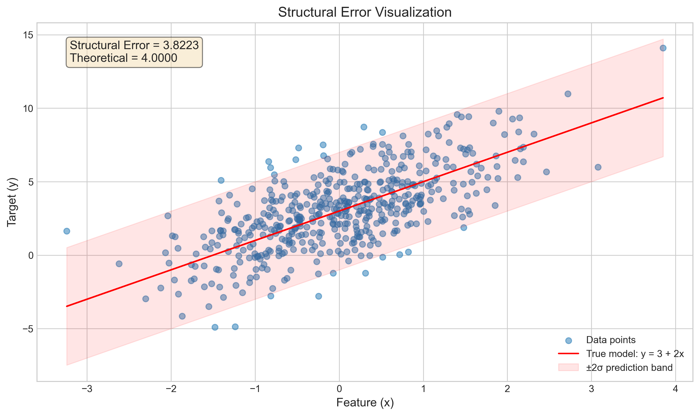
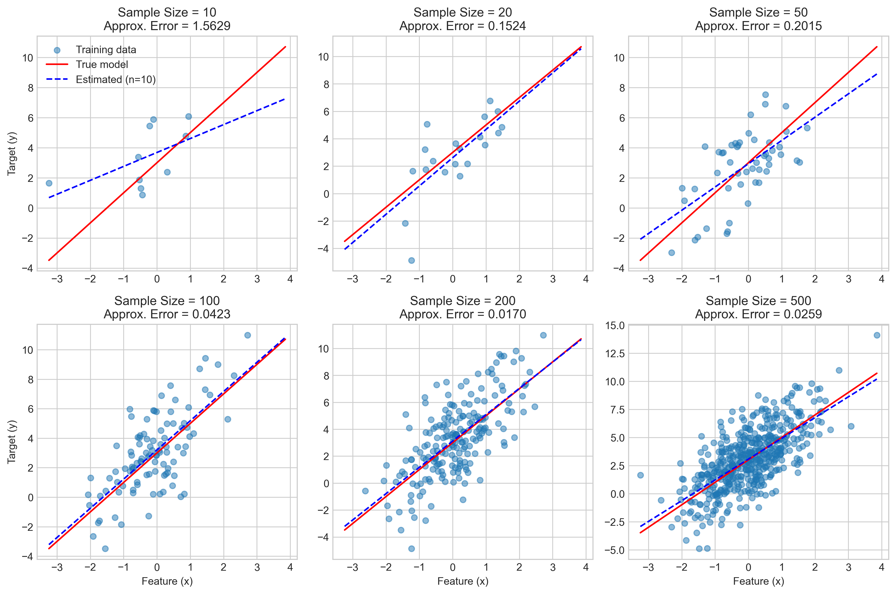
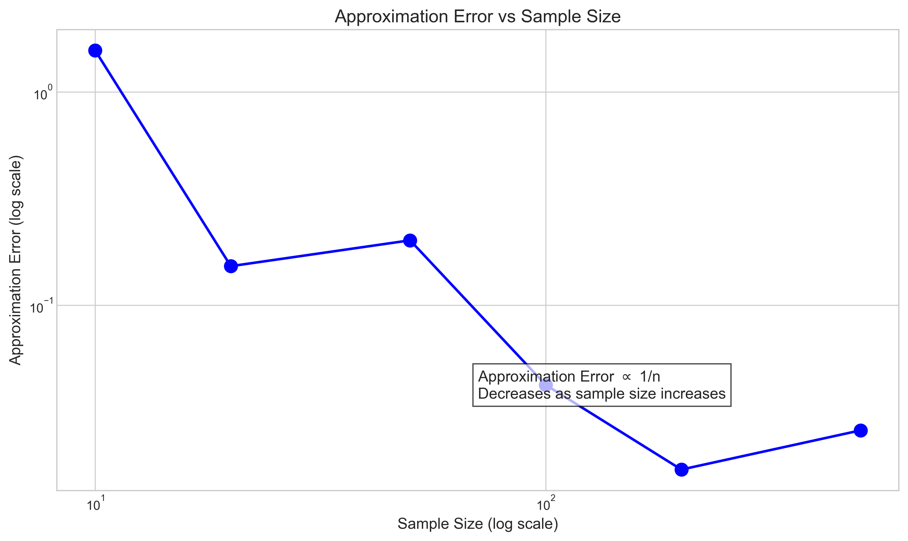
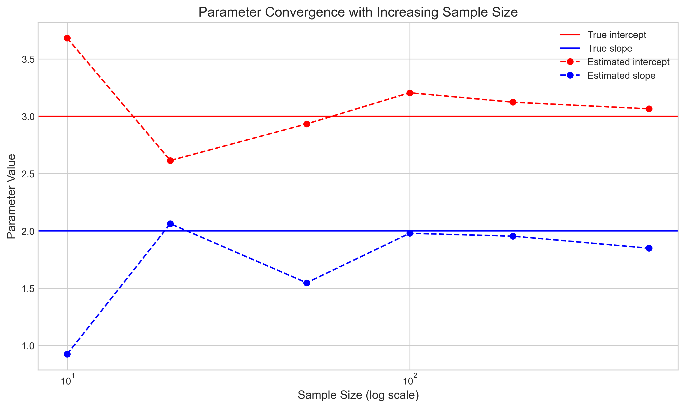
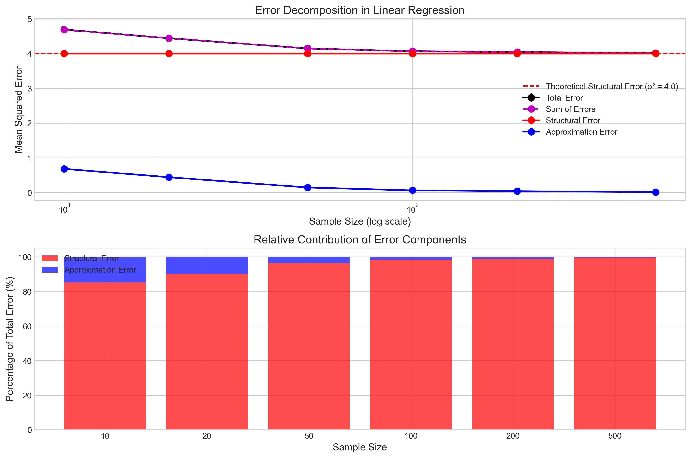
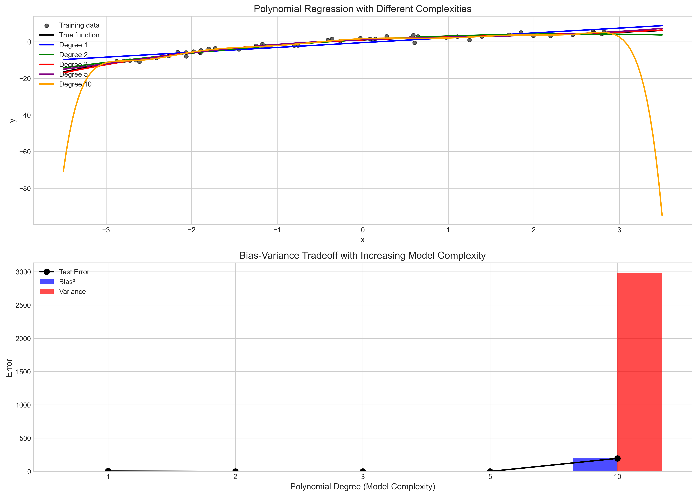
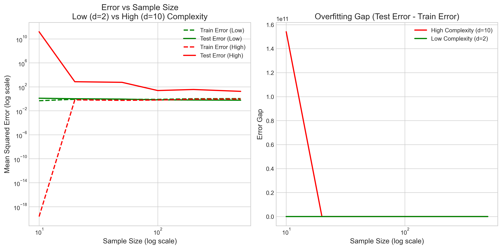

# Question 11: Error Decomposition in Linear Regression

## Problem Statement
Consider the error decomposition in linear regression. Given:

- $\boldsymbol{w}^*$ is the optimal parameter vector with infinite training data
- $\hat{\boldsymbol{w}}$ is the parameter vector estimated from a finite training set
- $\boldsymbol{y}$ is the vector of true target values
- $\boldsymbol{x}$ is the feature vector

### Task
1. Write down the mathematical expression for the structural error in linear regression
2. Write down the mathematical expression for the approximation error in linear regression
3. Prove that the expected error can be decomposed into the sum of structural and approximation errors:
   $$E_{\boldsymbol{x},y}[(y - \hat{\boldsymbol{w}}^T \boldsymbol{x})^2] = E_{\boldsymbol{x},y}[(y - \boldsymbol{w}^{*T} \boldsymbol{x})^2] + E_{\boldsymbol{x}}[(\boldsymbol{w}^{*T} \boldsymbol{x} - \hat{\boldsymbol{w}}^T \boldsymbol{x})^2]$$
4. Explain the practical significance of this error decomposition for model selection

## Understanding the Problem
This problem focuses on understanding the different sources of error in linear regression models and how they relate to each other. When developing a regression model, we need to understand why our predictions might differ from the true values. Error decomposition helps us identify whether our prediction errors arise from inherent noise in the data (structural error) or from the limitations of our estimation procedure (approximation error).

Understanding error decomposition is central to model selection and improvement strategies. It helps us decide whether we should focus on collecting more data, using a more complex model, or perhaps improving the quality of our measurements.

## Solution

### Step 1: Structural Error in Linear Regression
The structural error represents the inherent error due to noise in the data. It is the irreducible error that remains even with the optimal parameters (when we have infinite training data).

The mathematical expression for the structural error is:

$$E_{\boldsymbol{x},y}[(y - \boldsymbol{w}^{*T} \boldsymbol{x})^2]$$

Where:
- $E_{\boldsymbol{x},y}$ denotes expectation over the joint distribution of $\boldsymbol{x}$ and $y$
- $\boldsymbol{w}^*$ is the optimal parameter vector with infinite training data
- $y$ is the true target value
- $\boldsymbol{x}$ is the feature vector

This error represents the variance of the noise in the data, which cannot be reduced by any linear model, no matter how well estimated the parameters are. In a typical linear regression setting with additive noise (i.e., $y = \boldsymbol{w}^{*T} \boldsymbol{x} + \epsilon$ where $\epsilon$ has zero mean and variance $\sigma^2$), the structural error equals $\sigma^2$.

### Step 2: Approximation Error in Linear Regression
The approximation error is the error due to using finite samples to estimate parameters. It represents the difference between predictions made with the optimal parameters and predictions made with the estimated parameters.

The mathematical expression for the approximation error is:

$$E_{\boldsymbol{x}}[(\boldsymbol{w}^{*T} \boldsymbol{x} - \hat{\boldsymbol{w}}^T \boldsymbol{x})^2]$$

Where:
- $E_{\boldsymbol{x}}$ denotes expectation over the distribution of $\boldsymbol{x}$
- $\boldsymbol{w}^*$ is the optimal parameter vector with infinite training data
- $\hat{\boldsymbol{w}}$ is the parameter vector estimated from a finite training set
- $\boldsymbol{x}$ is the feature vector

This error arises from the fact that we only have a finite number of training samples to estimate our model parameters. As the sample size increases, the approximation error tends to decrease, eventually approaching zero with infinite data (assuming the model is correctly specified).

### Step 3: Proving Error Decomposition
We want to prove that:

$$E_{\boldsymbol{x},y}[(y - \hat{\boldsymbol{w}}^T \boldsymbol{x})^2] = E_{\boldsymbol{x},y}[(y - \boldsymbol{w}^{*T} \boldsymbol{x})^2] + E_{\boldsymbol{x}}[(\boldsymbol{w}^{*T} \boldsymbol{x} - \hat{\boldsymbol{w}}^T \boldsymbol{x})^2]$$

**Proof:**

1. Let's denote $\mu(\boldsymbol{x}) = \boldsymbol{w}^{*T} \boldsymbol{x}$ as the true regression function and $\hat{\mu}(\boldsymbol{x}) = \hat{\boldsymbol{w}}^T \boldsymbol{x}$ as the estimated regression function.

2. The total expected error is: $E_{\boldsymbol{x},y}[(y - \hat{\mu}(\boldsymbol{x}))^2]$

3. We can rewrite this as: $E_{\boldsymbol{x},y}[(y - \mu(\boldsymbol{x}) + \mu(\boldsymbol{x}) - \hat{\mu}(\boldsymbol{x}))^2]$

4. Expanding the square:
   $$E_{\boldsymbol{x},y}[(y - \mu(\boldsymbol{x}))^2 + 2(y - \mu(\boldsymbol{x}))(\mu(\boldsymbol{x}) - \hat{\mu}(\boldsymbol{x})) + (\mu(\boldsymbol{x}) - \hat{\mu}(\boldsymbol{x}))^2]$$

5. Taking the expectation term by term:
   - Term 1: $E_{\boldsymbol{x},y}[(y - \mu(\boldsymbol{x}))^2]$ is the structural error
   - Term 2: $E_{\boldsymbol{x},y}[2(y - \mu(\boldsymbol{x}))(\mu(\boldsymbol{x}) - \hat{\mu}(\boldsymbol{x}))]$
   - Term 3: $E_{\boldsymbol{x},y}[(\mu(\boldsymbol{x}) - \hat{\mu}(\boldsymbol{x}))^2]$

6. For Term 2, we can use the law of iterated expectations:
   $$E_{\boldsymbol{x},y}[2(y - \mu(\boldsymbol{x}))(\mu(\boldsymbol{x}) - \hat{\mu}(\boldsymbol{x}))] = E_{\boldsymbol{x}}[E_{y|\boldsymbol{x}}[2(y - \mu(\boldsymbol{x}))](\mu(\boldsymbol{x}) - \hat{\mu}(\boldsymbol{x}))]$$

7. Since $\mu(\boldsymbol{x}) = E[y|\boldsymbol{x}]$ by definition of the optimal regression function, we have $E_{y|\boldsymbol{x}}[y - \mu(\boldsymbol{x})] = 0$. Therefore, Term 2 equals 0.

8. Term 3 is $E_{\boldsymbol{x},y}[(\mu(\boldsymbol{x}) - \hat{\mu}(\boldsymbol{x}))^2] = E_{\boldsymbol{x}}[(\mu(\boldsymbol{x}) - \hat{\mu}(\boldsymbol{x}))^2]$, which is the approximation error. This equality holds because the expression inside the expectation does not depend on $y$.

9. Thus, we have proven that:
   $$E_{\boldsymbol{x},y}[(y - \hat{\boldsymbol{w}}^T \boldsymbol{x})^2] = E_{\boldsymbol{x},y}[(y - \boldsymbol{w}^{*T} \boldsymbol{x})^2] + E_{\boldsymbol{x}}[(\boldsymbol{w}^{*T} \boldsymbol{x} - \hat{\boldsymbol{w}}^T \boldsymbol{x})^2]$$

### Step 4: Practical Significance for Model Selection
The error decomposition has significant practical implications for model selection:

1. **Understanding Error Sources**:
   - The total error is split into structural error (due to noise) and approximation error (due to finite samples)
   - The structural error is a lower bound on the error that cannot be reduced by better parameter estimation
   - The approximation error can be reduced by collecting more data or using better estimation methods

2. **Bias-Variance Tradeoff**:
   - The approximation error can be further decomposed into bias squared and variance components
   - Complex models reduce bias but may increase variance (especially with limited data)
   - Simple models may have higher bias but lower variance
   - The optimal model complexity balances these two sources of error

3. **Model Selection Guidelines**:
   - When structural error dominates: focus on collecting better quality data or additional relevant features
   - When approximation error dominates: consider more complex models or collecting more training data
   - For small datasets: prefer simpler models to avoid high variance
   - For large datasets: can afford more complex models as approximation error decreases

4. **Data Collection Strategies**:
   - The decomposition informs us about when collecting more data will be beneficial
   - If approximation error is low relative to structural error, collecting more data won't help much
   - If approximation error is high, collecting more data can significantly reduce total error

5. **Cross-Validation and Regularization**:
   - Cross-validation helps estimate the total expected error
   - Regularization techniques (like ridge regression or LASSO) can help reduce approximation error by controlling model complexity

## Visual Explanations

The following visualizations illustrate the key concepts of error decomposition in linear regression:

### Structural Error Visualization

This visualization shows the structural error in linear regression. The red line represents the true model (y = 3 + 2x), while the scattered points show the observed data with noise. The shaded red area shows the ±2σ prediction band, illustrating the inherent variability in the data that cannot be reduced by better parameter estimation.

### Approximation Error vs Sample Size

This figure shows multiple plots of estimated regression lines from different sample sizes. As the sample size increases from 10 to 500, the estimated lines (blue dashed lines) converge toward the true model (red line).

This log-log plot demonstrates how approximation error decreases with increasing sample size, following an inversely proportional relationship (approximation error ∝ 1/n).

This plot shows how the estimated parameters (intercept and slope) converge to their true values as the sample size increases.

### Error Decomposition

This visualization shows how total error (black), structural error (red), and approximation error (blue) change with sample size. The top graph shows that structural error remains constant regardless of sample size, while approximation error decreases with increasing sample size. The total error approaches the structural error as sample size increases. The bottom graph shows the relative proportion of each error component at different sample sizes.

### Bias-Variance Tradeoff

This figure illustrates different model complexities (polynomial degrees 1-10) fitted to the same data. The top panel shows the fits, while the bottom panel demonstrates the bias-variance tradeoff. As model complexity increases, bias decreases but variance increases, leading to a U-shaped curve for test error.

This visualization shows how sample size affects the performance of low-complexity (degree 2) and high-complexity (degree 10) models. The left panel shows training and test errors, while the right panel shows the "overfitting gap" between test and training errors. With small datasets, complex models have much higher overfitting gaps.

## Key Insights

### Theoretical Insights
- The total expected error can be cleanly decomposed into structural and approximation components
- The structural error represents the irreducible error due to the noise in the data
- The approximation error represents the error due to parameter estimation with finite samples
- The approximation error decreases as sample size increases, while structural error remains constant
- The cross-term in the error decomposition equals zero due to the definition of the optimal regression function

### Practical Insights
- For any given dataset, there is a lower bound on achievable error (the structural error)
- Model selection should consider both the complexity of the model and the size of the dataset
- As dataset size increases, we can use more complex models without overfitting
- With small datasets, simpler models often perform better due to lower approximation error
- Regularization techniques help control approximation error by reducing parameter variance

### Model Selection Strategies
- Use cross-validation to estimate total expected error on new data
- When structural error dominates, focus on improving data quality or adding features
- When approximation error dominates, focus on collecting more data or improving estimation
- Balance model complexity with dataset size to minimize total error
- Consider the bias-variance tradeoff when selecting model complexity

## Conclusion
- The structural error in linear regression is $E_{\boldsymbol{x},y}[(y - \boldsymbol{w}^{*T} \boldsymbol{x})^2]$, representing the irreducible error due to noise.
- The approximation error is $E_{\boldsymbol{x}}[(\boldsymbol{w}^{*T} \boldsymbol{x} - \hat{\boldsymbol{w}}^T \boldsymbol{x})^2]$, representing the error due to parameter estimation with finite data.
- The total expected error can be decomposed as the sum of structural and approximation errors.
- This decomposition provides valuable insights for model selection, highlighting when to use more complex models, when to collect more data, and how to balance bias and variance.

Understanding error decomposition is fundamental to machine learning theory and practice, as it helps practitioners develop more effective models and data collection strategies. 