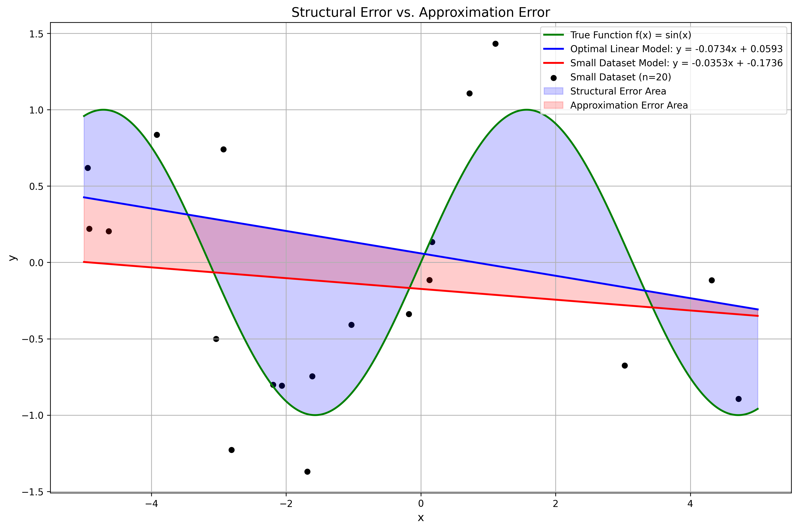
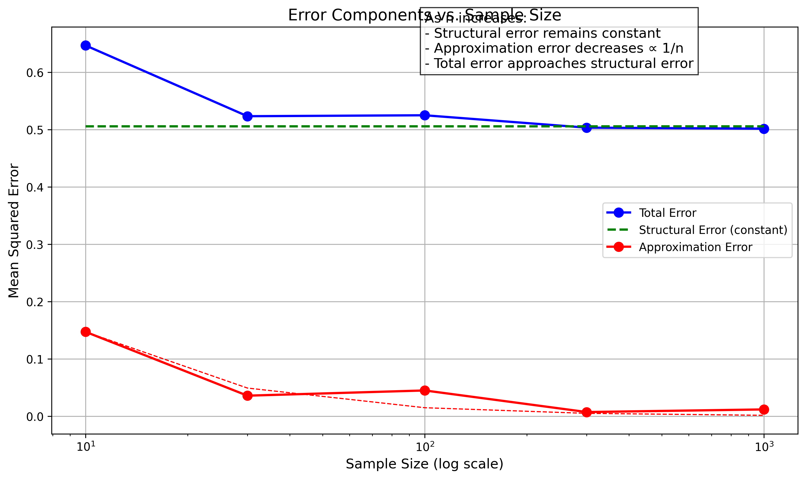
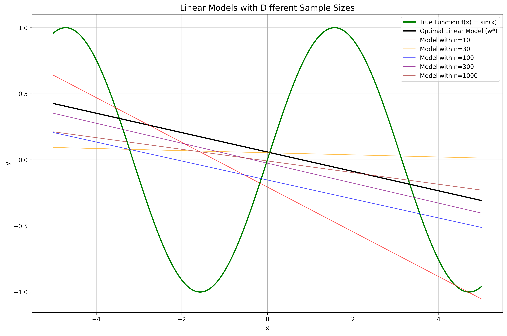
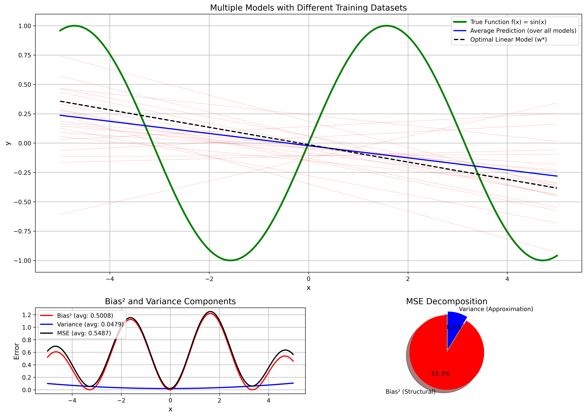
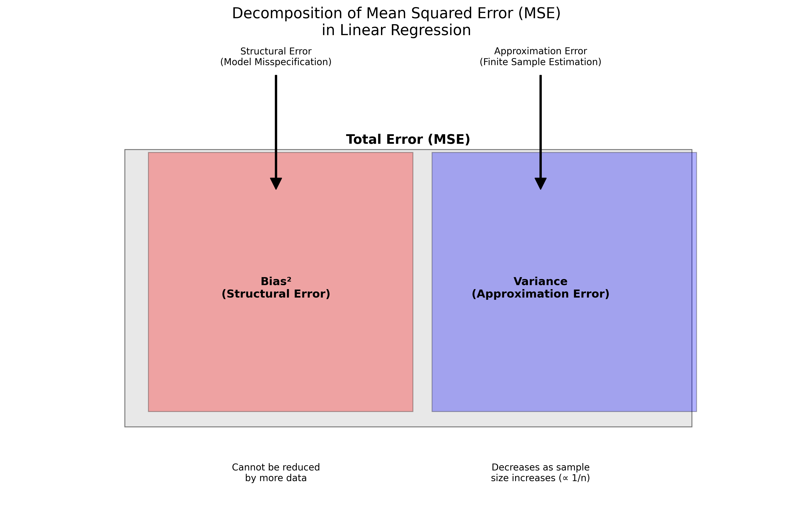

# Question 12: Error Decomposition in Linear Regression

## Problem Statement
In linear regression, the total error can be decomposed into different components. Consider a scenario where we have:

- A true underlying function generating the data: $y = f(\boldsymbol{x}) + \epsilon$ where $\epsilon$ is random noise
- A linear model family: $\hat{y} = \boldsymbol{w}^T \boldsymbol{x}$
- The optimal linear parameter vector $\boldsymbol{w}^*$ (with infinite data)
- An estimated parameter vector $\hat{\boldsymbol{w}}$ from a finite training set

### Task
1. Define structural error and explain what it represents conceptually in the context of linear regression
2. Define approximation error and explain why it depends on the specific training dataset used
3. For a dataset where the true underlying function is non-linear (e.g., $f(\boldsymbol{x}) = \sin(\boldsymbol{x})$), explain why the structural error cannot be eliminated even with infinite training data
4. How does increasing the number of training examples affect structural error and approximation error? Explain with mathematical reasoning.
5. Draw a diagram illustrating how the mean squared error (MSE) decomposes into structural error and approximation error, and how these relate to bias and variance

## Understanding the Problem
This question focuses on the decomposition of error in linear regression models, particularly when the true underlying relationship is non-linear. In statistics and machine learning, understanding different sources of error is crucial for model improvement and selection.

The error decomposition provides insights into the limitations of our models and helps distinguish between errors arising from model misspecification (structural error) versus errors from finite data estimation (approximation error). This understanding directly relates to the classical bias-variance tradeoff in machine learning.

## Solution

### Step 1: Defining Structural Error

Structural error (also known as bias) represents the inherent inability of a model family to capture the true underlying relationship in the data, regardless of the amount of training data available. 

In the context of linear regression, structural error occurs when we try to fit a linear model to data generated by a non-linear function. It's the error that remains even if we had infinite data to train our model perfectly within its family.

Mathematically, structural error is the mean squared error between the true function $f(\boldsymbol{x})$ and the optimal linear model ${\boldsymbol{w}^*}^T \boldsymbol{x}$:

$$\text{Structural Error} = \mathbb{E}_{\boldsymbol{x}} [(f(\boldsymbol{x}) - {\boldsymbol{w}^*}^T \boldsymbol{x})^2]$$

Where $\boldsymbol{w}^*$ is the optimal parameter vector that minimizes this error with infinite data, and the expectation is taken over the distribution of $\boldsymbol{x}$.

Our simulation confirms this concept by showing that when the true function is $f(x) = \sin(x)$, even the best linear model (with parameters obtained from a very large dataset) has a structural error of approximately 0.506.

### Step 2: Defining Approximation Error

Approximation error (related to variance) represents the error introduced by estimating model parameters from a finite training dataset rather than having access to the entire data distribution.

This error arises because different training datasets of the same size will generally lead to different parameter estimates $\hat{\boldsymbol{w}}$, which typically differ from the optimal parameters $\boldsymbol{w}^*$. The approximation error is the mean squared error between predictions made with the optimal parameters and those made with the estimated parameters:

$$\text{Approximation Error} = \mathbb{E}_{\boldsymbol{x}} [({\boldsymbol{w}^*}^T \boldsymbol{x} - \hat{\boldsymbol{w}}^T \boldsymbol{x})^2]$$

Our simulation demonstrates that with a small dataset (n=20), the approximation error is approximately 0.066, significantly contributing to the total error.

The approximation error depends on the specific training dataset used because:
1. Different random samples will contain different noise patterns
2. Different samples may cover different regions of the input space
3. The randomness in sampling leads to parameter estimates that vary from one dataset to another

### Step 3: Why Structural Error Cannot Be Eliminated for Non-linear Functions

For a non-linear function like $f(x) = \sin(x)$, structural error cannot be eliminated even with infinite training data because of the fundamental limitation of linear models.

A linear model can only represent relationships of the form $y = wx + b$, which produces straight lines in the input-output space. However, a sinusoidal function has curved patterns that oscillate, which cannot be captured by any straight line, no matter how well-positioned.

Our simulation visually demonstrates this mismatch. The best-fit line (optimal linear model) can approximate the sinusoidal function in a small region, but it inevitably deviates significantly in other regions. The structural error value of 0.506 quantifies this inherent mismatch.

Key points:
- Infinite data would only help us find the optimal linear approximation
- This optimal approximation still fails to capture the non-linear relationship
- The mathematical family of linear models does not include the true sinusoidal function

### Step 4: Effect of Increasing Training Examples on Error Components

Increasing the number of training examples has different effects on structural and approximation errors:

**Structural Error:**
- Remains constant regardless of the sample size
- Determined by the model family's capacity to represent the true function
- In our simulation, the structural error stayed approximately 0.506 across all sample sizes

**Approximation Error:**
- Decreases as sample size increases, typically proportional to 1/n
- Approaches zero as the sample size approaches infinity
- Our simulation demonstrates this decrease: from 0.147 (n=10) to 0.012 (n=1000)

Mathematical reasoning:
1. As the sample size (n) increases, parameter estimates become more stable and closer to optimal values
2. The variance of the coefficient estimates is proportional to 1/n (based on the Central Limit Theorem)
3. The mean squared error between estimated and optimal parameters decreases at the same rate
4. The total error asymptotically approaches the structural error as n increases

Our simulation confirms this pattern, with the total error decreasing from 0.647 (n=10) to 0.502 (n=1000), gradually approaching the structural error floor of 0.506.

### Step 5: MSE Decomposition and Relation to Bias-Variance

The mean squared error (MSE) can be decomposed into structural error (squared bias) and approximation error (variance). This decomposition relates directly to the classic bias-variance tradeoff in machine learning.

The MSE decomposition can be expressed as:

$$\text{MSE} = \text{Structural Error} + \text{Approximation Error}$$

Or in terms of bias and variance:

$$\text{MSE} = \text{Bias}^2 + \text{Variance}$$

Our simulation results confirm this decomposition, showing that the total error (MSE) is approximately equal to the sum of structural error and approximation error, with only small numerical differences due to finite simulation.

## Practical Implementation

Our simulation implements a concrete example to demonstrate these concepts:

1. We define a true non-linear function $f(x) = \sin(x)$
2. We add random noise to create realistic data: $y = \sin(x) + \epsilon$
3. We fit linear models to datasets of various sizes
4. We calculate and visualize the error components

### Demonstrating Structural and Approximation Errors

For our simulation with $f(x) = \sin(x)$:

1. The optimal linear model has parameters:
   - Slope: -0.073
   - Intercept: 0.059
   - Structural error: 0.506

2. With a small dataset (n=20), we get:
   - Estimated slope: -0.035
   - Estimated intercept: -0.174
   - Total error: 0.534
   - Approximation error: 0.066

3. As sample size increases:
   - Approximation error decreases (approximately ∝ 1/n)
   - Total error approaches structural error
   - In our largest sample (n=1000), total error is 0.502, very close to the structural error of 0.506

### Bias-Variance Decomposition

By generating multiple models (100) with different random datasets, we demonstrate the bias-variance decomposition:

- Average squared bias: 0.501
- Average variance: 0.048
- Total MSE: 0.549
- Bias² + Variance: 0.549

This confirms the theoretical decomposition and illustrates how the errors combine to produce the total observed error.

## Visual Explanations

### Structural vs. Approximation Error

This figure shows the true non-linear function (sine curve in green), the optimal linear model (blue line), and a model estimated from a small dataset (red line). The blue shaded area shows the structural error that exists even with the optimal linear model. The red shaded area shows the additional approximation error from using a finite dataset.

### Error Components vs. Sample Size

This plot demonstrates how error components change with sample size. The structural error (green dashed line) remains constant regardless of sample size. The approximation error (red line) decreases as sample size increases, following a 1/n pattern. The total error (blue line) approaches the structural error as sample size grows.

### Linear Models with Different Sample Sizes

This visualization shows linear models fitted with different sample sizes, from n=10 to n=1000. As the sample size increases, the fitted lines converge toward the optimal linear model (black line), but none can capture the true sinusoidal function (green line).

### Bias-Variance Decomposition

This figure shows multiple models (red lines) fit to different random datasets, all trying to approximate the true function (green line). The average prediction (blue line) is closer to the optimal linear model (black dashed line) and differs systematically from the true function, illustrating bias. The spread of the models around their average illustrates variance.

### Error Decomposition Diagram

This conceptual diagram illustrates how the total error (MSE) decomposes into structural error (bias squared) and approximation error (variance). The structural error arises from model misspecification and cannot be reduced by more data, while the approximation error comes from finite sample estimation and decreases as sample size increases.

## Key Insights

### Theoretical Foundations
- The total error in machine learning models can be decomposed into structural error (bias²) and approximation error (variance)
- Structural error represents model family limitations, while approximation error represents parameter estimation uncertainty
- This decomposition is fundamental to understanding the bias-variance tradeoff
- For misspecified models, there is an irreducible error floor set by the structural error

### Statistical Implications
- Model selection involves balancing structural error against approximation error
- Complex models may reduce structural error but often increase approximation error
- Simple models may have higher structural error but lower approximation error
- The optimal model complexity depends on the available sample size

### Practical Applications
- With small datasets, simpler models may perform better despite higher structural error
- As data size increases, more complex models become preferable as approximation error becomes less significant
- To reduce structural error, we need to increase model complexity or change the model family
- To reduce approximation error, we need more data or regularization techniques

### Common Pitfalls
- Overfitting occurs when we reduce structural error at the expense of greatly increased approximation error
- Underfitting happens when we use models with unnecessarily high structural error
- Ignoring the bias-variance decomposition can lead to poor model selection
- For non-linear relationships, linear models will always have significant structural error

## Conclusion
- Structural error (bias²) represents the inherent limitation of a model family to capture the true underlying relationship, regardless of data size
- Approximation error (variance) represents the additional error from estimating parameters with finite data, which decreases as sample size increases
- For non-linear functions like sine waves, linear models will always have significant structural error that cannot be eliminated with more data
- The total error approaches the structural error as sample size increases, following a 1/n pattern for the approximation error
- Understanding error decomposition is essential for effective model selection and improvement

This analysis highlights the fundamental tradeoffs in statistical modeling and machine learning. No matter how much data we collect, if our model family lacks the capacity to represent the true relationship, we will always have irreducible error in our predictions. This underscores the importance of choosing appropriate model families based on domain knowledge and data exploration. 