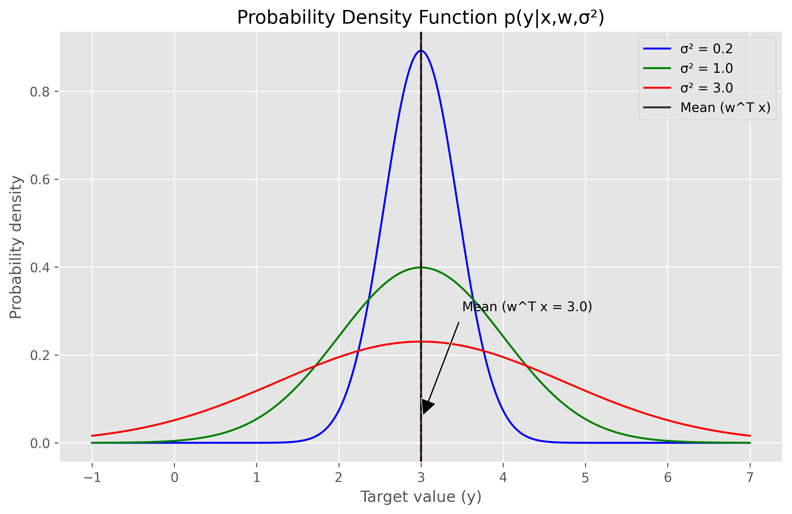
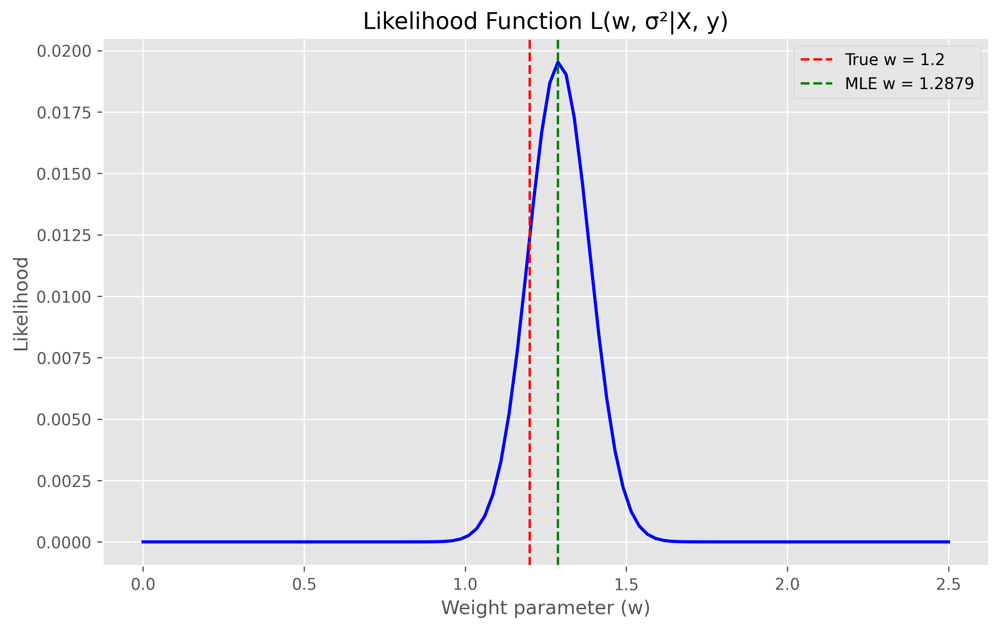
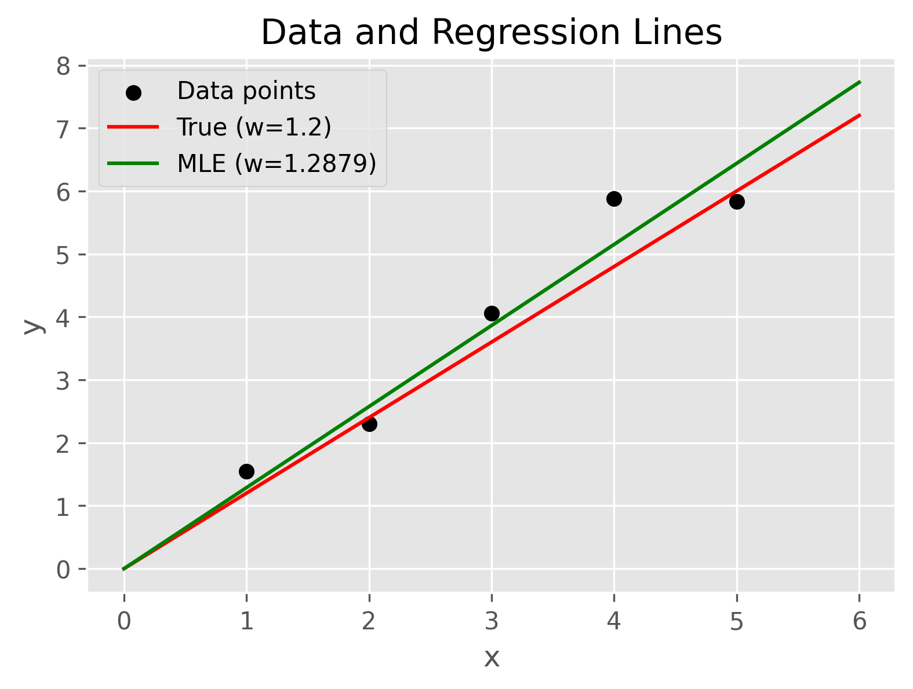
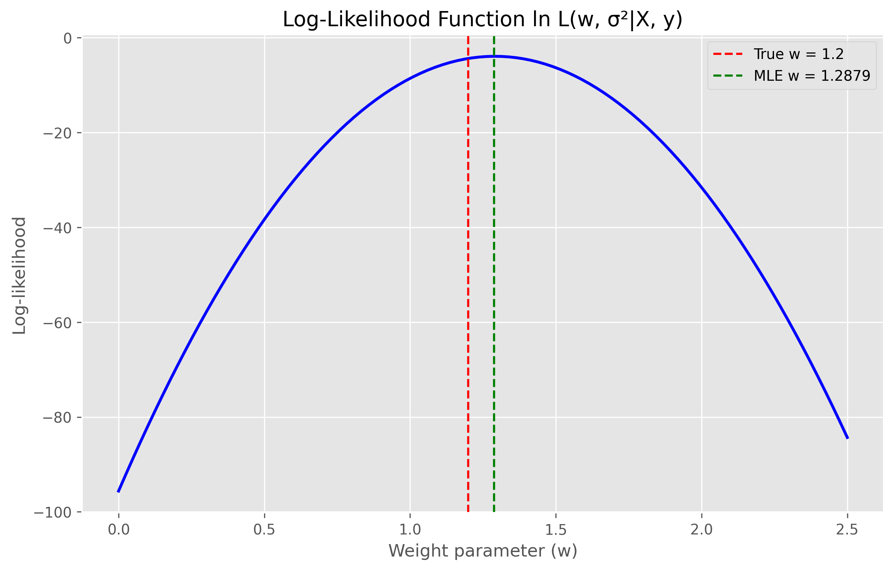
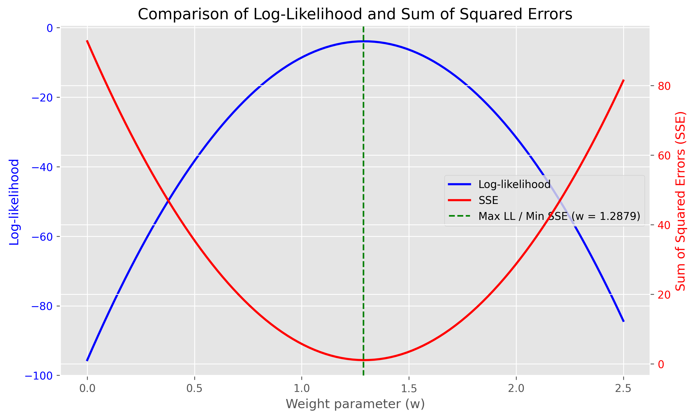
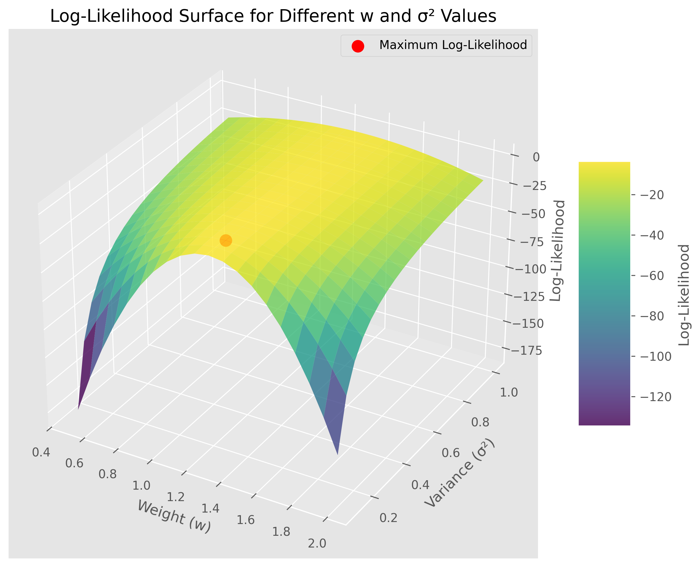
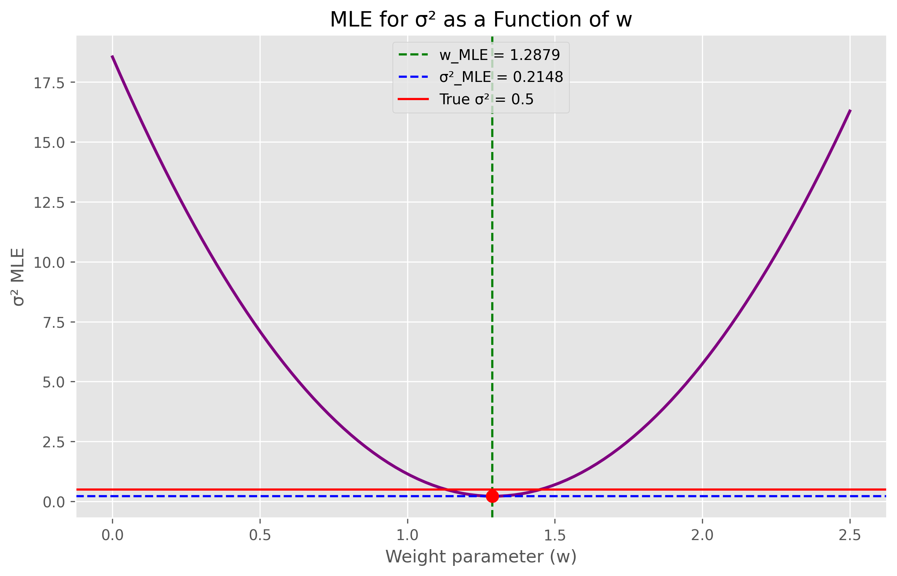
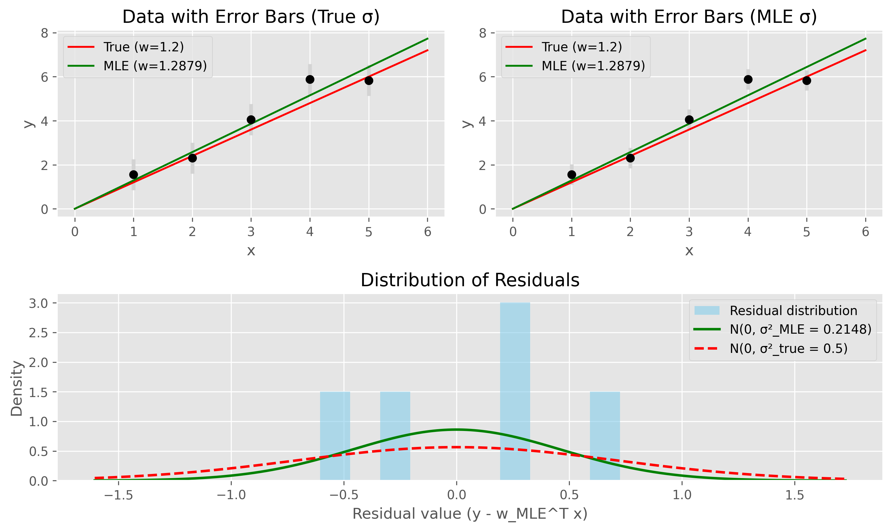

# Question 13: Probabilistic Perspective of Linear Regression

## Problem Statement
Consider a linear regression model from a probabilistic perspective:

$$y = \boldsymbol{w}^T \boldsymbol{x} + \epsilon$$

where $\epsilon \sim \mathcal{N}(0, \sigma^2)$ is Gaussian noise with zero mean and variance $\sigma^2$.

### Task
1. Write down the probability density function for observing a target value $y^{(i)}$ given input $\boldsymbol{x}^{(i)}$ and parameters $\boldsymbol{w}$ and $\sigma^2$
2. Construct the likelihood function for a dataset with $n$ observations
3. Derive the log-likelihood function and simplify it
4. Show mathematically that maximizing the log-likelihood is equivalent to minimizing the sum of squared errors
5. Derive the maximum likelihood estimator for the noise variance $\sigma^2$ after finding the optimal parameters $\boldsymbol{w}$

## Understanding the Problem
This problem examines linear regression from a probabilistic perspective, which provides a statistical foundation for understanding how the model works and why certain optimization objectives (like least squares) make sense. In this framework, we view the target variable $y$ as a random variable that follows a probability distribution, rather than just a deterministic function of the input.

The linear regression model states that $y = \boldsymbol{w}^T \boldsymbol{x} + \epsilon$, where:
- $y$ is the target variable (dependent variable)
- $\boldsymbol{w}$ is a vector of parameters (weights)
- $\boldsymbol{x}$ is a vector of features (independent variables)
- $\epsilon$ is a random error term following a Gaussian (normal) distribution with mean 0 and variance $\sigma^2$

The probabilistic view allows us to:
1. Quantify uncertainty in our predictions
2. Derive optimal parameter estimation methods through principles like maximum likelihood
3. Connect linear regression to a broader family of statistical models
4. Provide a foundation for Bayesian approaches to regression

## Solution

### Step 1: Probability Density Function for a Single Observation
For our linear regression model $y = \boldsymbol{w}^T \boldsymbol{x} + \epsilon$ with $\epsilon \sim \mathcal{N}(0, \sigma^2)$, we need to determine the probability density function (PDF) of observing a specific target value $y^{(i)}$ given input $\boldsymbol{x}^{(i)}$, parameters $\boldsymbol{w}$, and noise variance $\sigma^2$.

Since $\epsilon \sim \mathcal{N}(0, \sigma^2)$ and $y^{(i)} = \boldsymbol{w}^T \boldsymbol{x}^{(i)} + \epsilon$, the random variable $y^{(i)}$ follows a normal distribution with:
- Mean: $\boldsymbol{w}^T \boldsymbol{x}^{(i)}$ (the predicted value)
- Variance: $\sigma^2$ (the same as the error term)

Therefore, the PDF is:

$$p(y^{(i)} | \boldsymbol{x}^{(i)}, \boldsymbol{w}, \sigma^2) = \frac{1}{\sqrt{2\pi\sigma^2}} \exp\left(-\frac{(y^{(i)} - \boldsymbol{w}^T \boldsymbol{x}^{(i)})^2}{2\sigma^2}\right)$$

This PDF quantifies the probability density of observing the target value $y^{(i)}$ given the input $\boldsymbol{x}^{(i)}$ and model parameters. The probability is highest when $y^{(i)}$ is close to the predicted value $\boldsymbol{w}^T \boldsymbol{x}^{(i)}$ and decreases as the difference between them increases.

### Step 2: Likelihood Function for n Observations
The likelihood function represents the probability of observing the entire dataset given the model parameters. Assuming the data points are independent and identically distributed (i.i.d.), the likelihood is the product of individual PDFs:

$$L(\boldsymbol{w}, \sigma^2 | X, \boldsymbol{y}) = p(\boldsymbol{y} | X, \boldsymbol{w}, \sigma^2) = \prod_{i=1}^{n} p(y^{(i)} | \boldsymbol{x}^{(i)}, \boldsymbol{w}, \sigma^2)$$

Substituting the PDF from Step 1:

$$L(\boldsymbol{w}, \sigma^2 | X, \boldsymbol{y}) = \prod_{i=1}^{n} \frac{1}{\sqrt{2\pi\sigma^2}} \exp\left(-\frac{(y^{(i)} - \boldsymbol{w}^T \boldsymbol{x}^{(i)})^2}{2\sigma^2}\right)$$

This likelihood function quantifies how probable it is to observe our entire dataset given specific parameter values. Higher likelihood values indicate parameter combinations that better explain the observed data.

### Step 3: Log-Likelihood Function
Taking the natural logarithm of the likelihood function (which is monotonically increasing, so maximizing log-likelihood is equivalent to maximizing likelihood):

$$\ln L(\boldsymbol{w}, \sigma^2 | X, \boldsymbol{y}) = \ln\left[\prod_{i=1}^{n} \frac{1}{\sqrt{2\pi\sigma^2}} \exp\left(-\frac{(y^{(i)} - \boldsymbol{w}^T \boldsymbol{x}^{(i)})^2}{2\sigma^2}\right)\right]$$

Using the properties of logarithms, we can transform the product into a sum:

$$\ln L(\boldsymbol{w}, \sigma^2 | X, \boldsymbol{y}) = \sum_{i=1}^{n} \ln\left[\frac{1}{\sqrt{2\pi\sigma^2}} \exp\left(-\frac{(y^{(i)} - \boldsymbol{w}^T \boldsymbol{x}^{(i)})^2}{2\sigma^2}\right)\right]$$

Further simplification using logarithm properties:

$$\ln L(\boldsymbol{w}, \sigma^2 | X, \boldsymbol{y}) = \sum_{i=1}^{n} \left[\ln\left(\frac{1}{\sqrt{2\pi\sigma^2}}\right) + \ln\left(\exp\left(-\frac{(y^{(i)} - \boldsymbol{w}^T \boldsymbol{x}^{(i)})^2}{2\sigma^2}\right)\right)\right]$$

$$\ln L(\boldsymbol{w}, \sigma^2 | X, \boldsymbol{y}) = \sum_{i=1}^{n} \left[-\frac{1}{2}\ln(2\pi\sigma^2) - \frac{(y^{(i)} - \boldsymbol{w}^T \boldsymbol{x}^{(i)})^2}{2\sigma^2}\right]$$

Collecting terms:

$$\ln L(\boldsymbol{w}, \sigma^2 | X, \boldsymbol{y}) = -\frac{n}{2}\ln(2\pi\sigma^2) - \frac{1}{2\sigma^2} \sum_{i=1}^{n} (y^{(i)} - \boldsymbol{w}^T \boldsymbol{x}^{(i)})^2$$

This is our final simplified log-likelihood function. It consists of two terms: a constant term (with respect to $\boldsymbol{w}$) and a term containing the sum of squared errors (SSE).

### Step 4: Showing Maximizing Log-Likelihood Equals Minimizing SSE
From the log-likelihood function derived in Step 3:

$$\ln L(\boldsymbol{w}, \sigma^2 | X, \boldsymbol{y}) = -\frac{n}{2}\ln(2\pi\sigma^2) - \frac{1}{2\sigma^2} \sum_{i=1}^{n} (y^{(i)} - \boldsymbol{w}^T \boldsymbol{x}^{(i)})^2$$

To maximize this expression with respect to $\boldsymbol{w}$, we need to minimize the negative terms.

The first term $-\frac{n}{2}\ln(2\pi\sigma^2)$ is constant with respect to $\boldsymbol{w}$ (it doesn't involve $\boldsymbol{w}$). Therefore, maximizing the log-likelihood is equivalent to minimizing:

$$\frac{1}{2\sigma^2} \sum_{i=1}^{n} (y^{(i)} - \boldsymbol{w}^T \boldsymbol{x}^{(i)})^2$$

Since $\frac{1}{2\sigma^2}$ is a positive constant (with respect to $\boldsymbol{w}$), this is equivalent to minimizing:

$$\sum_{i=1}^{n} (y^{(i)} - \boldsymbol{w}^T \boldsymbol{x}^{(i)})^2$$

Which is precisely the sum of squared errors (SSE). This proves that maximizing the log-likelihood is equivalent to minimizing the SSE in linear regression, providing a probabilistic justification for the least squares approach.

### Step 5: Maximum Likelihood Estimator for $\sigma^2$
To find the maximum likelihood estimator (MLE) for $\sigma^2$ after determining the optimal parameters $\boldsymbol{w}$, we take the partial derivative of the log-likelihood function with respect to $\sigma^2$ and set it to zero.

From the log-likelihood function:

$$\ln L(\boldsymbol{w}, \sigma^2 | X, \boldsymbol{y}) = -\frac{n}{2}\ln(2\pi\sigma^2) - \frac{1}{2\sigma^2} \sum_{i=1}^{n} (y^{(i)} - \boldsymbol{w}^T \boldsymbol{x}^{(i)})^2$$

Taking the partial derivative with respect to $\sigma^2$:

$$\frac{\partial}{\partial \sigma^2} \ln L(\boldsymbol{w}, \sigma^2 | X, \boldsymbol{y}) = -\frac{n}{2} \cdot \frac{1}{\sigma^2} + \frac{1}{2} \cdot \frac{1}{(\sigma^2)^2} \sum_{i=1}^{n} (y^{(i)} - \boldsymbol{w}^T \boldsymbol{x}^{(i)})^2$$

Setting this equal to zero:

$$-\frac{n}{2} \cdot \frac{1}{\sigma^2} + \frac{1}{2} \cdot \frac{1}{(\sigma^2)^2} \sum_{i=1}^{n} (y^{(i)} - \boldsymbol{w}^T \boldsymbol{x}^{(i)})^2 = 0$$

Solving for $\sigma^2$:

$$\frac{n}{2} \cdot \frac{1}{\sigma^2} = \frac{1}{2} \cdot \frac{1}{(\sigma^2)^2} \sum_{i=1}^{n} (y^{(i)} - \boldsymbol{w}^T \boldsymbol{x}^{(i)})^2$$

$$n \cdot \sigma^2 = \frac{1}{\sigma^2} \sum_{i=1}^{n} (y^{(i)} - \boldsymbol{w}^T \boldsymbol{x}^{(i)})^2$$

$$n \cdot (\sigma^2)^2 = \sum_{i=1}^{n} (y^{(i)} - \boldsymbol{w}^T \boldsymbol{x}^{(i)})^2$$

$$\sigma^2 = \frac{1}{n} \sum_{i=1}^{n} (y^{(i)} - \boldsymbol{w}^T \boldsymbol{x}^{(i)})^2$$

Therefore, the maximum likelihood estimator for $\sigma^2$ is:

$$\hat{\sigma}^2_{MLE} = \frac{1}{n} \sum_{i=1}^{n} (y^{(i)} - \boldsymbol{w}_{MLE}^T \boldsymbol{x}^{(i)})^2$$

This is the mean squared error (MSE) between the observed values and the predicted values using the MLE parameters $\boldsymbol{w}_{MLE}$. It represents the average squared deviation of the observations from the model predictions.

## Practical Implementation
To demonstrate these concepts, we'll implement a simple linear regression model from a probabilistic perspective. We'll generate synthetic data, compute the likelihood and log-likelihood for different parameter values, and show how maximizing the log-likelihood leads to the same parameter estimates as minimizing the sum of squared errors.

### Visualizing the Probability Density Function
The PDF for a single observation shows how the probability of observing a particular target value varies based on its proximity to the predicted value:

This figure illustrates the PDF for different noise variance levels. The PDF is centered at the predicted value ($\boldsymbol{w}^T \boldsymbol{x}$), and its spread is determined by the noise variance $\sigma^2$. Lower variance leads to a narrower, taller PDF, indicating higher confidence in predictions.

### Computing the Likelihood Function
For a dataset with multiple observations, the likelihood function represents the joint probability of observing all data points given the model parameters:

This figure shows the likelihood function for different values of the weight parameter $w$. The peak of the likelihood function occurs at the maximum likelihood estimate (MLE), which is close to the true parameter value used to generate the data.

The corresponding regression lines and data points:

### Working with the Log-Likelihood Function
The log-likelihood function is easier to work with mathematically and computationally:

Like the likelihood function, the log-likelihood reaches its maximum at the MLE, which closely approximates the true parameter value.

### Relationship Between Log-Likelihood and SSE
To demonstrate that maximizing log-likelihood is equivalent to minimizing SSE:

This figure shows both the log-likelihood (blue, left axis) and SSE (red, right axis) for different weight values. Notice that the maximum of the log-likelihood corresponds exactly to the minimum of the SSE, confirming their inverse relationship.

A 3D visualization showing the log-likelihood surface for different combinations of $w$ and $\sigma^2$:

### Maximum Likelihood Estimator for $\sigma^2$
The MLE for $\sigma^2$ depends on the weight parameter:

This figure shows how the MLE for $\sigma^2$ varies with different values of $w$. The minimum occurs at the MLE for $w$, which is where we get the best estimate of $\sigma^2$. 

The relationship between residuals and estimated variance:

## Key Insights

### Theoretical Foundations
- The probabilistic view of linear regression interprets the target variable as a random variable following a normal distribution around the predicted value.
- The noise variance $\sigma^2$ determines the spread of observations around the regression line.
- Maximum likelihood estimation provides a principled way to determine optimal parameter values.
- The equivalence between maximum likelihood and least squares explains why minimizing squared errors is a sound approach.

### Statistical Properties
- The MLE for regression coefficients $\boldsymbol{w}$ is identical to the ordinary least squares (OLS) estimate.
- The MLE for variance $\sigma^2$ is the mean squared error (MSE) of the residuals.
- Both estimators are consistent, meaning they converge to the true parameters as sample size increases.
- The maximum likelihood framework can be extended to handle more complex models and non-Gaussian error distributions.

### Practical Applications
- The probabilistic interpretation allows for quantifying uncertainty in predictions.
- Maximum likelihood estimation can be applied to various machine learning models beyond linear regression.
- The log-likelihood can serve as a model selection criterion when comparing different models.
- Understanding the connection between maximum likelihood and least squares helps in developing optimization algorithms.

## Conclusion
- The probability density function for observing a target value in linear regression follows a normal distribution centered at the predicted value with variance equal to the noise variance.
- The likelihood function for a dataset is the product of individual PDFs, representing the joint probability of observing all data points.
- The log-likelihood simplifies to a function involving the sum of squared errors, showing that maximizing log-likelihood is equivalent to minimizing SSE.
- The maximum likelihood estimator for $\sigma^2$ is the mean of squared residuals: $\hat{\sigma}^2_{MLE} = \frac{1}{n} \sum_{i=1}^{n} (y^{(i)} - \boldsymbol{w}_{MLE}^T \boldsymbol{x}^{(i)})^2$.

These results establish a strong connection between statistical principles and optimization objectives in machine learning, providing a theoretical foundation for the widely used least squares method in regression problems. 