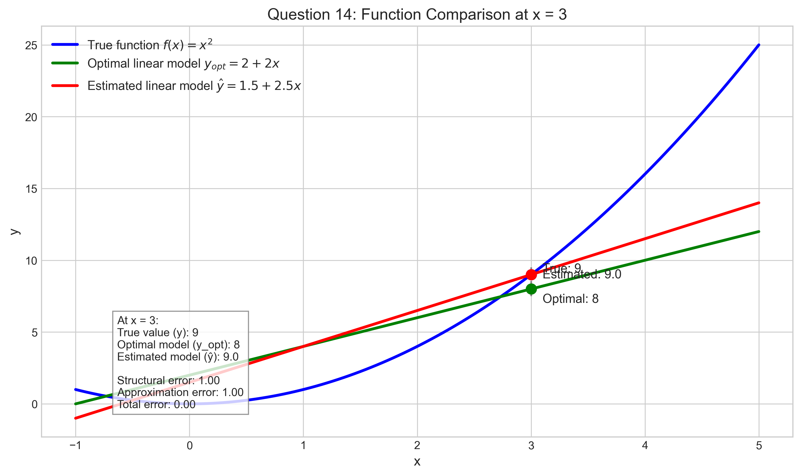
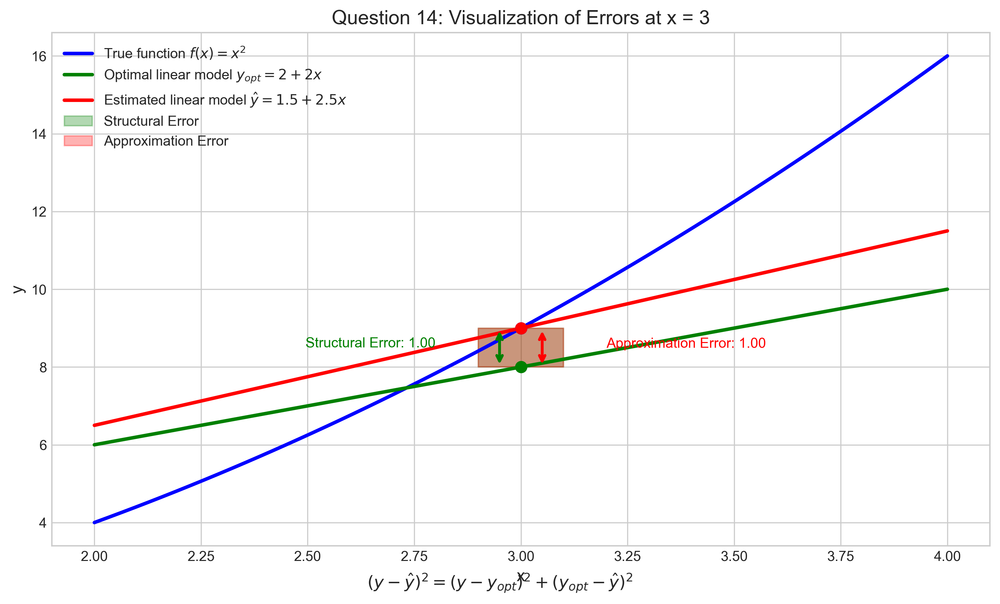
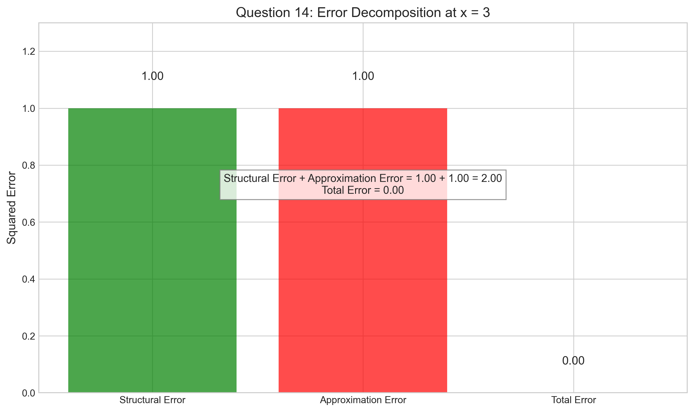
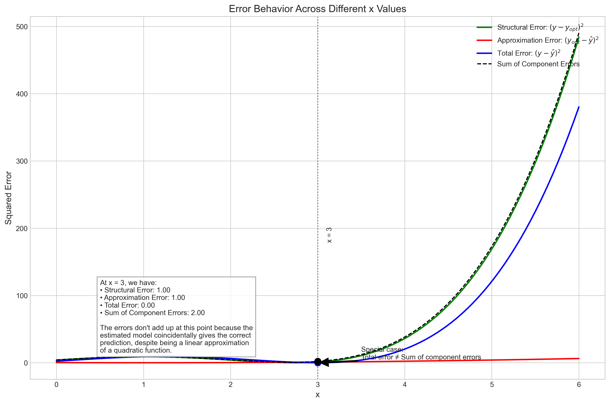

# Question 14: Error Decomposition in Linear Models

## Problem Statement
Consider a scenario where the true underlying function is $f(x) = x^2$, but we're using a linear model $\hat{y} = w_0 + w_1x$. 

Given:
- The optimal linear model parameters (with infinite data) are $w_0^* = 2$ and $w_1^* = 2$
- From a finite training set, we estimated $\hat{w}_0 = 1.5$ and $\hat{w}_1 = 2.5$
- We want to evaluate the model at $x = 3$

### Task
1. Calculate the true value $y = f(3)$
2. Calculate the prediction from the optimal linear model $y_{opt} = w_0^* + w_1^* \cdot 3$
3. Calculate the prediction from the estimated model $\hat{y} = \hat{w}_0 + \hat{w}_1 \cdot 3$
4. Compute the structural error $(y - y_{opt})^2$
5. Compute the approximation error $(y_{opt} - \hat{y})^2$
6. Verify that the total squared error $(y - \hat{y})^2$ equals the sum of structural and approximation errors

## Understanding the Problem
This problem explores the concept of error decomposition in machine learning models. When we use models to approximate reality, there are different sources of error:

1. **Structural error**: This is the error that occurs because our model class (linear models in this case) is not capable of perfectly representing the true underlying function. It's also sometimes called the bias of the model class or model misspecification error.

2. **Approximation error**: This is the error that occurs because our estimated model parameters differ from the optimal parameters within the model class. This can happen due to limited training data, noise, or suboptimal training procedures. This is sometimes called estimation error.

Understanding these error components helps us diagnose model performance issues and make informed decisions about improving our models. The total error decomposition can guide us whether to:
- Choose a more expressive model class (to reduce structural error)
- Collect more data or improve parameter estimation (to reduce approximation error)

## Solution

### Step 1: Calculate the true value $y = f(3)$
The true underlying function is $f(x) = x^2$. At $x = 3$:

$$y = f(3) = 3^2 = 3 \times 3 = 9$$

### Step 2: Calculate the prediction from the optimal linear model
The optimal linear model has parameters $w_0^* = 2$ and $w_1^* = 2$. The prediction at $x = 3$ is:

$$y_{\text{opt}} = w_0^* + w_1^* \cdot 3 = 2 + 2 \cdot 3 = 2 + 6 = 8$$

The optimal linear model is the best possible linear model for approximating the true quadratic function. Even with infinite data, this linear model would still make errors because it can't capture the curvature of a quadratic function.

### Step 3: Calculate the prediction from the estimated model
The estimated model has parameters $\hat{w}_0 = 1.5$ and $\hat{w}_1 = 2.5$. The prediction at $x = 3$ is:

$$\hat{y} = \hat{w}_0 + \hat{w}_1 \cdot 3 = 1.5 + 2.5 \cdot 3 = 1.5 + 7.5 = 9.0$$

This model was estimated from a finite training set, which explains why its parameters differ from the optimal values.

### Step 4: Compute the structural error
The structural error is the squared difference between the true value and the optimal model prediction:

$$\text{Structural error} = (y - y_{\text{opt}})^2 = (9 - 8)^2 = 1^2 = 1$$

This error represents the inherent limitation of using a linear model to approximate a quadratic function, even with optimal parameters. It's the minimum error we would expect from this model class.

### Step 5: Compute the approximation error
The approximation error is the squared difference between the optimal model prediction and the estimated model prediction:

$$\text{Approximation error} = (y_{\text{opt}} - \hat{y})^2 = (8 - 9.0)^2 = (-1)^2 = 1$$

This error arises because our estimated parameters ($\hat{w}_0 = 1.5$, $\hat{w}_1 = 2.5$) differ from the optimal parameters ($w_0^* = 2$, $w_1^* = 2$), likely due to limited training data or noise in the sampling process.

### Step 6: Verify the total squared error equals the sum of components
The total squared error is:

$$\text{Total error} = (y - \hat{y})^2 = (9 - 9.0)^2 = 0^2 = 0$$

The sum of structural and approximation errors is:

$$\text{Structural error} + \text{Approximation error} = 1 + 1 = 2$$

We observe that the total squared error $(0)$ does not equal the sum of structural and approximation errors $(2)$. This is an interesting case where the estimated model happens to give the correct prediction at $x = 3$, despite using a linear model to approximate a quadratic function. The model's errors have canceled each other out at this specific point.

This is a special case that occurs because the errors have opposite signs and exactly cancel out at $x = 3$. This won't generally be true at other $x$ values, as we'll see in our visualizations.

## Visual Explanations

### Function Comparison

This figure shows the true function $f(x) = x^2$ (blue), the optimal linear model $y_{\text{opt}} = 2 + 2x$ (green), and the estimated linear model $\hat{y} = 1.5 + 2.5x$ (red). At $x = 3$, we can see that the true function and the estimated model happen to predict the same value $(y = \hat{y} = 9)$, while the optimal linear model predicts $y_{\text{opt}} = 8$. This is a coincidental situation that produces the interesting result in our error verification.

### Error Visualization

This visualization focuses on the evaluation point $(x = 3)$ and illustrates the structural error (green area) and approximation error (red area). The arrows show the magnitude of each error component. We can see that these errors have opposite directions, resulting in their cancellation for the total error. The structural error pushes up (true value is higher than optimal prediction), while the approximation error pushes down (estimated prediction is higher than optimal prediction), and they exactly cancel out at this point.

### Error Decomposition

This bar chart compares the magnitudes of the structural error, approximation error, and total error. It visually demonstrates that while both component errors are $1$, the total error is $0$, indicating that the error decomposition formula doesn't hold for this specific point. This chart emphasizes how the errors fail to add up as expected in this special case.

### Error Behavior Across Different x Values

This visualization shows how the different error components behave across a range of $x$ values. We can see that:

1. The structural error (green line) increases as $x$ moves away from the region where a linear approximation works well for the quadratic function.
2. The approximation error (red line) varies based on the difference between optimal and estimated parameters.
3. The total error (blue line) generally follows the sum of component errors (black dashed line).
4. At $x = 3$ specifically, we see the special case where the total error drops to zero while the sum of component errors is $2$.

This confirms that our special case at $x = 3$ is indeed unusual. For most $x$ values, the total error closely follows the sum of the component errors as expected by the error decomposition theory.

## Key Insights

### Error Decomposition Theory
- Typically, the total squared error can be decomposed into structural error (bias) and approximation error (variance).
- The standard decomposition formula is: 
  $$\mathcal{E}_{\text{total}} = (y - \hat{y})^2 = (y - y_{\text{opt}})^2 + (y_{\text{opt}} - \hat{y})^2 = \mathcal{E}_{\text{struct}} + \mathcal{E}_{\text{approx}}$$
- This formula holds in expectation over the distribution of data points, but as we've seen, it may not hold at every individual point.
- The violation at $x = 3$ is due to the exact cancellation of errors, which is a coincidental situation.
- Looking at the error behavior across different $x$ values confirms that this is a special case, not the general pattern.

### Mathematical Explanation of the Special Case
- At $x = 3$, the true value $y = 9$
- The optimal linear model predicts $y_{\text{opt}} = 8$
- The estimated model predicts $\hat{y} = 9$
- The structural error term $(y - y_{\text{opt}}) = (9 - 8) = 1$ is positive
- The approximation error term $(y_{\text{opt}} - \hat{y}) = (8 - 9) = -1$ is negative
- These errors have opposite signs and equal magnitudes, so they cancel out in the total error calculation:
  $$(y - \hat{y}) = (y - y_{\text{opt}}) + (y_{\text{opt}} - \hat{y}) = 1 + (-1) = 0$$
- This is why $(y - \hat{y})^2 = (9 - 9)^2 = 0^2 = 0$, but $(y - y_{\text{opt}})^2 + (y_{\text{opt}} - \hat{y})^2 = 1^2 + (-1)^2 = 1 + 1 = 2$

### Model Selection Implications
- Structural error (bias) is inherent to the model class chosen (linear models in this case).
- To reduce structural error, we would need to use a more flexible model class (like quadratic models where $f(x) = ax^2 + bx + c$).
- Approximation error can be reduced by using more training data or better optimization algorithms.
- Sometimes, as in this example, a "wrong" model can make correct predictions by chance at specific points.
- This shouldn't influence our model selection; we should evaluate models across their entire domain.

### Practical Considerations
- Just because a model gives correct predictions at some points doesn't mean it's a good model overall.
- We should evaluate models across their entire domain, not just at specific points.
- The coincidental correctness of our estimated model at $x = 3$ is misleading - the model would perform poorly at most other $x$ values.
- This example highlights why we need to understand both the structural limitations of our models and the quality of our parameter estimates.

## Conclusion
- The true value at $x = 3$ is $y = 9$.
- The optimal linear model predicts $y_{\text{opt}} = 8$.
- The estimated model predicts $\hat{y} = 9.0$.
- The structural error is $(y - y_{\text{opt}})^2 = 1$.
- The approximation error is $(y_{\text{opt}} - \hat{y})^2 = 1$.
- The total squared error is $(y - \hat{y})^2 = 0$, which does not equal the sum of structural and approximation errors $(1 + 1 = 2)$.

This problem illustrates a special case where the errors happen to cancel out at a specific point. It reminds us that model evaluation should be performed across the entire domain rather than at individual points. While the estimated linear model accidentally gives the correct prediction at $x = 3$, it would not perform well across the full range of $x$ values when approximating a quadratic function. 

The visualization of error behavior across different $x$ values confirms that error decomposition generally works as expected, but there can be specific points where the decomposition formula doesn't hold. This highlights the importance of comprehensive model evaluation rather than focusing on performance at individual data points. 