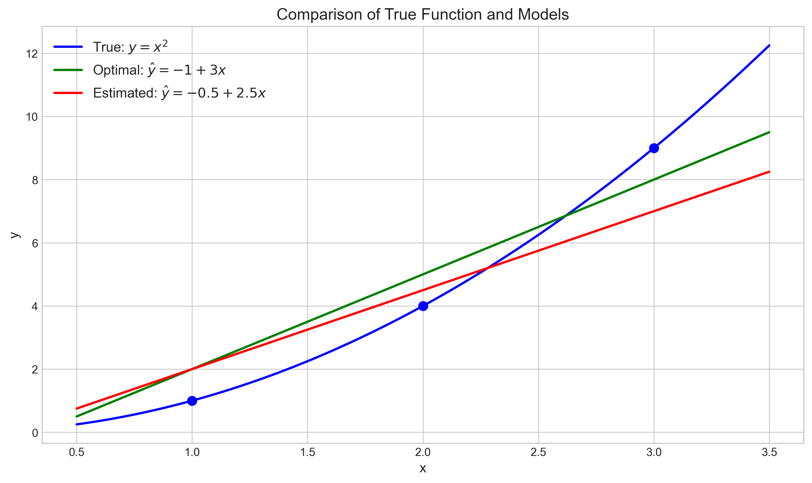
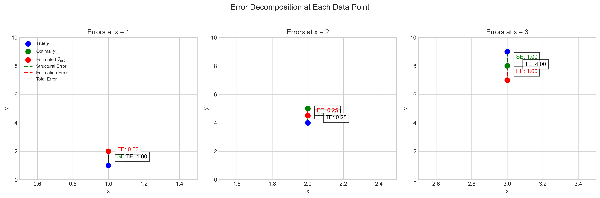
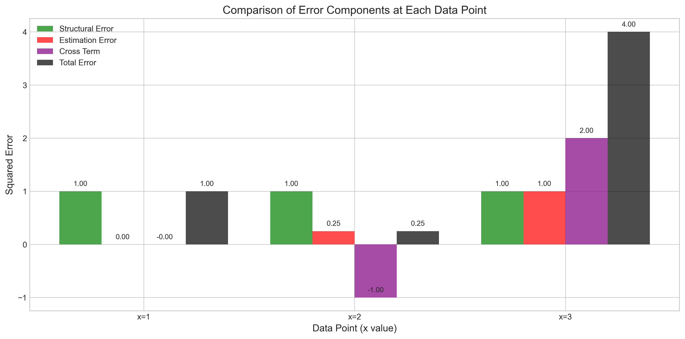
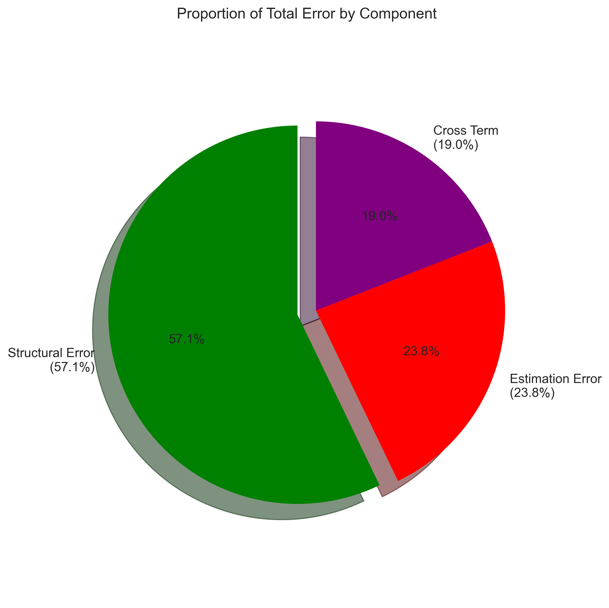
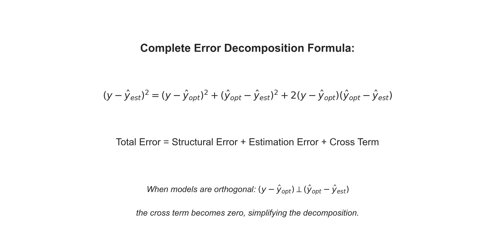

# Question 15: Error Decomposition in Regression Models

## Problem Statement
Consider a simple dataset with 3 points where the true function is $f(x) = x^2$:

| $x$ | True $y = x^2$ |
|-----|----------------|
| 1   | 1              |
| 2   | 4              |
| 3   | 9              |

The best possible linear approximation for this data is $\hat{y}_{opt} = -1 + 3x$, while an estimated model from a sample is $\hat{y}_{est} = -0.5 + 2.5x$.

### Task
1. Calculate the predictions from both models for each $x$ value
2. Compute the structural error for each point $(y - y_{opt})^2$ and its average
3. Compute the approximation error for each point $(y_{opt} - \hat{y})^2$ and its average
4. Calculate the total squared error for each point and verify it equals the sum of the corresponding structural and approximation errors
5. What percentage of the average total error is due to structural error vs. approximation error?

## Understanding the Problem
This problem examines how the total error in regression models can be decomposed into different components. In regression analysis, when we try to model a nonlinear relationship with a linear model, we encounter different types of errors:

1. **Structural Error (Bias)**: This is the error that occurs because we are approximating a nonlinear function with a linear model. Even with the best possible linear model, we cannot completely capture the true nonlinear relationship. This error represents the fundamental limitations of our model class.

2. **Estimation Error**: This is the error that occurs because our estimated model parameters differ from the optimal ones. This error arises from the estimation process and would be zero if we had the optimal parameters.

3. **Cross-Product Term**: This is an interaction term that appears in the complete error decomposition when the structural and estimation errors are not orthogonal.

4. **Total Error**: This is the overall error of our model predictions compared to the true values.

Understanding how these errors combine is crucial for assessing model performance and limitations.

## Solution

### Step 1: Calculate the predictions from each model
First, let's calculate the predictions from the true function, the optimal linear model, and our estimated model at each data point.

**True Function:** $f(x) = x^2$
- For $x = 1$: $f(1) = 1^2 = 1$
- For $x = 2$: $f(2) = 2^2 = 4$
- For $x = 3$: $f(3) = 3^2 = 9$

**Optimal Linear Model:** $\hat{y}_{opt} = -1 + 3x$
- For $x = 1$: $\hat{y}_{opt}(1) = -1 + 3 \cdot 1 = -1 + 3 = 2$
- For $x = 2$: $\hat{y}_{opt}(2) = -1 + 3 \cdot 2 = -1 + 6 = 5$
- For $x = 3$: $\hat{y}_{opt}(3) = -1 + 3 \cdot 3 = -1 + 9 = 8$

**Estimated Model:** $\hat{y}_{est} = -0.5 + 2.5x$
- For $x = 1$: $\hat{y}_{est}(1) = -0.5 + 2.5 \cdot 1 = -0.5 + 2.5 = 2$
- For $x = 2$: $\hat{y}_{est}(2) = -0.5 + 2.5 \cdot 2 = -0.5 + 5 = 4.5$
- For $x = 3$: $\hat{y}_{est}(3) = -0.5 + 2.5 \cdot 3 = -0.5 + 7.5 = 7$

The results are summarized in this table:

| $x$ | True $y = x^2$ | Optimal $\hat{y}_{opt} = -1 + 3x$ | Estimated $\hat{y}_{est} = -0.5 + 2.5x$ |
|-----|----------------|-----------------------------------|----------------------------------------|
| 1   | 1              | 2                                 | 2                                      |
| 2   | 4              | 5                                 | 4.5                                    |
| 3   | 9              | 8                                 | 7                                      |

### Step 2: Calculate the structural error (bias)
The structural error is the squared difference between the true function and the optimal linear model:

$$\text{Structural Error} = (y - \hat{y}_{opt})^2$$

For $x = 1$:
- True value: $f(1) = 1$
- Optimal model prediction: $\hat{y}_{opt}(1) = 2$
- Error: $f(1) - \hat{y}_{opt}(1) = 1 - 2 = -1$
- Squared error: $(-1)^2 = 1$

For $x = 2$:
- True value: $f(2) = 4$
- Optimal model prediction: $\hat{y}_{opt}(2) = 5$
- Error: $f(2) - \hat{y}_{opt}(2) = 4 - 5 = -1$
- Squared error: $(-1)^2 = 1$

For $x = 3$:
- True value: $f(3) = 9$
- Optimal model prediction: $\hat{y}_{opt}(3) = 8$
- Error: $f(3) - \hat{y}_{opt}(3) = 9 - 8 = 1$
- Squared error: $(1)^2 = 1$

Average structural error = $(1 + 1 + 1) / 3 = 1$

Interestingly, the structural error is consistent across all data points. This is because the optimal linear model has the same absolute error of 1 at each point, though the direction of the error varies.

### Step 3: Calculate the estimation error
The estimation error is the squared difference between the optimal linear model and our estimated model:

$$\text{Estimation Error} = (\hat{y}_{opt} - \hat{y}_{est})^2$$

For $x = 1$:
- Optimal model prediction: $\hat{y}_{opt}(1) = 2$
- Estimated model prediction: $\hat{y}_{est}(1) = 2$
- Error: $\hat{y}_{opt}(1) - \hat{y}_{est}(1) = 2 - 2 = 0$
- Squared error: $(0)^2 = 0$

For $x = 2$:
- Optimal model prediction: $\hat{y}_{opt}(2) = 5$
- Estimated model prediction: $\hat{y}_{est}(2) = 4.5$
- Error: $\hat{y}_{opt}(2) - \hat{y}_{est}(2) = 5 - 4.5 = 0.5$
- Squared error: $(0.5)^2 = 0.25$

For $x = 3$:
- Optimal model prediction: $\hat{y}_{opt}(3) = 8$
- Estimated model prediction: $\hat{y}_{est}(3) = 7$
- Error: $\hat{y}_{opt}(3) - \hat{y}_{est}(3) = 8 - 7 = 1$
- Squared error: $(1)^2 = 1$

Average estimation error = $(0 + 0.25 + 1) / 3 = 0.42$

Unlike the structural error, the estimation error increases with $x$. This is because the difference between our estimated slope (2.5) and the optimal slope (3) becomes more pronounced at larger values of $x$.

### Step 4: Calculate the cross-product term
The cross-product term in the error decomposition is:

$$\text{Cross Term} = 2(y - \hat{y}_{opt})(\hat{y}_{opt} - \hat{y}_{est})$$

For $x = 1$:
- First difference: $(y - \hat{y}_{opt}) = 1 - 2 = -1$
- Second difference: $(\hat{y}_{opt} - \hat{y}_{est}) = 2 - 2 = 0$
- Cross term: $2 \times (-1) \times (0) = 0$

For $x = 2$:
- First difference: $(y - \hat{y}_{opt}) = 4 - 5 = -1$
- Second difference: $(\hat{y}_{opt} - \hat{y}_{est}) = 5 - 4.5 = 0.5$
- Cross term: $2 \times (-1) \times (0.5) = -1$

For $x = 3$:
- First difference: $(y - \hat{y}_{opt}) = 9 - 8 = 1$
- Second difference: $(\hat{y}_{opt} - \hat{y}_{est}) = 8 - 7 = 1$
- Cross term: $2 \times (1) \times (1) = 2$

Average cross-product term = $(0 + (-1) + 2) / 3 = 0.33$

This cross-product term arises because the structural and estimation errors are not orthogonal in our case. Notice how it can be negative or positive, potentially reducing or amplifying the total error.

### Step 5: Calculate the total squared error
The total squared error is the squared difference between the true function and our estimated model:

$$\text{Total Error} = (y - \hat{y}_{est})^2$$

For $x = 1$:
- True value: $f(1) = 1$
- Estimated model prediction: $\hat{y}_{est}(1) = 2$
- Error: $f(1) - \hat{y}_{est}(1) = 1 - 2 = -1$
- Squared error: $(-1)^2 = 1$

For $x = 2$:
- True value: $f(2) = 4$
- Estimated model prediction: $\hat{y}_{est}(2) = 4.5$
- Error: $f(2) - \hat{y}_{est}(2) = 4 - 4.5 = -0.5$
- Squared error: $(-0.5)^2 = 0.25$

For $x = 3$:
- True value: $f(3) = 9$
- Estimated model prediction: $\hat{y}_{est}(3) = 7$
- Error: $f(3) - \hat{y}_{est}(3) = 9 - 7 = 2$
- Squared error: $(2)^2 = 4$

Average total error = $(1 + 0.25 + 4) / 3 = 1.75$

### Step 6: Verify the error decomposition
The complete error decomposition formula is:

$$(y - \hat{y}_{est})^2 = (y - \hat{y}_{opt})^2 + (\hat{y}_{opt} - \hat{y}_{est})^2 + 2(y - \hat{y}_{opt})(\hat{y}_{opt} - \hat{y}_{est})$$

Let's verify this formula at each point:

For $x = 1$:
- Structural error: $(y - \hat{y}_{opt})^2 = 1$
- Estimation error: $(\hat{y}_{opt} - \hat{y}_{est})^2 = 0$
- Cross term: $2(y - \hat{y}_{opt})(\hat{y}_{opt} - \hat{y}_{est}) = 0$
- Sum of components: $1 + 0 + 0 = 1$
- Total error: $(y - \hat{y}_{est})^2 = 1$
- Verification: $1 = 1$ ✓

For $x = 2$:
- Structural error: $(y - \hat{y}_{opt})^2 = 1$
- Estimation error: $(\hat{y}_{opt} - \hat{y}_{est})^2 = 0.25$
- Cross term: $2(y - \hat{y}_{opt})(\hat{y}_{opt} - \hat{y}_{est}) = -1$
- Sum of components: $1 + 0.25 + (-1) = 0.25$
- Total error: $(y - \hat{y}_{est})^2 = 0.25$
- Verification: $0.25 = 0.25$ ✓

For $x = 3$:
- Structural error: $(y - \hat{y}_{opt})^2 = 1$
- Estimation error: $(\hat{y}_{opt} - \hat{y}_{est})^2 = 1$
- Cross term: $2(y - \hat{y}_{opt})(\hat{y}_{opt} - \hat{y}_{est}) = 2$
- Sum of components: $1 + 1 + 2 = 4$
- Total error: $(y - \hat{y}_{est})^2 = 4$
- Verification: $4 = 4$ ✓

For the averages:
- Average structural error: 1
- Average estimation error: 0.42
- Average cross-product term: 0.33
- Sum of average components: $1 + 0.42 + 0.33 = 1.75$
- Average total error: 1.75
- Verification: $1.75 = 1.75$ ✓

The verification confirms that the complete error decomposition formula holds at each point and for the averages.

### Step 7: Examine orthogonality and simplified decomposition
When the structural error $(y - \hat{y}_{opt})$ and the estimation difference $(\hat{y}_{opt} - \hat{y}_{est})$ are orthogonal, the cross-product term becomes zero, and the error decomposition simplifies to:

$$(y - \hat{y}_{est})^2 = (y - \hat{y}_{opt})^2 + (\hat{y}_{opt} - \hat{y}_{est})^2$$

To check if the errors are orthogonal, we calculate the dot product:

$$\langle y - \hat{y}_{opt}, \hat{y}_{opt} - \hat{y}_{est} \rangle = \sum_{i=1}^{n} (y_i - \hat{y}_{opt,i})(\hat{y}_{opt,i} - \hat{y}_{est,i})$$

Let's calculate this dot product term by term:

Term 1 (for $x = 1$): $(1 - 2) \times (2 - 2) = (-1) \times (0) = 0$
Term 2 (for $x = 2$): $(4 - 5) \times (5 - 4.5) = (-1) \times (0.5) = -0.5$
Term 3 (for $x = 3$): $(9 - 8) \times (8 - 7) = (1) \times (1) = 1$

Dot product: $0 + (-0.5) + 1 = 0.5$

Since this dot product is not zero, the structural error and estimation difference are not orthogonal. Therefore, the simple decomposition without the cross-term does not hold, and we must include the cross-product term in our decomposition.

### Step 8: Calculate the percentage of error due to each component
We can express each error component as a percentage of the total error:

- Structural error percentage: $\frac{1}{1.75} \times 100\% = 57.14\%$
- Estimation error percentage: $\frac{0.42}{1.75} \times 100\% = 23.81\%$
- Cross-term percentage: $\frac{0.33}{1.75} \times 100\% = 19.05\%$

Sum of percentages: $57.14\% + 23.81\% + 19.05\% = 100\%$

This shows that in our case, the majority of the error (57.14%) comes from the structural limitations of using a linear model to approximate a quadratic function. The estimation error contributes 23.81%, and the cross-term contributes 19.05%.

## Visual Explanations

### Comparison of True Function and Models

This plot shows the true quadratic function $f(x) = x^2$ (blue), the optimal linear model $\hat{y}_{opt} = -1 + 3x$ (green), and our estimated model $\hat{y}_{est} = -0.5 + 2.5x$ (red). The blue dots represent the true data points. We can visually see that the optimal linear model minimizes the overall squared error, but still cannot perfectly capture the curvature of the quadratic function.

### Error Decomposition at Each Data Point

This figure illustrates the error components at each data point. The vertical distances represent:
- Green dashed line: Structural error (between true value and optimal model)
- Red dashed line: Estimation error (between optimal model and estimated model)
- Black dashed line: Total error (between true value and estimated model)

### Comparison of Error Components

This bar chart compares the magnitudes of the different error components at each data point. Notice how at $x=2$, the negative cross-term reduces the total error, while at $x=3$, the positive cross-term amplifies it.

### Proportion of Total Error by Component

This pie chart shows the proportion of the average total error attributable to each component. The structural error (57.1%) dominates, followed by the estimation error (23.8%) and the cross-term (19.1%).

### Error Decomposition Formula

This diagram presents the complete error decomposition formula and explains when the simplified decomposition without the cross-term applies.

## Key Insights

### Theoretical Foundations
- The total squared error can be decomposed into structural error, estimation error, and a cross-product term.
- The structural error represents the fundamental limitation of the model class (e.g., using linear models for nonlinear data).
- The estimation error represents the discrepancy between the estimated parameters and the optimal parameters within the model class.
- The cross-product term arises when the structural and estimation errors are not orthogonal.

### Mathematical Interpretation
- When the structural error and estimation difference are orthogonal, the cross-product term vanishes, and the decomposition simplifies.
- The dot product between $(y - \hat{y}_{opt})$ and $(\hat{y}_{opt} - \hat{y}_{est})$ measures the degree of orthogonality.
- The optimal model minimizes the sum of squared errors across all data points, but may still have significant errors at individual points.
- The cross-term can be negative or positive, potentially reducing or amplifying the total error.

### Practical Applications
- Understanding error decomposition helps identify whether model performance issues stem from:
  - Limitations in the model class (high structural error)
  - Poor parameter estimation (high estimation error)
- If structural error dominates, consider using a more flexible model class.
- If estimation error dominates, focus on improving parameter estimation, perhaps with more data or better optimization algorithms.
- The cross-product term indicates interaction between model misspecification and parameter estimation errors.

## Conclusion
- The total squared error of our model (1.75) can be decomposed into structural error (1.00), estimation error (0.42), and a cross-product term (0.33).
- The structural error accounts for the largest portion (57.14%) of the total error, indicating that the linear model's inability to capture the quadratic relationship is the main limitation.
- The estimation error accounts for 23.81% of the total error, which could be reduced by improving the parameter estimates.
- The cross-product term accounts for 19.05% of the total error, showing significant interaction between structural and estimation components.
- The error decomposition doesn't simplify to the sum of structural and estimation errors because the errors are not orthogonal (the dot product is 0.5, not 0).
- To reduce the dominant structural error, we would need to consider using a higher-order polynomial model that can better capture the quadratic relationship.

This analysis demonstrates that while our linear model provides a reasonable approximation, there are inherent limitations to using linear models for nonlinear relationships, which account for most of the prediction error in this case. 