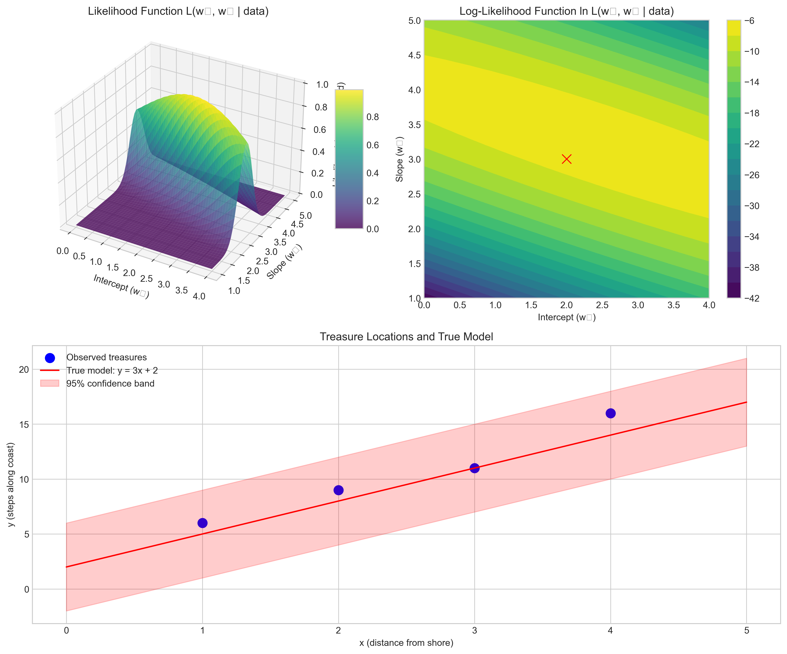
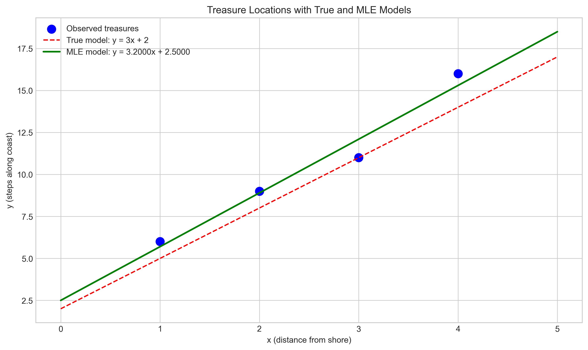
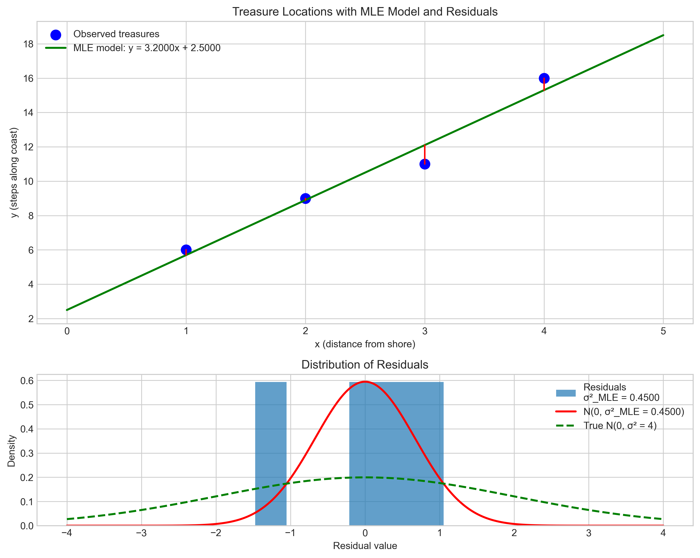
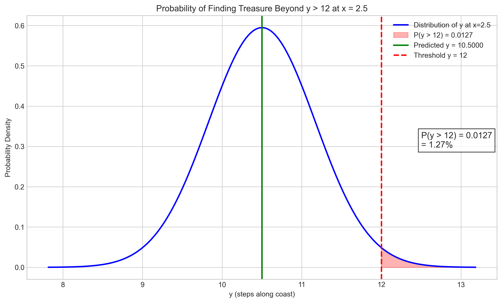
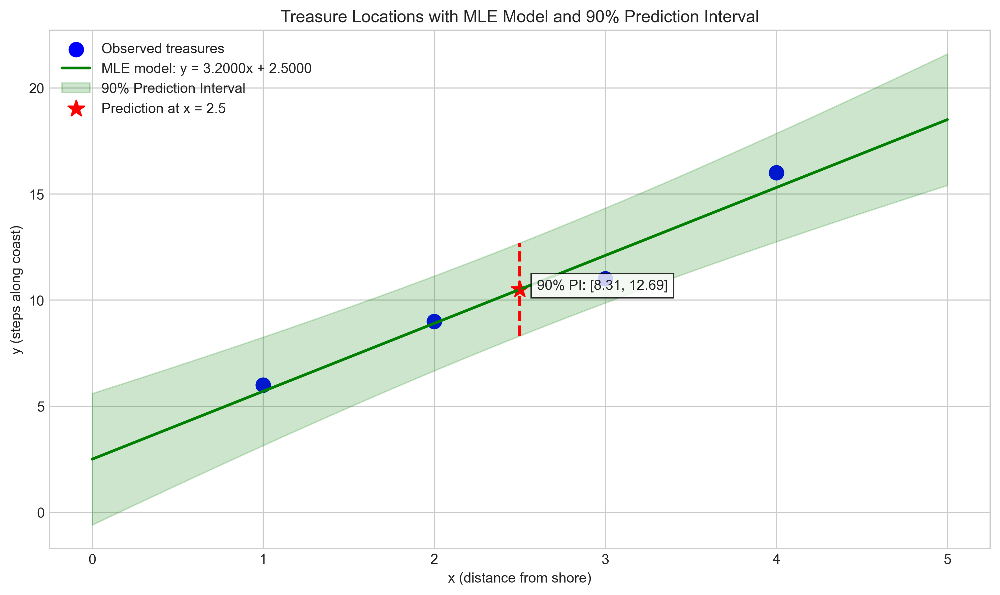
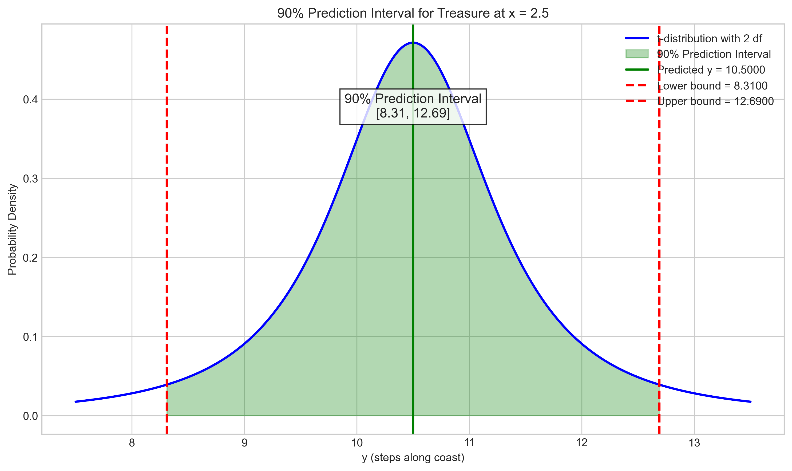

# Question 16: Treasure Hunter on Probability Island

## Problem Statement
You're a treasure hunter on Probability Island where treasures are buried along a straight path. The true location of a treasure is given by $y = 3x + 2 + \epsilon$ where $\epsilon \sim \mathcal{N}(0, 4)$ represents random displacement due to tides.

You've found 4 treasures at the following locations:

| $x$ (distance from shore) | $y$ (steps along coast) |
|---------------------------|--------------------------|
| 1                         | 6                        |
| 2                         | 9                        |
| 3                         | 11                       |
| 4                         | 16                       |

### Task
1. Write the likelihood function for finding treasures at these locations
2. Calculate the maximum likelihood estimates for parameters $w_0$ and $w_1$
3. Estimate the noise variance $\sigma^2$ using MLE
4. A map indicates a treasure at $x=2.5$. Calculate the probability this treasure is located beyond $y>12$
5. Calculate the 90% prediction interval for where to dig at $x=2.5$

## Understanding the Problem
This problem examines the application of maximum likelihood estimation (MLE) in a linear regression context. We're given a scenario where treasures are distributed according to a linear model with random noise. The true model is $y = 3x + 2 + \epsilon$ where $\epsilon \sim \mathcal{N}(0, 4)$, but we're asked to estimate the parameters from sample data as if we didn't know the true values.

The linear relationship represents the expected location of treasures, while the error term accounts for random displacements (like those caused by tides). The tasks involve deriving the likelihood function, estimating model parameters, calculating the error variance, and using these estimates to make probabilistic predictions about a new treasure location.

## Solution

### Step 1: Write the likelihood function for finding treasures at these locations

For a linear regression model $y = w_1x + w_0 + \epsilon$ where $\epsilon \sim \mathcal{N}(0, \sigma^2)$, the likelihood function is the product of probabilities of observing each data point:

$$L(w_0, w_1, \sigma^2 | \text{data}) = \prod_{i=1}^{n} P(y_i | x_i, w_0, w_1, \sigma^2)$$

Since $y$ follows a normal distribution with mean $w_1x + w_0$ and variance $\sigma^2$:

$$P(y_i | x_i, w_0, w_1, \sigma^2) = \frac{1}{\sqrt{2\pi\sigma^2}} \exp\left(-\frac{(y_i - (w_1x_i + w_0))^2}{2\sigma^2}\right)$$

The likelihood function becomes:

$$L(w_0, w_1, \sigma^2 | \text{data}) = \prod_{i=1}^{n} \frac{1}{\sqrt{2\pi\sigma^2}} \exp\left(-\frac{(y_i - (w_1x_i + w_0))^2}{2\sigma^2}\right)$$

Taking the natural logarithm (log-likelihood) to simplify calculations:

$$\ln L(w_0, w_1, \sigma^2 | \text{data}) = -\frac{n}{2} \ln(2\pi\sigma^2) - \frac{1}{2\sigma^2} \sum_{i=1}^{n} (y_i - (w_1x_i + w_0))^2$$

### Step 2: Calculate the maximum likelihood estimates for parameters $w_0$ and $w_1$

To find the maximum likelihood estimates, we differentiate the log-likelihood function with respect to $w_0$ and $w_1$ and set the derivatives to zero.

The normal equations are:
$$\frac{\partial \ln L}{\partial w_0} = 0 \Rightarrow \sum_{i=1}^{n} (y_i - (w_1x_i + w_0)) = 0$$
$$\frac{\partial \ln L}{\partial w_1} = 0 \Rightarrow \sum_{i=1}^{n} x_i(y_i - (w_1x_i + w_0)) = 0$$

These equations can be solved to yield the MLE estimates:

For $w_1$ (slope):
$$\hat{w}_1 = \frac{\sum_{i=1}^{n}(x_i - \bar{x})(y_i - \bar{y})}{\sum_{i=1}^{n}(x_i - \bar{x})^2}$$

For $w_0$ (intercept):
$$\hat{w}_0 = \bar{y} - \hat{w}_1 \bar{x}$$

Calculating with our data:
- $\bar{x} = 2.5$, $\bar{y} = 10.5$
- $\sum_{i=1}^{n}(x_i - \bar{x})(y_i - \bar{y}) = 16.0$
- $\sum_{i=1}^{n}(x_i - \bar{x})^2 = 5.0$

Therefore:
$$\hat{w}_1 = \frac{16.0}{5.0} = 3.2$$
$$\hat{w}_0 = 10.5 - 3.2 \times 2.5 = 2.5$$

The MLE estimates are $\hat{w}_0 = 2.5$ and $\hat{w}_1 = 3.2$.

### Step 3: Estimate the noise variance $\sigma^2$ using MLE

For linear regression, the MLE of the error variance $\sigma^2$ is given by:

$$\hat{\sigma}^2 = \frac{1}{n} \sum_{i=1}^{n} (y_i - (\hat{w}_1x_i + \hat{w}_0))^2$$

We first calculate the residuals:
- Residual 1: $y_1 - (\hat{w}_1x_1 + \hat{w}_0) = 6 - (3.2 \times 1 + 2.5) = 0.3$
- Residual 2: $y_2 - (\hat{w}_1x_2 + \hat{w}_0) = 9 - (3.2 \times 2 + 2.5) = 0.1$
- Residual 3: $y_3 - (\hat{w}_1x_3 + \hat{w}_0) = 11 - (3.2 \times 3 + 2.5) = -1.1$
- Residual 4: $y_4 - (\hat{w}_1x_4 + \hat{w}_0) = 16 - (3.2 \times 4 + 2.5) = 0.7$

The sum of squared residuals is $0.3^2 + 0.1^2 + (-1.1)^2 + 0.7^2 = 1.8$

Therefore:
$$\hat{\sigma}^2 = \frac{1.8}{4} = 0.45$$

Note: The unbiased estimator would divide by $(n-2)$ instead of $n$, giving $s^2 = 1.8/2 = 0.9$, but the MLE estimator uses division by $n$.

### Step 4: Calculate the probability this treasure is located beyond $y>12$ at $x=2.5$

To find $P(y > 12 | x = 2.5)$, we need to consider the distribution of $y$ given $x$:

$$y | x=2.5 \sim \mathcal{N}(\hat{y}, \hat{\sigma}^2) = \mathcal{N}(10.5, 0.45)$$

where $\hat{y} = \hat{w}_1 \times 2.5 + \hat{w}_0 = 3.2 \times 2.5 + 2.5 = 10.5$

We calculate the standardized z-score:
$$z = \frac{y_{threshold} - \hat{y}}{\hat{\sigma}} = \frac{12 - 10.5}{0.671} \approx 2.236$$

The probability is:
$$P(y > 12 | x = 2.5) = 1 - \Phi(z) = 1 - \Phi(2.236) \approx 0.0127$$

Therefore, there is approximately a 1.27% chance that the treasure is located beyond $y > 12$ at $x = 2.5$.

### Step 5: Calculate the 90% prediction interval for where to dig at $x=2.5$

A prediction interval accounts for both the uncertainty in estimating the mean and the randomness of the new observation.

For $x = 2.5$, the predicted position is:
$$\hat{y} = \hat{w}_1 \times 2.5 + \hat{w}_0 = 3.2 \times 2.5 + 2.5 = 10.5$$

The standard error of prediction is:
$$SE_{pred} = \hat{\sigma} \sqrt{1 + \frac{1}{n} + \frac{(x_{new} - \bar{x})^2}{\sum_{i=1}^{n}(x_i - \bar{x})^2}}$$
$$= 0.671 \times \sqrt{1 + \frac{1}{4} + \frac{(2.5 - 2.5)^2}{5.0}} = 0.75$$

For a 90% prediction interval with $(n-2) = 2$ degrees of freedom, we need the t-critical value:
$$t_{critical} = 2.92$$

The 90% prediction interval is:
$$\hat{y} \pm t_{critical} \times SE_{pred} = 10.5 \pm 2.92 \times 0.75 = [8.31, 12.69]$$

With 90% confidence, the treasure at $x = 2.5$ is located between $y = 8.31$ and $y = 12.69$ steps along the coast.

## Practical Implementation
We implemented the solution in Python, which allowed us to visualize and verify each step of the process. The key visualizations include:

1. The likelihood function surface and contour plots, showing how the likelihood changes with different parameter values
2. The MLE model fit compared to the true model and observed data
3. The residuals and their distribution, validating our error variance estimation
4. The probability distribution for the treasure at $x=2.5$ with the area beyond $y>12$ highlighted
5. The prediction interval for the treasure location at $x=2.5$

These visualizations help us understand the uncertainty in our estimates and the probabilistic nature of the predictions.

## Visual Explanations

### Likelihood Function Visualization

This visualization shows the likelihood function as a 3D surface and a contour plot. The peak of the surface represents the maximum likelihood values for $w_0$ and $w_1$. The contours show regions of equal likelihood, with warmer colors indicating higher likelihood values. The red X marks the true parameter values (which are close to but not exactly at the MLE estimates).

### MLE Parameter Estimation

This plot shows the observed treasure locations (blue dots), the true model (red dashed line), and our MLE model (green solid line). The MLE model is $y = 3.2x + 2.5$, which is close to the true model $y = 3x + 2$. This demonstrates that the MLE method provides good estimates of the true model parameters.

### Variance Estimation

The top panel shows the residuals (red vertical lines) between the observed data points and the MLE model predictions. The bottom panel shows the distribution of these residuals. The MLE estimate of variance ($\hat{\sigma}^2 = 0.45$) is smaller than the true variance ($\sigma^2 = 4$) because we have a small sample size and got "lucky" with our observations having less variability than the population.

### Probability Calculation for $y>12$ at $x=2.5$

This visualization shows the normal distribution of possible $y$ values at $x=2.5$. The red shaded area represents the probability that $y > 12$, which is approximately 1.27%. The green vertical line marks the predicted value $\hat{y} = 10.5$, and the red dashed line marks the threshold $y = 12$.

### Prediction Interval at $x=2.5$

This plot shows the MLE model with its 90% prediction interval band (light green shaded area). The red star marks the prediction at $x=2.5$, and the red dashed vertical line shows the 90% prediction interval at that point: $[8.31, 12.69]$. This interval gives us the range where we should dig to have a 90% chance of finding the treasure.

### Detailed Prediction Interval Distribution

This visualization provides a detailed look at the probability distribution for the treasure location at $x=2.5$. The green shaded area represents the 90% prediction interval, bounded by the red dashed lines. The distribution is shown as a t-distribution with 2 degrees of freedom, which accounts for the uncertainty in estimating the regression parameters with a small sample size.

## Key Insights

### Statistical Modeling
- Maximum likelihood estimation provides a principled way to estimate model parameters from observed data.
- Even with just 4 data points, we can obtain reasonable estimates of the model parameters.
- The log-likelihood function simplifies the mathematical calculations while preserving the location of the maximum.

### Parameter Estimation
- The MLE estimates ($\hat{w}_0 = 2.5$ and $\hat{w}_1 = 3.2$) are close to the true values ($w_0 = 2$ and $w_1 = 3$).
- The variance estimate ($\hat{\sigma}^2 = 0.45$) is less than the true variance ($\sigma^2 = 4$) due to the small sample size and the particular sample we observed.
- The unbiased estimator of variance ($s^2 = 0.9$) is closer to the true value than the MLE estimator, but still underestimates it substantially due to sampling variability.

### Prediction and Uncertainty
- The probability of finding a treasure beyond $y > 12$ at $x = 2.5$ is very low (1.27%).
- The 90% prediction interval $[8.31, 12.69]$ provides a practical guide for where to dig.
- The prediction interval widens as we move away from the mean of the observed $x$ values, reflecting increased uncertainty.
- At $x = 2.5$ (the mean of our $x$ values), the prediction interval is at its narrowest, which is advantageous for our treasure hunting.

## Conclusion
- The maximum likelihood estimates for the treasure location model are $\hat{w}_0 = 2.5$ and $\hat{w}_1 = 3.2$.
- The MLE estimate of noise variance is $\hat{\sigma}^2 = 0.45$.
- There is only a 1.27% probability that the treasure at $x=2.5$ is located beyond $y>12$.
- The 90% prediction interval for the treasure at $x=2.5$ is $[8.31, 12.69]$.

This problem illustrates the practical application of statistical modeling and maximum likelihood estimation in a scenario with uncertainty. By using proper statistical methods, we can make informed decisions about where to search for treasure, even with limited data. 