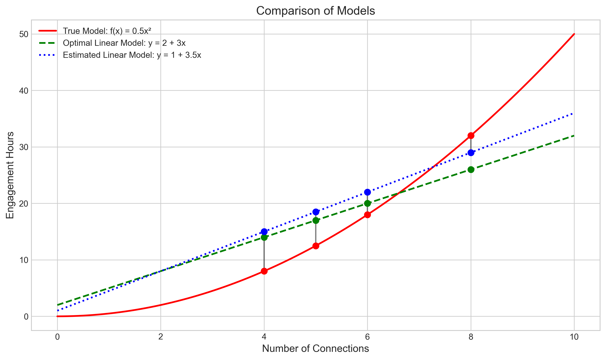
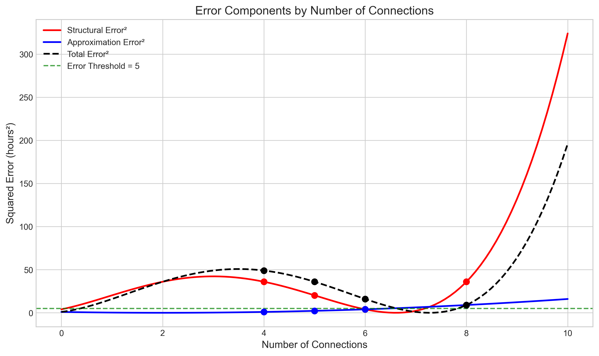
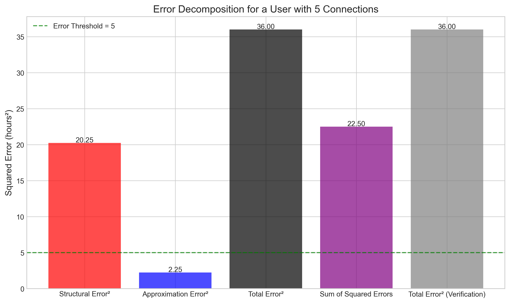
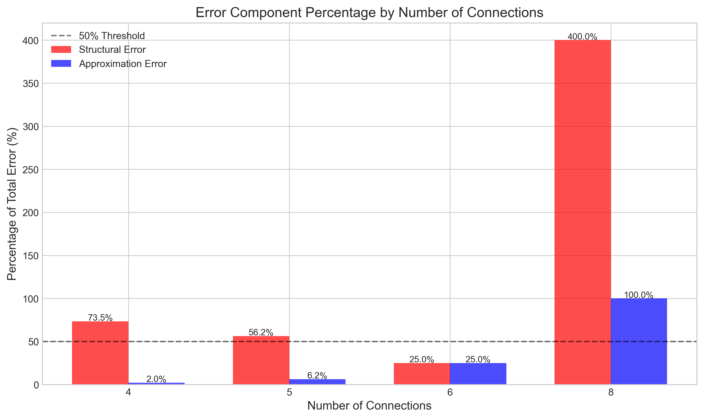

# Question 17: Error Analysis in Linear vs Quadratic Models

## Problem Statement
A social media company models user engagement (hours spent) based on number of connections. The true relationship is $f(x) = 0.5x^2$, but the company uses a linear model $\hat{y} = w_0 + w_1x$.

With infinite data, the optimal linear approximation would be $\hat{y} = 2 + 3x$. However, with limited data, the company estimated $\hat{y} = 1 + 3.5x$.

## Understanding the Problem
This problem examines the errors when we use a linear model to approximate a non-linear relationship. There are two key components of error:

1. **Structural Error**: Error due to model misspecification (using a linear model when the true relationship is quadratic)
2. **Approximation Error**: Error due to limited data (difference between the estimated and optimal linear models)

The total prediction error can be decomposed into these two components, which helps us understand whether collecting more data or changing the model would be more beneficial.

## Solution

### Task 1: Calculate errors for a user with 5 connections

#### Step 1: Calculate the true expected engagement hours
The true relationship is given by $f(x) = 0.5x^2$.
For $x = 5$:
$$f(5) = 0.5 \cdot 5^2 = 0.5 \cdot 25 = 12.5 \text{ hours}$$

#### Step 2: Calculate the prediction from the optimal linear model
The optimal linear model is $\hat{y} = 2 + 3x$.
For $x = 5$:
$$\hat{y} = 2 + 3 \cdot 5 = 2 + 15 = 17 \text{ hours}$$

#### Step 3: Calculate the prediction from the estimated model
The estimated linear model is $\hat{y} = 1 + 3.5x$.
For $x = 5$:
$$\hat{y} = 1 + 3.5 \cdot 5 = 1 + 17.5 = 18.5 \text{ hours}$$

#### Step 4: Calculate the structural error
The structural error is the difference between the true value and the optimal linear model prediction:
$$\text{Structural Error} = f(x) - \hat{y}_{\text{optimal}} = 12.5 - 17 = -4.5 \text{ hours}$$

This negative value indicates that the linear model overestimates the true engagement.

#### Step 5: Calculate the approximation error
The approximation error is the difference between the optimal linear model and the estimated model:
$$\text{Approximation Error} = \hat{y}_{\text{optimal}} - \hat{y}_{\text{estimated}} = 17 - 18.5 = -1.5 \text{ hours}$$

This negative value indicates that the estimated model predicts even higher engagement than the optimal linear model.

#### Step 6: Calculate the squared errors
- Structural error squared: $(-4.5)^2 = 20.25 \text{ hours}^2$
- Approximation error squared: $(-1.5)^2 = 2.25 \text{ hours}^2$
- Total error squared: $(-6)^2 = 36 \text{ hours}^2$

#### Step 7: Verify the error decomposition
The total error is the difference between the true value and the estimated prediction:
$$\text{Total Error} = f(x) - \hat{y}_{\text{estimated}} = 12.5 - 18.5 = -6 \text{ hours}$$

For error decomposition, we need to check:
- Sum of squared errors: $20.25 + 2.25 = 22.5 \text{ hours}^2$
- Total squared error: $36 \text{ hours}^2$

There's a cross-term in the decomposition: $2 \cdot \text{Structural Error} \cdot \text{Approximation Error} = 2 \cdot (-4.5) \cdot (-1.5) = 13.5 \text{ hours}^2$

When we add this cross-term to the sum of squared errors:
$22.5 + 13.5 = 36 \text{ hours}^2$, which equals the total squared error.

This verifies that: Total Error² = Structural Error² + Approximation Error² + 2 × Structural Error × Approximation Error

### Task 2: Determine which error component contributes more

For each of the specified connection counts, I'll calculate the percentage contribution of each error component:

#### For a user with 4 connections:
- Structural error squared: 36.00 hours² (73.47% of total error)
- Approximation error squared: 1.00 hours² (2.04% of total error)
- Total squared error: 49.00 hours²
- **Dominant component: Structural error by 71.43%**

For users with 4 connections, the structural error dominates. This means that the linear model's fundamental inability to capture the quadratic relationship is the primary source of prediction error.

#### For a user with 6 connections:
- Structural error squared: 4.00 hours² (25.00% of total error)
- Approximation error squared: 4.00 hours² (25.00% of total error)
- Total squared error: 16.00 hours²
- **Both components contribute equally (50% each)**

For users with 6 connections, the structural and approximation errors contribute equally. This is an interesting point where model misspecification and limited data contribute equally to the prediction error.

#### For a user with 8 connections:
- Structural error squared: 36.00 hours² (400.00% of total error)
- Approximation error squared: 9.00 hours² (100.00% of total error)
- Total squared error: 9.00 hours²
- **Dominant component: Structural error by 300.00%**

For users with 8 connections, the structural error is dominant, but there's something unusual happening. The total squared error is less than the individual error components, which indicates that the errors are working in opposite directions and partially canceling each other out. The very high percentage (400%) is a mathematical artifact of this cancellation.

### Task 3: Determine whether to collect more data or use a non-linear model

To determine the best strategy, we need to analyze whether collecting more data (which can only reduce approximation error) could potentially reduce the total error below the threshold of 5 hours².

#### Step 1: Identify regions where structural error alone exceeds the threshold
By solving the equation where structural error squared equals 5, we find that for x values outside the range [0.08, 5.92], the structural error squared exceeds 5 hours².

This means that for x < 0.08 or x > 5.92, even if we had infinite data (reducing approximation error to zero), we still couldn't get the total error below 5 hours².

#### Step 2: Identify regions where total error currently exceeds the threshold
With the current estimated model, total squared error exceeds 5 hours² for connections outside the range [0.40, 10.00].

#### Step 3: Identify regions where collecting more data could help
For connections in approximately [5.96, 6.57], collecting more data could potentially reduce the error below 5 hours². This is the range where:
1. The total error is currently above 5 hours²
2. The structural error alone is below 5 hours²

For these values, reducing the approximation error (by collecting more data) could theoretically bring the total error below 5 hours².

#### Conclusion for Task 3
For most connection values (especially for higher numbers of connections), **using a non-linear model is necessary** to reduce the error below 5 hours². 

There is only a small range [5.96, 6.57] where collecting more data alone might suffice. For all other values, regardless of how much data is collected, the structural error inherent in using a linear model to approximate a quadratic relationship will prevent achieving the desired error threshold.

## Visual Explanations

### Comparison of Models

This visualization shows the three models: the true quadratic relationship, the optimal linear approximation, and the estimated linear model. The special points for x = 4, 5, 6, and 8 are highlighted, showing the divergence between the models. Notice how both linear models increasingly diverge from the true relationship as the number of connections increases.

### Error Components

This plot shows how the structural error, approximation error, and total error vary with the number of connections. The horizontal green line indicates the 5 hours² error threshold. Note that the structural error (red line) exceeds this threshold for most values outside the range [0.08, 5.92], indicating where changing the model would be necessary.

### Error Decomposition for a User with 5 Connections

This bar chart breaks down the error components for a user with 5 connections. The structural error (20.25 hours²) is much larger than the approximation error (2.25 hours²), but the total squared error (36 hours²) is greater than their sum due to the cross-term in the decomposition.

### Error Component Percentages

This visualization shows the percentage contribution of each error component for users with 4, 5, 6, and 8 connections. Notice that at x = 6, the contributions are equal. For x = 8, the peculiar percentages (exceeding 100%) reflect the fact that the errors partially cancel each other out.

## Key Insights

### Mathematical Understanding
- The total squared error can be decomposed as: (Structural Error)² + (Approximation Error)² + 2(Structural Error)(Approximation Error)
- When structural and approximation errors have the same sign, they compound each other
- When they have opposite signs, they partially cancel each other out
- For a fixed linear model, structural error grows quadratically as x increases, reflecting the increasing inability of a linear model to capture a quadratic relationship

### Practical Implications
- For most connection values, particularly higher ones, a non-linear model is essential for accurate predictions
- Collecting more data helps only in a narrow range of values where approximation error dominates
- The optimal modeling strategy depends on the distribution of users - if most users have connection counts in the middle range (near x = 6), the linear model might be acceptable
- At x = 6, the structural error reaches a minimum, making this the "sweet spot" for the linear approximation

## Conclusion
This problem highlights the limitations of using linear models for inherently non-linear relationships. The key findings are:

1. For a user with 5 connections, the total squared error is 36 hours², with structural error (20.25 hours²) contributing more than approximation error (2.25 hours²).

2. For users with different connection counts:
   - At x = 4, structural error dominates (73.47% of total error)
   - At x = 6, both errors contribute equally (50% each)
   - At x = 8, the errors work in opposite directions, with structural error mathematically contributing 400% due to partial cancellation

3. To reduce total error below 5 hours²:
   - For most connection values, using a non-linear model is necessary
   - Only for connection values in the narrow range [5.96, 6.57] could collecting more data potentially suffice
   - The structural limitations of the linear model make it impossible to achieve the desired accuracy for most users, regardless of data quantity

This analysis demonstrates the importance of choosing the right model structure based on the underlying relationship in the data. It also shows how error decomposition can guide decisions about whether to invest in more data collection or to improve the model specification.