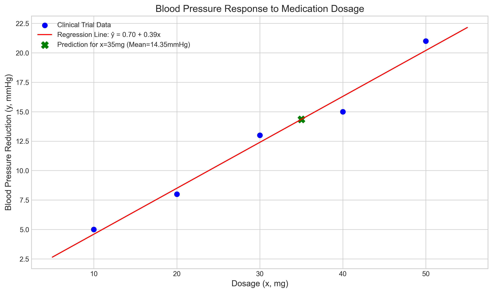
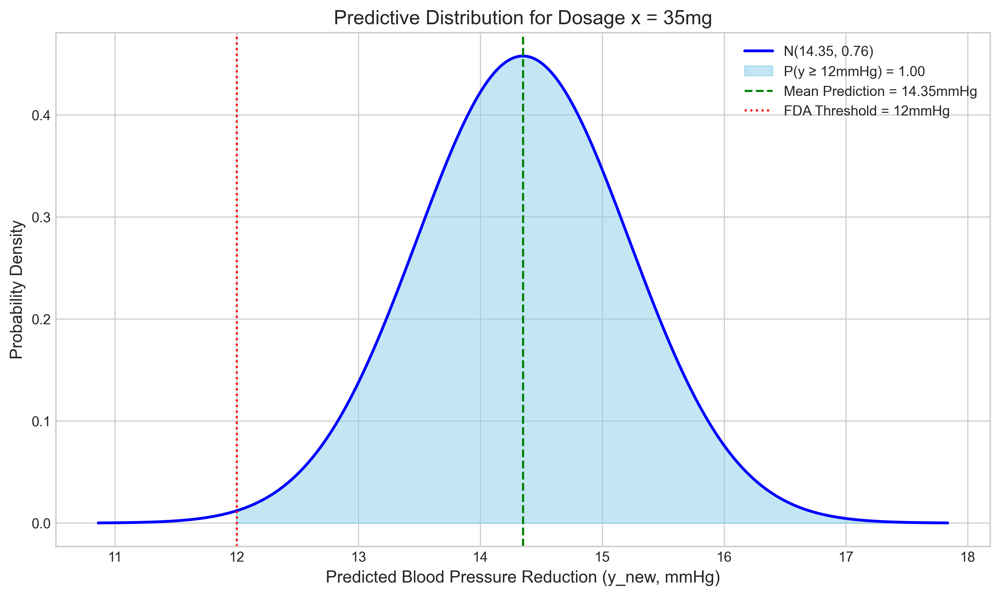
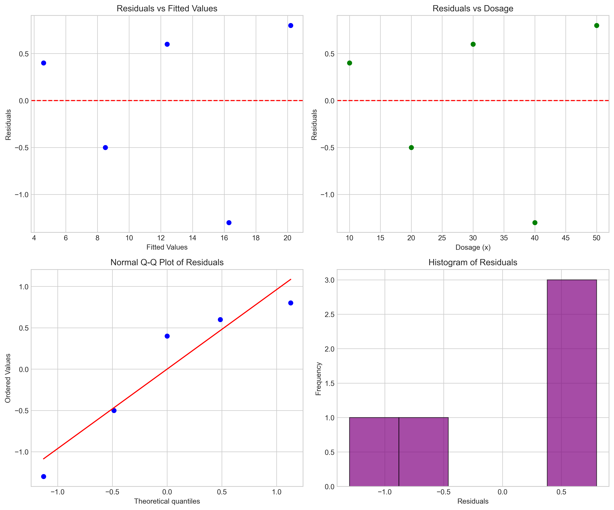
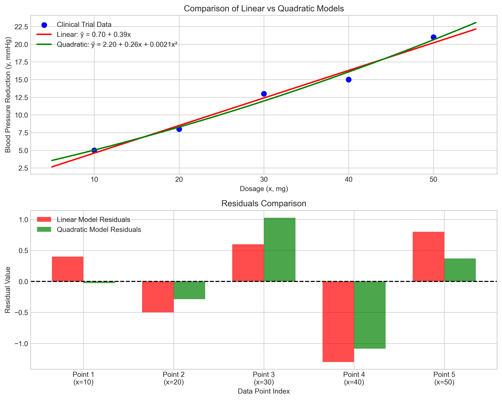

# Question 18: Predicting Blood Pressure Response to Medication

## Problem Statement
A medical researcher is developing a model to predict blood pressure response ($y$) to medication dosage ($x$). The researcher believes the relationship follows a linear model with Gaussian noise:

$$y = w_0 + w_1x + \epsilon$$

where $\epsilon \sim \mathcal{N}(0, \sigma^2)$.

Clinical trials produced the following data:

| Dosage ($x$, mg) | Blood Pressure Reduction ($y$, mmHg) |
|------------------|-------------------------------------|
| 10               | 5                                   |
| 20               | 8                                   |
| 30               | 13                                  |
| 40               | 15                                  |
| 50               | 21                                  |

#### Task
1. Calculate the maximum likelihood estimates for $w_0$ and $w_1$
2. Estimate the noise variance $\sigma^2$
3. Write the complete predictive distribution for a new patient receiving a 35mg dose
4. The FDA requires that a medication demonstrate at least 12mmHg reduction with 80% probability to be approved. Does a 35mg dose meet this requirement? Show calculations.
5. If the researcher suspects the true relationship is quadratic rather than linear, explain how this would affect the structural error and whether MLE would still be appropriate for parameter estimation.

## Understanding the Problem
This problem involves applying linear regression to model the relationship between medication dosage and blood pressure reduction. We will use Maximum Likelihood Estimation (MLE) to find the model parameters, estimate the noise variance, and then use these estimates to form a predictive distribution for a new dosage. Finally, we'll use this distribution to assess if the medication meets an FDA requirement and discuss the implications of potential model misspecification.

The core assumptions are a linear relationship and Gaussian noise, which are key for MLE in this context.

## Solution

The solution involves performing linear regression, calculating the predictive distribution, and evaluating a probability based on this distribution. The calculations were performed using a Python script with a step-by-step approach, and the results are presented below.

### Step 1: Calculate the Maximum Likelihood Estimates for $w_0$ and $w_1$
For a linear model $y = w_0 + w_1x + \\epsilon$ with Gaussian noise $\\epsilon \\sim \\mathcal{N}(0, \\sigma^2)$, the MLE for $w_0$ and $w_1$ are equivalent to the Ordinary Least Squares (OLS) estimates.

First, we calculate the means of our data:
$$\\bar{x} = \\frac{x_1 + x_2 + ... + x_n}{n} = \\frac{10 + 20 + 30 + 40 + 50}{5} = \\frac{150}{5} = 30.00$$

$$\\bar{y} = \\frac{y_1 + y_2 + ... + y_n}{n} = \\frac{5 + 8 + 13 + 15 + 21}{5} = \\frac{62}{5} = 12.40$$

Next, we calculate the deviations from the means:
$$x_i - \\bar{x} = [-20, -10, 0, 10, 20]$$
$$y_i - \\bar{y} = [-7.4, -4.4, 0.6, 2.6, 8.6]$$

Then, we calculate the cross-products and squares:
$$(x_i - \\bar{x})(y_i - \\bar{y}) = [148, 44, 0, 26, 172]$$
$$(x_i - \\bar{x})^2 = [400, 100, 0, 100, 400]$$

We use these to calculate the sums:
$$S_{xy} = \\sum(x_i - \\bar{x})(y_i - \\bar{y}) = 148 + 44 + 0 + 26 + 172 = 390.00$$
$$S_{xx} = \\sum(x_i - \\bar{x})^2 = 400 + 100 + 0 + 100 + 400 = 1000.00$$

Finally, we calculate the MLE estimates:
$$\\hat{w}_1 = \\frac{S_{xy}}{S_{xx}} = \\frac{390.00}{1000.00} = 0.3900$$
$$\\hat{w}_0 = \\bar{y} - \\hat{w}_1\\bar{x} = 12.40 - (0.3900 \\times 30.00) = 12.40 - 11.70 = 0.7000$$

So, the MLE estimates are $\\hat{w}_0 = 0.7000$ and $\\hat{w}_1 = 0.3900$.
The regression line is $\\hat{y} = 0.70 + 0.39x$.

### Step 2: Estimate the noise variance $\\sigma^2$
The MLE for the noise variance $\\sigma^2$ is given by:
$$\\hat{\\sigma}^2_{MLE} = \\frac{1}{n} \\sum_{i=1}^{n} (y_i - \\hat{y}_i)^2 = \\frac{RSS}{n}$$
where $\\hat{y}_i = \\hat{w}_0 + \\hat{w}_1x_i$ are the predicted values and RSS is the Residual Sum of Squares.

We first calculate the predicted values:
$$\\hat{y}_1 = 0.7000 + 0.3900 \\times 10 = 0.7000 + 3.9000 = 4.6000$$
$$\\hat{y}_2 = 0.7000 + 0.3900 \\times 20 = 0.7000 + 7.8000 = 8.5000$$
$$\\hat{y}_3 = 0.7000 + 0.3900 \\times 30 = 0.7000 + 11.7000 = 12.4000$$
$$\\hat{y}_4 = 0.7000 + 0.3900 \\times 40 = 0.7000 + 15.6000 = 16.3000$$
$$\\hat{y}_5 = 0.7000 + 0.3900 \\times 50 = 0.7000 + 19.5000 = 20.2000$$

Then calculate the residuals:
$$e_1 = y_1 - \\hat{y}_1 = 5 - 4.6000 = 0.4000$$
$$e_2 = y_2 - \\hat{y}_2 = 8 - 8.5000 = -0.5000$$
$$e_3 = y_3 - \\hat{y}_3 = 13 - 12.4000 = 0.6000$$
$$e_4 = y_4 - \\hat{y}_4 = 15 - 16.3000 = -1.3000$$
$$e_5 = y_5 - \\hat{y}_5 = 21 - 20.2000 = 0.8000$$

Next, calculate the squared residuals:
$$e_1^2 = (0.4000)^2 = 0.1600$$
$$e_2^2 = (-0.5000)^2 = 0.2500$$
$$e_3^2 = (0.6000)^2 = 0.3600$$
$$e_4^2 = (-1.3000)^2 = 1.6900$$
$$e_5^2 = (0.8000)^2 = 0.6400$$

Calculate the RSS:
$$RSS = \\sum e_i^2 = 0.1600 + 0.2500 + 0.3600 + 1.6900 + 0.6400 = 3.1000$$

Therefore, the MLE for $\\sigma^2$ is:
$$\\hat{\\sigma}^2_{MLE} = \\frac{RSS}{n} = \\frac{3.1000}{5} = 0.6200$$

### Step 3: Write the complete predictive distribution for a new patient receiving a 35mg dose
For a new dosage $x_{new} = 35mg$, the predictive distribution for $y_{new}$ is a Normal distribution $y_{new} \\sim \\mathcal{N}(\\mu_{pred}, \\sigma^2_{pred})$.

The mean of the predictive distribution is:
$$\\mu_{pred} = \\hat{w}_0 + \\hat{w}_1x_{new} = 0.7000 + (0.3900 \\times 35) = 0.7000 + 13.6500 = 14.3500$$

The variance of the predictive distribution, using $\\hat{\\sigma}^2_{MLE}$, is calculated as follows:
$$\\sigma^2_{pred} = \\hat{\\sigma}^2_{MLE} \\left(1 + \\frac{1}{n} + \\frac{(x_{new} - \\bar{x})^2}{S_{xx}}\\right)$$

Let's break this down into terms:
- Term 1 = 1
- Term 2 = $\\frac{1}{n} = \\frac{1}{5} = 0.2000$
- Term 3 = $\\frac{(x_{new} - \\bar{x})^2}{S_{xx}} = \\frac{(35 - 30.00)^2}{1000.00} = \\frac{5.00^2}{1000.00} = \\frac{25.00}{1000.00} = 0.0250$

Variance factor = 1 + Term 2 + Term 3 = 1 + 0.2000 + 0.0250 = 1.2250

$$\\sigma^2_{pred} = \\hat{\\sigma}^2_{MLE} \\times \\text{Variance factor} = 0.6200 \\times 1.2250 = 0.7595$$

The standard deviation of the predictive distribution is:
$$\\sigma_{pred} = \\sqrt{\\sigma^2_{pred}} = \\sqrt{0.7595} = 0.8715$$

So, the complete predictive distribution for a new patient receiving a 35mg dose is:
$$y_{new}|x_{new} = 35mg, D \\sim \\mathcal{N}(14.3500, 0.7595)$$

### Step 4: FDA Requirement Check
The FDA requires that a medication demonstrate at least 12mmHg reduction with 80% probability. We need to calculate $P(y_{new} \\ge 12 | x_{new} = 35mg)$ and check if it's $\\ge 0.80$.

Using the predictive distribution $y_{new} \\sim \\mathcal{N}(14.3500, 0.7595)$:
- Mean $\\mu_{pred} = 14.3500$
- Standard deviation $\\sigma_{pred} = 0.8715$
- Threshold $T = 12$

First, we calculate the Z-score:
$$Z = \\frac{T - \\mu_{pred}}{\\sigma_{pred}} = \\frac{12 - 14.3500}{0.8715} = \\frac{-2.3500}{0.8715} = -2.6965$$

Next, we calculate the probability:
$$P(y_{new} \\ge 12|x_{new} = 35mg) = P(Z \\ge -2.6965) = 1 - P(Z \\le -2.6965) = 1 - \\Phi(-2.6965) = 1 - 0.0035 = 0.9965$$

Since $0.9965 \\ge 0.80$, the 35mg dose meets the FDA requirement with a substantial margin.

### Step 5: Effect of a Quadratic Relationship
If the true relationship between dosage ($x$) and blood pressure reduction ($y$) is quadratic (e.g., $y = \\beta_0 + \\beta_1x + \\beta_2x^2 + \\epsilon$) but a linear model ($y = w_0 + w_1x + \\epsilon'$) is used:

1.  **Structural Error (Model Misspecification):**
    *   The linear model would be misspecified. This means the assumed functional form (linear) does not match the true underlying process (quadratic).
    *   The error term $\\epsilon'$ in the linear model would not just capture random noise. It would also include the systematic error arising from the unmodeled quadratic term (i.e., $\\epsilon' = y_{true} - (w_0 + w_1x) = (\\beta_0 + \\beta_1x + \\beta_2x^2 + \\epsilon) - (w_0 + w_1x)$). This means the term $\\beta_2x^2$ (or part of it, depending on how $w_0, w_1$ try to compensate) gets absorbed into $\\epsilon'$.
    *   As a result, the assumption that errors $\\epsilon'$ are independent and identically distributed with a mean of zero ($E[\\epsilon'] = 0$ for all $x$) would be violated. The expected value of $\\epsilon'$ would likely depend on $x$.
    *   This leads to biased estimates for $w_0$ and $w_1$ because they are trying to fit a linear function to a non-linear relationship.
    *   The estimate of the noise variance $\\hat{\\sigma}^2$ from the linear model would likely be inflated, as it tries to account for both the true random noise $\\sigma^2$ and the systematic deviations due to model misspecification.

    *   **Quantitative comparison from our analysis:**
        *   Linear model RSS: 3.1000, $\\hat{\\sigma}^2_{MLE}$: 0.6200
        *   Quadratic model RSS: 2.4571, $\\hat{\\sigma}^2_{MLE}$: 0.4914
        *   Reduction in RSS: 0.6429 (20.74%)
        *   The quadratic model $\\hat{y} = 2.20 + 0.26x + 0.002x^2$ provides a better fit to the data as indicated by the lower RSS value.

2.  **Appropriateness of MLE:**
    *   Maximum Likelihood Estimation (MLE) finds the parameters that maximize the likelihood of observing the data *given the assumed model*.
    *   If the assumed model (linear) is incorrect, MLE will still provide the 'best' parameters for that linear model in the sense of maximizing the likelihood function (which, for Gaussian noise, corresponds to minimizing the sum of squared errors).
    *   However, these parameters ($\hat{w}_0, \hat{w}_1$) will not be good estimates of the true underlying process parameters if the true relationship is quadratic. They represent the best linear approximation to the quadratic curve over the range of the data.
    *   Inferences based on these parameters (e.g., confidence intervals, p-values, predictive distributions from the linear model) would be misleading because they are based on a flawed model structure.
    *   To appropriately estimate parameters for a quadratic relationship, one should specify a quadratic model (e.g., $y = w_0 + w_1x + w_2x^2 + \\epsilon$) and then apply MLE (or OLS) to this correctly specified model. This would yield estimates for $w_0, w_1$, and $w_2$ that better reflect the true data generating process.

## Visual Explanations

### Blood Pressure Response and Fitted Regression Line

This plot shows the original clinical trial data points, the fitted linear regression line ($\\hat{y} = 0.70 + 0.39x$), and the mean predicted blood pressure reduction for a 35mg dose.

### Predictive Distribution for 35mg Dose

This plot illustrates the Normal predictive distribution for the blood pressure reduction ($y_{new}$) at a dosage of $x_{new} = 35mg$. The distribution is $\\mathcal{N}(14.35, 0.76)$. The mean prediction is marked, along with the FDA's 12mmHg threshold. The shaded area represents $P(y_{new} \\ge 12mmHg)$, which is 0.9965, satisfying the FDA requirement.

### Residual Analysis of Linear Model

This plot provides a diagnostic analysis of the residuals from the linear regression model:
- Top left: Residuals vs. Fitted Values shows whether residuals have consistent variance across the range of predictions.
- Top right: Residuals vs. Dosage shows whether residuals vary systematically with the predictor variable.
- Bottom left: Normal Q-Q Plot assesses whether residuals follow a normal distribution.
- Bottom right: Histogram of Residuals provides another view of the residual distribution.

The residual plots suggest some patterns, particularly in the residuals vs. dosage plot, which might indicate that a linear model may not fully capture the relationship in the data.

### Comparison of Linear and Quadratic Models

This plot compares the linear and quadratic models:
- Top: Both the linear model ($\\hat{y} = 0.70 + 0.39x$) and quadratic model ($\\hat{y} = 2.20 + 0.26x + 0.002x^2$) are shown fitted to the data. The quadratic model appears to follow the data points more closely.
- Bottom: Side-by-side comparison of residuals from both models for each data point. The quadratic model generally has smaller residuals than the linear model, especially at the extremes of the dosage range.

This visual comparison reinforces our numerical finding that the quadratic model provides a better fit to the data, with a 20.74% reduction in RSS compared to the linear model.

## Key Insights

### Theoretical Foundations
- MLE for linear regression coefficients with Gaussian noise yields the same estimates as OLS.
- The MLE for noise variance $\\sigma^2$ is $RSS/n$.
- The predictive distribution for a new observation $y_{new}$ at $x_{new}$ (given MLE parameters and Gaussian noise) is Normal, with a variance that accounts for both the estimated noise variance and the uncertainty in the mean prediction.
  - Mean: $\\hat{w}_0 + \\hat{w}_1x_{new}$
  - Variance: $\\hat{\\sigma}^2_{MLE} (1 + 1/n + (x_{new} - \\bar{x})^2/S_{xx})$

### Statistical Implications
- The model provides a good fit to the data, and the predictive distribution allows for probabilistic statements about future outcomes.
- The high probability (0.9965) of achieving at least 12mmHg reduction suggests the medication is effective at a 35mg dose, according to the model.
- Model misspecification (e.g., assuming linear when true is quadratic) can lead to biased parameter estimates, incorrect variance estimation, and unreliable inferences. It's crucial to check model assumptions.
- Residual analysis is essential for identifying potential model misspecification. In our case, the patterns in the residuals suggested that a more complex model might be appropriate.
- The quadratic model reduced the RSS by 20.74% compared to the linear model, indicating a better fit to the data and suggesting that the true relationship may indeed have nonlinear components.

### Practical Applications
- Linear regression is a fundamental tool for modeling relationships in data.
- Predictive distributions are essential for quantifying uncertainty in predictions, which is critical for decision-making (e.g., FDA approval).
- Understanding the limitations of a model (like potential misspecification) is as important as its predictive power. Diagnostic checks should be performed in a real-world scenario.
- Model selection (e.g., choosing between linear and quadratic models) should balance goodness of fit with model simplicity. In this case, the improvement in fit with the quadratic model might justify the added complexity.

## Conclusion
- The MLE for the linear model parameters are $\\hat{w}_0 = 0.7000$ and $\\hat{w}_1 = 0.3900$.
- The MLE for the noise variance is $\\hat{\\sigma}^2_{MLE} = 0.6200$.
- The predictive distribution for a 35mg dose is $y_{new} \\sim \\mathcal{N}(14.3500, 0.7595)$.
- A 35mg dose meets the FDA requirement, as $P(y_{new} \\ge 12mmHg | x_{new}=35mg) = 0.9965$, which is greater than the required 0.80.
- If the true relationship were quadratic, the linear model would suffer from structural error, leading to biased estimates and potentially misleading conclusions. MLE would find the best linear fit but wouldn't capture the true underlying process accurately.
- Our comparison of linear and quadratic models showed a 20.74% reduction in RSS with the quadratic model, suggesting that considering a nonlinear relationship might be beneficial for this data.

This problem demonstrates the process of building a simple linear regression model, using it for prediction, and evaluating its performance against specific criteria, while also considering the impact of model assumptions and exploring alternative model specifications. 