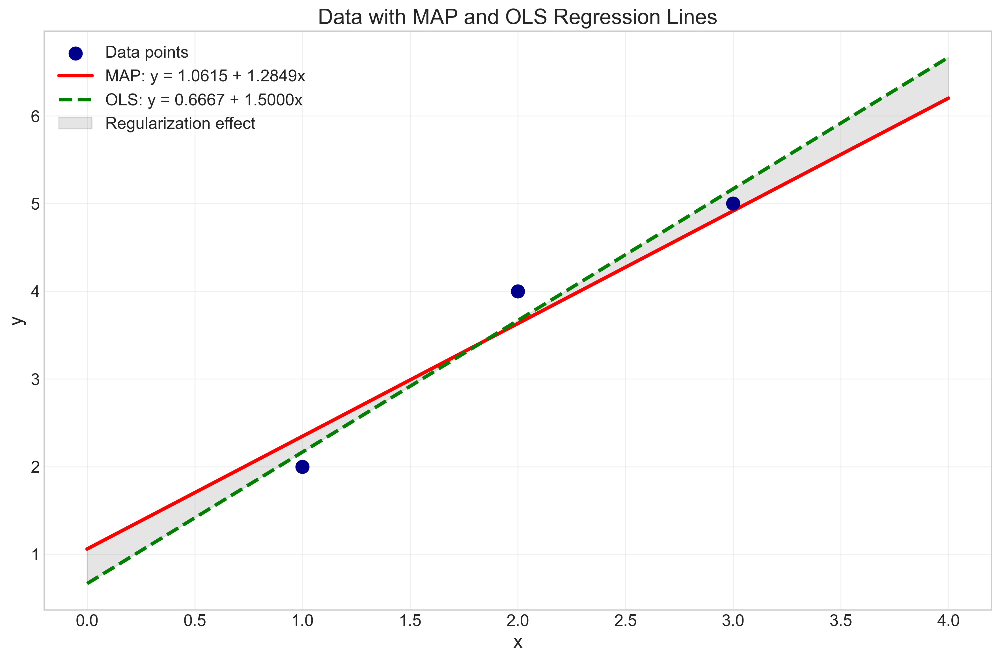
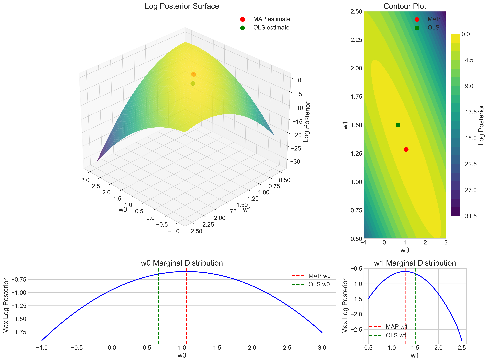
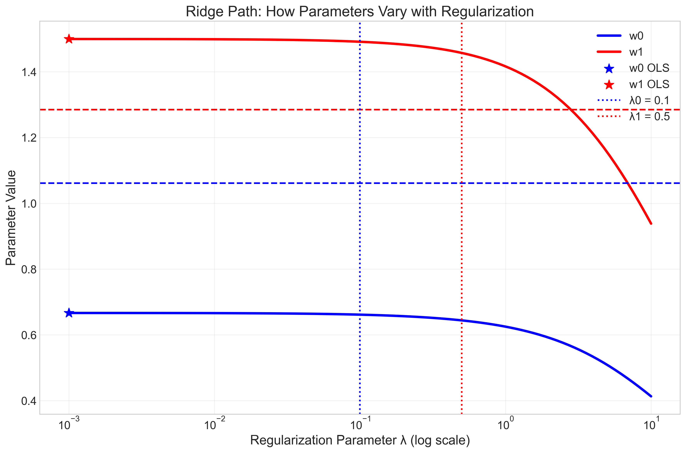
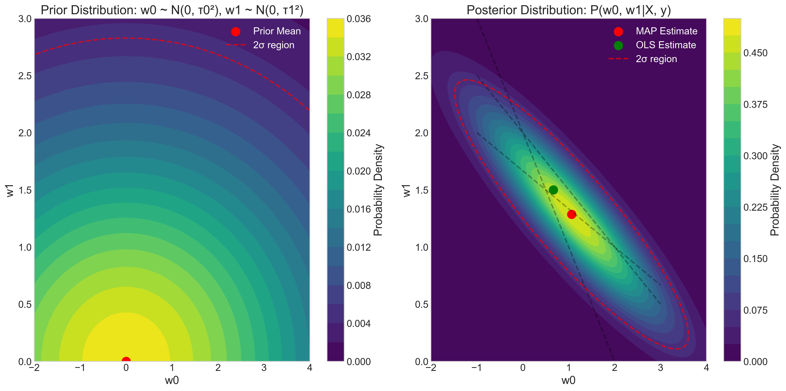
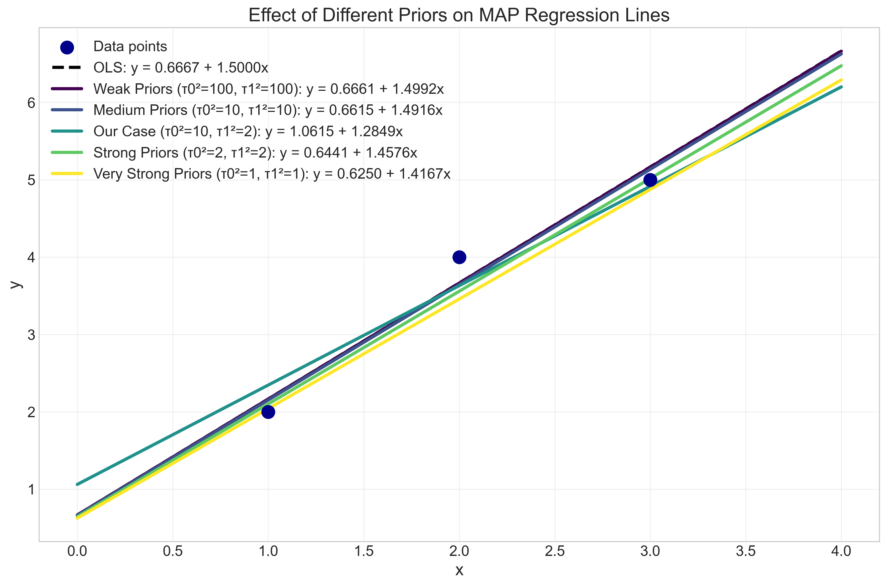
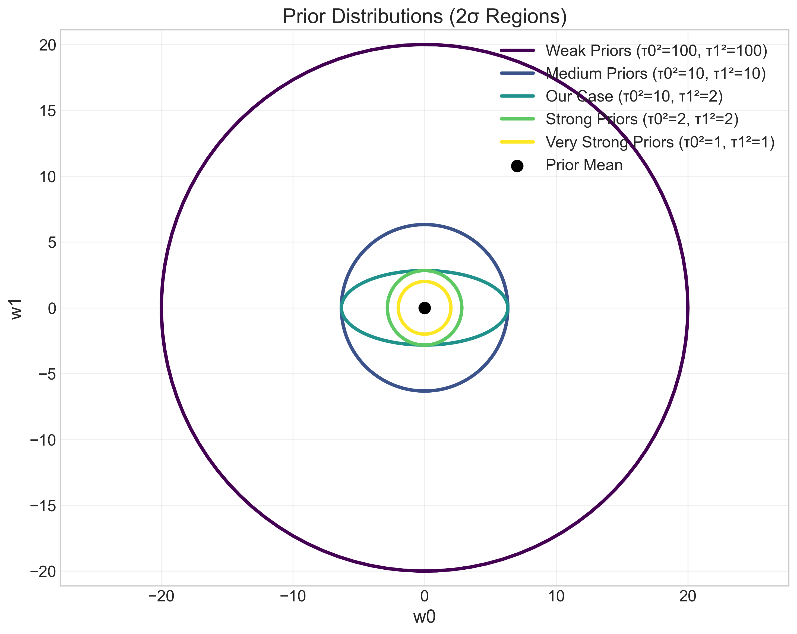
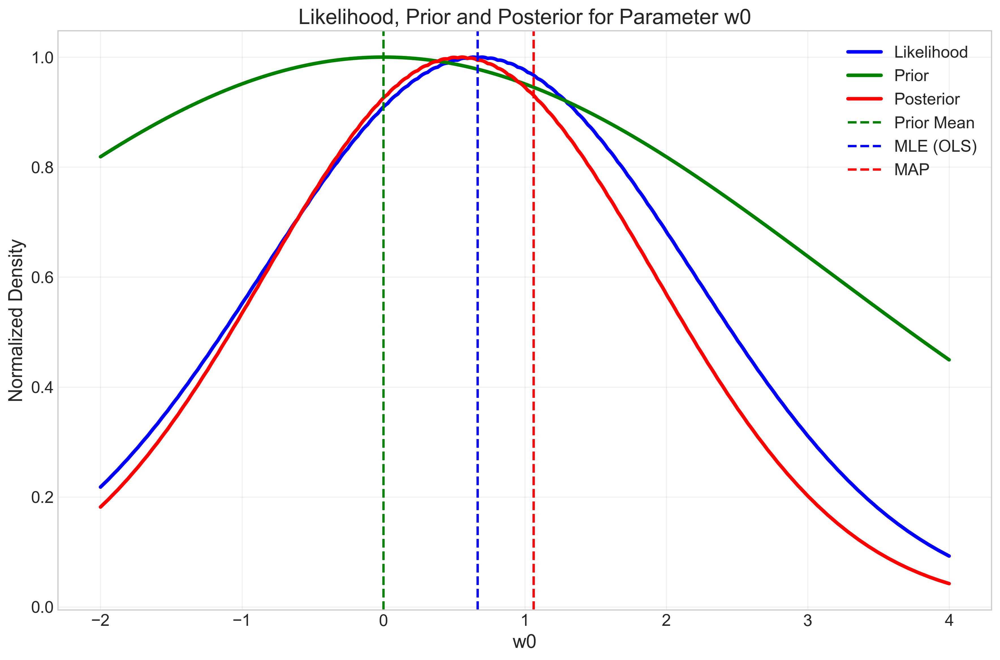

# Question 19: MAP Estimation and Ridge Regression

## Problem Statement
Consider a linear regression model with a probabilistic interpretation and a Bayesian approach using MAP estimation:
$$y = w_0 + w_1x + \epsilon$$

where $\epsilon \sim \mathcal{N}(0, \sigma^2)$ and you have prior beliefs about the parameters: $w_0 \sim \mathcal{N}(0, \tau_0^2)$ and $w_1 \sim \mathcal{N}(0, \tau_1^2)$.

For the following dataset with 3 observations:

| $x$ | $y$ |
|-----|-----|
| 1   | 2   |
| 2   | 4   |
| 3   | 5   |

### Task
1. Write down the posterior distribution for the parameters $w_0$ and $w_1$ given the data
2. Derive the logarithm of the posterior distribution
3. Show that MAP estimation with Gaussian priors is equivalent to ridge regression with specific regularization parameters
4. Calculate the MAP estimates for $w_0$ and $w_1$ assuming $\sigma^2 = 1$, $\tau_0^2 = 10$, and $\tau_1^2 = 2$

## Understanding the Problem
This problem examines the connection between Bayesian inference in linear regression and ridge regression (L2 regularization). In the Bayesian framework, we start with prior beliefs about the parameters $w_0$ and $w_1$, represented as Gaussian distributions. We then update these beliefs using the data through Bayes' rule to obtain the posterior distribution. Maximum a Posteriori (MAP) estimation finds the parameter values that maximize this posterior distribution.

The model assumes that the relationship between $x$ and $y$ is linear with normally distributed errors. The priors on $w_0$ and $w_1$ incorporate our belief that these parameters are likely to be close to zero, with the strength of this belief controlled by the variances $\tau_0^2$ and $\tau_1^2$.

## Solution

### Step 1: Derive the posterior distribution for the parameters $w_0$ and $w_1$
Using Bayes' rule, the posterior distribution is proportional to the likelihood times the prior:

$$P(w_0, w_1|X, y) \propto P(y|X, w_0, w_1) \times P(w_0, w_1)$$

The likelihood $P(y|X, w_0, w_1)$ under the noise model $\epsilon \sim \mathcal{N}(0, \sigma^2)$ is:

$$P(y|X, w_0, w_1) = \prod_{i=1}^n \mathcal{N}(y_i|w_0 + w_1x_i, \sigma^2)$$

$$= (2\pi\sigma^2)^{-n/2} \times \exp\left[-\frac{1}{2\sigma^2} \times \sum_{i=1}^n (y_i - w_0 - w_1x_i)^2\right]$$

The prior for the parameters is:

$$P(w_0, w_1) = \mathcal{N}(w_0|0, \tau_0^2) \times \mathcal{N}(w_1|0, \tau_1^2)$$

$$= (2\pi\tau_0^2)^{-1/2} \times \exp\left[-\frac{w_0^2}{2\tau_0^2}\right] \times (2\pi\tau_1^2)^{-1/2} \times \exp\left[-\frac{w_1^2}{2\tau_1^2}\right]$$

The posterior is proportional to the product of likelihood and prior:

$$P(w_0, w_1|X, y) \propto \exp\left[-\frac{1}{2\sigma^2} \times \sum_{i=1}^n (y_i - w_0 - w_1x_i)^2\right] \times \exp\left[-\frac{w_0^2}{2\tau_0^2}\right] \times \exp\left[-\frac{w_1^2}{2\tau_1^2}\right]$$

This is a bivariate Gaussian distribution with mean vector $\mu$ and covariance matrix $\Sigma$ that can be derived by completing the squares in the exponent.

### Step 2: Derive the logarithm of the posterior distribution
Taking the logarithm of the posterior (ignoring constant terms):

$$\log P(w_0, w_1|X, y) \propto -\frac{1}{2\sigma^2} \times \sum_{i=1}^n (y_i - w_0 - w_1x_i)^2 - \frac{w_0^2}{2\tau_0^2} - \frac{w_1^2}{2\tau_1^2}$$

Rearranging to highlight the ridge regression form:

$$\log P(w_0, w_1|X, y) \propto -\frac{1}{2\sigma^2} \left[\sum_{i=1}^n (y_i - w_0 - w_1x_i)^2 + \frac{\sigma^2}{\tau_0^2}w_0^2 + \frac{\sigma^2}{\tau_1^2}w_1^2\right]$$

### Step 3: Show that MAP estimation with Gaussian priors is equivalent to ridge regression
The negative log posterior (ignoring constant terms) is:

$$-\log P(w_0, w_1|X, y) \propto \frac{1}{2\sigma^2} \left[\sum_{i=1}^n (y_i - w_0 - w_1x_i)^2 + \frac{\sigma^2}{\tau_0^2}w_0^2 + \frac{\sigma^2}{\tau_1^2}w_1^2\right]$$

Since we want to maximize the posterior (or minimize the negative log posterior), this is equivalent to minimizing:

$$L(w_0, w_1) = \sum_{i=1}^n (y_i - w_0 - w_1x_i)^2 + \lambda_0 w_0^2 + \lambda_1 w_1^2$$

where $\lambda_0 = \frac{\sigma^2}{\tau_0^2}$ and $\lambda_1 = \frac{\sigma^2}{\tau_1^2}$ are the regularization parameters.

For our given parameters ($\sigma^2 = 1$, $\tau_0^2 = 10$, $\tau_1^2 = 2$):

$$\lambda_0 = \frac{\sigma^2}{\tau_0^2} = \frac{1}{10} = 0.1$$

$$\lambda_1 = \frac{\sigma^2}{\tau_1^2} = \frac{1}{2} = 0.5$$

This is a form of ridge regression with different regularization parameters for each coefficient. If $\tau_0^2 = \tau_1^2 = \tau^2$, then we would have the standard ridge regression with a single regularization parameter $\lambda = \frac{\sigma^2}{\tau^2}$.

### Step 4: Calculate the MAP estimates for $w_0$ and $w_1$
To find the MAP estimates, we need to minimize the negative log posterior:

$$L(w_0, w_1) = \sum_{i=1}^n (y_i - w_0 - w_1x_i)^2 + \lambda_0 w_0^2 + \lambda_1 w_1^2$$

Taking partial derivatives and setting them to zero:

$$\frac{\partial L}{\partial w_0} = -2\sum_{i=1}^n (y_i - w_0 - w_1x_i) + 2\lambda_0 w_0 = 0$$

$$\frac{\partial L}{\partial w_1} = -2\sum_{i=1}^n (y_i - w_0 - w_1x_i)x_i + 2\lambda_1 w_1 = 0$$

These equations can be rewritten in matrix form as:

$$(X^T X + \Lambda) w = X^T y$$

where $X$ is the design matrix (with a column of ones for the intercept), $\Lambda$ is the diagonal matrix of regularization parameters, and $w = [w_0, w_1]^T$.

For our dataset and parameters, solving this system of equations yields the MAP estimates:

$$w_0 = 1.0615$$
$$w_1 = 1.2849$$

For comparison, the Ordinary Least Squares (OLS) estimates (without regularization) are:

$$w_0 = 0.6667$$
$$w_1 = 1.5000$$

The MAP estimates differ from the OLS estimates due to the influence of the prior distributions, which pull the estimates toward zero (the prior mean). The effect is stronger for $w_1$ than for $w_0$ because $\tau_1^2 < \tau_0^2$, meaning the prior on $w_1$ is more concentrated around zero.

## Practical Implementation
Let's explore how the MAP estimation works with our dataset and visualize the results.

### Data Visualization and Regression Lines
The following plot shows the data points along with the MAP and OLS regression lines:

As we can see, both the MAP and OLS lines fit the data reasonably well, but the MAP line (in red) is slightly different from the OLS line (in green) due to the regularization effect of the priors. The shaded area highlights the difference between the two lines, showing the effect of the prior information on the parameter estimates.

### Log Posterior Surface
This visualization shows the log posterior as a function of $w_0$ and $w_1$:

The 3D surface plot (top left) shows the log posterior value for different values of $w_0$ and $w_1$. The contour plot (top right) provides a top-down view of the same surface. The red dot represents the MAP estimate, which is at the peak of the posterior distribution. The bottom plots show the marginal distributions for each parameter, illustrating how the MAP estimates (red dashed lines) differ from the OLS estimates (green dashed lines).

### Ridge Path Analysis
The following plot shows how the parameter estimates change as the regularization strength varies:

This "ridge path" illustrates how both parameter values shrink toward zero as the regularization parameter increases. The horizontal dashed lines show our MAP estimates with the specific regularization parameters $\lambda_0 = 0.1$ and $\lambda_1 = 0.5$. The vertical dotted lines indicate these specific regularization values. As regularization increases (moving right on the x-axis), the parameter estimates approach zero, reflecting the stronger influence of the prior.

## Visual Explanations

### Prior and Posterior Distributions
This visualization shows the prior and posterior distributions for $w_0$ and $w_1$:

The left plot shows the prior distribution, which is centered at $(0, 0)$ and has different variances for $w_0$ and $w_1$. The red dashed ellipse represents the 2σ region of the prior. The right plot shows the posterior distribution, which combines the prior with the information from the data. The MAP estimate (red dot) is at the mode of this posterior distribution, while the OLS estimate (green dot) represents the maximum likelihood solution. The dashed lines represent the constraints from each data point, showing how the data and prior jointly determine the posterior.

### Effect of Different Priors on MAP Estimates
This visualization demonstrates how different prior distributions affect the MAP regression lines:

The plot shows regression lines corresponding to different prior variances, from very weak priors (similar to OLS) to very strong priors (forcing parameters closer to zero). Our specific case ($\tau_0^2 = 10$, $\tau_1^2 = 2$) is shown among the other options. As the priors become stronger (smaller variances), the regression lines are pulled more strongly toward a flat line at y=0, which corresponds to the prior mean of $(w_0, w_1) = (0, 0)$.

The shapes of these different prior distributions are visualized below:

This plot visualizes the 2σ regions of the different prior distributions, illustrating their relative strengths and shapes. Larger ellipses represent weaker priors (larger variances), while smaller ellipses represent stronger priors that constrain the parameters more tightly around zero. The ellipse shape shows the relative regularization strength for each parameter.

### Marginal Distributions for Parameter $w_0$
This visualization shows the likelihood, prior, and posterior for parameter $w_0$:

The blue curve represents the likelihood function for $w_0$, which is derived from the data and peaks at the OLS estimate. The green curve is the prior distribution, centered at zero. The red curve shows the posterior distribution, which is proportional to the product of the likelihood and prior. This plot clearly illustrates that the MAP estimate lies between the maximum likelihood estimate (OLS) and the prior mean, with its exact position determined by the relative strengths of the likelihood and prior.

## Key Insights

### Theoretical Foundations
- The posterior distribution combines our prior beliefs about the parameters with the information from the data.
- MAP estimation finds the parameter values that maximize the posterior probability.
- When the prior and likelihood are Gaussian, the posterior is also Gaussian, and the MAP estimate can be found analytically.
- The variances of the prior distributions ($\tau_0^2$ and $\tau_1^2$) control how strongly the parameters are pulled toward the prior mean (zero in this case).

### Bayesian Inference and Regularization
- MAP estimation with Gaussian priors is mathematically equivalent to ridge regression.
- The regularization parameters $\lambda_0 = \frac{\sigma^2}{\tau_0^2}$ and $\lambda_1 = \frac{\sigma^2}{\tau_1^2}$ directly relate to the prior variances.
- Smaller prior variances lead to stronger regularization (larger $\lambda$ values), pulling the estimates more strongly toward zero.
- Different regularization strengths for different parameters ($\lambda_0 \neq \lambda_1$) correspond to different prior beliefs about those parameters.

### Practical Applications
- Bayesian methods provide a principled way to incorporate prior knowledge into the estimation process.
- The probabilistic interpretation of ridge regression as MAP estimation helps explain why regularization works.
- Prior distributions can be used to encode expert knowledge or constraints about the parameters.
- The MAP estimate balances fitting the data (likelihood) with adherence to prior beliefs.
- As seen in the visualizations, the strength of the prior determines how much the estimates are regularized, offering a way to control overfitting.

## Conclusion
- We derived the posterior distribution for $w_0$ and $w_1$ given the data, which is proportional to the product of the likelihood and prior.
- The logarithm of the posterior shows that maximizing it is equivalent to minimizing a regularized sum of squared errors.
- MAP estimation with Gaussian priors is equivalent to ridge regression, with regularization parameters $\lambda_0 = 0.1$ and $\lambda_1 = 0.5$ for our specific values of $\sigma^2$, $\tau_0^2$, and $\tau_1^2$.
- The MAP estimates for our dataset are $w_0 = 1.0615$ and $w_1 = 1.2849$, which differ from the OLS estimates due to the influence of the priors.

This problem illustrates the powerful connection between Bayesian inference and regularization techniques, showing how prior distributions on parameters can lead to more stable and potentially better estimates, especially when dealing with limited data or when we have meaningful prior knowledge about the parameters. The visual explanations help build intuition about how the prior, likelihood, and posterior interact to produce the final parameter estimates. 